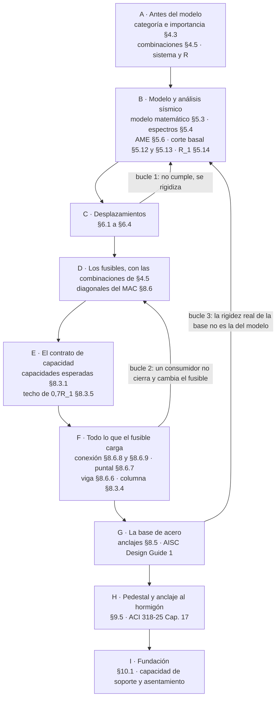

# ANALISIS.md — el orden en que se analiza y se diseña

**En qué orden se toca una estructura industrial chilena, desde el modelo hasta el sello de
fundación, y qué del corpus cubre cada paso.** Es un documento de ruta: dice *cuándo* se hace cada
cosa y *dónde* está ejemplificada, no cómo se calcula.

Está fuera del build, como `ejemplos/`. Se versiona.

**Este archivo no deriva ningún número.** Las cláusulas se nombran por su número y su título del
índice de la norma; toda magnitud que aparezca viene de un memo o de un post que la leyó del PDF,
y se cita con su origen. Si un paso no tiene quién lo cubra, la fila dice `—` y no se completa de
memoria. Esa es la misma regla de `ejemplos/README.md` aplicada acá.

**Alcance actual**: el camino que el corpus recorre — marco arriostrado concéntrico de acero
(NCh2369 §8.6), su base, su pedestal y su fundación. Las fases A a C están declaradas pero solo
parcialmente ancladas: lo que falta está en «La deuda», al final.

## El mapa, con sus tres bucles

La secuencia no es lineal. Tres verificaciones tardías devuelven el trabajo a una fase anterior, y
son las que separan un diseño que cierra de uno que parece cerrar.

**Bucle 1 — la deriva.** El conocido: si el desplazamiento no cumple, se rigidiza y se rehace el
análisis.

**Bucle 2 — el consumidor que no cierra.** Cuando un elemento que cuelga del fusible no cierra, una
de las salidas es cambiar el fusible, y eso **invalida el contrato entero**: el memo del tubo
ranurado no cierra (uso 1,20) y la salida de subir la pared del HSS a 8 mm sube $P_{ne}$, con lo
que el puntal, la columna y el gusset hay que rehacerlos. Es el bucle que se descubre tarde.

**Bucle 3 — la rigidez de la base.** El modelo de la fase B supuso la base empotrada o rotulada; la
base real entrega $\beta_{base} = 18\,190\ \text{kN}\cdot\text{m/rad}$, el 54 % del $4EI/L$ de su
propia columna (memo de la rigidez rotacional). El supuesto de la fase B no es el que la base
cumple. Casi nadie cierra este bucle.

## Las fases

### A · Antes del modelo

Lo que queda fijado antes de dibujar nada: categoría de la estructura y su coeficiente de
importancia [§4.3], las combinaciones con las que se va a trabajar y las dos cargas que NCh 3171 no
tiene [§4.5 y Anexo B], la clasificación del sistema estructural con su $R$, y el sitio [§5.4].

Cubre: [Caps. 1–4 — alcance, desempeño y combinaciones](src/content/apuntes/nch2369-panorama-y-combinaciones.mdx)
y [el espectro de diseño](src/content/apuntes/nch2369-espectro-de-diseno.mdx) para la parte de sitio.

### B · Modelo y análisis sísmico

Modelo matemático [§5.3], espectros normativos [§5.4], análisis modal espectral [§5.6], acción
sísmica vertical [§5.7], corte basal mínimo y máximo [§5.12 y §5.13], y el $R_1$ efectivo [§5.14].
El espectro ya entra dividido por $R$ — el «inelástico» de la práctica.

Cubre: [el espectro y sus tres correcciones](src/content/apuntes/nch2369-espectro-de-diseno.mdx), y
la serie del factor $R$ en el blog. **Sin cubrir**: §5.3, §5.6, §5.12 a §5.14 — ver la deuda.

### C · Desplazamientos

Cálculo de desplazamientos sísmicos [§6.1], separación entre estructuras [§6.2], máximos [§6.3] y
efecto P-Delta [§6.4]. **Cierra el bucle 1.**

Cubre: nada del corpus. Es el hueco más grande.

### D · Los fusibles, con las combinaciones de §4.5

Recién acá se dimensiona el primer elemento: las diagonales, con la demanda del análisis.

**Lo que el corpus encontró, y contradice la intuición: la diagonal no la dimensiona la
resistencia.** El HSS 125×125×5 pasaba resistencia con uso 0,79 y lo botó la Tabla 9 de esbeltez y
compacidad, porque el $R_y = 1{,}3$ nacional endurece el límite (22 > 18,9). Elegir el perfil por
el uso lleva al perfil equivocado.

Cubre: [diagonal de paño en V invertida](ejemplos/acero/diagonal-v-invertida-nch2369.md) ·
[diagonal fusible en X](ejemplos/acero/diagonal-fusible-contrato-nch2369.md).

### E · El contrato de capacidad

Con el fusible ya elegido salen las capacidades esperadas [§8.3.1] y el techo de $0{,}7R_1$
[§8.3.5]. Ese conjunto es un **contrato que el fusible exporta** a todo lo demás.

**La consecuencia que sorprende: sobredimensionar el fusible no mejora nada — encarece a todos sus
consumidores.** La diagonal como miembro usa 0,50 de sí misma y le factura 841 kN a la conexión,
519 al puntal y 587 a la columna.

Cubre: [el contrato de la diagonal fusible](ejemplos/acero/diagonal-fusible-contrato-nch2369.md) ·
[el 0,7R₁ como diseño por capacidad](src/content/apuntes/nch2369-capacidad-y-07r1.mdx). Variante:
el galpón liviano de [§12.2](src/content/blog/galpon-liviano-nch2369.mdx) rebaja el amplificador a
$0{,}5R_1$ a cambio de ocho condiciones.

### F · Todo lo que el fusible carga

Conexión de la diagonal [§8.6.8] con el techo de espesor de [§8.6.9], puntal entre paños [§8.6.7],
viga del paño [§8.6.6] y columna [§8.3.4]. **Cierra el bucle 2.**

**Lo que el corpus encontró: cada consumidor tiene su propio peor estado del mecanismo.** Reusar el
estado del puntal para la columna deja la demanda 31 % baja — el puntal sufre el post-pandeo que
§8.6.7 escribe, y la columna, el pandeo incipiente que C8.6.7 declara no evaluar. Y la viga del
paño la multiplica por 12: la gravedad pedía $Z_x = 340\ \text{cm}^3$ y el equilibrio post-pandeo
pide 4 100.

Cubre: [puntal](ejemplos/acero/puntal-entre-x-nch2369.md) ·
[columna](ejemplos/acero/columna-marco-x-capacidad-nch2369.md) ·
[viga](ejemplos/acero/viga-pano-v-invertida-nch2369.md) ·
[gusset](ejemplos/acero/gusset-diagonal-fusible-nch2369.md) ·
[área neta del tubo ranurado](ejemplos/acero/tubo-ranurado-area-neta-nch2369.md).

### G · La base de acero

Anclajes [§8.5]: el piso de $0{,}5M_{pe}$ para bases empotradas [§8.5.2], la llave de corte
[§8.5.3], el roce que §8.5.4 no deja acreditar, y la zona en contacto con los anclajes que §8.5.5
manda a la cláusula 9. El espesor de la placa y la silla van por la AISC Design Guide 1.
**Cierra el bucle 3.**

**Lo que el corpus encontró: el espesor no lo fija la carga.** Con el bloque saturado en
$f_{p(máx)}$ el espesor depende solo del voladizo y de $f'_c$, y lo gobierna $n$, el voladizo
transversal al plano de flexión. Los 25 mm de catálogo piden 52.

Cubre: [base empotrada](ejemplos/acero/placa-base-empotrada-nch2369.md) ·
[espesor](ejemplos/acero/placa-base-espesor-dg1.md) ·
[llave de corte](ejemplos/acero/placa-base-llave-de-corte-nch2369.md) ·
[silla de anclaje](ejemplos/acero/placa-base-silla-anclaje-nch2369.md) ·
[rigidez rotacional](ejemplos/acero/placa-base-rigidez-rotacional-dg1.md).

### H · Pedestal y anclaje al hormigón

Pedestal para base de columna de acero [§9.5], y el anclaje por ACI 318-25 Cap. 17: breakout de
tracción y de corte, pullout, estallido lateral, y la vía de armadura de anclaje.

**Lo que el corpus encontró: al pedestal no lo dimensiona la resistencia.** Los usos quedan
≤ 0,37; la armadura la fija el mínimo de 0,5 % y los estribos, la zona de protección de §9.5.3. Lo
que el ancho no compra es el anclaje — el cono de tracción no cierra ni con lado 1100.

Cubre: [pedestal](ejemplos/hormigon/pedestal-base-columna-nch2369.md) ·
[tracción del grupo](ejemplos/hormigon/pedestal-traccion-grupo-armadura-nch2369.md) ·
[armadura de anclaje del breakout de la llave](ejemplos/hormigon/llave-corte-armadura-de-anclaje-nch2369.md).

### I · Fundación

Fundaciones superficiales [§10.1]: presión de contacto, porcentaje de área apoyada, deslizamiento y
volcamiento. Los dos estados límite que la norma no cubre —capacidad de soporte y asentamiento— van
por la referencia geotécnica.

**Lo que el corpus encontró: la zapata la dimensiona el 80 % de área apoyada**, no la presión ni el
deslizamiento; y el $k_v$ de un informe suele ser sísmico, con lo que subestima el asentamiento
estático unas tres veces.

Cubre: [zapata bajo el pedestal](ejemplos/geotecnia/zapata-base-columna-nch2369.md) ·
[capacidad de soporte y asentamiento](ejemplos/geotecnia/zapata-capacidad-y-asentamiento-das.md).

## Cobertura

`✓` ejemplificado con cláusula leída del PDF · `~` parcial · `—` sin cubrir.

| Fase | Cláusulas | Estado |
|---|---|:--:|
| A · Antes del modelo | §4.3, §4.5, Anexo B | ✓ |
| A · Sistema estructural y R | §5.14 y su tabla | ~ |
| B · Modelo matemático | §5.3 | — |
| B · Espectros normativos | §5.4 | ✓ |
| B · Métodos y análisis modal | §5.2, §5.6 | — |
| B · Acción sísmica vertical | §5.7 | — |
| B · Corte basal mínimo y máximo | §5.12, §5.13 | — |
| C · Desplazamientos y P-Delta | §6.1 a §6.4 | — |
| D · Fusibles del MAC | §8.6 y su Tabla 9 | ✓ |
| E · Capacidades esperadas y 0,7R₁ | §8.3.1, §8.3.5 | ✓ |
| F · Conexión de la diagonal | §8.6.8, §8.6.9 | ✓ |
| F · Puntal, viga y columna | §8.6.6, §8.6.7, §8.3.4 | ✓ |
| F · Conexiones sismorresistentes en general | §8.4 | — |
| G · Anclajes de la base | §8.5.2 a §8.5.5 | ✓ |
| H · Pedestal | §9.5 | ✓ |
| H · Anclaje al hormigón | ACI 318-25 Cap. 17 | ✓ |
| I · Fundaciones superficiales | §10.1 | ✓ |
| — · Diafragmas horizontales | §8.8 | — |
| — · Marcos resistentes a momento | §8.7 | ~ |
| — · Elementos secundarios y equipos | §7 | — |
| — · Fundaciones profundas | §10.2 | — |

## La deuda

En orden de cuánto duele:

1. **§6, los desplazamientos.** Cierra el bucle 1 y no hay nada escrito. Sin esto la fase C es un
   nombre.
2. **§5.12 a §5.14 — corte basal mínimo, máximo y $R_1$ efectivo.** El corpus usa $R_1$ como dato
   del análisis en todos los memos; ningún memo lo deriva.
3. **§5.3, el modelo matemático.** Es donde vive el supuesto que el bucle 3 desmiente.
4. **§8.8, diafragmas horizontales.** El arriostramiento de techo no está en ninguna parte del
   corpus, y es la mitad del camino de la carga.
5. **§8.4, conexiones sismorresistentes en general.** Hoy solo está lo específico del MAC.
6. **§8.7, marcos resistentes a momento.** Hay un memo de conexión BFP, sin la estructura alrededor.

## Cómo se mantiene

- Un memo nuevo suma su enlace a la fase que ejemplifica y actualiza su fila de cobertura.
- Una fila pasa de `—` a `✓` solo cuando existe un memo o post con la cláusula leída del PDF y
  fecha registrada. No hay estado intermedio por «lo sé».
- Los tres bucles son la parte que no se toca a la ligera: si un caso nuevo muestra un cuarto, va
  acá antes que en cualquier otro lado.
