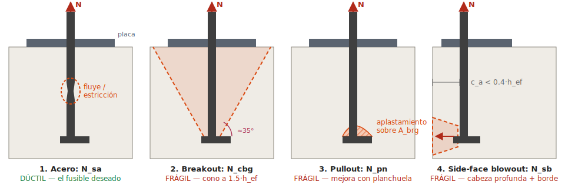
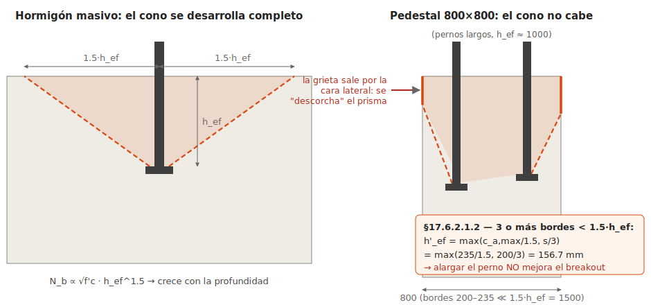
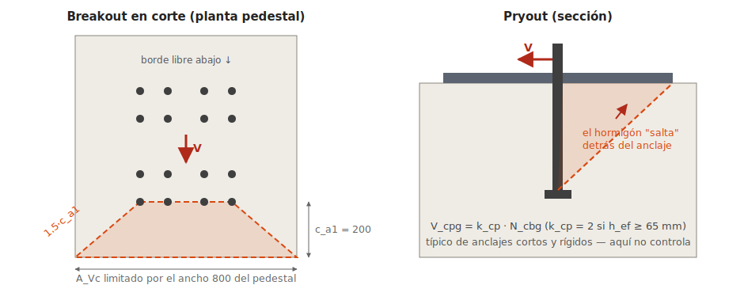

# Diseño de anclaje al hormigón — Placa base DET-1

**Sesión de aprendizaje** — verificación paso a paso según **ACI 318-25, Capítulo 17** (la numeración de secciones es la de 318-19, que 318-25 mantiene), con comentarios de práctica chilena (NCh2369).

> **Estado**: documento de estudio con capacidades calculadas bajo supuestos declarados (§2). Las demandas $N_{ua}, V_{ua}, M_{ua}$ no vienen en los planos, así que las capacidades quedan listas para comparar cuando las tengas.

---

## 1. Lectura del detalle

| Elemento | Dato (de los planos) |
|---|---|
| Columna | H460×191×16×12 (d=460, b_f=191, t_f=16, t_w=12 mm) |
| Placa base | PL 38×550×550 mm |
| Atiesadores | PL16×179.5 típ. (de ala a borde de placa: (550−191)/2 = 179.5 ✓) |
| Pernos | **16 anclajes Ø1" (25.4 mm), ASTM F1554**, preinstalados (cast-in) |
| Agujeros en placa | Ø 1-3/8" (35 mm) — sobredimensionados, estándar AISC DG1 |
| Pedestal | 800×800 mm (0.55 m sobre NTC, empotrado en la fundación) |
| Grilla de anclajes | 4×4. Dirección x: bordes 235, espaciamientos 100/130/100. Dirección y: bordes 200, espaciamientos 100/200/100 (el 200 central acotado 100+100 al eje) |
| Largo embebido | ≈ 1000 mm hasta la tuerca/planchuela inferior (corte 1A) |
| Extremo inferior | Tuerca + contratuerca (y aparentemente planchuela) → **se comporta como anclaje con cabeza (headed)** |

**Interpretaciones que conviene confirmar contra el plano original:**
- Pedestal 800×800 (suma de cotas: 235+100+130+100+235 = 800 ✓ en ambos sentidos con 200+100+100+100+100+200 = 800).
- Las cotas 80/80/80 del corte las leo como proyección del perno + grout de nivelación + recubrimiento a la primera armadura.
- $h_{ef} \approx 1000$ mm (da casi lo mismo el valor exacto: con el pedestal angosto manda otra cosa, ver §5.2).

---

## 2. Supuestos (cambiarlos cambia los números)

| Parámetro | Valor asumido | Comentario |
|---|---|---|
| Grado F1554 | **Gr. 36** ($f_{ya}=248$ MPa, $f_{uta}=400$ MPa) | El plano no lo dice. Si es Gr. 55 o Gr. 105, **todo el lado acero escala** (×1.29 y ×2.16 respectivamente). Gr. 36 y Gr. 55 son elementos dúctiles (elongación ≥14%); verificar S1 si se suelda. |
| $f'_c$ pedestal | **25 MPa** (G25) | Típico en fundaciones industriales; el lado hormigón escala con $\sqrt{f'_c}$. |
| Hormigón | Peso normal ($\lambda_a=1.0$), **fisurado** ($\psi_{c,N}=\psi_{c,P}=1.0$) | En zonas de tracción sísmica siempre asumir fisurado, salvo justificación. |
| $A_{se,N}$ (1"-8UNC) | 391 mm² (0.606 in²) | Área efectiva a tracción por hilo. |
| $A_{brg}$ (tuerca hex pesada 1") | 969 mm² | $\tfrac{\sqrt{3}}{2}F^2 - \tfrac{\pi d_a^2}{4}$ con F=41.3 mm. Si hay planchuela, $A_{brg}$ es mayor → mejora pullout y side-face blowout. |

Chequeo de norma: $f_{uta} \le \min(1.9 f_{ya},\ 860) = 471$ MPa → se usa **400 MPa**. ✓

---

## 3. Mapa de verificaciones (§17.5.1)

Cada anclaje/grupo debe pasar **todos** los modos de falla aplicables; el diseño lo controla el menor:

| # | Modo | Sección | φ (caso base) | ¿Dúctil? |
|---|---|---|---|---|
| T1 | Acero en tracción $N_{sa}$ | 17.6.1 | 0.75 | ✅ (F1554 Gr36/55) |
| T2 | Breakout del hormigón $N_{cbg}$ | 17.6.2 | 0.70 (Cond. B) | ❌ frágil |
| T3 | Pullout (arrancamiento) $N_{pn}$ | 17.6.3 | 0.70 | ❌ frágil |
| T4 | Side-face blowout $N_{sbg}$ | 17.6.4 | 0.70 | ❌ frágil |
| V1 | Acero en corte $V_{sa}$ | 17.7.1 | 0.65 | ✅ |
| V2 | Breakout en corte $V_{cbg}$ | 17.7.2 | 0.70 | ❌ frágil |
| V3 | Pryout $V_{cpg}$ | 17.7.3 | 0.70 | ❌ frágil |
| I | Interacción T–V | 17.8 | — | — |
| S | Sísmico | 17.10 | — | — |

**La filosofía**: quieres que mande un modo dúctil (T1/V1). Los modos de hormigón se "sacan del camino" con geometría o con **armadura de anclaje** (§17.5.2.1) — spoiler: en este detalle es obligatorio (§9).

---

## 4. De (P, M, V) a fuerzas por perno

Antes de las capacidades, la demanda. Con carga axial $P_u$ y momento $M_u$ sobre la placa:

1. **Caso comprimido con e pequeña** ($e = M_u/P_u \le N/6$ aprox.): nadie tracciona, los anclajes solo toman corte (si les toca).
2. **Caso con levantamiento**: se plantea equilibrio placa rígida — bloque de compresión bajo el borde comprimido de la placa (grout) y tracción $T_u$ en las filas del lado opuesto. Con 4 filas, es razonable (y conservador para el perno extremo) asignar la tracción a las **2 filas del lado traccionado** (8 pernos) con brazo al centroide del bloque comprimido, o hacer distribución triangular por fila.
3. $N_{ua}$ por perno = $T_u / n_{filas\ traccionadas}$; para breakout en grupo se usa la **resultante y su excentricidad** ($\psi_{ec,N}$).

> Para tracción pura (uplift): $N_{ua} = P_{u,t}/16$.

---

## 5. Tracción

### 5.1 (T1) Acero del perno — §17.6.1

$$N_{sa} = A_{se,N} \cdot f_{uta} = 391 \times 400 = 156.4 \text{ kN/perno}$$

$$\phi N_{sa} = 0.75 \times 156.4 = \mathbf{117.3 \text{ kN/perno}}$$

Grupo completo: 16 × 117.3 = 1,877 kN. Una fila de 4: 469 kN.

### 5.2 (T2) Breakout del hormigón — §17.6.2 ⚠️ el modo que manda

Aquí está la parte más instructiva del detalle. El cono de falla se proyecta 1.5·$h_{ef}$ desde cada perno. Con $h_{ef} = 1000$ mm → 1.5·$h_{ef}$ = 1500 mm, **mucho más que cualquier distancia al borde** (200–235 mm): el cono "no cabe" en el pedestal de 800×800.

**§17.6.2.1.2 — pedestal angosto (3 o más bordes < 1.5·h_ef):** no se puede usar el $h_{ef}$ real; se reemplaza por:

$$h'_{ef} = \max\left(\frac{c_{a,max}}{1.5},\ \frac{s_{max}}{3}\right) = \max\left(\frac{235}{1.5},\ \frac{200}{3}\right) = 156.7 \text{ mm}$$

Esto refleja que en un pedestal angosto la falla es un "descorche" del prisma completo del pedestal, no un cono individual. **Hacer el perno más largo no ayuda al breakout** — por eso el largo de 1000 mm de este detalle tiene otra motivación (ductilidad y llegar a la armadura, §8–§9).

Resistencia básica de un anclaje (SI, cast-in, $k_c = 10$):

$$N_b = k_c\, \lambda_a \sqrt{f'_c}\; (h'_{ef})^{1.5} = 10 \times 1.0 \times \sqrt{25} \times 156.7^{1.5} = 98.0 \text{ kN}$$

Áreas proyectadas (con $h'_{ef}$):
- $A_{Nco} = 9 (h'_{ef})^2 = 220{,}900$ mm²
- $A_{Nc}$ del grupo de 16: extensión de la grilla + 1.5·$h'_{ef}$ = 235 mm por lado → **cubre exactamente el pedestal completo**: $A_{Nc} = 800 \times 800 = 640{,}000$ mm² (≤ 16·$A_{Nco}$ ✓)

Factores: $\psi_{ec,N} = 1.0$ (tracción concéntrica; con momento, calcular con $e'_N$), $\psi_{ed,N} = 0.7 + 0.3\frac{c_{a,min}}{1.5 h'_{ef}} = 0.7 + 0.3\frac{200}{235} = 0.955$, $\psi_{c,N} = 1.0$ (fisurado).

$$N_{cbg} = \frac{A_{Nc}}{A_{Nco}}\,\psi_{ed,N}\,\psi_{c,N}\, N_b = 2.90 \times 0.955 \times 98.0 = 271 \text{ kN (grupo de 16)}$$

$$\phi N_{cbg} = 0.70 \times 271 = \mathbf{190 \text{ kN}} \quad \text{(¡para las 16 barras juntas!)}$$

**Comparación brutal**: acero del grupo = 1,877 kN vs. hormigón sin armar = 190 kN (relación 10:1). En sísmico además se multiplica por 0.75 (§17.10.5.4) → 142 kN. **El breakout sin armadura es inservible aquí** → la resistencia real la debe dar la **armadura de anclaje del pedestal** (§9).

### 5.3 (T3) Pullout — §17.6.3

Aplastamiento local del hormigón sobre la cabeza (tuerca/planchuela). Es **por perno** (no de grupo) y la armadura no lo mejora — solo agrandar $A_{brg}$ o subir $f'_c$.

$$N_p = 8\, A_{brg}\, f'_c = 8 \times 969 \times 25 = 193.7 \text{ kN}$$

$$\phi N_{pn} = 0.70 \times 1.0 \times 193.7 = \mathbf{135.6 \text{ kN/perno}} > \phi N_{sa} = 117.3 \text{ kN} ✓$$

Nominal contra nominal: $N_p = 193.7 > 1.2\,N_{sa} = 187.7$ kN — pasa **justo** el requisito de diseño dúctil sísmico (§8). Con planchuela inferior (mayor $A_{brg}$) queda con holgura; otra razón para que el detalle la incluya.

### 5.4 (T4) Side-face blowout — §17.6.4

Aplica porque el anclaje es profundo y cercano al borde: $c_{a1} = 200 < 0.4\,h_{ef} = 400$ mm. La cabeza profunda revienta lateralmente la cara del pedestal.

$$N_{sb} = 13\, c_{a1} \sqrt{A_{brg}}\; \lambda_a \sqrt{f'_c} = 13 \times 200 \times \sqrt{969} \times \sqrt{25} = 405 \text{ kN/perno} \quad (c_a = 235: 475 \text{ kN})$$

Para pernos vecinos a lo largo del borde con $s = 100 < 6c_{a1}$, corrección de grupo $\left(1 + \tfrac{s}{6 c_{a1}}\right)$ repartida entre los pernos del borde (§17.6.4.1.2). Orden de magnitud: $\phi N_{sb} \approx 0.70 \times 405 = 284$ kN/perno ≫ $\phi N_{sa}$. **No controla**, y además $N_{sb} = 405 > 1.2 N_{sa} = 188$ kN ✓ (compatible con diseño dúctil).

---

## 6. Corte

### 6.1 (V1) Acero del perno — §17.7.1

Con placa sobre **grout de nivelación** (este caso), ACI castiga con 0.8:

$$V_{sa} = 0.6\, A_{se,V}\, f_{uta} = 0.6 \times 391 \times 400 = 93.8 \text{ kN} \;\xrightarrow{\times 0.8}\; 75.1 \text{ kN}$$

$$\phi V_{sa} = 0.65 \times 75.1 = \mathbf{48.8 \text{ kN/perno}}$$

**Pero ojo con la práctica**: con agujeros Ø1-3/8" para perno Ø1" (holgura ~10 mm), los 16 pernos **no comparten el corte de manera confiable** — algunos tocan, otros no. Las soluciones estándar: (a) golillas/planchuelas soldadas a la placa después del montaje, (b) **llave de corte** bajo la placa, o (c) tomar el corte por fricción bajo compresión permanente. NCh2369 empuja fuerte hacia (b)/(c): el perno de anclaje sísmico chileno se reserva para tracción.

### 6.2 (V2) Breakout en corte — §17.7.2

Corte hacia el borde libre del pedestal ($c_{a1} = 200$ mm), $l_e = \min(h_{ef}, 8d_a) = 203$ mm:

$$V_b = \min\left(0.6\left(\tfrac{l_e}{d_a}\right)^{0.2}\sqrt{d_a}\,\lambda_a\sqrt{f'_c}\,c_{a1}^{1.5},\ \ 3.7\lambda_a\sqrt{f'_c}\,c_{a1}^{1.5}\right) = \min(64.8,\ 52.3) = 52.3 \text{ kN}$$

Grupo (fila frontal, media losa de proyección limitada por el pedestal): $A_{Vco} = 4.5c_{a1}^2 = 180{,}000$ mm², $A_{Vc} \approx 800 \times 1.5c_{a1} = 240{,}000$ mm², esquinas con $c_{a2} = 235 < 1.5c_{a1}$ → $\psi_{ed,V} = 0.935$:

$$\phi V_{cbg} \approx 0.70 \times \tfrac{240{,}000}{180{,}000} \times 0.935 \times 52.3 \approx \mathbf{46 \text{ kN (grupo)}}$$

De nuevo ridículamente bajo frente al acero — mismo remedio: armadura de anclaje al corte (estribos del pedestal) o llave de corte que transfiera directo a la fundación.

### 6.3 (V3) Pryout — §17.7.3

Con $h_{ef} \ge 65$ mm, $k_{cp} = 2$:

$$\phi V_{cpg} = 0.70 \times 2 \times N_{cbg} = 0.70 \times 2 \times 271 = \mathbf{380 \text{ kN (grupo)}}$$

Rara vez controla en anclajes largos; aquí tampoco (V2 es menor).

---

## 7. Interacción tracción–corte — §17.8

Si $V_{ua} > 0.2\,\phi V_n$ **y** $N_{ua} > 0.2\,\phi N_n$, verificar:

$$\frac{N_{ua}}{\phi N_n} + \frac{V_{ua}}{\phi V_n} \le 1.2$$

(con $\phi N_n$ y $\phi V_n$ los menores de cada familia). Si el corte se resuelve con llave de corte, los pernos quedan solo a tracción y esta interacción típicamente desaparece.

---

## 8. Requisitos sísmicos — ACI §17.10 + NCh2369

**ACI 17.10.5.3** — para la tracción sísmica hay que elegir una de estas rutas:

- **(a) Fusible dúctil** *(la que este detalle persigue)*: la resistencia de los modos de hormigón (nominal) debe superar **1.2 veces** la resistencia nominal del acero, $1.2 N_{sa} = 187.7$ kN/perno, y el perno debe ser un elemento dúctil con **largo de estiramiento** (stretch length) ≥ 8$d_a$ = **203 mm** libre para fluir. Los ~1000 mm embebidos + la porción sobre el hormigón dan eso de sobra: el perno largo con camisa o despegado del hormigón fluye en toda su longitud y disipa.
- (b) Fusible en el elemento fijado (ej. la silla fluye antes).
- (c) Diseñar con **sobrerresistencia** $\Omega_0$.
- (d) Diseñar el hormigón para 1.2 veces lo que entrega el fusible.

Además **17.10.5.4**: si controla el hormigón, sus resistencias se multiplican por **0.75** en sísmico.

**NCh2369 (práctica chilena industrial)** — coherente con la ruta (a) y visible en el detalle:
- Pernos de anclaje **dúctiles** (F1554 ✓), diseñados para fluir en tracción; el detalle de perno largo con tuerca+planchuela inferior es exactamente la configuración clásica chilena.
- **Silla de anclaje** o largo libre expuesto que permita la fluencia e inspección/recambio post-sismo (las cotas 80+80 sobre el pedestal apuntan a eso).
- El **corte no se confía a los pernos**: llave de corte o fricción.
- Verificar la conexión con la amplificación sísmica que exija la versión vigente (0.75/R o Ω según NCh2369:2023).

Chequeo del fusible con nuestros números (nominal vs nominal, por perno):
| Modo de hormigón | Nominal | ≥ 1.2·N_sa = 187.7 kN? |
|---|---|---|
| Pullout $N_p$ | 193.7 kN | ✓ (justo — planchuela ayuda) |
| Side-face blowout $N_{sb}$ | 405 kN | ✓ |
| Breakout $N_{cbg}$/perno | 271/16 = 17 kN | ✗✗ → **armadura de anclaje** |

---

## 9. Armadura de anclaje (§17.5.2.1) — la salida real del detalle

Cuando el breakout no da (como aquí), la norma permite **ignorar por completo T2 y V2** si una armadura desarrollada "cose" el cono de falla y se diseña para la demanda total:

$$A_{s,req} = \frac{N_{ua,grupo}}{\phi f_y}, \quad \phi = 0.75$$

Requisitos clave:
1. **Tracción**: barras verticales del pedestal paralelas al perno, dentro de **0.5·h_ef** del eje de los pernos (con h′ el criterio práctico es pegarlas a los pernos, ≤ 100–150 mm), **desarrolladas a ambos lados** del plano de falla: hacia arriba (gancho/longitud sobre el cono) y hacia abajo en la fundación. En este detalle son las barras longitudinales del pedestal con gancho inferior que se ven en el corte 1A.
2. **Corte**: estribos cerrados en la parte superior del pedestal (los primeros ≤ 0.5·c_{a1} de la superficie), o llave de corte.
3. Con armadura de anclaje, **φ = 0.75** y el modo pasa a ser dúctil (fluencia de barras).

**Ejemplo dimensionador** (diseño por capacidad, ruta dúctil): para desarrollar $1.2 N_{sa}$ en los 8 pernos de un lado traccionado:

$$A_{s,req} = \frac{8 \times 187.7 \times 10^3}{0.75 \times 420} = 4{,}766 \text{ mm}^2 \approx 10\phi25 \;(4{,}909\text{ mm}^2)\ \text{en ese lado}$$

(con A630-420H). El pedestal de 800×800 con armadura perimetral típica de fundación industrial anda en ese orden — verificar contra el plano de armadura del pedestal.

---

## 10. Requisitos geométricos — §17.9

| Requisito | Norma | Detalle | Estado |
|---|---|---|---|
| Espaciamiento mínimo (cast-in sin torquear) | $4 d_a = 101.6$ mm | 100 mm | ⚠️ **1.6 mm bajo el mínimo** — formalmente no cumple; en la práctica se acepta con cotas nominales, pero es una observación válida al detalle |
| Distancia al borde mínima | cubrir por recubrimiento y §17.9.2 ($6d_a$ si hay torque = 152 mm) | 200 / 235 mm | ✓ |
| Recubrimiento del perno | ≥ recubrimiento de armadura | 200−38/2 ≈ 187 mm | ✓ |

---

## 11. Resumen de capacidades de diseño (con los supuestos de §2)

| Modo | φRn | Base | ¿Controla? |
|---|---|---|---|
| T1 Acero tracción | **117.3 kN/perno** (1,877 kN grupo) | por perno | ✅ **objetivo: que mande esto** |
| T2 Breakout tracción | 190 kN **grupo** (142 kN sísmico) | grupo 16 | ❌ inaceptable → armadura de anclaje |
| T3 Pullout | 135.6 kN/perno | por perno | No (>T1) ✓ |
| T4 Side-face blowout | ~284 kN/perno | por perno borde | No ✓ |
| V1 Acero corte (c/grout) | 48.8 kN/perno | por perno | Solo si el corte va a pernos |
| V2 Breakout corte | ~46 kN grupo | grupo | ❌ → estribos o llave de corte |
| V3 Pryout | ~380 kN grupo | grupo | No |

**Lectura del diseño**: el detalle está concebido como **anclaje dúctil chileno** — pernos F1554 largos (1000 mm) que fluyen en tracción, planchuela inferior para pullout y blowout, y un pedestal cuya **armadura vertical + estribos** reemplaza la resistencia de breakout (que en un pedestal 800×800 es despreciable). Las verificaciones que quedan abiertas para cerrar el diseño:

1. Obtener $P_u, M_u, V_u$ de las combinaciones (incl. sísmicas NCh2369) y bajar a $N_{ua}$ por perno (§4).
2. Verificar $N_{ua} \le \phi N_{sa} = 117.3$ kN/perno (o confirmar el grado F1554 real).
3. Diseñar/verificar la armadura de anclaje del pedestal para $\max(N_{ua}, 1.2N_{sa})$ según la ruta sísmica elegida.
4. Resolver el corte explícitamente (llave de corte o fricción) y documentarlo.
5. Lado acero de la conexión (fuera del Cap. 17): flexión de la placa 38 mm, aplastamiento del grout/hormigón ($\sqrt{A_2/A_1} = 800/550 = 1.45$), atiesadores y soldaduras — AISC Design Guide 1.

---

*Cálculos verificados numéricamente (script Python, unidades SI). Fórmulas en versión SI (N, mm, MPa) de ACI 318. Documento de estudio — no reemplaza la memoria de cálculo del proyecto.*
