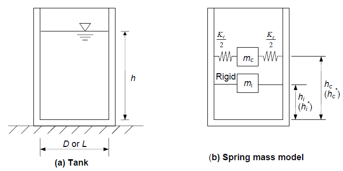
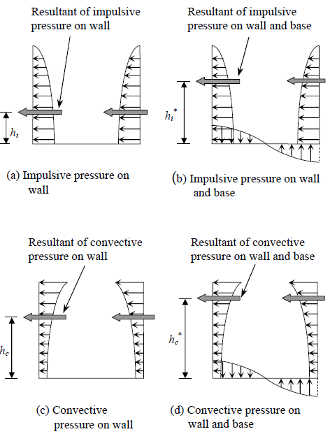
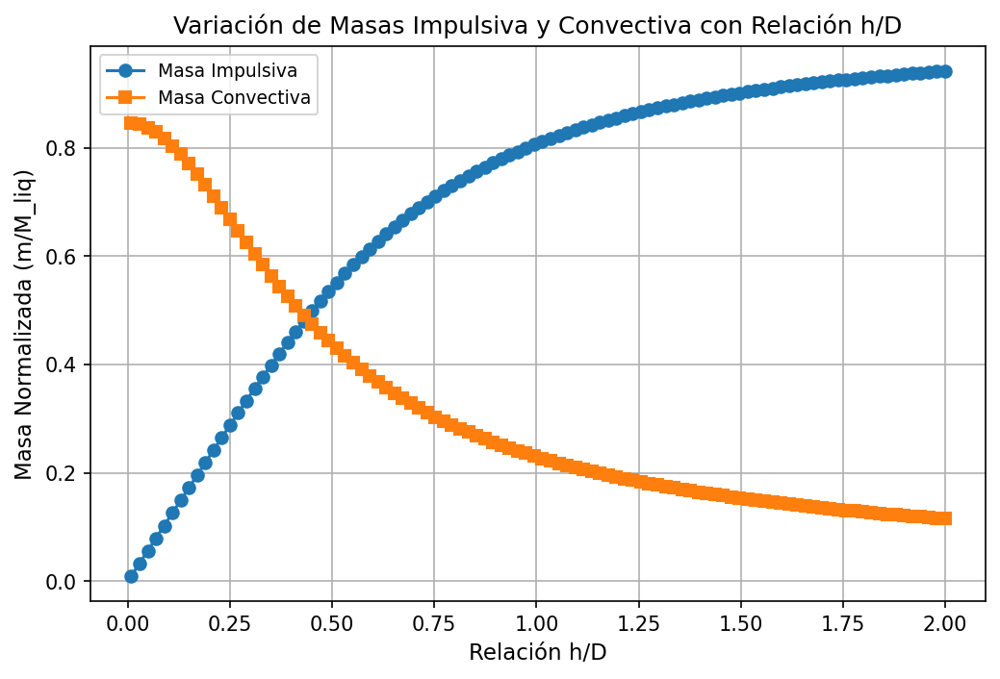
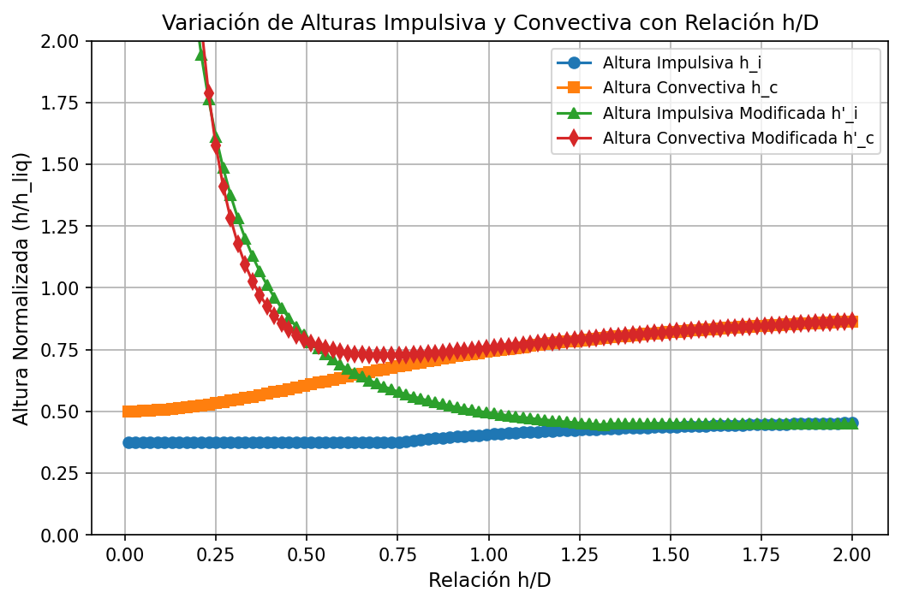

# Estanques de Acero — API 650

Esta subsección cubre el diseño de **estanques cilíndricos verticales de acero soldado apoyado en el suelo** según el estándar **API 650**. Se exponen ecuaciones principales para el calculo de componentes hidrodinámicas (impulsiva y convectiva) y un poco de teoría relacionada para entender conceptos relacionados.

## Modelo Masa-Resorte para Análisis Sísmico

Cuando un tanque que contiene líquido vibra, el líquido ejerce presiones hidrodinámicas **impulsivas** y **convectivas** sobre la pared y la base del tanque, además de la presión hidrostática. Para incluir el efecto de la presión hidrodinámica en el análisis, el tanque puede idealizarse mediante un modelo equivalente de masa-resorte, que incorpora el efecto de la interacción entre la pared del tanque y el líquido. Los parámetros de este modelo dependen de la geometría del tanque y de su flexibilidad.

### Estanque Apoyado en Suelo.

Los tanques apoyados sobre el suelo pueden idealizarse como un modelo de masa-resorte. La masa impulsiva del líquido ($m_i$), está rígidamente unida a la pared del tanque a la altura $h_i$ (o $h_i^*$). De manera similar, la masa convectiva ($m_c$) está unida a la pared del tanque a la altura $h_c$ (o $h_c^*$) mediante un resorte de rigidez $K_c$.

Los valores de $h_i$ y $h_c$ consideran únicamente la presión hidrodinámica sobre la pared del tanque. En cambio, $h_i^*$ y $h_c^*$ consideran la presión hidrodinámica tanto sobre la pared como sobre la base del tanque. Por lo tanto, los valores de $h_i$ y $h_c$ deben utilizarse para calcular el momento debido a la presión hidrodinámica en la base de la pared del tanque. Los valores de $h_i^*$ y $h_c^*$ deben emplearse para calcular el momento de volcamiento en la base del tanque.

---

### Resumen de Parámetros — Estanque Circular y Rectangular

| Parámetro | Condición | Circular | Rectangular |
|:---|:---:|:---:|:---:|
| Masa impulsiva $m_i/m$ | — | $\dfrac{\tanh(0.866\,D/h)}{0.866\,D/h}$ | $\dfrac{\tanh(0.866\,L/h)}{0.866\,L/h}$ |
| Altura impulsiva $h_i/h$ | $h/D \leq 0.75$ | $0.375$ | $0.375$ |
| Altura impulsiva $h_i/h$ | $h/D > 0.75$ | $0.5 - \dfrac{0.09375}{h/D}$ | $0.5 - \dfrac{0.09375}{h/L}$ |
| Altura volcante $h_i^*/h$ | $h/D \leq 1.33$ | $\dfrac{0.866\,D/h}{2\tanh(0.866\,D/h)} - 0.125$ | $\dfrac{0.866\,L/h}{2\tanh(0.866\,L/h)} - 0.125$ |
| Altura volcante $h_i^*/h$ | $h/D > 1.33$ | $0.45$ | $0.45$ |
| Masa convectiva $m_c/m$ | — | $0.23\,\dfrac{\tanh(3.68\,h/D)}{h/D}$ | $0.264\,\dfrac{\tanh(3.16\,h/L)}{h/L}$ |
| Altura convectiva $h_c/h$ | — | $1 - \dfrac{\cosh(3.68\,h/D)-1}{3.68\,(h/D)\,\sinh(3.68\,h/D)}$ | $1 - \dfrac{\cosh(3.16\,h/L)-1}{3.16\,(h/L)\,\sinh(3.16\,h/L)}$ |
| Altura volcante convectiva $h_c^*/h$ | — | $1 - \dfrac{\cosh(3.68\,h/D)-2.01}{3.68\,(h/D)\,\sinh(3.68\,h/D)}$ | $1 - \dfrac{\cosh(3.16\,h/L)-2.01}{3.16\,(h/L)\,\sinh(3.16\,h/L)}$ |
| Rigidez convectiva $K_c$ | — | $0.836\,\dfrac{mg}{h}\tanh^2(3.68\,h/D)$ | $0.833\,\dfrac{mg}{h}\tanh^2(3.16\,h/L)$ |

NOTA: $h$ corresponde a la altura del líquido en el estanque y $m$ es la masa **total** del liquido contenido.

| Graficos para Estanque Circular|  |
| - | - |
|  |  |

## Análisis Sísmico (NCh2369:2025)

Se utilizan las disposiciones del capítulo **11.2-Estanques** de la norma, dependiente el tipo de estanque considerado. En este caso, nos concentraremos en la sección **11.2.1-Estanques Cilíndricos Verticales de acero apoyados en el suelo**. Se consideran estanques circulares de **base rígida**:

| Periodo | Ecuación | Factor C |
| - | - | - |
| Impulsivo | $T_i=C_i \frac{h\sqrt{\rho}}{\sqrt{t/D}\sqrt{E}}$ | $C_i = \frac{1}{\sqrt{h/D}(0.46-0.3h/D+0.067(h/D)^2)}$|
| Convectivo | $T_c=C_c \sqrt{D/g}$ | $C_c = \frac{2\pi}{\sqrt{3.68tanh(3.68h/D)}}$ |

Donde: **$h$** es la altura del liquido, **$D$** el diámetro del estanque, **$t$** el espesor del manto, **$E$** el módulo de elasticidad del manto, **$\rho$** masa unitaria del líquido y **$g$** la aceleración de gravedad.

### Factor de Modificación de Respuesta y Amortiguamiento.

- **11.2.1.6**: En estanques bajos se debe usar un valor máximo R=4 para el factor de modificación de respuesta impulsiva en el caso en que el estanque esté mecánicamente anclado contra el volcamiento. En el caso de estanques no anclados contra el volcamiento se debe usar un valor máximo de R=2,5 para el mismo factor. La razón de amortiguamiento asociada a la respuesta impulsiva debe ser $\xi=2\%$.

- **11.2.1.7**: En estanques bajos, los parámetros de diseño asociados a la respuesta convectiva deben ser R=1,5 y $\xi=0,5\%$. El valor de $S_a$ para esta respuesta no debe ser menor que $0.1\cdot I \cdot A_r \cdot S/g$

- **11.2.1.8**: El efecto sísmico vertical se debe considerar de la forma y en la magnitud definida en cláusula 5 de la norma. La combinación del efecto sísmico
vertical con el horizontal debe ser la indicada en el código de diseño de estanques utilizado, pero no debe ser menor a lo indicado en cláusula 5 para estructuras generales. Por lo general la dirección vertical de un estanque responderá de manera rígida, alcanzando los valores máximos para el diseño. Sin embargo, lo relevante es establecer que la respuesta vertical no se encuentra condicionada a la horizontal para efectos del análisis normativo.

### Consideraciones.

- Generalmente, como la componente impulsiva actúa de manera rígida junto con el movimiento del estanque, la aceleración de esta componente cae en la parte espectral de periodos cortos, por lo que conservadoramente se usa la aceleración máxima normativa (§5.13 Fuerza Sísmica de corte basal máxima):

$$
S_{ai} = 2.75 \frac{I\cdot A_r\cdot S}{g(R+1)}(\frac{0.05}{\xi})^{0.4}
$$

- Por otro lado, como la componente convectiva actúa de manera "flexible", se obtienen periodos largos. Debido a lo anterior, se debe evaluar usando el espectro de diseño (§5.4.1) pero con una consideración importante: Debido a que la componente convectiva considera $\xi_c = 0.5\%$ y en el espectro de diseño el factor de amortiguamiento $(0.05/\xi)^{0.4}$ solo admite amortiguamientos $\xi=[2:5]\%$, se considera lo establecido en API650, precisamente §E.4.2.4:

 The response spectrum values for 0.5% damping for the convective behavior shall be 1.5 times the 5% spectral values unless otherwise specified by the Purcharser. 

$$
S_{ac} = \frac{1.5\cdot I}{R^*} (A_r\cdot S\cdot (\frac{1+r(\frac{T_c}{T_0})^p}{1+(\frac{T_c}{T_0})^q}))
$$

Donde $R^*=R_c=1.5$, ya que:

- 1) $R_c \neq 1$
- 2) $C_r = 0.16 R_c = 0.24$ y considerando el máximo $T_1 = 0.79 seg$ (Suelo E, Tabla 6), se tiene que $T_c > C_rT_1 = 0.24\cdot 0.79 = 0.1896 seg$, lo que para la componente convectiva (periodo largo) se cumple siempre.

## Esfuerzos Sísmicos (Macro).

De manera simplificada, considerando espesores de manto, techo, fondo, y pesos adicionales que tenga el estanque, se pueden obtener las reacciones basales. Como se vió anteriormente, se tienen dos componentes principales: la **impulsiva**, que actúa en conjunto con el tanque (y sus componentes) y la **convectiva**, la respuesta global resulta de la combinación SRSS.

- 1) **Corte Basal V**

$$
V = \sqrt{  (S_{ai} \cdot (m_i + m_w + m_t) \cdot g)^2  + (S_{ac} \cdot m_c \cdot g)^2}
$$

Donde $m_i$ corresponde a la masa impulsiva, $m_w$ es la masa del manto, $m_t$ es la masa del techo (y % de sobrecarga eventual) y $m_c$ es la masa convectiva.

- 2) **Momento Basal fondo de Manto M**

$$
M = \sqrt{  (S_{ai} \cdot (m_ih_i + m_wh_w + m_th_t) \cdot g)^2  +  (S_{ac} \cdot m_ch_c \cdot g)^2}
$$

Donde $h_i$ altura impulsiva (sin subpresión), $h_w$ altura del centro de masa del manto, $h_t$ altura del centro de masa del techo y $h_c$ altura convectiva (sin subpresión).

- 3) **Momento Basal Volcante $M^*$**

$$
M^* = \sqrt{  (S_{ai} \cdot (m_ih_i^* + m_wh_w + m_th_t) \cdot g)^2  +  (S_{ac} \cdot m_ch_c^* \cdot g)^2}
$$

Donde $h_i^*$ altura impulsiva (con subpresión) y $h_c^*$ altura convectiva (con subpresión).

Con estas reacciones se puede realizar el cálculo del sistema de anclaje y análisis de estabilidad de fundaciones.

