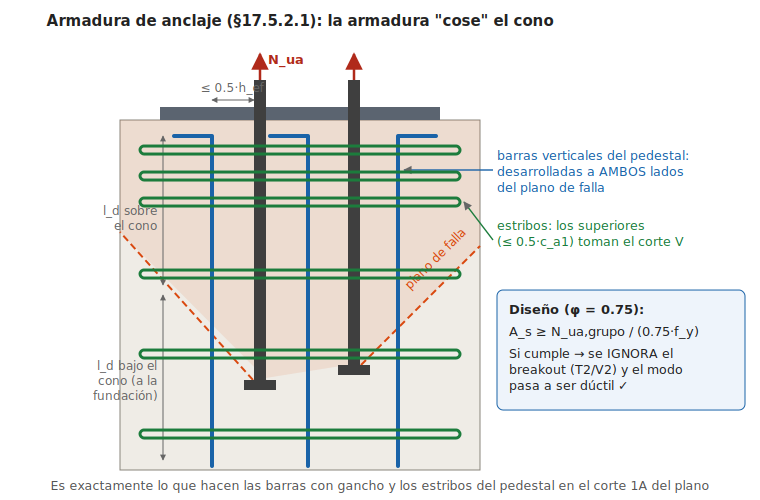

# Verificaciones de diseño del pedestal — Cierre DET-1

Documento de cierre del sistema de anclaje: toma las capacidades desarrolladas en [anclajes-placa-base-det1.md](anclajes-placa-base-det1.md) y las contrasta con las **demandas reales** del modelo (reacciones de apoyo SAP2000), completando las verificaciones del pedestal de hormigón armado.

> **Contexto**: este es un **diseño existente en verificación** (no un diseño nuevo). El detalle **no lleva llave de corte** — el corte se transfiere por los pernos de anclaje — y la armadura del pedestal es la que muestre el plano de enfierradura. Donde este documento indica cuantías "requeridas", son los valores contra los cuales **contrastar el armado existente**.

> Mismos supuestos del documento base: **F1554 Gr. 36**, **f'c = 25 MPa (G25)**, acero de refuerzo **A630-420H** ($f_y = 420$ MPa). Unidades: kN (y tonf entre paréntesis donde ayuda).

---

## 1. Demandas de diseño (envolvente de reacciones LRFD)

De la tabla de Joint Reactions (F3 < 0 = tracción; 1 tonf = 9.81 kN):

| Efecto | Caso gobernante | Valor | Concurrente |
|---|---|---|---|
| **Tracción máxima** $T_u$ | J24, LRFD_7b Min | **−73.0 tonf = 716 kN** | V ≈ 96 kN |
| **Corte máximo** $V_u$ | J22, LRFD_6a Min | **20.1 tonf = 197 kN** | T = 229 kN (¡con levantamiento!) |
| Tracción + corte alto | J4, LRFD_6b | T = 445 kN | V = 169 kN |
| **Compresión máxima** $C_u$ | J485, LRFD_6b Max | **87.6 tonf = 859 kN** | — |

**Dos notas sobre estos datos:**
1. Las filas Min/Max de una envolvente SAP2000 reportan el extremo de **cada columna por separado** — los pares usados arriba pueden no ser concurrentes en el tiempo. Emparejar extremos es conservador y está bien para diseño.
2. ⚠️ **Confirmar si las combinaciones LRFD_6/7 ya incluyen la amplificación sísmica que NCh2369 exige para el diseño de anclajes.** Si los 716 kN son sismo sin amplificar, las utilizaciones de acero escalan proporcionalmente (hay holgura ~2.6× en los pernos antes de saturar).

---

## 2. Cierre de la verificación de anclajes (Cap. 17)

| Verificación | Demanda | φRn | D/C | Estado |
|---|---|---|---|---|
| T1 Acero perno ($T_u/16$) | 44.8 kN | 117.3 kN | 0.38 | ✅ |
| T3 Pullout | 44.8 kN | 135.6 kN | 0.33 | ✅ |
| T4 Side-face blowout | 44.8 kN | ~284 kN | 0.16 | ✅ |
| T2 Breakout **sin armadura** | 716 kN | 190 kN (142 sísmico) | **5.0** | ❌ → se resuelve con armadura de anclaje (§3) |
| V1 Acero perno ($V_u/16$) | 12.3 kN | 48.8 kN | 0.25 | ✅ (si los pernos toman corte, §7) |
| V2 Breakout corte **sin armadura** | 197 kN | ~46 kN | **4.3** | ❌ → estribos superiores o llave de corte (§7) |
| Interacción T–V (J22 / J4) | — | ≤ 1.2 | 0.37 / 0.45 | ✅ |

**Conclusión anclajes**: pernos Ø1" Gr. 36 correctos y con reserva dúctil (44.8 kN < fluencia $A_{se}f_{ya}$ = 97 kN). Los dos modos frágiles de hormigón excedidos se eliminan por diseño con la armadura del pedestal — que es justamente lo que verifica este documento.

---

## 3. Armadura vertical del pedestal (armadura de anclaje a tracción, §17.5.2.1)

Dos criterios de dimensionamiento:

| Criterio | Fórmula | As requerida |
|---|---|---|
| (a) Por **demanda** | $T_u / (0.75 f_y) = 716{,}000/315$ | 2,274 mm² |
| (b) Por **capacidad** (fusible: que los 16 pernos fluyan antes que las barras) | $16 \times 1.2 N_{sa} / f_y = 3{,}003{,}000/420$ | 7,150 mm² |

**Referencia de verificación: 16φ25 perimetrales** → $A_s = 7{,}854$ mm² ✓ cumpliría ambos. **Contrastar con el plano de enfierradura del pedestal**: si el armado existente está entre 2,274 y 7,150 mm², la verificación cierra por demanda pero no por capacidad (el fusible dúctil pierde la protección formal); bajo 2,274 mm² no cierra.

- Cuantía: $\rho = 7{,}854/640{,}000 = 1.23\%$ ≥ 1% mínimo de columna ✓ (el pedestal queda armado como columna, no como pedestal simple).
- Distribución: 5 barras por cara (esquinas compartidas), separación ~165 mm ≤ límites ✓. Las barras quedan a ≤150 mm de los pernos, dentro de la zona efectiva (≤ 0.5·h_ef) ✓.

Ver el esquema del mecanismo: 

## 4. Desarrollo de las barras a ambos lados del plano de falla

El plano de falla nace en las cabezas de los pernos (~1000 mm de profundidad) y sube a ~35°. Las barras deben desarrollarse **sobre** y **bajo** ese plano (φ25, f'c=25, factores 1.0):

| Longitud | Valor | Disponible | Estado |
|---|---|---|---|
| $l_d$ recta (mejor caso, $(c_b+K_{tr})/d_b = 2.5$) | 764 mm | ~850 mm sobre el plano (barras junto a los pernos cruzan el plano cerca de las cabezas) | ✅ justo — verificar con geometría real de cada barra |
| $l_{dh}$ gancho 90° | 457 mm | — | usar **gancho superior** en las barras si el desarrollo recto no alcanza para las barras que cruzan el plano más arriba |
| Bajo el plano: anclaje en la fundación | $l_{dh}$ = 457 mm | canto de la zapata (≫) con gancho 90° | ✅ |

**Detalle recomendado**: barras con gancho 90° arriba (bajo la parrilla superior del pedestal) y gancho 90° abajo dentro de la zapata — como muestra el corte 1A. Con gancho arriba, el desarrollo sobre el plano queda cubierto para todas las barras, no solo las cercanas a los pernos.

## 5. Pedestal como elemento (columna corta 800×800)

| Verificación | Demanda | φRn | D/C |
|---|---|---|---|
| Corte del pedestal (una dirección) | 197 kN | $\phi V_c = 0.75 \times 0.17\sqrt{25} \times 800 \times 730$ = 372 kN | 0.53 ✅ sin contar estribos |
| Flexión en voladizo ($M_u = V_u \times 0.55$ m altura libre) | 108 kN·m | $M_n \approx A_{s,cara} f_y (d-d')$ = 680 kN·m (aprox., sin beneficio de compresión) | <0.2 ✅ |
| Tracción pura (uplift J24 repartido en 16φ25) | 44.8 kN/barra | $\phi f_y A_b$ = 186 kN/barra | 0.24 ✅ |
| Compresión (859 kN) | 859 kN | trivial para 800×800 armado | ≪1 ✅ |

Interacción flexo-tracción (J22: T=229 kN + M=108 kN·m simultáneos): con utilizaciones individuales de 0.08 y 0.16, cierra holgado ✅.

## 6. Aplastamiento bajo la placa base

$$\phi P_p = 0.65 \times 0.85 f'_c A_1 \sqrt{A_2/A_1} = 0.65 \times 0.85 \times 25 \times 550^2 \times 1.45 = 6{,}078 \text{ kN}$$

vs $C_u$ = 859 kN → **D/C = 0.14** ✅. El grout de nivelación (80 mm) debe especificarse con resistencia ≥ f'c del pedestal (típico ≥ 45 MPa, no controla).

## 7. Corte por los pernos (diseño sin llave de corte)

El detalle no lleva llave de corte, así que el corte viaja: **placa → pernos → hormigón**. El caso gobernante (J22) tiene **corte 197 kN con levantamiento simultáneo** (T = 229 kN) → no hay fricción disponible en ese caso; la fricción solo ayuda en los casos comprimidos (C hasta 859 kN), que no son los que gobiernan. La cadena tiene tres eslabones a verificar:

**(1) Acero de los pernos** ✓ — $V_u/16 = 12.3$ kN vs $\phi V_{sa} = 48.8$ kN/perno (con grout): **D/C = 0.25**, e interacción T–V máxima 0.45 ≤ 1.2.

**(2) Reparto placa→pernos** ⚠️ *observación de verificación* — con agujeros Ø1-3/8" para perno Ø1" (holgura ~10 mm), el corte no se reparte de forma confiable entre los 16 pernos salvo que existan **golillas/planchuelas soldadas a la placa** después del montaje. Confirmar si el detalle las incluye (es lo habitual junto a la silla en la práctica NCh2369). Si no las hay, el reparto real puede concentrarse en pocos pernos: incluso así, 4 pernos tomando todo dan 49.2 kN/perno ≈ φV_sa — al límite; con golillas soldadas la verificación cierra holgada.

**(3) Breakout del hormigón en corte** ⚠️ *el eslabón que depende del armado existente* — sin armadura, $\phi V_{cbg} \approx 46$ kN ≪ 197 kN. Incluso el argumento más favorable (grupo rígido con golillas soldadas, evaluando en la fila trasera con $c_{a1} = 600$ mm) da $\phi V_{cbg} \approx 66$ kN — insuficiente. Por lo tanto la verificación **requiere acreditar los estribos superiores del pedestal como armadura de anclaje al corte** (§17.5.2.1b):

$$A_{sv,req} = \frac{V_u}{0.75 f_y} = \frac{197{,}000}{315} = 626 \text{ mm}^2$$

- Equivale a **3 estribos φ12** (2 ramas paralelas a V c/u = 678 mm²) o **4 estribos φ10** (628 mm²) en la zona superior.
- Efectividad: el comentario de ACI acota los estribos que se pueden contar a los cercanos a la superficie/fila frontal (del orden de ~0.5·c_a1 ≈ 100 mm, lectura estricta; en la práctica se suele aceptar la zona superior armada densa). Las cotas **80/80/80** del corte 1A sugieren precisamente **estribos @80 en la zona superior** — si el plano confirma φ12@80 (o φ10@80 con 4 unidades efectivas), este eslabón cierra.
- Verificar también en la dirección ortogonal (V hasta 169 kN en J4 → mismo requisito, 537 mm²).

**Conclusión del corte**: los pernos resisten con holgura; el cierre queda **condicionado a confirmar en el plano**: (a) golillas soldadas para el reparto, y (b) estribos superiores ≥ 626 mm² efectivos en ambas direcciones.

---

## 8. Armado requerido — checklist para contrastar con el plano de enfierradura

| Componente | Requerido para que la verificación cierre |
|---|---|
| Armadura vertical | ≥ **2,274 mm²** por demanda (≥ **7,150 mm²** ≈ 16φ25 para cierre por capacidad/fusible), desarrollada a ambos lados del plano de falla (gancho 90° arriba recomendado, anclada en zapata) |
| Estribos superiores | ≥ **626 mm² efectivos por dirección** cerca de la fila frontal (3Eφ12 o 4Eφ10 — las cotas 80/80/80 del corte 1A sugieren que existen @80) |
| Reparto del corte | **Golillas/planchuelas soldadas** a la placa en los pernos (agujeros Ø1-3/8") — confirmar en el detalle |
| Pernos | 16 Ø1" F1554 **Gr. 36** (confirmar grado), embebido ~1000 mm, tuerca + contratuerca + planchuela inferior ✓ (según plano) |
| Grout | 80 mm, ≥45 MPa, no retráctil (confirmar EETT) |

## 9. Tabla de cierre — D/C global del sistema

| # | Verificación | D/C | Estado |
|---|---|---|---|
| 1 | Perno a tracción (acero, dúctil) | 0.38 | ✅ |
| 2 | Pullout / side-face blowout | 0.33 / 0.16 | ✅ |
| 3 | Breakout tracción → armadura de anclaje 16φ25 | 716/2,474* → **0.29** (por demanda) | ✅ y cumple capacidad (7,854 ≥ 7,150) |
| 4 | Desarrollo de barras (ambos lados del plano) | l_d 764 ≤ ~850 disp. (recto) / gancho | ✅ con gancho superior |
| 5 | Corte por pernos (acero) | 0.25 | ✅ |
| 5b | Corte lado hormigón → estribos superiores ≥ 626 mm² | 626/678 = 0.92 (con 3Eφ12) | ⚠️ condicionado a confirmar estribos y golillas soldadas en plano |
| 6 | Interacción T–V pernos | 0.45 máx | ✅ |
| 7 | Pedestal columna (corte / flexión / tracción) | 0.53 / <0.2 / 0.24 | ✅ |
| 8 | Aplastamiento placa base | 0.14 | ✅ |
| 9 | Espaciamiento pernos (§17.9) | 100 vs 101.6 mm | ⚠️ formal, 1.6 mm |

\* φ·f_y·A_s = 0.75 × 420 × 7,854 = 2,474 kN.

**Resultado de la verificación**: los pernos trabajan como fusible dúctil al 38% y el pedestal como elemento tiene holgura amplia. El cierre completo queda **condicionado a confirmar contra el plano de enfierradura y el detalle**: (a) armadura vertical ≥ 2,274 mm² (ideal ≥ 7,150 mm² por capacidad), (b) estribos superiores ≥ 626 mm² efectivos por dirección, (c) golillas soldadas en los pernos.

## 10. Pendientes para cerrar la verificación

1. **Plano de enfierradura del pedestal**: cuantía vertical y estribos superiores reales (ítems condicionantes de §9).
2. **Detalle de golillas soldadas** en los pernos (reparto del corte con agujeros sobredimensionados).
3. **Amplificación NCh2369** de las combinaciones sísmicas para anclajes (confirmar si LRFD_6/7 ya la traen) — hay holgura ~2.6× en los pernos si hubiera que amplificar.
4. **Estabilidad global al uplift**: los 716 kN de tracción deben equilibrarse con peso de zapata + relleno (verificación geotécnica de la fundación).
5. Confirmar contra EETT: grado F1554 real y f'c real (los supuestos Gr. 36 / G25 son los conservadores habituales).
6. Lado acero de la conexión (placa 38 mm, atiesadores, soldaduras) — AISC DG1.
7. Detalle de la silla/largo libre de los pernos para inspección post-sismo según NCh2369.

---

*Cálculos verificados numéricamente (script Python, SI). Documento de estudio — no reemplaza la memoria de cálculo del proyecto.*
