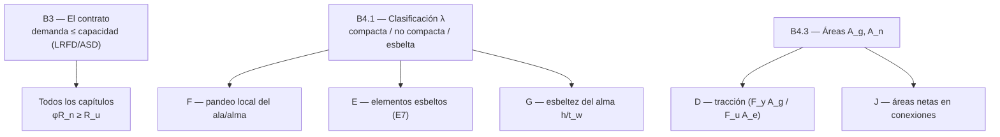

import Note from '../../components/content/Note.astro';
import Equation from '../../components/content/Equation.astro';
import Figure from '../../components/content/Figure.astro';

## La pelea que organiza el capítulo

El Capítulo B es el único que **no diseña nada**. Es el fundamento: escribe el **contrato**
que cumplen todos los demás capítulos y define el **vocabulario** con que están escritos. Si
D, E, F, G, H y J son las reglas del juego, B es la gramática.

Fija tres cosas que después se usan en todas partes:

| Lo que B establece | Sección | Dónde se usa |
|---|---|:---:|
| **El contrato**: demanda ≤ capacidad (LRFD / ASD) | B3 | todos los capítulos |
| **El vocabulario**: clasificación por esbeltez $\lambda$ | B4.1 | F (pandeo local), E (elementos esbeltos), G (alma)… |
| **Las áreas**: bruta $A_g$ y neta $A_n$ | B4.3 | D (tracción), E (compresión), J (conexiones) |

El lente dúctil/frágil de la serie está en la raíz de todo esto: el contrato calibra cuánto
margen se le da a cada modo de falla (más a lo frágil, menos a lo dúctil), y la
clasificación $\lambda$ decide justamente si un elemento es lo bastante robusto para *fluir*
(dúctil) o si *pandeará localmente antes* (frágil). B es donde esa distinción se vuelve
número.

<Note type="info" title="Alcance">
El Capítulo B fija los requisitos generales: B1 alcance, B2 cargas (remite al código de
edificación), B3 bases de diseño (estados límite, LRFD y ASD), B4 propiedades de los
miembros (clasificación y áreas), B5–B6 fabricación y calidad, B7 evaluación de estructuras
existentes. Esta nota cubre B3 y B4, las partes de cálculo.
</Note>

---

## 1. El contrato de diseño: LRFD y ASD (B3)

Todo el diseño se reduce a una desigualdad: la **resistencia requerida** (la demanda) no
puede superar la **resistencia disponible** (la capacidad). AISC ofrece dos dialectos para
decir lo mismo, y ambos parten de la **misma resistencia nominal $R_n$**:

<Figure
  src="/aisc360-22-capB/contrato-de-diseno.svg"
  alt="El contrato de diseño: una resistencia nominal Rn común se divide en dos métodos. LRFD multiplica por phi (Ru ≤ phi·Rn, cargas mayoradas, Ec B3-1); ASD divide por Omega (Ra ≤ Rn/Omega, cargas de servicio, Ec B3-2). Calibrados al mismo Rn con Omega = 1.5/phi"
  caption="El contrato en dos dialectos. LRFD reduce R_n con φ y lo compara con cargas mayoradas; ASD lo divide por Ω y lo compara con cargas de servicio. Como parten del mismo R_n y se calibran con Ω = 1.5/φ, dan diseños equivalentes."
/>

<Equation label="Ec. B3-1 (LRFD)">
$$
R_u \leq \phi R_n \qquad (\phi \leq 1.0)
$$
</Equation>

<Equation label="Ec. B3-2 (ASD)">
$$
R_a \leq \frac{R_n}{\Omega} \qquad (\Omega \geq 1.0)
$$
</Equation>

<Note type="tip" title="Por qué φ = 0.90 ↔ Ω = 1.67 y φ = 0.75 ↔ Ω = 2.00">
Los dos formatos se calibran para dar el mismo resultado en una relación viva/muerta
típica, lo que fija $\Omega = \dfrac{1.5}{\phi}$. Por eso a lo largo de toda la
especificación se ven emparejados: $\phi = 0.90$ (estados dúctiles, como la fluencia) con
$\Omega = 1.67$, y $\phi = 0.75$ (estados frágiles, como la rotura) con $\Omega = 2.00$. El
factor más estricto siempre acompaña a la falla más súbita.
</Note>

---

## 2. La clasificación por esbeltez: $\lambda$ (B4.1)

Aquí está el concepto que reaparece en **cada** capítulo de miembros. La capacidad de un
elemento de desarrollar la fluencia (o $M_p$) antes de arrugarse localmente depende de su
**relación ancho-espesor** $\lambda = b/t$. Una placa delgada ($\lambda$ grande) pandea
localmente antes de que el material dé todo lo suyo. La norma compara $\lambda$ con uno o
dos umbrales según la solicitación:

<Figure
  src="/aisc360-22-capB/clasificacion-lambda.svg"
  alt="La clasificación por esbeltez lambda = b/t. En compresión axial (Tabla B4.1a) un solo umbral lambda_r separa no esbelto (desarrolla Fy) de esbelto (pandea local antes). En flexión (Tabla B4.1b) dos umbrales lambda_p y lambda_r separan compacta (alcanza Mp), no compacta (transición) y esbelta (pandea antes de Mp)"
  caption="El vocabulario de la esbeltez. En compresión axial hay un umbral (no esbelto / esbelto); en flexión hay dos (compacta / no compacta / esbelta). De esta clasificación cuelgan las fórmulas de F, E y G."
/>

- **Compresión axial → Tabla B4.1a.** Un solo límite $\lambda_r$: el elemento es **no
  esbelto** ($\lambda \leq \lambda_r$, desarrolla $F_y$) o **esbelto** ($\lambda > \lambda_r$,
  pandea local antes y obliga a usar el área efectiva).
- **Flexión → Tabla B4.1b.** Dos límites, $\lambda_p$ y $\lambda_r$:

| Si | Clasificación (flexión) | Significa |
|----|-------------------------|-----------|
| $\lambda \leq \lambda_p$ | **Compacta** | alcanza $M_p$ |
| $\lambda_p < \lambda \leq \lambda_r$ | **No compacta** | entre $M_p$ y el pandeo (transición) |
| $\lambda > \lambda_r$ | **Esbelta** | pandea local antes de $M_p$ |

<Note type="warning">
Se clasifican **todos** los elementos comprimidos de la sección (ala *y* alma), por
separado, y gobierna el más desfavorable. Un mismo perfil puede clasificarse distinto en
compresión axial que en flexión, y un ala puede ser compacta mientras el alma no lo es.
</Note>

---

## 3. Atiesado vs no atiesado: por qué cambian los límites

Los umbrales $\lambda_r$ no son iguales para todos los elementos, y la razón es puramente de
estabilidad: **una placa sujeta por sus dos bordes aguanta más antes de pandear que una
sujeta por uno solo**.

<Figure
  src="/aisc360-22-capB/atiesado-y-no-atiesado.svg"
  alt="Elementos no atiesados vs atiesados. No atiesado: una placa apoyada en un solo borde (el ala de un perfil I, apoyada en el alma y libre en la punta) pandea más fácil, con límites lambda_r menores. Atiesado: una placa apoyada en dos bordes (el alma de un I, o la pared de un HSS) es más estable, con límites lambda_r mayores"
  caption="El borde libre importa. Un elemento no atiesado (ala de I, con un borde libre) pandea más fácil → λ_r más estricto. Un atiesado (alma de I, pared de HSS, sujeto por dos bordes) aguanta más → λ_r más holgado. Por eso cada elemento tiene su propio límite."
/>

- **No atiesados** — apoyados en **un solo** borde paralelo a la carga (alas de perfiles I,
  canales, tés y ángulos). Un borde queda libre y pandea antes: $\lambda_r$ **menores**.
- **Atiesados** — apoyados en **ambos** bordes (almas de perfiles I, paredes de HSS). Más
  estables: $\lambda_r$ **mayores**.

El ancho $b$ también se mide según el caso: en no atiesados, del apoyo al borde libre; en
atiesados, entre apoyos (en HSS, $b$ y $h$ son los anchos planos; si no se conoce el radio
de esquina, $b = B - 3t$ y $h = H - 3t$).

---

## 4. Las tablas de referencia B4.1

### Tabla B4.1a — Compresión axial (solo $\lambda_r$)

$k_c = \dfrac{4}{\sqrt{h/t_w}}$, con $0.35 \leq k_c \leq 0.76$.

| Caso | Elemento | $\lambda$ | $\lambda_r$ (no esbelto) |
|:----:|----------|:---------:|:------------------------:|
| 1 | Alas de perfiles laminados, canales y tés (no atiesado) | $b/t$ | $0.56\sqrt{E/F_y}$ |
| 2 | Alas de perfiles I soldados (no atiesado) | $b/t$ | $0.64\sqrt{k_c\,E/F_y}$ |
| 3 | Alas de ángulos y otros elementos no atiesados | $b/t$ | $0.45\sqrt{E/F_y}$ |
| 4 | Almas (vástagos) de tés | $d/t$ | $0.75\sqrt{E/F_y}$ |
| 5 | Almas de perfiles I y canales (atiesado) | $h/t_w$ | $1.49\sqrt{E/F_y}$ |
| 6 | Paredes de HSS rectangulares y cajón | $b/t$ | $1.40\sqrt{E/F_y}$ |
| 8 | Todo elemento atiesador | $b/t$ | $1.49\sqrt{E/F_y}$ |
| 9 | HSS circulares | $D/t$ | $0.11\,E/F_y$ |

### Tabla B4.1b — Flexión ($\lambda_p$ y $\lambda_r$)

| Caso | Elemento | $\lambda$ | $\lambda_p$ | $\lambda_r$ |
|:----:|----------|:---------:|:-----------:|:-----------:|
| 10 | Alas de I laminados, canales y tés (no atiesado) | $b/t$ | $0.38\sqrt{E/F_y}$ | $1.0\sqrt{E/F_y}$ |
| 11 | Alas de I armados (no atiesado) | $b/t$ | $0.38\sqrt{E/F_y}$ | $0.95\sqrt{k_c E/F_L}$ |
| 12 | Alas de ángulos simples | $b/t$ | $0.54\sqrt{E/F_y}$ | $0.91\sqrt{E/F_y}$ |
| 14 | Almas (vástagos) de tés | $d/t$ | $0.84\sqrt{E/F_y}$ | $1.03\sqrt{E/F_y}$ |
| 15 | Almas de I y canales doblemente simétricos (atiesado) | $h/t_w$ | $3.76\sqrt{E/F_y}$ | $5.70\sqrt{E/F_y}$ |
| 17 | Alas de HSS rectangulares y cajón | $b/t$ | $1.12\sqrt{E/F_y}$ | $1.40\sqrt{E/F_y}$ |
| 19 | Almas de HSS rectangulares y cajón | $h/t$ | $2.42\sqrt{E/F_y}$ | $5.70\sqrt{E/F_y}$ |
| 20 | HSS circulares | $D/t$ | $0.07\,E/F_y$ | $0.31\,E/F_y$ |

<Note type="info">
Compárense los límites: para el **alma atiesada** de un I en flexión (Caso 15)
$\lambda_p = 3.76\sqrt{E/F_y}$, mientras que para el **ala no atiesada** (Caso 10)
$\lambda_p = 0.38\sqrt{E/F_y}$ — un orden de magnitud más estricto. El borde libre del ala
es lo que la vuelve exigente. Casos omitidos (16 almas de simetría simple, 18 sobre-planchas)
siguen la misma lógica con parámetros propios; en el Caso 11, $F_L = 0.7 F_y$ en general.
</Note>

---

## 5. Áreas bruta y neta (B4.3)

Las propiedades geométricas que usan tracción, compresión y conexiones:

- **Área bruta $A_g$** — el área total de la sección.
- **Área neta $A_n$** — descuenta los agujeros de conectores (el ancho del agujero se toma
  $1.6$ mm mayor que el nominal). Con agujeros escalonados se **recupera** parte con el
  término $s^2/4g$ por cada diagonal, porque la trayectoria de rotura en zigzag es más larga:

<Equation label="Ec. B4.3b">
$$
A_n = \left[ b_g - \sum d_h + \sum \frac{s^2}{4g} \right] t
$$
</Equation>

con $s$ el paso longitudinal entre agujeros y $g$ el gramil transversal.

<Note type="tip">
El **área neta efectiva** $A_e = A_n U$ (que incorpora el retraso de cortante con el factor
$U$) se define en el Capítulo D, no aquí. B solo fija $A_g$ y $A_n$: la geometría pura, sin
el efecto de cómo se conecta.
</Note>

---

## 6. Cómo B alimenta a toda la especificación

Este diagrama es la serie completa vista al revés: donde los otros capítulos *calculan*, el
Capítulo B *define*. Toda ecuación de resistencia de la especificación empieza, sin decirlo,
con un dato que salió de aquí — un $\phi$, un $\lambda_p$, un $A_n$.

---

## Resumen de lo que fija el Capítulo B

| Requisito | Contenido | Naturaleza |
|-----------|-----------|:---:|
| Contrato de resistencia | $R_u \leq \phi R_n$ (LRFD) / $R_a \leq R_n/\Omega$ (ASD) | marco de todo |
| Calibración de factores | $\Omega = 1.5/\phi$ (0.90↔1.67, 0.75↔2.00) | φ estricto = falla frágil |
| Clasificación axial | $\lambda$ vs $\lambda_r$ (Tabla B4.1a) | no esbelto / esbelto |
| Clasificación en flexión | $\lambda$ vs $\lambda_p, \lambda_r$ (Tabla B4.1b) | compacta / no compacta / esbelta |
| Atiesado vs no atiesado | fija $\lambda_r$ y cómo se mide $b$ | estabilidad del borde |
| Áreas | $A_g$ bruta, $A_n$ neta (con $s^2/4g$) | geometría base |

<Note type="warning">
B1–B2 remiten al código de edificación aplicable para cargas y combinaciones; B5–B7
(fabricación, control de calidad y evaluación de estructuras existentes) son administrativos.
Los valores de las tablas deben verificarse contra la edición vigente de AISC 360-22.
</Note>
