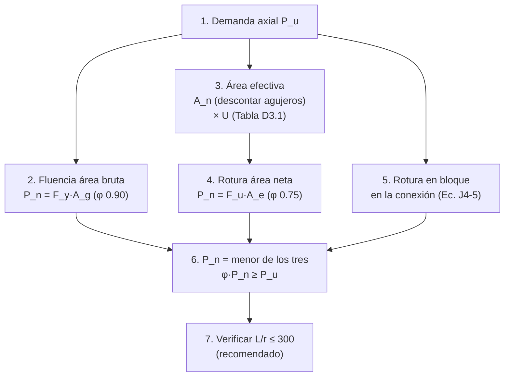

import Note from '../../components/content/Note.astro';
import Equation from '../../components/content/Equation.astro';
import Figure from '../../components/content/Figure.astro';

## La pelea que organiza el capítulo

Un miembro en tracción tiene el trabajo más simple del acero: aguantar un tirón axial.
Pero puede fallar de dos maneras **opuestas**, y todo el Capítulo D es decidir cuál de las
dos gobierna:

| Estado límite | Qué es | Naturaleza |
|---|---|:---:|
| **Fluencia en el área bruta** ($F_y A_g$) | toda la barra se estira y fluye | **dúctil — avisa** |
| **Rotura en el área neta efectiva** ($F_u A_e$) | fractura súbita en la conexión | **frágil — sin aviso** |

<Figure
  src="/aisc360-22-capD/dos-estados-limite.svg"
  alt="Comparación de los dos estados límite de tracción: a la izquierda la fluencia en el área bruta, toda la barra se estira uniformemente (dúctil, Pn = Fy Ag, phi 0.90); a la derecha la rotura en el área neta a través de los agujeros de los pernos (frágil, Pn = Fu Ae, phi 0.75)"
  caption="Los dos modos de falla en tracción. La fluencia recorre toda la barra y avisa; la rotura es local, súbita, en la conexión. Se verifican ambos y gobierna el menor P_n."
/>

Lo contraintuitivo — y la clave del capítulo — es que la **rotura puede gobernar aunque
$F_u > F_y$**. Parece imposible que el material se rompa antes de fluir siendo la tensión
de rotura mayor. Pasa porque los dos estados no se comparan en igualdad de condiciones:

- la fluencia usa $F_y$ sobre el área **bruta** $A_g$, con un $\phi$ **generoso** ($0.90$);
- la rotura usa $F_u$ sobre el área **neta efectiva** $A_e$ — más chica, penalizada por
  los agujeros y por el retraso de cortante — con un $\phi$ **estricto** ($0.75$).

Menos área y peor factor pueden más que el mayor $F_u$. Y esa asimetría de $\phi$ no es
casual: es el lente dúctil/frágil de toda la especificación — **si algo tiene que ceder,
que ceda lo que avisa.**

<Note type="info" title="Alcance">
El Capítulo D cubre la **resistencia a tracción** $P_n$ de miembros solicitados axialmente
por su centroide (Secciones D1 a D6: esbeltez, resistencia, área neta efectiva, miembros
armados, conexiones por pasador y barras de ojo). La resistencia de diseño exige, según el
método:

$$
\text{LRFD:}\quad \phi_t P_n \geq P_u
\qquad\qquad
\text{ASD:}\quad \frac{P_n}{\Omega_t} \geq P_a
$$
</Note>

---

## 1. Fluencia en el área bruta: el estado dúctil

Si la barra fluye en toda su longitud, se estira de forma visible y sostenida antes de
romper — es la falla que uno *preferiría* si tuviera que elegir. Por eso lleva el factor
menos exigente:

<Equation label="Ec. D2-1">
$$
P_n = F_y \, A_g \qquad (\phi_t = 0.90, \;\; \Omega_t = 1.67)
$$
</Equation>

$A_g$ es el área **bruta** de la sección, sin descontar nada: la fluencia es un fenómeno
del cuerpo entero del miembro, lejos de la conexión.

---

## 2. Rotura en el área neta efectiva: el estado frágil

En la conexión la historia cambia. Los agujeros de los pernos quitan material y la carga
no entra de forma pareja, así que ahí la sección puede **fracturarse** sin haber fluido en
el resto de su longitud — una falla súbita, sin capacidad residual:

<Equation label="Ec. D2-2">
$$
P_n = F_u \, A_e \qquad (\phi_t = 0.75, \;\; \Omega_t = 2.00)
$$
</Equation>

El área efectiva sale de dos descuentos sucesivos sobre el área bruta:

<Equation label="Ec. D3-1">
$$
A_e = A_n \, U
$$
</Equation>

donde $A_n$ es el área **neta** (Sec. B4.3, descontando el ancho de los agujeros) y $U$ el
**factor de retraso de cortante**, que corrige el segundo problema — que no toda la sección
está realmente conectada.

---

## 3. Retraso de cortante: por qué $A_e < A_n$

Este es el mecanismo propio del capítulo. Cuando solo **algunos** elementos de la sección
se conectan (por ejemplo un ángulo apernado por una sola ala), la fuerza tiene que entrar
por esos elementos y recién ahí repartirse al resto. Sobre la longitud corta de la
conexión no alcanza a hacerlo: la tensión se **agolpa** en el elemento conectado y el
elemento libre "va atrás" — trabaja menos de lo que su área promete. El resultado es un
área efectiva menor que la neta:

<Figure
  src="/aisc360-22-capD/retraso-cortante.svg"
  alt="Ángulo conectado por una sola ala a una plancha mediante tres pernos: la sección muestra el ala conectada y el ala libre con el centroide y la excentricidad x-barra; la elevación muestra la fuerza agolpándose en los pernos y el largo de conexión l; fórmula U = 1 - x-barra/l"
  caption="Retraso de cortante: como el ala libre no se conecta, la tensión no se reparte sobre el largo l de la conexión. U = 1 − x̄/l castiga la excentricidad x̄ (del plano de conexión al centroide) y premia una conexión larga."
/>

La forma general, válida para casi cualquier perfil apernado o soldado en que solo parte
de la sección se conecta (Caso 2 de la Tabla D3.1), es:

<Equation label="Caso 2, Tabla D3.1">
$$
U = 1 - \frac{\bar{x}}{l}
$$
</Equation>

con $\bar{x}$ la excentricidad (distancia del plano de conexión al centroide del elemento)
y $l$ la longitud de la conexión en la dirección de la carga. La lectura física es directa:
mucha excentricidad o conexión corta → $U$ chico → mucha penalización.

### Tabla D3.1 — Factores de retraso de cortante $U$

| Caso | Configuración | $U$ |
|:----:|---------------|-----|
| 1 | La carga se transmite directamente a **cada** elemento de la sección | $1.0$ |
| 2 | Todos los miembros **salvo HSS**, con la carga en **algunos** elementos | $1 - \bar{x}/l$ |
| 3 | Carga transmitida solo por **soldaduras transversales** | $1.0$; $A_n$ = área de los elementos conectados |
| 4 | Planchas, ángulos, canales y W con **soldaduras longitudinales** solamente | $\dfrac{3 l^2}{3 l^2 + w^2}\left(1 - \dfrac{\bar{x}}{w}\right)$ |
| 5 | **HSS circular** con una plancha gusset concéntrica | $1.0$ si $l \geq 1.3D$; si $D \leq l < 1.3D$: $1 - \bar{x}/l$, $\bar{x} = D/\pi$ |
| 6 | **HSS rectangular**, una plancha gusset ($l \geq H$) | $1 - \bar{x}/l$, $\bar{x} = \dfrac{B^2 + 2BH}{4(B+H)}$ |
| 6 | **HSS rectangular**, dos planchas laterales ($l \geq H$) | $1 - \bar{x}/l$, $\bar{x} = \dfrac{B^2}{4(B+H)}$ |
| 7 | W, M, S, HP (o tés de ellos) con el **ala** conectada (≥ 3 conectores/línea) | $0.90$ si $b_f \geq \tfrac{2}{3} d$; si no, $0.85$ |
| 7 | Los mismos perfiles con el **alma** conectada (≥ 4 conectores/línea) | $0.70$ |
| 8 | Ángulos con ≥ 4 conectores por línea | $0.80$ |
| 8 | Ángulos con 3 conectores por línea (con menos de 3, usar Caso 2) | $0.60$ |

$B$ = ancho del HSS a 90° del plano de conexión, $H$ = altura en el plano de conexión,
$D$ = diámetro del HSS circular, $d$ = peralte del perfil, $w$ = ancho de la plancha y
$l_1, l_2$ ($\geq 4\times$ el tamaño de soldadura) las longitudes de soldadura longitudinal.

<Note type="tip">
Para perfiles laminados (Caso 7) y ángulos (Caso 8) se puede usar el valor tabulado **o**,
de forma más precisa, $U = 1 - \bar{x}/l$ del Caso 2; AISC permite tomar el **mayor** de
ambos. Los valores tabulados son cotas conservadoras cómodas para predimensionar.
</Note>

---

## 4. Rotura en bloque: la tercera falla frágil

Además de romperse *a través* de la sección neta, la conexión puede fallar de otra forma
igual de súbita: **desgarrar un bloque completo** de material alrededor del grupo de
pernos. El bloque se separa por dos tipos de plano a la vez — planos de **corte**
paralelos a la carga y un plano de **tracción** perpendicular:

<Figure
  src="/aisc360-22-capD/rotura-en-bloque.svg"
  alt="Rotura en bloque: una plancha con dos pernos donde se desgarra un bloque limitado por dos planos de corte paralelos a la carga y un plano de tracción perpendicular; la fuerza P arranca el bloque"
  caption="Rotura en bloque (block shear): el bloque se arranca combinando corte (0.60 F_u sobre A_nv) y tracción (F_u sobre A_nt). Es un estado frágil de la conexión, no del cuerpo del miembro."
/>

Su cálculo vive en la **Sección J4.3**, pero pertenece conceptualmente a la misma familia
frágil de este capítulo:

<Equation label="Ec. J4-5">
$$
R_n = 0.60 \, F_u A_{nv} + U_{bs} \, F_u A_{nt} \leq 0.60 \, F_y A_{gv} + U_{bs} \, F_u A_{nt}
$$
</Equation>

$A_{gv}, A_{nv}$ son las áreas bruta/neta en **corte**, $A_{nt}$ el área neta en
**tracción**, y $U_{bs} = 1.0$ para tracción uniforme ($0.5$ si es no uniforme). El tope
del lado derecho limita el término de corte a la **fluencia** ($0.60 F_y A_{gv}$) en lugar
de la rotura, coherente con la idea de todo el capítulo: no confiar en la fractura del
plano de corte más de lo debido. $\phi = 0.75$, $\Omega = 2.00$.

---

## 5. Esbeltez (D1)

No hay límite obligatorio de esbeltez para miembros en tracción — un tirante no pandea. Con
todo, AISC **recomienda** $L/r \leq 300$ (salvo varillas y colgadores) para controlar
vibraciones y la flecha por peso propio durante el montaje.

---

## 6. El orden de diseño

Detalle práctico que sale del orden: los tres estados que pueden gobernar —rotura neta,
retraso de cortante y bloque— viven **en la conexión**, no en el cuerpo del miembro. Por
eso agrandar el perfil rara vez es la solución cuando gobierna la rotura: lo que arregla el
problema es **mejorar la conexión** (más pernos, conexión más larga, conectar más
elementos para subir $U$).

---

## Resumen de verificaciones para tracción

| Verificación | Requisito | Naturaleza |
|--------------|-----------|:---:|
| Fluencia en área bruta | $P_n = F_y A_g$, $\phi = 0.90$ (Ec. D2-1) | **dúctil — la deseada** |
| Rotura en área neta efectiva | $P_n = F_u A_e$, $\phi = 0.75$ (Ec. D2-2) | frágil — sobreproteger |
| Área neta efectiva | $A_e = A_n\,U$, con $U$ de la Tabla D3.1 | penaliza el retraso de cortante |
| Rotura en bloque | Ec. J4-5, $\phi = 0.75$ (Sec. J4.3) | frágil — en la conexión |
| Esbeltez | $L/r \leq 300$ recomendado (Sec. D1) | servicio (no obligatorio) |

<Note type="warning">
Las Secciones D4–D6 (miembros armados, conexiones por pasador y barras de ojo) tienen
reglas geométricas y de resistencia propias no detalladas aquí. Los valores de $U$ se
resumen de la Tabla D3.1; verificar el caso exacto contra la edición vigente.
</Note>
