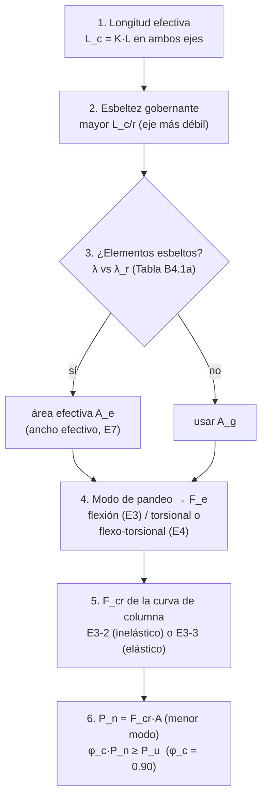

import Note from '../../components/content/Note.astro';
import Equation from '../../components/content/Equation.astro';
import Figure from '../../components/content/Figure.astro';

## La pelea que organiza el capítulo

A una columna casi nunca la vence la *resistencia* del material. Un trozo corto de perfil
se aplastaría cuando toda la sección alcanza $F_y$, en $F_y A_g$ — pero ninguna columna
real llega ahí: **pandea antes**, con una tensión crítica $F_{cr} < F_y$, y el pandeo es
súbito. Todo el Capítulo E es medir cuánto de ese techo $F_y A_g$ le roba la inestabilidad:

$$
P_n = F_{cr}\,A_g \qquad\qquad \frac{F_{cr}}{F_y} = \text{la fracción de } F_y \text{ que la columna alcanza a usar}
$$

| Estado límite | Qué es | Naturaleza |
|---|---|:---:|
| **Aplastamiento** ($F_y A_g$) | toda la sección fluye | dúctil — pero **casi nunca gobierna** |
| **Pandeo por flexión (FB)** | la columna se flexiona de lado (Euler) | inestabilidad — súbita |
| **Pandeo torsional / flexo-torsional (TB/FTB)** | la columna gira, o gira y se flexiona | inestabilidad — súbita |
| **Pandeo local** | las placas esbeltas se arrugan antes | inestabilidad local — súbita |

Y el protagonista de la pelea es un solo número, la **esbeltez** $L_c/r$: cuanto más
esbelta la columna, menos de su $F_y$ aprovecha. Diseñar en compresión es bajar esa
esbeltez —con más arriostramiento o mejores apoyos— para mover la columna hacia el techo
del material.

<Note type="info" title="Alcance">
El Capítulo E cubre la **resistencia nominal a compresión** $P_n$ de miembros cargados
axialmente por su centroide (Secciones E1 a E7). $P_n$ es el menor de los estados límite de
pandeo aplicables. La resistencia de diseño exige, según el método:

$$
\text{LRFD:}\quad \phi_c P_n \geq P_u \;\; (\phi_c = 0.90)
\qquad\qquad
\text{ASD:}\quad \frac{P_n}{\Omega_c} \geq P_a \;\; (\Omega_c = 1.67)
$$
</Note>

---

## 1. La esbeltez manda: longitud efectiva $L_c = KL$ (E2)

Antes de calcular resistencia hay que fijar *cuánta* longitud pandea. Una columna no pandea
sobre su longitud física $L$ sino sobre su **longitud efectiva** $L_c = KL$: la distancia
entre puntos de inflexión de la forma pandeada, que depende de cómo estén sujetos los
extremos. El factor $K$ traduce las condiciones de apoyo:

<Figure
  src="/aisc360-22-capE/longitud-efectiva.svg"
  alt="Cuatro columnas con distintas condiciones de apoyo y sus formas pandeadas: rótula-rótula K=1.0, empotrado-empotrado K=0.5, empotrado-rótula K=0.7, y empotrado-libre (voladizo) K=2.0; cada una con su longitud efectiva Lc = KL"
  caption="L_c = K·L. Empotrar los extremos acorta la longitud que 'cuenta' para el pandeo (baja K, sube F_cr); un extremo libre la duplica. La misma columna rinde distinto según cómo se sujete."
/>

<Equation label="Ec. E2">
$$
L_c = K L
$$
</Equation>

$K$ se obtiene de los **ábacos de alineamiento** (Apéndice 7) o por análisis. Se evalúa la
mayor relación $L_c/r$ de los dos ejes principales — la columna pandea por su eje más débil.

<Note type="tip">
AISC recomienda limitar $L_c/r \leq 200$. No es obligatorio, pero esbelteces mayores rara
vez son eficientes: la columna usa tan poco de su $F_y$ que sobra material.
</Note>

---

## 2. Pandeo por flexión: la curva de columna (E3)

Es el modo que gobierna en la mayoría de columnas de perfil compacto y doblemente
simétrico: la columna se flexiona de lado, como una regla que se arquea al empujarla por
los extremos. Su resistencia es:

<Equation label="Ec. E3-1">
$$
P_n = F_{cr} \, A_g
$$
</Equation>

Todo el contenido está en $F_{cr}$, y la mejor forma de entenderla es como una curva de
$F_{cr}$ contra la esbeltez $L_c/r$ — la **curva de columna**:

<Figure
  src="/aisc360-22-capE/curva-columna.svg"
  alt="Curva de F_cr en función de la esbeltez Lc/r: una meseta cerca de Fy para columnas cortas, una transición inelástica, y una rama elástica que sigue 0.877 veces la curva de Euler para columnas esbeltas; la transición ocurre en Lc/r = 4.71 raíz de E/Fy"
  caption="La curva de columna. Corta/intermedia → pandeo inelástico (Ec. E3-2). Esbelta → pandeo elástico de Euler castigado por 0.877 (Ec. E3-3). El material F_y es un techo que solo las columnas muy cortas rozan."
/>

La tensión de referencia es la de **Euler**, el pandeo elástico ideal:

<Equation label="Ec. E3-4">
$$
F_e = \frac{\pi^2 E}{\left(L_c / r\right)^2}
$$
</Equation>

y la norma parte la curva en dos regímenes según la esbeltez, con el quiebre en
$L_c/r = 4.71\sqrt{E/F_y}$ (equivalente a $F_y/F_e = 2.25$):

- **Columna corta / intermedia** — pandeo **inelástico**: parte de la sección ya fluyó
  cuando pandea, así que la curva de Euler ya no vale. El $0.658$ captura la caída por
  tensiones residuales de laminación e imperfecciones:

<Equation label="Ec. E3-2">
$$
F_{cr} = \left[ 0.658^{\, F_y / F_e} \right] F_y
$$
</Equation>

- **Columna esbelta** — pandeo **elástico**: se vuelca sin fluir, siguiendo a Euler pero
  reducido por el factor $0.877$ (el castigo por imperfecciones iniciales):

<Equation label="Ec. E3-3">
$$
F_{cr} = 0.877 \, F_e
$$
</Equation>

La lectura de la curva es la tesis del capítulo hecha gráfico: a la izquierda (columnas
rechonchas) $F_{cr}$ roza $F_y$; a la derecha (columnas esbeltas) se desploma. **Bajar
$L_c/r$ mueve la columna hacia la izquierda, hacia el material.**

---

## 3. Los otros modos: torsional y flexo-torsional (E4)

El pandeo por flexión no es el único camino a la inestabilidad. Según la forma de la
sección, la columna puede **girar sobre su eje** (pandeo torsional) o **flexionarse y girar
a la vez** (flexo-torsional), y a veces esos modos ceden antes que el de flexión:

<Figure
  src="/aisc360-22-capE/modos-pandeo.svg"
  alt="Los cuatro modos de pandeo de una columna: por flexión (se arquea de lado), torsional (gira sobre su eje), flexo-torsional (se arquea y gira), y local (las placas se arrugan); con el tipo de sección típico de cada uno"
  caption="Los modos de pandeo. La flexión (E3) gobierna en perfiles doblemente simétricos compactos; el torsional y flexo-torsional (E4) aparecen en secciones de simetría simple o asimétricas —ángulos, tés, canales, cruciformes—; el local (E7) arruga las placas esbeltas."
/>

El cálculo reusa la misma curva de columna (Ecs. E3-2/E3-3 para $F_{cr}$), pero cambiando
la tensión de pandeo elástico $F_e$ por la que corresponde al modo. Para miembros
**doblemente simétricos**:

<Equation label="Ec. E4-2">
$$
F_e = \left( \frac{\pi^2 E \, C_w}{L_{cz}^2} + G J \right) \frac{1}{I_x + I_y}
$$
</Equation>

Para miembros de **simetría simple** (eje $y$ de simetría), el modo mezcla flexión sobre un
eje con torsión, y $F_e$ sale de acoplarlos:

<Equation label="Ec. E4-3">
$$
F_e = \left( \frac{F_{ey} + F_{ez}}{2H} \right) \left[ 1 - \sqrt{1 - \frac{4 \, F_{ey} F_{ez} \, H}{\left(F_{ey} + F_{ez}\right)^2}} \, \right]
$$
</Equation>

con los términos auxiliares:

$$
F_{ez} = \frac{1}{A_g \, \bar{r}_o^2}\left( \frac{\pi^2 E \, C_w}{L_{cz}^2} + G J \right), \qquad
H = 1 - \frac{x_o^2 + y_o^2}{\bar{r}_o^2}, \qquad
\bar{r}_o^2 = x_o^2 + y_o^2 + \frac{I_x + I_y}{A_g}
$$

donde $x_o, y_o$ son las coordenadas del **centro de corte** respecto al centroide (su
separación es la que acopla flexión y torsión), $\bar{r}_o$ el radio de giro polar respecto
al centro de corte y $L_{cz}$ la longitud efectiva a torsión.

<Note type="info" title="Por qué a los ángulos y tés hay que mirarlos aparte">
En un perfil W doblemente simétrico el centro de corte coincide con el centroide y la
torsión no se acopla con la flexión: basta el pandeo por flexión (E3). En ángulos, tés y
canales el centro de corte está *desplazado*, así que empujar por el centroide induce giro
— y el modo flexo-torsional puede dar un $F_e$ más bajo que el de flexión pura. Por eso E4
(y E5 para ángulos simples) existen.
</Note>

---

## 4. Pandeo local: elementos esbeltos (E7)

Los tres modos anteriores tratan la columna como un todo. Pero si alguna placa de la
sección es **esbelta** ($\lambda > \lambda_r$ de la Tabla B4.1a), esa placa se arruga
localmente *antes* de que pandee la columna entera, y la sección nunca desarrolla toda su
área. La norma lo trata con el **método del ancho efectivo**: se calcula $F_{cr}$ igual que
en E3/E4 (con la sección completa) pero se aplica sobre un **área efectiva** reducida:

<Equation label="Ec. E7-1">
$$
P_n = F_{cr} \, A_e
$$
</Equation>

$A_e$ se obtiene reemplazando el ancho real $b$ de cada elemento esbelto por un ancho
efectivo $b_e < b$ (se "descuenta" la parte de placa que ya se arrugó y dejó de trabajar):

<Equation label="Ec. E7-3">
$$
b_e = b \left[ 1 - c_1 \sqrt{\frac{F_{el}}{F_{cr}}} \, \right] \sqrt{\frac{F_{el}}{F_{cr}}}
\qquad \text{si } \lambda > \lambda_r \sqrt{F_y / F_{cr}}
$$
</Equation>

con la tensión de pandeo local elástico $F_{el} = \left( c_2 \, \lambda_r/\lambda \right)^2 F_y$
(Ec. E7-5) y los coeficientes $c_1, c_2$ de la Tabla E7.1 según el tipo de elemento
($c_2 = (1 - \sqrt{1 - 4 c_1})/2 c_1$). Para **HSS circulares esbeltos**
($D/t > 0.11\,E/F_y$) se usa directamente:

<Equation label="Ec. E7-19">
$$
A_e = \left[ \frac{0.038 \, E}{F_y \left(D/t\right)} + \frac{2}{3} \right] A_g \leq A_g
$$
</Equation>

<Note type="warning">
AISC 360-16/22 reemplazó el antiguo **factor $Q$** por este método del ancho efectivo;
documentación o software anteriores a 2016 usan la formulación $Q_s Q_a$. Las Secciones E5
(ángulos simples) y E6 (miembros armados) añaden reglas de esbeltez modificada no
detalladas aquí.
</Note>

---

## 5. El orden de diseño

Lo que el orden deja claro: si $P_n$ no alcanza, subir el grado del acero ($F_y$) ayuda
poco en columnas esbeltas —ahí manda $F_e$, que depende de $E$ y la geometría, no de
$F_y$—. Lo que de verdad sube la resistencia es **bajar $L_c/r$**: arriostrar, empotrar
mejor los apoyos o elegir un perfil con mayor radio de giro.

---

## Resumen de verificaciones para compresión

| Verificación | Requisito | Naturaleza |
|--------------|-----------|:---:|
| Longitud efectiva | $L_c = KL$ en ambos ejes (Sec. E2) | fija la esbeltez |
| Esbeltez | mayor $L_c/r$; $\leq 200$ recomendado | protagonista |
| Elementos esbeltos | $\lambda$ vs $\lambda_r$ → $A_e$ (Sec. E7) | inestabilidad local |
| Pandeo por flexión | $F_{cr}$ con $F_e$ de Euler (Sec. E3) | inestabilidad global — súbita |
| Pandeo torsional / flexo-torsional | $F_{cr}$ con $F_e$ de E4 | inestabilidad global — súbita |
| Resistencia de diseño | $\phi_c P_n \geq P_u$, $\phi_c = 0.90$ | — |
