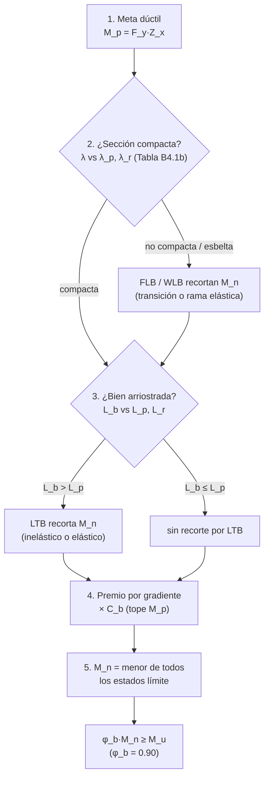

import Note from '../../components/content/Note.astro';
import Equation from '../../components/content/Equation.astro';
import Figure from '../../components/content/Figure.astro';

## La pelea que organiza el capítulo

Una viga de acero **quiere** llegar a su momento plástico $M_p = F_y Z$: el estado en que
toda la sección fluye, se deforma a la vista y avisa durante mucho tiempo antes de
colapsar. Es la falla dúctil, la que uno persigue. Pero tres inestabilidades pueden
robarle ese momento *antes* de alcanzarlo — y las tres son **súbitas**, sin aviso:

| Estado límite | Qué es | Naturaleza |
|---|---|:---:|
| **Fluencia** ($M_p = F_y Z$) | toda la sección plastifica | **dúctil — la meta** |
| **Pandeo lateral-torsional (LTB)** | la viga se vuelca de costado y gira | inestabilidad global |
| **Pandeo local (FLB / WLB)** | el ala o el alma se arruga como una placa esbelta | inestabilidad local |

Todo el Capítulo F es la misma frase escrita de muchas maneras:

$$
M_n = \min\bigl(\underbrace{M_p}_{\text{lo que quiero}},\; \underbrace{\text{LTB},\; \text{FLB},\; \text{WLB}}_{\text{lo que la geometría me roba}}\bigr)
$$

Y lo bueno es que las inestabilidades **se compran**: se alejan del camino con dos
decisiones de proyecto — cuánto se **arriostra** la viga (controla LTB) y qué tan
**compacto** es el perfil (controla el pandeo local). Diseñar en flexión es lograr que la
sección fluya antes de que se pandee.

<Note type="info" title="Alcance">
El Capítulo F cubre la **resistencia nominal a flexión** $M_n$ de miembros solicitados por
flexión simple alrededor de un eje principal (Secciones F2 a F12, una por tipo de sección
y eje). Asume que el corte se verifica aparte (Cap. G) y la interacción con carga axial en
el Cap. H. La resistencia de diseño exige, según el método:

$$
\text{LRFD:}\quad \phi_b M_n \geq M_u \;\; (\phi_b = 0.90)
\qquad\qquad
\text{ASD:}\quad \frac{M_n}{\Omega_b} \geq M_a \;\; (\Omega_b = 1.67)
$$
</Note>

---

## 1. La meta dúctil: el momento plástico

Cuando una sección compacta y bien arriostrada se flexiona, la fluencia arranca en las
fibras extremas y avanza hacia adentro hasta que **toda** la sección alcanza $F_y$ — se
forma una rótula plástica. El momento en ese instante es el máximo que el material puede
dar:

<Equation label="Ec. F2-1">
$$
M_n = M_p = F_y \, Z_x
$$
</Equation>

donde $Z_x$ es el **módulo plástico** (no el elástico $S_x$): la diferencia $Z/S$ — el
factor de forma, ≈ 1.12 para un perfil I — es la reserva que la sección tiene *después* de
que fluye la fibra extrema. Ese margen post-fluencia es precisamente lo que las
inestabilidades ponen en riesgo: si la viga se pandea apenas fluye la primera fibra, ese
12 % (y mucho más) se pierde.

---

## 2. Pandeo lateral-torsional: el ala comprimida es una columna

Aquí está el mecanismo que hay que ver antes que cualquier fórmula. Al flexionar la viga,
el **ala comprimida** trabaja como una columna larga y delgada — pero una columna que no
puede pandear libremente porque el alma la ata al ala traccionada, que sí está estable.
El resultado es que el ala comprimida escapa de costado y, al hacerlo, **arrastra la
sección en un giro**: la viga se desplaza lateralmente *y* torsiona a la vez. Eso es el
**pandeo lateral-torsional (LTB)**.

<Figure
  src="/aisc360-22-capF/ltb-mecanismo.svg"
  alt="Viga en flexión mostrando el ala comprimida que pandea de costado como una columna mientras el ala traccionada permanece recta, produciendo desplazamiento lateral más giro de la sección; se muestran los arriostramientos que acortan la longitud no arriostrada Lb"
  caption="LTB: el ala comprimida es una columna que pandea de lado y torsiona la sección. Cuanto más larga la longitud no arriostrada L_b, más fácil ocurre — igual que una columna pandea más fácil cuanto más larga. Arriostrar acorta L_b y devuelve resistencia."
/>

De esa imagen sale todo: LTB depende de la **longitud no arriostrada** $L_b$ (la distancia
entre puntos que impiden el desplazamiento lateral o el giro), exactamente como el pandeo
de una columna depende de su longitud. Y como toda columna, tiene tres regímenes según lo
larga que sea.

### 2.1 Las tres zonas de $L_b$

Este diagrama es al Cap. F lo que la curva de φ es a las vigas de hormigón: la norma
compara $L_b$ con dos longitudes límite, $L_p$ y $L_r$, y según dónde caiga define el modo:

<Figure
  src="/aisc360-22-capF/momento-vs-lb.svg"
  alt="Gráfico de Mn en función de la longitud no arriostrada Lb con tres zonas: para Lb menor o igual a Lp la resistencia es constante e igual a Mp (plastificación, dúctil); entre Lp y Lr una recta descendente (pandeo inelástico); pasado Lr una curva de pandeo elástico. Se muestra el efecto de Cb elevando la curva y el tope en Mp"
  caption="Las tres zonas del pandeo lateral-torsional. L_b ≤ L_p: la viga alcanza M_p (dúctil). L_p < L_b ≤ L_r: pandeo inelástico, recta que baja. L_b > L_r: pandeo elástico. C_b sube la curva por el gradiente de momento, pero nunca por encima de M_p."
/>

- **$L_b \leq L_p$** — la viga está tan arriostrada que no alcanza a pandear: desarrolla
  la rótula plástica. **$M_n = M_p$**. Es la zona donde uno quiere estar.
- **$L_p < L_b \leq L_r$** — **pandeo inelástico**: la sección ya fluyó en parte cuando
  pandea. La resistencia cae linealmente entre $M_p$ y $0.7 F_y S_x$ (el $0.7$ descuenta
  la tensión residual de laminación, que adelanta la fluencia):

<Equation label="Ec. F2-2">
$$
M_n = C_b \left[ M_p - \left(M_p - 0.7 F_y S_x\right) \left(\frac{L_b - L_p}{L_r - L_p}\right) \right] \leq M_p
$$
</Equation>

- **$L_b > L_r$** — **pandeo elástico**: la viga se vuelca sin haber fluido, con la tensión
  crítica de Euler adaptada a la rigidez torsional y de alabeo:

<Equation label="Ec. F2-3 / F2-4">
$$
M_n = F_{cr} \, S_x \leq M_p
\qquad
F_{cr} = \frac{C_b \, \pi^2 E}{\left(L_b / r_{ts}\right)^2} \sqrt{1 + 0.078 \, \frac{J c}{S_x h_o} \left(\frac{L_b}{r_{ts}}\right)^2}
$$
</Equation>

El $\pi^2 E / (L_b/r_{ts})^2$ es literalmente la fórmula de Euler de una columna: el ala
comprimida pandeando entre arriostramientos.

### 2.2 Las dos longitudes límite

<Equation label="Ec. F2-5">
$$
L_p = 1.76 \, r_y \sqrt{\frac{E}{F_y}}
$$
</Equation>

<Equation label="Ec. F2-6">
$$
L_r = 1.95 \, r_{ts} \, \frac{E}{0.7 F_y} \sqrt{\frac{J c}{S_x h_o} + \sqrt{\left(\frac{J c}{S_x h_o}\right)^2 + 6.76 \left(\frac{0.7 F_y}{E}\right)^2}}
$$
</Equation>

$L_p$ es corta y depende de $r_y$ (el radio de giro respecto al eje débil — el eje sobre el
que la viga se vuelca); $L_r$ marca dónde la sección deja de fluir del todo. Para perfiles
I doblemente simétricos $c = 1$; para canales $c = \tfrac{h_o}{2}\sqrt{I_y/C_w}$, con $h_o$
la distancia entre centroides de alas.

### 2.3 $C_b$: el premio por gradiente de momento

Las fórmulas anteriores suponen lo más desfavorable — momento **uniforme** en toda la
longitud no arriostrada, que hace pandear todo el tramo a la vez. Si el diagrama de
momentos no es uniforme (lo habitual), solo una parte del tramo está muy solicitada y la
viga aguanta más. $C_b$ es ese crédito:

<Equation label="Ec. F1-1">
$$
C_b = \frac{12.5 \, M_{max}}{2.5 \, M_{max} + 3 M_A + 4 M_B + 3 M_C}
$$
</Equation>

con $M_{max}$ el momento máximo absoluto del tramo y $M_A, M_B, M_C$ los momentos absolutos
a $1/4$, $1/2$ y $3/4$ de $L_b$.

<Note type="tip" title="C_b = 1.0 siempre es admisible">
Para momento uniforme $C_b = 1.0$. Tomar $C_b = 1.0$ es conservador y simplifica la
verificación a costa de resistencia. $C_b$ multiplica la curva de LTB **pero el tope sigue
siendo $M_p$** (Ec. F2-2 y F2-3 lo acotan): el gradiente de momento premia la estabilidad,
no crea material.
</Note>

---

## 3. Pandeo local: la esbeltez de las placas

La segunda inestabilidad no necesita que la viga sea larga: ocurre en la propia sección.
Cada ala y cada alma es una **placa comprimida**, y una placa lo bastante delgada se
arruga antes de fluir. Si eso pasa, la sección nunca llega a $M_p$. La norma mide esa
delgadez con la esbeltez $\lambda = b/t$ de cada elemento y la compara con dos límites de
la **Tabla B4.1b**:

<Figure
  src="/aisc360-22-capF/clasificacion-esbeltez.svg"
  alt="Recta numérica de la esbeltez lambda con dos umbrales lambda-p y lambda-r que definen tres regiones: compacta (desarrolla Mp), no compacta (pandeo local inelástico) y esbelta (pandeo local elástico); a un costado un ala de perfil que se arruga localmente bajo compresión"
  caption="Clasificación de la Tabla B4.1b: cada placa (ala, alma) se ubica en la recta de esbeltez. Compacta → alcanza M_p sin problema. No compacta o esbelta → el pandeo local recorta M_n, con transición inelástica o rama elástica según el caso."
/>

| Si | Clasificación | Estado límite de pandeo local |
|----|---------------|-------------------------------|
| $\lambda \leq \lambda_p$ | **Compacta** | No aplica — desarrolla $M_p$ |
| $\lambda_p < \lambda \leq \lambda_r$ | **No compacta** | Pandeo local **inelástico** (transición) |
| $\lambda > \lambda_r$ | **Esbelta** | Pandeo local **elástico** |

La estructura se repite en toda la familia F: cuando un elemento es no compacto, $M_n$
transita linealmente entre $M_p$ y el momento de pandeo; cuando es esbelto, cae a una rama
elástica. Cambia la geometría, no la idea. El caso del **ala de un perfil I** (F3):

<Equation label="Ec. F3-1 / F3-2">
$$
\text{no compacta:}\;\; M_n = M_p - \left(M_p - 0.7 F_y S_x\right)\frac{\lambda - \lambda_{pf}}{\lambda_{rf} - \lambda_{pf}}
\qquad
\text{esbelta:}\;\; M_n = \frac{0.9 \, E \, k_c \, S_x}{\lambda^2}
$$
</Equation>

con $\lambda = b_f/2t_f$ y $k_c = 4/\sqrt{h/t_w}$ acotado a $[0.35,\,0.76]$. La recta de la
izquierda es la **misma forma** que la Ec. F2-2 del LTB inelástico: transición lineal
desde $M_p$ hasta el $0.7 F_y S_x$ marcado por la tensión residual.

<Note type="info" title="Perfiles W laminados: casi siempre compactos">
Para perfiles laminados doblemente simétricos (W) de acero A992, el alma es **siempre**
compacta y el ala casi siempre, así que el pandeo local rara vez gobierna y la Sección F2
(fluencia + LTB) manda. Las Secciones F3–F12 existen para cuando la geometría se aparta de
ese caso amable.
</Note>

---

## 4. Un mismo pleito, muchas formas de sección

Las Secciones F2 a F12 son la misma pelea (fluencia contra inestabilidad) resuelta para
cada geometría — cambia *cuáles* inestabilidades aplican:

| Sección | Tipo de sección / eje | Inestabilidades que compiten con $M_p$ |
|---------|-----------------------|----------------------------------------|
| **F2** | Perfil I y canal **compactos**, eje mayor | LTB |
| **F3** | Perfil I, eje mayor, **ala no compacta/esbelta** | LTB + FLB (pandeo local del ala) |
| **F4** | Perfil I de simetría simple, eje mayor | LTB + FLB + WLB |
| **F5** | Perfil I de **alma esbelta**, eje mayor | LTB + FLB + WLB |
| **F6** | Perfil I y canal, **eje menor** | FLB (¡sin LTB!) |
| **F7** | HSS rectangular y cajón | FLB + WLB (sin LTB si es compacto) |
| **F8** | HSS circular | Pandeo local (abolladura) |
| **F9** | Tés y ángulos dobles | LTB + FLB + fluencia limitada |
| **F10** | Ángulos simples | LTB + pandeo local de ala |
| **F11** | Barras rectangulares y circulares | Fluencia (LTB solo si son muy esbeltas) |

Dos casos vale la pena mirar porque muestran los extremos:

- **Flexión en eje menor (F6):** al flexionar sobre el eje débil, la sección **no puede
  volcarse** — ya está en su posición más estable. Desaparece el LTB y solo queda el
  pandeo local del ala. Por eso una viga en eje menor puede desarrollar $M_p = F_y Z_y$ sin
  preocuparse de arriostramiento (con el tope $\leq 1.6 F_y S_y$).
- **HSS (F7, F8):** las secciones tubulares cerradas tienen enorme rigidez torsional, así
  que el LTB prácticamente no las afecta; el pleito se reduce a fluencia contra pandeo
  local de las paredes.

<Note type="tip">
En HSS rectangulares, $b$ y $h$ son los anchos planos (descontando radios de esquina);
cuando no se conoce el radio, AISC permite tomar $b = B - 3t$ y $h = H - 3t$. Para HSS
circulares la Sección F8 exige $D/t < 0.45\,E/F_y$.
</Note>

---

## 5. El orden de diseño

El corazón está en los pasos 2 y 3: si $M_n$ no alcanza, la primera reacción **no** es
subir de acero, es **arriostrar más** (bajar $L_b$) o **elegir un perfil más compacto** —
atacar la inestabilidad que gobierna, no la resistencia del material.

---

## Resumen de verificaciones para flexión

| Verificación | Requisito | Naturaleza |
|--------------|-----------|:---:|
| Momento plástico | $M_p = F_y Z_x$ (Ec. F2-1) | **dúctil — la meta** |
| Clasificación de placas | $\lambda$ vs $\lambda_p, \lambda_r$ (Tabla B4.1b) | define qué inestabilidad aplica |
| Pandeo lateral-torsional | $L_b$ vs $L_p, L_r$ (Ec. F2-2/F2-3) | inestabilidad global — súbita |
| Pandeo local del ala (FLB) | $\lambda_f$ vs $\lambda_{pf}, \lambda_{rf}$ (Sec. F3/F6/F7) | inestabilidad local — súbita |
| Pandeo local del alma (WLB) | $\lambda_w$ vs límites (Sec. F4/F5/F7) | inestabilidad local — súbita |
| Premio por gradiente | $\times C_b \leq M_p$ (Ec. F1-1) | crédito de estabilidad |
| Resistencia de diseño | $\phi_b M_n \geq M_u$, $\phi_b = 0.90$ | — |

<Note type="warning">
Los límites de esbeltez $\lambda_p$/$\lambda_r$ de cada elemento deben verificarse siempre
contra la Tabla B4.1b de la edición vigente. Las Secciones F4–F5 (perfiles I de simetría
simple y alma esbelta) y F9–F12 (tés, ángulos y barras) siguen la misma lógica de
fluencia contra inestabilidad con parámetros geométricos propios.
</Note>
