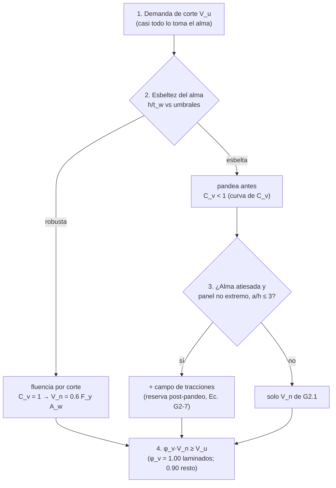

import Note from '../../components/content/Note.astro';
import Equation from '../../components/content/Equation.astro';
import Figure from '../../components/content/Figure.astro';

## La pelea que organiza el capítulo

En un perfil I el corte no se reparte parejo: casi todo pasa por el **alma** (las alas
apenas participan). Así que el diseño a corte es el diseño del alma, y ahí se repite la
misma pelea de toda la especificación:

| Estado límite | Qué es | Naturaleza |
|---|---|:---:|
| **Fluencia por corte** ($0.6 F_y A_w$) | el alma fluye a $\tau_y \approx 0.6 F_y$ | **dúctil — la meta** |
| **Pandeo del alma por corte** | el alma esbelta se arruga en diagonal | inestabilidad — súbita |
| **Campo de tracciones** | el alma pandeada sigue trabajando como celosía | reserva **post-pandeo** |

El corazón es:

<Equation label="Ec. G2-1">
$$
V_n = 0.6 \, F_y \, A_w \, C_{v1}
$$
</Equation>

con $A_w = d\,t_w$ (peralte $\times$ espesor del alma) y $C_{v1}$ un coeficiente entre 0 y 1
que es exactamente **la fracción de la fluencia por corte que el alma alcanza antes de
pandear**. El parámetro que lo decide es la esbeltez del alma $h/t_w$: alma robusta →
$C_{v1}=1$ (fluye, dúctil); alma esbelta → $C_{v1}<1$ (pandea antes, súbito). Y hay un
tercer acto propio del corte: si el alma se atiesa, puede seguir tomando carga *después* de
pandear, como las diagonales traccionadas de una celosía.

<Note type="info" title="Alcance">
El Capítulo G cubre la **resistencia nominal a corte** $V_n$ en el plano del alma (y en el
eje débil para algunos perfiles): G2 perfiles I y canales, G3 ángulos y tés, G4 HSS
rectangulares y cajón, G5 HSS circulares, G6 corte en eje débil, G7 vigas con aberturas.
La resistencia de diseño exige $\phi_v V_n \geq V_u$ (LRFD) o $V_n/\Omega_v \geq V_a$ (ASD),
con los factores según el caso.
</Note>

---

## 1. El alma toma el corte: fluencia (G2.1)

La tensión de fluencia por corte del acero es $\tau_y \approx 0.6\,F_y$ (criterio de von
Mises), y actúa sobre el área del alma $A_w$. Cuando el alma es lo bastante robusta para
fluir sin pandear, esa es toda la resistencia — el estado dúctil que uno persigue:

<Figure
  src="/aisc360-22-capG/corte-en-el-alma.svg"
  alt="Sección I con el diagrama de tensión de corte concentrado en el alma (Aw = d·tw, tau = 0.6 Fy), y dos destinos del alma: robusta que fluye por corte con líneas a 45 grados (dúctil, Cv = 1) o esbelta que pandea en diagonal (súbito, Cv < 1)"
  caption="El corte vive en el alma. Si es robusta fluye a 0.6 F_y (dúctil, C_v = 1); si es esbelta pandea en diagonal antes de fluir (súbito, C_v < 1). C_v es la fracción de la fluencia por corte que se alcanza a usar."
/>

El coeficiente $C_{v1}$ y sus factores dependen de la esbeltez:

- **Almas de perfiles I laminados** con $\dfrac{h}{t_w} \leq 2.24\sqrt{\dfrac{E}{F_y}}$:

<Equation label="Ec. G2-2">
$$
C_{v1} = 1.0 \qquad (\phi_v = 1.00, \;\; \Omega_v = 1.50)
$$
</Equation>

- **Los demás** perfiles I y canales ($\phi_v = 0.90$): $C_{v1} = 1.0$ mientras
  $\dfrac{h}{t_w} \leq 1.10\sqrt{\dfrac{k_v E}{F_y}}$; pasado ese punto,

<Equation label="Ec. G2-4">
$$
C_{v1} = \frac{1.10\sqrt{k_v E / F_y}}{h / t_w}
$$
</Equation>

<Note type="tip" title="El regalo del φ = 1.00">
Casi todos los perfiles **W laminados** de uso común cumplen
$h/t_w \leq 2.24\sqrt{E/F_y}$, así que toman $C_{v1} = 1.0$ **y** el factor más generoso de
toda la especificación, $\phi_v = 1.00$: $V_n = 0.6\,F_y\,A_w$ sin ninguna reducción. La
fluencia por corte es tan dúctil y predecible que AISC no le aplica margen de resistencia.
</Note>

---

## 2. Cuándo el alma pandea: el coeficiente $C_v$

Si el alma es esbelta, pandea por corte antes de fluir y solo desarrolla una fracción de
$0.6 F_y A_w$. Graficar $C_v$ contra $h/t_w$ da una curva que es hermana de la curva de
columna del pandeo axial — misma lógica, otro eje:

<Figure
  src="/aisc360-22-capG/coeficiente-cv.svg"
  alt="Curva de Cv en función de la esbeltez del alma h/tw: meseta Cv = 1 para almas robustas (fluencia), transición de pandeo inelástico proporcional a 1/(h/tw), y rama de pandeo elástico proporcional a 1/(h/tw)² para almas muy esbeltas; umbrales en 1.10 y 1.37 raíz de kv E sobre Fy"
  caption="El coeficiente C_v. Meseta en 1.0 mientras el alma fluye; luego pandeo inelástico (C_v ∝ 1/(h/t_w)) y elástico (∝ 1/(h/t_w)²). Es la curva de columna del corte: la esbeltez decide qué fracción del material se aprovecha."
/>

El coeficiente de **pandeo por corte** $k_v$ es el que traduce el atiesamiento del alma:

- Almas **sin atiesadores transversales**: $k_v = 5.34$.
- Almas **con atiesadores** separados una distancia $a$:

<Equation label="Sec. G2.1(b)">
$$
k_v = 5 + \frac{5}{\left(a/h\right)^2}
$$
</Equation>

(con $k_v = 5.34$ cuando $a/h > 3.0$ o $a/h > [260/(h/t_w)]^2$). Más juntos los atiesadores
→ mayor $k_v$ → los umbrales de la curva se corren a la derecha → más alma trabaja a
fluencia. Atiesar es, literalmente, comprar $C_v$.

---

## 3. Campo de tracciones: resistencia post-pandeo (G2.2)

Aquí ocurre lo más interesante del capítulo. Que el alma pandee **no** es el fin: en un
panel atiesado y esbelto, después del pandeo elástico el alma sigue tomando corte mediante
un mecanismo nuevo. Las bandas diagonales del alma —ya arrugadas— trabajan como **tirantes
traccionados**, y los atiesadores transversales, como **montantes comprimidos**. Junto con
las alas (los cordones), forman una **celosía Pratt**:

<Figure
  src="/aisc360-22-capG/campo-de-tracciones.svg"
  alt="Viga armada con atiesadores transversales formando una celosía: el alma pandeada actúa como bandas de tracción diagonal, los atiesadores como montantes comprimidos y las alas como cordones; con la fuerza de corte V y la ecuación G2-7"
  caption="El campo de tracciones (tension field action). Tras pandear, el alma atiesada trabaja como las diagonales traccionadas de una celosía Pratt: una reserva de resistencia post-pandeo que la fluencia/pandeo simple no contabiliza."
/>

Cuando se cumplen las condiciones de G2.2, esa reserva se suma:

<Equation label="Ec. G2-7">
$$
V_n = 0.6 \, F_y \, A_w \left[ C_{v2} + \frac{1 - C_{v2}}{1.15\sqrt{1 + \left(a/h\right)^2}} \right]
$$
</Equation>

El primer término ($C_{v2}$, el coeficiente de **pandeo** por corte) es lo que el alma da
por sí sola; el segundo es la contribución del campo de tracciones, que crece cuanto más
juntos estén los atiesadores (menor $a/h$).

<Note type="warning" title="Cuándo NO se permite el campo de tracciones">
El mecanismo necesita anclarse: exige que los paneles vecinos y las alas puedan equilibrar
la componente de las diagonales. Por eso **no se permite** en paneles extremos (les falta
un panel contiguo que ancle el campo), cuando $a/h > 3.0$, ni donde el anclaje no se pueda
desarrollar. Si no aplica, se usa la resistencia de G2.1 ($C_{v1}$).
</Note>

---

## 4. Otras secciones: HSS y eje débil

La misma idea (fluencia por corte reducida por pandeo del alma) se reescribe para cada
geometría:

- **HSS rectangulares y cajón (G4):** $V_n = 0.6 F_y A_w C_{v2}$ con $A_w = 2ht$ (las **dos**
  almas), $k_v = 5$ y $C_{v2}$ en tres rangos de $h/t$. $\phi_v = 0.90$.
- **HSS circulares (G5):** $V_n = F_{cr} A_g / 2$, con $F_{cr}$ el mayor de dos expresiones
  de pandeo pero acotado a $\leq 0.6 F_y$; $L_v$ es la distancia entre corte máximo y nulo.
- **Corte en el eje débil (G6):** en perfiles I y canales flexionados en el eje débil, el
  corte lo toman las **alas**: $V_n = 0.6 F_y b_f t_f C_{v2}$ por ala, con $k_v = 1.2$.

<Note type="tip">
En HSS el $A_w = 2ht$ recuerda que hay **dos** paredes verticales tomando el corte, y $h$ es
el ancho plano (descontando radios de esquina). En eje débil el rol de "alma" lo cumplen
las alas, por eso ahí $A_w = b_f t_f$.
</Note>

---

## 5. El orden de diseño

Lo que el orden enseña: en la gran mayoría de vigas laminadas el corte **ni siquiera es
crítico** —el alma es robusta, $C_{v1}=1$, $\phi_v=1.00$—. El capítulo se vuelve
interesante en **vigas armadas** de alma esbelta (plate girders), donde atiesar el alma y
contar el campo de tracciones es lo que hace eficiente el diseño.

---

## Resumen de verificaciones para corte

| Verificación | Requisito | Naturaleza |
|--------------|-----------|:---:|
| Fluencia por corte | $V_n = 0.6 F_y A_w C_{v1}$ (Ec. G2-1) | **dúctil — la meta** |
| Esbeltez del alma | $h/t_w$ vs $2.24\sqrt{E/F_y}$ y $1.10\sqrt{k_vE/F_y}$ | fija $C_{v1}$ |
| Pandeo del alma | $C_{v1} < 1$ si el alma es esbelta | inestabilidad — súbita |
| Campo de tracciones | Ec. G2-7 si G2.2 aplica (no en paneles extremos) | reserva post-pandeo |
| HSS / eje débil | G4, G5, G6 con su $A_w$ y $k_v$ | misma lógica, otra geometría |
| Resistencia de diseño | $\phi_v V_n \geq V_u$ ($\phi_v = 1.00$ laminados) | — |
