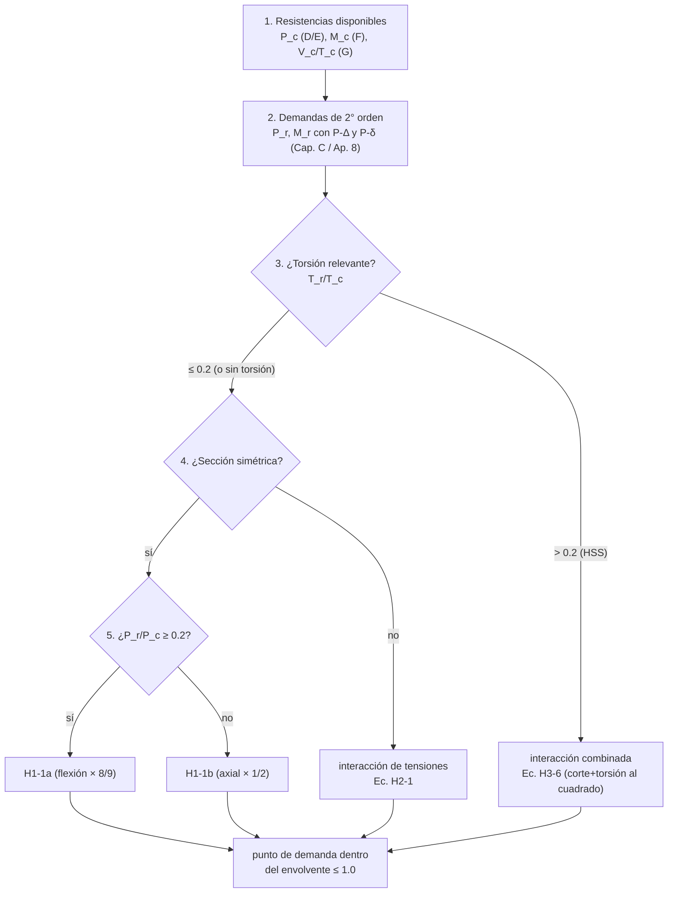

import Note from '../../components/content/Note.astro';
import Equation from '../../components/content/Equation.astro';
import Figure from '../../components/content/Figure.astro';

## La pelea que organiza el capítulo

Los capítulos anteriores resuelven cargas puras: tracción sola, compresión sola, flexión
sola. Pero un miembro real casi nunca vive así — una columna de pórtico también flexiona
(momentos de nudo, viento, carga excéntrica), una viga puede llevar axial. El Capítulo H
responde la pregunta que falta: **¿cuánto de cada cosa aguanta el miembro cuando actúan a
la vez?**

La respuesta cambia el carácter del capítulo. H **no calcula una resistencia nueva**: toma
las que ya salieron de los otros capítulos y las **presupuesta**. Cada demanda gasta una
fracción de la capacidad, y la suma no puede pasar de 1:

| Estado | Sección | Qué combina |
|---|---|:---:|
| **Flexión + axial, simétricos** | H1 | la viga-columna común (P de D/E + M de F) |
| **Flexión + axial, asimétricos** | H2 | interacción de **tensiones** en el punto crítico |
| **Torsión y combinados** | H3 | corte y torsión (de G) + axial y flexión, en HSS |

El lente dúctil/frágil de la serie sigue presente, pero **heredado**: H no introduce modos
de falla propios, verifica que la combinación no active ninguno de los modos —fluencia,
pandeo, rotura— que los Capítulos D a G ya acotaron.

<Note type="info" title="Alcance y notación">
H usa resistencias **requeridas** ($P_r, M_r, V_r, T_r$) y **disponibles**
($P_c = \phi P_n$ en LRFD o $P_n/\Omega$ en ASD; análogo para $M_c, V_c, T_c$), tomadas de
los Cap. D/E (axial), F (flexión) y G (corte/torsión). Clave: $P_r$ y $M_r$ deben incluir
los **efectos de segundo orden** ($P\text{-}\Delta$ y $P\text{-}\delta$) por el análisis
del Cap. C o la amplificación del Apéndice 8 *antes* de entrar aquí.
</Note>

---

## 1. Qué es una viga-columna

Antes de la ecuación, el mecanismo. Una viga-columna siente **axial y flexión al mismo
tiempo**, y lo peligroso es que no se suman de forma inocente: la carga axial, al montarse
sobre la deflexión que produce la flexión, **agrega momento**. Es el efecto
$P\text{-}\delta$:

<Figure
  src="/aisc360-22-capH/viga-columna.svg"
  alt="Una viga-columna: un miembro vertical con carga axial Pr y momentos de extremo M que lo deflectan una distancia delta; el axial montado sobre delta agrega momento P·delta de segundo orden. A la derecha, las dos demandas: axial Pr (de Cap D/E) y flexión Mr = M primario + P·delta (de Cap F)"
  caption="La viga-columna. El axial P monta sobre la deflexión δ y suma un momento P·δ (segundo orden). El Cap. H no calcula resistencia nueva: pregunta cuánto de la capacidad consumen la demanda axial y la de flexión juntas."
/>

Por eso $M_r$ no es solo el momento del análisis de primer orden: es ese momento **más** la
amplificación $P\text{-}\delta$. Con las demandas ya amplificadas, el capítulo se reduce a
una verificación de interacción.

---

## 2. El diagrama de interacción (H1.1)

Es la ecuación más usada del diseño en acero. Aplica a compresión o tracción axial en
perfiles doble y simplemente simétricos, y tiene **dos ramas** según cuál demanda domine:

- **Cuando $\dfrac{P_r}{P_c} \geq 0.2$** (domina el axial):

<Equation label="Ec. H1-1a">
$$
\frac{P_r}{P_c} + \frac{8}{9}\left( \frac{M_{rx}}{M_{cx}} + \frac{M_{ry}}{M_{cy}} \right) \leq 1.0
$$
</Equation>

- **Cuando $\dfrac{P_r}{P_c} < 0.2$** (domina la flexión):

<Equation label="Ec. H1-1b">
$$
\frac{P_r}{2 P_c} + \left( \frac{M_{rx}}{M_{cx}} + \frac{M_{ry}}{M_{cy}} \right) \leq 1.0
$$
</Equation>

Graficadas en el plano $P_r/P_c$ – $M_r/M_c$, las dos rectas forman un **envolvente
bilineal**: el miembro es seguro si su punto de demanda cae dentro.

<Figure
  src="/aisc360-22-capH/diagrama-interaccion.svg"
  alt="Diagrama de interacción P/Pc contra M/Mc: un envolvente bilineal con quiebre en Pr/Pc = 0.2, la rama H1-1a arriba (axial domina, flexión pesa 8/9) y la rama H1-1b abajo (flexión domina, axial pesa 1/2); región segura sombreada, un punto de demanda dentro, y la recta lineal simple más conservadora como comparación"
  caption="El diagrama de interacción. Dos rectas con quiebre en P_r/P_c = 0.2: arriba la flexión pesa 8/9, abajo el axial pesa 1/2. El envolvente va por fuera de la recta lineal simple — AISC aprovecha la forma real de la interacción en vez de sumar linealmente."
/>

El **quiebre en 0.2** no es arbitrario: la interacción real es una curva suave y convexa, y
la norma la aproxima con dos rectas calibradas para quedar del lado seguro sin ser tan
conservadora como una suma lineal directa $P_r/P_c + M_r/M_c \leq 1$. Cuando el axial es
alto, la flexión entra castigada por $8/9$; cuando es bajo (bajo el 20 % de $P_c$), el
axial pasa a contar solo a la mitad.

<Note type="tip" title="La tracción estabiliza (H1.2)">
Para **tracción** axial combinada con flexión, la Sección H1.2 permite aumentar el factor
$C_b$ del pandeo lateral-torsional: la tracción tira del miembro y lo endereza, estabilizándolo
contra el vuelco. Es el caso raro donde una demanda *ayuda* a otra.
</Note>

---

## 3. Miembros asimétricos: interacción de tensiones (H2)

Cuando la sección no tiene eje de simetría (o H1 no aplica), no se puede trabajar con
razones de fuerzas: hay que ir al **punto más solicitado** y sumar las tensiones que
concurren allí, cada una normalizada por su tensión disponible:

<Equation label="Ec. H2-1">
$$
\left| \frac{f_{ra}}{F_{ca}} + \frac{f_{rbw}}{F_{cbw}} + \frac{f_{rbz}}{F_{cbz}} \right| \leq 1.0
$$
</Equation>

con $f_{ra}, f_{rbw}, f_{rbz}$ las tensiones requeridas (axial y flexión en los ejes
principales $w, z$) y $F_{ca}, F_{cbw}, F_{cbz}$ las disponibles. Es la misma idea del
presupuesto, pero en términos de tensiones locales en lugar de fuerzas globales.

---

## 4. Torsión y estados combinados (H3)

Primero, la resistencia a torsión de un HSS (el caso donde la torsión importa de verdad,
por su sección cerrada):

<Equation label="Ec. H3-1">
$$
T_n = F_{cr} \, C \qquad (\phi_T = 0.90, \;\; \Omega_T = 1.67)
$$
</Equation>

con $C$ la constante torsional del HSS y $F_{cr}$ la tensión crítica de corte por torsión
(acotada a $\leq 0.6 F_y$; con expresiones de pandeo para $D/t$ o $h/t$ altos). Y cuando la
torsión se combina con axial, flexión y corte, la interacción tiene una forma reveladora:

<Figure
  src="/aisc360-22-capH/interaccion-torsion.svg"
  alt="Estados combinados con torsión H3: a la izquierda un HSS bajo torsión T con Tn = Fcr·C; a la derecha la ecuación H3-6 dividida en dos grupos, las tensiones normales (axial+flexión) que suman lineal y las tensiones de corte (corte+torsión) que suman al cuadrado, con la regla de despreciar la torsión si Tr/Tc ≤ 0.2"
  caption="La interacción combinada H3-6. Las tensiones normales (axial + flexión) pesan lineal; las de corte (corte + torsión) pesan al cuadrado. Por eso una torsión pequeña casi no cuenta: si T_r/T_c ≤ 0.2, se desprecia y se diseña por H1."
/>

<Equation label="Ec. H3-6">
$$
\left( \frac{P_r}{P_c} + \frac{M_r}{M_c} \right) + \left( \frac{V_r}{V_c} + \frac{T_r}{T_c} \right)^2 \leq 1.0
$$
</Equation>

El detalle físico está en los exponentes: las **tensiones normales** (axial y flexión)
entran lineales, pero las **de corte** (corte y torsión) entran **al cuadrado**, porque se
combinan como tensiones en el material. La consecuencia práctica: una torsión chica aporta
poquísimo ($0.2^2 = 0.04$), y por eso la norma permite **despreciar la torsión cuando
$T_r/T_c \leq 0.2$** y diseñar solo por H1.

<Note type="warning">
La Sección H3.3 (torsión en miembros **no-HSS**, p. ej. perfiles I abiertos) superpone
tensiones normales y de corte limitadas por $F_y$ y $0.6 F_y$; rara vez gobierna salvo en
perfiles abiertos muy solicitados a torsión. Verificar coeficientes contra la edición
vigente.
</Note>

---

## 5. El orden de diseño

Lo que el orden deja claro: el Capítulo H es el **techo de la serie**. Todo lo de D, E, F y
G desemboca aquí, y el eslabón fácil de olvidar es el paso 2 — si $P_r$ y $M_r$ no traen la
amplificación de segundo orden, el diagrama de interacción da un falso "pasa".

---

## Resumen de verificaciones para fuerzas combinadas

| Verificación | Requisito | Naturaleza |
|--------------|-----------|:---:|
| Demandas de 2° orden | $P_r, M_r$ con $P\text{-}\Delta$ y $P\text{-}\delta$ | previo imprescindible |
| Interacción P–M, simétricos | H1-1a ($P_r/P_c \geq 0.2$) o H1-1b ($< 0.2$) | presupuesto bilineal |
| Flexión biaxial | sumar $M_{rx}/M_{cx} + M_{ry}/M_{cy}$ | dos ejes en el mismo presupuesto |
| Miembros asimétricos | interacción de tensiones (Ec. H2-1) | presupuesto en tensiones |
| Torsión en HSS | $T_n = F_{cr} C$ (Ec. H3-1) | hereda pandeo por corte |
| Estados combinados con torsión | Ec. H3-6 (corte+torsión al cuadrado) | despreciable si $T_r/T_c \leq 0.2$ |
