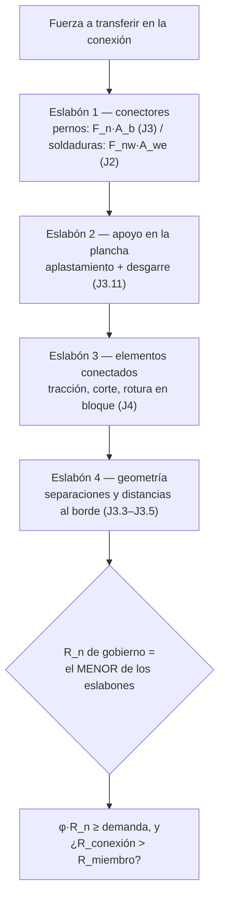

import Note from '../../components/content/Note.astro';
import Equation from '../../components/content/Equation.astro';
import Figure from '../../components/content/Figure.astro';

## La pelea que organiza el capítulo

Una conexión no es un punto: es una **cadena de transferencia**. La fuerza sale de un
miembro, entra a los conectores (pernos o soldaduras), pasa por el apoyo de esos conectores
en la plancha, atraviesa los elementos de conexión y sale al otro miembro. Cada tramo de
esa cadena es un estado límite, y la conexión resiste **lo que resiste su eslabón más
débil**. Diseñar la conexión es recorrer la cadena y verificar cada eslabón.

Y hay una diferencia de fondo con los capítulos de miembros: casi todos los estados límite
de conexión son **frágiles** — el perno se corta, la plancha se desgarra, el bloque se
arranca —, fallas súbitas sin aviso. De ahí la filosofía que organiza todo el diseño de
conexiones:

> **Hacer la conexión más fuerte que el miembro**, para que la ductilidad —el aviso, la
> deformación visible— viva en el miembro y no en el nudo. El nudo es el eslabón que *no*
> queremos que gobierne.

| Familia de eslabones | Sección | Naturaleza |
|---|---|:---:|
| **Los conectores** (pernos, soldaduras) | J2, J3 | frágil — fractura súbita |
| **El apoyo en la plancha** (aplastamiento/desgarre) | J3.11 | frágil — súbito |
| **Los elementos conectados** (planchas: tracción, corte, bloque) | J4 | dúctil (fluencia) o frágil (rotura) |

<Figure
  src="/aisc360-22-capJ/cadena-de-transferencia.svg"
  alt="Empalme apernado de dos barras traccionadas: la fuerza P pasa por cuatro eslabones numerados — (1) fluencia/rotura del elemento, (2) corte del perno, (3) aplastamiento y desgarre en la plancha, (4) rotura en bloque — cada uno un estado límite a verificar; gobierna el más débil"
  caption="La conexión como cadena. La fuerza recorre cada eslabón (elemento → perno → apoyo en la plancha → bloque), y cada uno es un estado límite. La conexión resiste lo que resiste el más débil."
/>

<Note type="info" title="Alcance">
El Capítulo J cubre los **elementos de conexión** y las partes afectadas de los miembros:
J2 soldaduras, J3 pernos y partes roscadas, J4 resistencia de elementos afectados y de
conexión, J5–J6 rellenos y empalmes, J7–J10 aplastamiento, bases de columna, anclajes y
fuerzas concentradas. Casi todos los estados de fractura llevan $\phi = 0.75$
($\Omega = 2.00$); la fluencia lleva factores más generosos.
</Note>

---

## 1. Los conectores I: pernos (J3)

La resistencia de un perno a corte o tracción es simplemente su tensión nominal por su
área:

<Equation label="Ec. J3-1">
$$
R_n = F_n \, A_b \qquad (\phi = 0.75, \;\; \Omega = 2.00)
$$
</Equation>

con $A_b$ el área bruta del perno y $F_n$ igual a $F_{nv}$ (corte) o $F_{nt}$ (tracción) de
la Tabla J3.2:

| Conector | $F_{nt}$ | $F_{nv}$ rosca **incluida** (N) | $F_{nv}$ rosca **excluida** (X) |
|----------|:--------:|:--------------------------------:|:--------------------------------:|
| A307 | 310 MPa | 188 MPa | 188 MPa |
| Grupo A (A325) | 620 MPa | 372 MPa | 469 MPa |
| Grupo B (A490) | 780 MPa | 469 MPa | 579 MPa |
| Partes roscadas | $0.75 F_u$ | $0.450 F_u$ | $0.563 F_u$ |

El perno puede fallar de cuatro maneras, y conviene tenerlas juntas porque compiten:

<Figure
  src="/aisc360-22-capJ/pernos-estados-limite.svg"
  alt="Cuatro estados límite del perno: corte (el perno se corta en el plano entre planchas, Rn = Fnv Ab), tracción (el perno se estira o rompe axialmente, Rn = Fnt Ab), aplastamiento y desgarre (la plancha se aplasta o se desgarra hacia el borde a lo largo de lc), y deslizamiento crítico (la fricción entre planchas resiste, el perno no toca el agujero)"
  caption="Los estados límite del perno. Corte, tracción y aplastamiento/desgarre son fracturas frágiles (φ = 0.75). El deslizamiento crítico es de servicio: la pretensión genera fricción que impide el movimiento antes de llegar al aplastamiento."
/>

- **Corte / tracción combinados** (conexión tipo aplastamiento): si actúan a la vez, la
  tracción disponible se reduce según la demanda de corte $f_{rv}$:

<Equation label="Ec. J3-3a">
$$
F_{nt}' = 1.3 \, F_{nt} - \frac{F_{nt}}{\phi \, F_{nv}} \, f_{rv} \leq F_{nt}
$$
</Equation>

- **Deslizamiento crítico** (cuando no se admite movimiento bajo cargas de servicio): la
  pretensión $T_b$ genera fricción entre las caras, y esa fricción —no el perno— resiste:

<Equation label="Ec. J3-4">
$$
R_n = \mu \, D_u \, h_f \, T_b \, n_s
$$
</Equation>

con $\mu = 0.30$ (Clase A) o $0.50$ (Clase B), $D_u = 1.13$, $h_f$ factor de relleno, $T_b$
la pretensión mínima (Tabla J3.1) y $n_s$ el número de planos de deslizamiento.
$\phi = 1.00$ para agujeros estándar.

<Note type="tip" title="Aplastamiento vs deslizamiento crítico">
Son dos filosofías. En la conexión **tipo aplastamiento** se deja que el perno apoye contra
el agujero y se verifica la resistencia última. En la **deslizamiento crítico** se impide
que la conexión llegue siquiera a moverse (fatiga, cargas reversibles, agujeros
sobredimensionados): es un estado límite de *servicio* que se agrega, no reemplaza, a los de
resistencia.
</Note>

---

## 2. Los conectores II: soldaduras de filete (J2)

Una soldadura de filete no falla por su cateto sino por su **garganta** —el plano a 45° de
menor sección—, y su resistencia es la del metal de aporte sobre esa área:

<Equation label="Ec. J2-4">
$$
R_n = F_{nw} \, A_{we} \qquad (\phi = 0.75, \;\; \Omega = 2.00)
$$
</Equation>

Lo interesante es que $F_{nw}$ **crece con el ángulo** entre la carga y el eje de la
soldadura:

<Figure
  src="/aisc360-22-capJ/soldadura-filete.svg"
  alt="Soldadura de filete: a la izquierda la sección transversal mostrando los catetos w y la garganta efectiva 0.707w como plano de falla a 45 grados; a la derecha el bono por ángulo, con soldadura longitudinal (theta 0, Fnw = 0.6 FEXX) y transversal (theta 90, Fnw = 0.9 FEXX, +50%) y una curva creciente de Fnw con theta"
  caption="La soldadura de filete falla por la garganta (0.707w para catetos iguales). F_nw sube con el ángulo de carga θ: una soldadura transversal es un 50% más resistente que una longitudinal, porque moviliza mejor la garganta."
/>

<Equation label="Ec. J2-5">
$$
F_{nw} = 0.60 \, F_{EXX} \left( 1.0 + 0.50 \sin^{1.5}\theta \right)
$$
</Equation>

Una soldadura **longitudinal** ($\theta = 0°$) da $F_{nw} = 0.60\,F_{EXX}$; una
**transversal** ($\theta = 90°$) da $0.90\,F_{EXX}$ — 50 % más.

<Note type="info" title="Geometría de la garganta">
La garganta efectiva de un filete de cateto $w$ (lados iguales) es $0.707\,w$. Los tamaños
**mínimos** dependen del espesor de la parte más delgada (Tabla J2.4); el **máximo** a lo
largo de bordes es $w = t$ si $t < 6\,$mm, o $w = t - 2\,$mm si $t \geq 6\,$mm. En filetes
largos cargados en el extremo ($l/w > 100$) la longitud efectiva se reduce por
$\beta = 1.2 - 0.002(l/w) \leq 1.0$: los extremos se sobrecargan y el centro trabaja poco.
</Note>

---

## 3. El apoyo en la plancha: aplastamiento y desgarre (J3.11)

Aunque el perno resista, la **plancha** puede ceder donde el perno apoya. AISC 360-22 los
trata como **dos estados límite separados** —**aplastamiento** (el agujero se ovala,
$\propto d$) y **desgarre** o *tearout* (el perno arranca el material hasta el borde,
$\propto l_c$)— y se toma el **menor** de ambos. Con la deformación del agujero como
consideración de diseño:

<Equation label="Ecs. J3-6a y J3-6c">
$$
R_n = \min\left( \underbrace{2.4 \, d \, t \, F_u}_{\text{aplastamiento (J3-6a)}} ,\;\;
\underbrace{1.2 \, l_c \, t \, F_u}_{\text{desgarre (J3-6c)}} \right)
$$
</Equation>

donde $l_c$ es la distancia **libre** entre el borde del agujero y el borde adyacente (otro
agujero o el borde del material), $d$ el diámetro del perno y $t$ el espesor. El desgarre
gobierna cuando el perno está cerca del borde (poco $l_c$); el aplastamiento gobierna
cuando hay espacio de sobra. Si la deformación **no** es consideración de diseño, los
coeficientes suben a $3.0$ (J3-6b) y $1.5$ (J3-6d).

---

## 4. Los elementos conectados (J4)

El último eslabón son las propias planchas y las partes afectadas de los miembros. Aquí
reaparece el par dúctil/frágil de siempre:

- **Tracción:** fluencia en área bruta $R_n = F_y A_g$ ($\phi = 0.90$, dúctil) o rotura en
  área neta $R_n = F_u A_e$ ($\phi = 0.75$, frágil).
- **Corte:** fluencia $R_n = 0.60 F_y A_{gv}$ ($\phi = 1.00$) o rotura $R_n = 0.60 F_u A_{nv}$
  ($\phi = 0.75$).
- **Rotura en bloque** (*block shear*): un bloque de la conexión se arranca combinando
  **corte** en unos planos y **tracción** en otro:

<Equation label="Ec. J4-5">
$$
R_n = 0.60 \, F_u A_{nv} + U_{bs} \, F_u A_{nt} \leq 0.60 \, F_y A_{gv} + U_{bs} \, F_u A_{nt}
$$
</Equation>

con $\phi = 0.75$; $A_{gv}, A_{nv}$ áreas bruta/neta en corte, $A_{nt}$ área neta en
tracción, y $U_{bs} = 1.0$ si la tracción es uniforme ($0.5$ si no lo es). El tope del lado
derecho limita el término de corte a la **fluencia** en vez de la rotura: no se confía en
fracturar el plano de corte más de lo debido.

---

## 5. Geometría: separaciones y distancias al borde (J3.3–J3.5)

Estos límites suelen controlar el detallado, y están ligados a la resistencia porque
definen el $l_c$ del aplastamiento/desgarre:

- **Separación mínima entre centros (J3.3):** $s \geq 2\tfrac{2}{3}\,d$ (preferible $3d$).
- **Distancia mínima al borde (J3.4):** de la Tabla J3.4M — p. ej. 22 mm para $d=16$, 26 mm
  para $d=20$, 30 mm para $d=24$; $1.25\,d$ para $d>36$ mm.
- **Máximos (J3.5):** distancia al borde $\leq 12t$ y $\leq 150$ mm; separación
  $\leq 24t$ o 305 mm (menos en acero patinable expuesto).

<Note type="tip">
La distancia al borde y la separación no son solo detallado: fijan el $l_c$ que entra en
las Ecs. J3-6a/b. Un perno demasiado cerca del borde no falla por su corte, falla por
**desgarre** de la plancha — un eslabón distinto de la cadena.
</Note>

---

## 6. El orden de diseño

El último rombo es la filosofía hecha chequeo: no basta con que la conexión aguante la
demanda; se busca que sea **más fuerte que el miembro que une**, de modo que si el sistema
se sobrecarga, ceda primero —dúctil, avisando— el miembro y no —frágil, de golpe— el nudo.

---

## Resumen de verificaciones para conexiones

| Eslabón | Verificación | Naturaleza |
|---|---|:---:|
| Perno — corte/tracción | $R_n = F_n A_b$ (Tabla J3.2) | frágil — fractura |
| Perno — corte+tracción | $F_{nt}'$ reducido (Ec. J3-3a) | frágil |
| Deslizamiento crítico | $\mu D_u h_f T_b n_s$ (Ec. J3-4) | servicio (fricción) |
| Soldadura de filete | $R_n = F_{nw} A_{we}$; bono por ángulo (Ec. J2-5) | frágil — por la garganta |
| Apoyo en la plancha | menor de $2.4\,d\,t\,F_u$ (Ec. J3-6a) y $1.2\,l_c\,t\,F_u$ (Ec. J3-6c) | frágil — aplastam./desgarre |
| Elemento — tracción | $F_y A_g$ (dúctil) / $F_u A_e$ (frágil) | ambas |
| Elemento — rotura en bloque | Ec. J4-5 | frágil |
| Geometría | $s \geq 2\tfrac{2}{3}d$, distancias al borde (J3.3–J3.5) | detallado / fija $l_c$ |

<Note type="warning">
Quedan fuera de esta nota J2.1 (soldaduras de tope), las tablas completas de pretensión y
dimensiones de agujeros, y las Secciones J7–J10 (bases de columna, anclajes y fuerzas
concentradas en alas/almas, con estados como fluencia y arrugamiento local del alma).
Verificar valores contra la edición vigente de AISC 360-22.
</Note>
