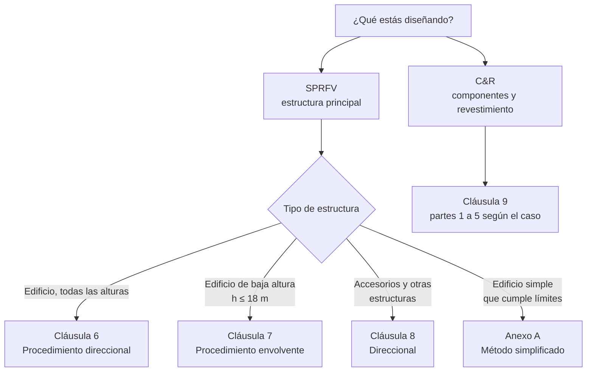

import Note from '../../components/content/Note.astro';
import Equation from '../../components/content/Equation.astro';
import Figure from '../../components/content/Figure.astro';

## La idea que organiza la norma

La NCh 432 no te entrega una fuerza de viento. Te entrega una **velocidad** y una **cadena
de factores** que la convierten en una presión, y esa presión —afinada por la forma del
edificio— en fuerzas de diseño. Vista así, toda la norma es una sola función:

$$
\underbrace{V}_{\text{velocidad de zona}} \;\longrightarrow\;
\underbrace{q_z}_{\text{presión de velocidad}} \;\longrightarrow\;
\underbrace{p}_{\text{presión sobre la superficie}}
$$

El corazón físico es la **presión dinámica** de un fluido en movimiento, $q=\tfrac{1}{2}\rho V^2$.
Todo lo demás —zona, exposición, topografía, altura, ráfaga, forma— son correcciones que
ajustan ese $\tfrac{1}{2}\rho V^2$ a *tu* edificio en *tu* sitio. Si entiendes de dónde sale
cada factor, no necesitas memorizar la norma: la reconstruyes.

<Figure
  src="/nch432-cargas-de-viento/cadena-presion.svg"
  alt="Diagrama de la cadena de cálculo de la NCh 432: la velocidad básica V entra a la presión de velocidad qz mediante los factores 0.613, I, Kz, Kzt, Ke; luego qz se convierte en la presión de diseño p mediante Kd, G, Cp y el término de presión interna GCpi; finalmente p alimenta las fuerzas de diseño del SPRFV o de componentes y revestimiento"
  caption="El mapa completo. Cada casilla es una cláusula de la norma; los factores de arriba afinan la presión de velocidad, los de abajo la llevan hasta la cara del edificio."
/>

<Note type="info" title="Herencia y unidades">
La NCh 432:2025 (3.ª edición) adopta el marco de **ASCE/SEI 7-22**: procedimientos
direccional / envolvente / simplificado, la distinción SPRFV vs. componentes y
revestimiento, y la clasificación del cerramiento. Las diferencias chilenas están en la
**zonificación propia** (Figura 2 y Tabla 1) y en trabajar en **unidades SI** ($V$ en m/s,
presiones en N/m²). Ojo con dos ubicaciones que difieren de ASCE: el **factor de
importancia $I$ vive dentro de $q_z$** (no en las combinaciones de carga), y el **factor de
direccionalidad $K_d$ aparece en la ecuación de la presión $p$**, no en $q_z$.
</Note>

---

## 1. La velocidad básica $V$: la zonificación de Chile

Todo empieza con $V$, la **velocidad básica del viento**: la ráfaga de 3 segundos medida a
10 m de altura sobre terreno abierto (exposición C). No la eliges libremente: sale de la
**Tabla 1** según la **zona** en que caiga el proyecto (Figura 2 de la norma).

<Figure
  src="/nch432-cargas-de-viento/zonas-viento.svg"
  alt="Esquema de la zonificación de viento de Chile como una franja vertical de norte a sur, dividida en zonas I a VI con sus velocidades básicas crecientes hacia el sur, desde 27 m/s en el norte hasta 44 m/s en el extremo austral, más las zonas no continentales Isla de Pascua, Juan Fernández y Antártica"
  caption="La velocidad básica crece hacia el sur: de 27 m/s en el norte a 44 m/s en Magallanes, y hasta 60 m/s en la Antártica. El sufijo A/B subdivide por altitud."
/>

La tabla no da solo $V$: da también una **presión referencial $p_0 = 0{,}613\,V^2$**, que es
justamente $q_z$ evaluada con $K_z=K_{zt}=K_e=I=1$. Es un buen ancla mental: para $V=34$ m/s
(zona III, donde cae Santiago), $p_0 = 0{,}613\cdot 34^2 \approx 709$ N/m². Todos los factores
posteriores mueven ese número hacia arriba o hacia abajo.

**El período de retorno lo fija la ocupación.** La misma zona produce una carga distinta
según qué tan crítica sea la estructura, mediante el **factor de importancia $I$** (Tabla 2):

| Categoría de ocupación | I | II | III | IV |
|---|---|---|---|---|
| Período de retorno (años) | 25 | 50 | 100 | 150 |
| Factor de importancia $I$ | 0,87 | 1,00 | 1,15 | 1,22 |

Un hospital (categoría IV) se diseña para el viento de 150 años; una bodega menor
(categoría I), para el de 25. La categoría se define en NCh 3171.

<Note type="tip" title="Situaciones especiales">
Los valores de la Tabla 1 son mínimos. En terrenos montañosos, portezuelos o regiones con
registros de viento inusualmente alto (§5.3.2–5.3.3), $V$ **debe incrementarse**, y el
Anexo B da una metodología de estudio (ajuste a ráfaga de 3 s, distribución de Gumbel). El
valor obtenido nunca puede ser menor al asociado a una probabilidad anual de 0,02.
</Note>

---

## 2. La presión de velocidad $q_z$

Este es el eslabón central. La velocidad se transforma en presión con la ecuación (2) de la
norma:

<Equation label="Ec. 2 (§5.8.2)">
$$
q_z = 0{,}613\,I\,K_z\,K_{zt}\,K_e\,V^2 \qquad [\text{N/m}^2]
$$
</Equation>

El $0{,}613$ es $\tfrac{1}{2}\rho$ con $\rho \approx 1{,}225$ kg/m³ (aire a nivel del mar):
$\tfrac{1}{2}\cdot 1{,}225 = 0{,}6125$. Todo lo demás son los cuatro multiplicadores que
personalizan esa presión dinámica. Vamos uno por uno.

### 2.1 $I$ — importancia

Ya lo vimos: mueve la carga según el período de retorno de la ocupación (Tabla 2). Es el
único factor que no depende de la física del sitio, sino de la **consecuencia de la falla**.

### 2.2 $K_z$ — exposición y altura

Este es el factor más rico. Captura dos cosas a la vez: **cómo crece el viento con la
altura** y **cuánto lo frena la rugosidad del terreno**. Cerca del suelo el viento se frena
por fricción; cuanto más rugoso el terreno, más grueso el colchón de aire lento y menor la
velocidad a baja altura.

<Figure
  src="/nch432-cargas-de-viento/perfil-exposicion.svg"
  alt="Tres perfiles de velocidad del viento con la altura para las exposiciones B (urbano), C (terreno abierto) y D (agua o planicie lisa). En exposición B el viento cerca del suelo es más lento y Kz a 10 metros vale 0.71; en C vale 1.00; en D, el terreno más liso, vale 1.19"
  caption="A igual altura, el terreno más liso deja pasar más viento. Por eso Kz(D) > Kz(C) > Kz(B). Los valores son a z = 10 m; Kz crece además con la altura."
/>

La norma define tres **categorías de exposición** (§5.5.3):

- **Exposición B** — urbano, suburbano o boscoso: obstrucciones densas del tamaño de una
  vivienda o mayores, que prevalecen ~450–800 m contra el viento.
- **Exposición C** — terreno abierto con obstrucciones dispersas < 10 m (campos, pastizales,
  aeropuertos). Es el caso **por defecto**: se usa cuando no aplican ni B ni D.
- **Exposición D** — planicies lisas o superficies de agua (marismas, salinas, planicies
  desérticas).

De la categoría y la altura $z$ se lee $K_z$ (o $K_h$, evaluado en la altura media del techo
$h$) en la **Tabla 5**. Para las alturas intermedias, la norma da la ley potencial
$K_z = 2{,}41\,(z/z_g)^{2/\alpha}$, con $\alpha$ y $z_g$ de la Tabla 6 (B: $\alpha=7{,}5$,
$z_g=1000$ m; C: $\alpha=9{,}8$, $z_g=750$ m; D: $\alpha=11{,}5$, $z_g=590$ m).

<Note type="warning" title="Barlovento usa Kz; el resto usa Kh">
En la ecuación de la presión, el **muro de barlovento** se evalúa con $q_z$ que **varía con
la altura** (recibe el viento de frente, con su perfil completo). Los muros de sotavento,
laterales y el techo usan $q_h$ **constante**, evaluado en la altura media del techo. Es una
simplificación deliberada: solo la cara que enfrenta el viento merece el perfil detallado.
</Note>

### 2.3 $K_{zt}$ — topografía

Sobre cerros, lomas y escarpes el viento se **acelera** al comprimirse contra la pendiente.
$K_{zt}$ recoge esa amplificación (§5.6, Figura 3):

<Equation label="Ec. 1 (§5.6.2)">
$$
K_{zt} = \left(1 + K_1 K_2 K_3\right)^2
$$
</Equation>

$K_1$ depende de la forma y esbeltez del accidente, $K_2$ de la distancia horizontal a la
cresta y $K_3$ de la altura sobre el terreno. En **terreno esencialmente plano**, o si no se
cumplen las condiciones de §5.6.1, $K_{zt} = 1{,}0$ — el caso más común.

### 2.4 $K_e$ — elevación del terreno

El aire es menos denso en altura, así que la misma velocidad produce menos presión. $K_e$
corrige la densidad según la altitud del sitio (§5.7, Tabla 4):

<Equation label="§5.7, Nota 2">
$$
K_e = e^{-0{,}000119\,z_e} \qquad (z_e = \text{elevación del terreno sobre el mar, m})
$$
</Equation>

Siempre es lícito, del lado conservador, tomar $K_e = 1{,}0$. Para Santiago ($z_e \approx
570$ m): $K_e = e^{-0{,}000119\cdot 570} \approx 0{,}93$ — un alivio del 7 %.

---

## 3. De $q_z$ a la presión sobre la superficie

$q_z$ es la presión que el viento *podría* ejercer; lo que realmente llega a cada cara del
edificio depende de la **aerodinámica de la forma** y de cuánto entra el viento *dentro* del
edificio. Para el sistema principal (procedimiento direccional, cláusula 6):

<Equation label="Ec. 4 (§6.3.1)">
$$
p = q\,K_d\,G\,C_p \;-\; q_i\,K_d\,(GC_{pi}) \qquad [\text{N/m}^2]
$$
</Equation>

El primer término es la **presión externa**; el segundo, la **interna**. Se restan porque
actúan sobre caras opuestas de una misma superficie.

<Figure
  src="/nch432-cargas-de-viento/presiones-edificio.svg"
  alt="Sección de un edificio con el viento llegando por la izquierda. El muro de barlovento recibe presión positiva creciente con la altura (Cp positivo, con qz variable); el muro de sotavento y el techo sufren succión (Cp negativo, con qh constante); en el interior actúa la presión interna GCpi, positiva o negativa según el cerramiento"
  caption="El viento empuja en barlovento y succiona en sotavento y techo. La presión interna, según cuán cerrado esté el edificio, infla o succiona desde adentro y se combina con la externa."
/>

### $K_d$ — direccionalidad

Reconoce que es **improbable** que el viento máximo sople exactamente en la peor dirección y
que la peor racha coincida con el peor coeficiente. Para edificios: $K_d = 0{,}85$ (Tabla 3).

### $G$ — efecto de ráfaga

El viento no es constante: tiene ráfagas. $G$ amplifica la presión media para cubrir el
**pico dinámico**. Aquí la norma separa dos mundos según la **frecuencia fundamental $f$**
(cláusula 3):

- **Estructura rígida** ($f \ge 1$ Hz): se permite $G = 0{,}85$. Los edificios de **baja
  altura** ($h \le 18$ m y $h \le$ la menor dimensión en planta) se pueden tratar como
  rígidos.
- **Estructura flexible** ($f < 1$ Hz, edificios altos y esbeltos): $G_f$ debe calcularse
  con un **análisis dinámico** racional (p. ej. ASCE 7-22 §26.11.5), porque la ráfaga puede
  entrar en **resonancia** con el modo fundamental.

<Note type="warning" title="La frecuencia se calcula, no se estima">
§5.9.1 es explícito: la frecuencia fundamental debe obtenerse de un análisis de las
propiedades estructurales reales. **No se permite** usar fórmulas aproximadas basadas solo
en la geometría (del tipo $f = 1/(0{,}1N)$) para decidir si el edificio es rígido o flexible.
</Note>

### $C_p$ y $GC_{pi}$ — la forma, por fuera y por dentro

- **$C_p$ (presión externa)** es la firma aerodinámica de la geometría: positivo donde el
  viento empuja (barlovento, ~+0,8), negativo donde succiona (sotavento ~−0,5, techos,
  esquinas). Sale de las **Figuras 4 a 6** según muros, cúpulas, techos a dos aguas,
  arqueados, etc. No hay una fórmula: hay tablas y ábacos por geometría.
- **$GC_{pi}$ (presión interna)** depende de cuánto **entra** el viento, es decir, de las
  **aberturas**. La norma clasifica el cerramiento (§5.10) y de la **Tabla 7** salen los
  valores:

| Clasificación del cerramiento | $(GC_{pi})$ |
|---|---|
| Edificio **cerrado** | ±0,18 |
| Parcialmente **cerrado** (una cara dominante abierta) | ±0,55 |
| Parcialmente **abierto** | ±0,18 |
| Edificio **abierto** (cada muro ≥ 80 % abierto) | 0,00 |

<Note type="tip" title="Por qué el ±0,55 asusta">
Un edificio **parcialmente cerrado** —una gran abertura en barlovento (un portón abierto, un
ventanal que voló)— deja que el viento entre y **presurice el interior**, sumándose a la
succión externa del techo y los muros. Ese $\pm0{,}55$ triplica la presión interna del caso
cerrado: es el mecanismo por el que se vuelan techos en tormentas. Por eso se evalúan **los
dos signos** de $GC_{pi}$ (infla / succiona) y se toma el peor.
</Note>

---

## 4. Dos escalas de la misma presión: SPRFV vs. C&R

La misma presión se usa para dos diseños distintos, y conviene no confundirlos:

- **SPRFV — Sistema Principal Resistente a las Fuerzas del Viento:** el esqueleto que recibe
  el viento de *todo* el edificio y lo baja a las fundaciones (marcos, arriostramientos,
  diafragmas). Ve **presiones promediadas** sobre grandes áreas.
- **C&R — Componentes y Revestimiento:** los elementos que reciben el viento **directo y
  local** (una fijación de cubierta, un panel de fachada, un vidrio). Sufren **picos de
  succión** en esquinas y bordes mucho mayores que el promedio, por eso se diseñan con
  coeficientes $(GC_p)$ propios (cláusula 9) y sobre **áreas tributarias pequeñas**.

Un mismo techo puede estar bien para el SPRFV y, aun así, perder una plancha en la esquina si
el C&R no se verificó: son escalas distintas del mismo fenómeno.

---

## 5. ¿Qué procedimiento usar?

La norma ofrece varios caminos según el tipo de estructura. El árbol de decisión:

- **Direccional (cláusula 6):** para edificios de **todas las alturas**. Separa
  explícitamente barlovento, sotavento y laterales — es el más general.
- **Envolvente (cláusula 7):** para **baja altura** ($h \le 18$ m). Usa coeficientes de
  pseudo-presión $(GC_{pf})$ ya combinados con casos de carga (incluye torsión, Figuras 12–13).
- **Otras estructuras (cláusula 8):** muros y letreros aislados, chimeneas, estanques,
  torres en celosía, marcos abiertos — con coeficientes de fuerza $C_f$.
- **Simplificado (Anexo A, normativo):** un atajo con un "factor de forma" para edificios que
  cumplen los límites geométricos.
- **Componentes y revestimiento (cláusula 9):** su propia familia de coeficientes locales.

---

## 6. Ejemplo resuelto: una nave en Santiago

Pongamos números a la cadena. Galpón de oficinas, **Santiago**, altura media de techo
$h = 10$ m, terreno urbano, edificio cerrado, ocupación normal.

1. **Zona y velocidad** — Santiago cae en **zona III-A**: $V = 34$ m/s (Tabla 1).
2. **Importancia** — categoría II (ocupación normal): $I = 1{,}00$.
3. **Exposición** — urbano → **B**. A $h = 10$ m: $K_z = K_h = 0{,}71$ (Tabla 5).
4. **Topografía** — terreno plano: $K_{zt} = 1{,}0$.
5. **Elevación** — $z_e \approx 570$ m: $K_e = e^{-0{,}000119\cdot 570} \approx 0{,}93$.

**Presión de velocidad:**

<Equation>
$$
q_h = 0{,}613 \cdot 1{,}00 \cdot 0{,}71 \cdot 1{,}0 \cdot 0{,}93 \cdot 34^2 \approx 468\ \text{N/m}^2
$$
</Equation>

Ahora a la **presión de diseño** en el muro de barlovento, con $K_d = 0{,}85$, edificio rígido
$G = 0{,}85$, $C_p = +0{,}8$, y presión interna de edificio cerrado $GC_{pi} = \pm0{,}18$:

<Equation label="Ec. 4">
$$
p_{\text{barl.}} = \underbrace{468 \cdot 0{,}85 \cdot 0{,}85 \cdot 0{,}8}_{\text{externa} \;\approx\; 270} \;-\; \underbrace{468 \cdot 0{,}85 \cdot (\pm 0{,}18)}_{\text{interna} \;\approx\; \pm72}
$$
</Equation>

La externa en barlovento vale **≈ 270 N/m²** y la del muro de sotavento ($C_p \approx -0{,}5$),
**≈ −169 N/m²**. La componente horizontal neta sobre el marco (barlovento − sotavento) es del
orden de **≈ 440 N/m²**, a la que la presión interna **no** contribuye (se cancela entre las
dos caras). La presión interna sí importa para el **techo y cada muro por separado**, donde
$\pm72$ N/m² decide si el elemento se infla o se succiona.

<Note type="warning" title="La carga mínima siempre gana si es mayor">
§6.1.5 impone un piso: la presión de diseño del SPRFV **no puede ser menor** a
**0,25 kN/m² sobre el área de muros** ni a **0,13 kN/m² sobre el techo**, aplicadas
simultáneamente. En nuestro ejemplo la presión neta de muros (~0,44 kN/m²) supera el mínimo,
pero en zonas de baja $V$ o edificios muy protegidos, es el **mínimo** el que manda el diseño.
</Note>

---

## El hilo, en una frase

La NCh 432 es una máquina de convertir una **velocidad de zona** en una **presión sobre una
cara**: $\tfrac{1}{2}\rho V^2$ afinado por *dónde estás* ($I$, zona), *qué tan expuesto*
($K_z$), *la forma del terreno* ($K_{zt}$), *la altitud* ($K_e$), *la dirección y la ráfaga*
($K_d$, $G$), *la forma del edificio* ($C_p$) y *cuánto entra el viento* ($GC_{pi}$). Si
sabes qué corrige cada factor, la norma deja de ser una tabla que se consulta y pasa a ser
una historia física que se entiende.
