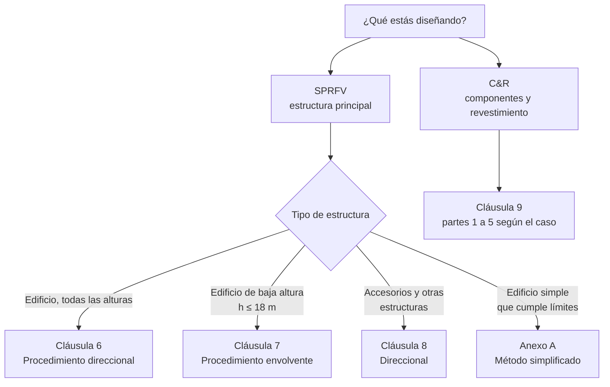

import Note from '../../components/content/Note.astro';
import Equation from '../../components/content/Equation.astro';
import Figure from '../../components/content/Figure.astro';

## La idea que organiza la norma

La NCh 432 no te entrega una fuerza de viento. Te entrega una **velocidad** y una **cadena
de factores** que la convierten en una presión, y esa presión —afinada por la forma del
edificio— en fuerzas de diseño. Vista así, toda la norma es una sola función:

$$
\underbrace{V}_{\text{velocidad de zona}} \;\longrightarrow\;
\underbrace{q_z}_{\text{presión de velocidad}} \;\longrightarrow\;
\underbrace{p}_{\text{presión sobre la superficie}}
$$

El corazón físico es la **presión dinámica** de un fluido en movimiento, $q=\tfrac{1}{2}\rho V^2$.
Todo lo demás —zona, exposición, topografía, altura, ráfaga, forma— son correcciones que
ajustan ese $\tfrac{1}{2}\rho V^2$ a *tu* edificio en *tu* sitio. Si entiendes de dónde sale
cada factor, no necesitas memorizar la norma: la reconstruyes.

<Figure
  src="/nch432-cargas-de-viento/cadena-presion.svg"
  alt="Diagrama de la cadena de cálculo de la NCh 432: la velocidad básica V entra a la presión de velocidad qz mediante los factores 0.613, I, Kz, Kzt, Ke; luego qz se convierte en la presión de diseño p mediante Kd, G, Cp y el término de presión interna GCpi; finalmente p alimenta las fuerzas de diseño del SPRFV o de componentes y revestimiento"
  caption="El mapa completo. Cada casilla es una cláusula de la norma; los factores de arriba afinan la presión de velocidad, los de abajo la llevan hasta la cara del edificio."
/>

<Note type="info" title="Herencia y unidades">
La NCh 432:2025 (3.ª edición) adopta el marco de **ASCE/SEI 7-22**: procedimientos
direccional / envolvente / simplificado, la distinción SPRFV vs. componentes y
revestimiento, y la clasificación del cerramiento. Las diferencias chilenas están en la
**zonificación propia** (Figura 2 y Tabla 1) y en trabajar en **unidades SI** ($V$ en m/s,
presiones en N/m²). Ojo con dos ubicaciones que difieren de ASCE: el **factor de
importancia $I$ vive dentro de $q_z$** (no en las combinaciones de carga), y el **factor de
direccionalidad $K_d$ aparece en la ecuación de la presión $p$**, no en $q_z$.

La herencia es tan literal que la cláusula 2 tiene **solo dos referencias normativas**:
NCh 3171 y ASCE/SEI 7-22. Todo lo que la norma no transcribe —túnel de viento, ráfaga
calculada, excentricidad de edificios flexibles, hielo en celosías— se resuelve yendo al
ASCE. Son **siete delegaciones explícitas**.
</Note>

<Note type="warning" title="Antes de seguir: la trampa del 1,6">
Si vienes de leer un ejemplo de ASCE 7-22, para acá. **La NCh 432 conserva el viento de
50 años de ASCE/SEI 7-05**, no el de 300–1 700 años del ASCE moderno. Por eso en Chile
**el viento sigue mayorándose por 1,6 en LRFD**, mientras el ASCE usa 1,0. Los dos
sistemas son coherentes por dentro; cruzarlos se equivoca en un factor de 1,6. Está
desarrollado en la **sección 8**, y no está en el cuerpo normativo: vive en el
**Anexo C.4**, informativo.
</Note>

---

## 1. La velocidad básica $V$: la zonificación de Chile

Todo empieza con $V$, la **velocidad básica del viento**: la ráfaga de 3 segundos medida a
10 m de altura sobre terreno abierto (exposición C). No la eliges libremente: sale de la
**Tabla 1** según la **zona** en que caiga el proyecto (Figura 2 de la norma).

<Figure
  src="/nch432-cargas-de-viento/zonas-viento.svg"
  alt="Esquema de la zonificación de viento de Chile como una franja vertical de norte a sur, dividida en zonas I a VI con sus velocidades básicas crecientes hacia el sur, desde 27 m/s en el norte hasta 44 m/s en el extremo austral, más las zonas no continentales Isla de Pascua, Juan Fernández y Antártica"
  caption="La velocidad básica crece hacia el sur: de 27 m/s en el norte a 44 m/s en Magallanes, y hasta 60 m/s en la Antártica. El sufijo A/B subdivide por altitud."
/>

La tabla no da solo $V$: da también una **presión referencial $p_0 = 0{,}613\,V^2$**, que es
justamente $q_z$ evaluada con $K_z=K_{zt}=K_e=I=1$. Es un buen ancla mental: para $V=34$ m/s
(zona III, donde cae Santiago), $p_0 = 0{,}613\cdot 34^2 \approx 709$ N/m². Todos los factores
posteriores mueven ese número hacia arriba o hacia abajo.

**El sufijo A/B es un corte por altitud, y el umbral cambia en cada zona:**

| Zona | Latitud Sur | Altitud | $V$ (m/s) | $p_0$ (N/m²) |
|---|---|---|---|---|
| I-A / **I-B** | 17°29′–27°22′ | < 2 000 / **≥ 2 000** msnm | 27 / **30** | 447 / 552 |
| II-A / II-B | 27°22′–29°54′ | < 1 500 / ≥ 1 500 | 27 / 35 | 447 / 751 |
| III-A / III-B | 29°54′–37°28′ | < 1 000 / ≥ 1 000 | **34** / 35 | 709 / 751 |
| IV-A / IV-B | 37°28′–41°28′ | < 600 / ≥ 600 | 37 / 40 | 839 / 981 |
| V | 41°28′–50° | — | 40 | 981 |
| VI | 50°–56°32′ | — | 44 | 1 187 |
| NC1 / NC2 / NC3 | Isla de Pascua / Juan Fernández / Antártica | — | 32 / 50 / 60 | 628 / 1 533 / 2 207 |

Fíjate en la consecuencia para una faena minera: en la zona I, cruzar los **2 000 msnm**
sube $V$ de 27 a 30 m/s. Son **+23 % en $p_0$** por una línea de nivel.

<Note type="warning" title="La Antártica está tabulada pero fuera de alcance">
La cláusula 1.1 y el Preámbulo excluyen expresamente el **territorio Antártico Chileno**
del campo de aplicación. Y sin embargo la Tabla 1 trae la zona **NC3 «Antártica CL»** con
$V = 60$ m/s, y el Anexo C reporta la estación *Eduardo Frei Montalva* con 60,4 m/s. La
norma da el dato pero declara no aplicar allí: usarlo es una **decisión del proyectista**,
no una aplicación de la norma.
</Note>

### De dónde salió realmente este mapa

El Anexo C (informativo) cuenta la trastienda, y conviene saberla antes de confiar
ciegamente en un número de la Tabla 1.

Se revisaron **140 estaciones** de la Dirección Meteorológica y la DGAC. **Solo 36
cumplieron** los requisitos (10 años de registro, ajustadas a 10 m en exposición C). Con
esas 36 se ajustó una **distribución de Gumbel** por estación y se llevó cada una al viento
de 50 años. Después, por zona, se miró el promedio más una desviación estándar y el máximo,
y se eligió «criteriosamente» —la palabra es de la norma— el valor de la tabla.

Tres cosas que salen de ahí:

- **Santiago mide 28 m/s y la norma manda 34.** Quinta Normal da 28,5 y Pudahuel 28,1. La
  zona III-A cubre desde La Serena hasta Concepción con 14 estaciones y una dispersión
  enorme ($\sigma' = 4{,}2$ m/s); el 34 lo fijan Chillán (38,0) y Rodelillo (37,6). En
  Santiago la norma pide **un 42 % más de presión** que la medición local —$(34/28{,}5)^2$—,
  y ese margen es el que absorbe la falta de resolución del mapa.
- **Toda la cordillera descansa sobre dos mediciones.** Las cuatro zonas «B» tienen 0 o 1
  estación: I-B tiene una (Calama), II-B ninguna, III-B una (Termas de Chillán), IV-B
  ninguna. El corte este-oeste no sale de isotacas: se fundamenta en la experiencia de las
  **líneas de alta tensión** del sector eléctrico (RPTD N.° 11).
- **La Tabla 1 no coincide con el propio Anexo C** en tres zonas.

<Note type="warning" title="Tabla 1 (normativa) vs. Tabla C.2 (informativa)">
| Zona | Tabla C.2 (Anexo C) | **Tabla 1 (normativa)** | |
|---|---|---|---|
| I-A | 26 m/s | **27 m/s** | la norma es más exigente |
| III-B | 32 m/s | **35 m/s** | la norma es más exigente |
| **IV-B** | **45 m/s** | **40 m/s** | **el anexo es más exigente** |

**Manda la Tabla 1**: es la normativa, y el Anexo C se declara informativo. Pero la **IV-B**
merece atención: es una zona **sin ninguna estación de medición**, donde el estudio propuso
45 m/s y la norma publicó 40. Para un proyecto sobre 600 msnm en la Araucanía o Los Lagos,
la diferencia son **27 % de presión**. Y §5.3.3 —«la velocidad básica se debe incrementar
donde los registros o la experiencia indiquen velocidades mayores»— da el gancho normativo
para considerarlo. Como mínimo, es una discrepancia que se declara en la memoria de cálculo.
</Note>

**El período de retorno lo fija la ocupación.** La misma zona produce una carga distinta
según qué tan crítica sea la estructura, mediante el **factor de importancia $I$** (Tabla 2):

| Categoría de ocupación | I | II | III | IV |
|---|---|---|---|---|
| Período de retorno (años) | 25 | 50 | 100 | 150 |
| Factor de importancia $I$ | 0,87 | 1,00 | 1,15 | 1,22 |

Un hospital (categoría IV) se diseña para el viento de 150 años; una bodega menor
(categoría I), para el de 25. La categoría se define en NCh 3171.

<Note type="tip" title="Situaciones especiales">
Los valores de la Tabla 1 son mínimos. En terrenos montañosos, portezuelos o regiones con
registros de viento inusualmente alto (§5.3.2–5.3.3), $V$ **debe incrementarse**, y el
Anexo B da una metodología de estudio (ajuste a ráfaga de 3 s, distribución de Gumbel). El
valor obtenido nunca puede ser menor al asociado a una probabilidad anual de 0,02.
</Note>

---

## 2. La presión de velocidad $q_z$

Este es el eslabón central. La velocidad se transforma en presión con la ecuación (2) de la
norma:

<Equation label="Ec. 2 (§5.8.2)">
$$
q_z = 0{,}613\,I\,K_z\,K_{zt}\,K_e\,V^2 \qquad [\text{N/m}^2]
$$
</Equation>

El $0{,}613$ es $\tfrac{1}{2}\rho$ con $\rho \approx 1{,}225$ kg/m³ (aire a nivel del mar):
$\tfrac{1}{2}\cdot 1{,}225 = 0{,}6125$. Todo lo demás son los cuatro multiplicadores que
personalizan esa presión dinámica. Vamos uno por uno.

### 2.1 $I$ — importancia

Ya lo vimos: mueve la carga según el período de retorno de la ocupación (Tabla 2). Es el
único factor que no depende de la física del sitio, sino de la **consecuencia de la falla**.

### 2.2 $K_z$ — exposición y altura

Este es el factor más rico. Captura dos cosas a la vez: **cómo crece el viento con la
altura** y **cuánto lo frena la rugosidad del terreno**. Cerca del suelo el viento se frena
por fricción; cuanto más rugoso el terreno, más grueso el colchón de aire lento y menor la
velocidad a baja altura.

<Figure
  src="/nch432-cargas-de-viento/perfil-exposicion.svg"
  alt="Tres perfiles de velocidad del viento con la altura para las exposiciones B (urbano), C (terreno abierto) y D (agua o planicie lisa). En exposición B el viento cerca del suelo es más lento y Kz a 10 metros vale 0.71; en C vale 1.00; en D, el terreno más liso, vale 1.19"
  caption="A igual altura, el terreno más liso deja pasar más viento. Por eso Kz(D) > Kz(C) > Kz(B). Los valores son a z = 10 m; Kz crece además con la altura."
/>

La norma define tres **categorías de exposición** (§5.5.3):

- **Exposición B** — urbano, suburbano o boscoso: obstrucciones densas del tamaño de una
  vivienda o mayores, que prevalecen ~450–800 m contra el viento.
- **Exposición C** — terreno abierto con obstrucciones dispersas < 10 m (campos, pastizales,
  aeropuertos). Es el caso **por defecto**: se usa cuando no aplican ni B ni D.
- **Exposición D** — planicies lisas o superficies de agua (marismas, salinas, planicies
  desérticas).

De la categoría y la altura $z$ se lee $K_z$ (o $K_h$, evaluado en la altura media del techo
$h$) en la **Tabla 5**. Para las alturas intermedias, la norma da la ley potencial
$K_z = 2{,}41\,(z/z_g)^{2/\alpha}$, con $\alpha$ y $z_g$ de la Tabla 6.

Y aquí está el detalle que la Tabla 6 esconde en una tercera columna y que cambia
resultados: **$z_{\text{mín}}$**.

| Exposición | $\alpha$ | $z_g$ (m) | $z_{\text{mín}}$ (m) |
|---|---|---|---|
| B | 7,5 | 1 000 | **10** |
| C | 9,8 | 750 | **5** |
| D | 11,5 | 590 | **2** |

Por debajo de $z_{\text{mín}}$, $K_z$ **no sigue bajando**: se congela en el valor evaluado en
$z_{\text{mín}}$ (Nota 3 de la Tabla 5). Eso explica algo que en la Tabla 5 parece un hecho
físico y no lo es: el $K_z(\text{B}) = 0{,}71$ constante de 0 a 10 m no es una meseta del
viento, es **el piso de la norma**. Lo mismo con el 0,87 de C hasta 5 m y el 0,90 de D hasta
2 m. Y por encima de $z_g$, $K_z = 2{,}41$ fijo.

<Note type="warning" title="La Tabla 5 termina en 20 m">
La tabla de $K_z$ **no pasa de 20 metros**. Cualquier edificio más alto —que es casi todo lo
industrial de altura media— sale de la ley potencial de la Nota 1, no de la tabla. No es un
descuido: es que la tabla existe para el caso corriente y la fórmula para el resto. Pero
conviene tenerlo presente antes de extrapolar a ojo.

(Y en la misma Nota 5 la norma dice «Tabla 4» donde corresponde «Tabla 5». Es una de varias
referencias cruzadas mal escritas en esta edición.)
</Note>

<Note type="warning" title="Barlovento usa Kz; el resto usa Kh">
En la ecuación de la presión, el **muro de barlovento** se evalúa con $q_z$ que **varía con
la altura** (recibe el viento de frente, con su perfil completo). Los muros de sotavento,
laterales y el techo usan $q_h$ **constante**, evaluado en la altura media del techo. Es una
simplificación deliberada: la cara que enfrenta el viento «ve» el perfil completo, pero en
las demás el flujo ya se separó y la succión es aproximadamente uniforme, gobernada por una
estela que se establece a la escala de la altura total y no de cada nivel.
</Note>

<Note type="tip" title="En el norte, la exposición D no es rara">
«Planicies desérticas» está literalmente en la definición de rugosidad D. Para una faena en
el norte de Chile eso no es un detalle de redacción: pasar de C a D sube $K_z$ a 10 m de
1,00 a **1,19**, un 19 % más de presión. Y hay una cláusula de proximidad que arrastra: si
el sitio está a **≤ 180 m o 20 $h$** de una condición D, se usa D aunque el terreno inmediato
sea B o C.
</Note>

### 2.3 $K_{zt}$ — topografía

Sobre cerros, lomas y escarpes el viento se **acelera** al comprimirse contra la pendiente.
$K_{zt}$ recoge esa amplificación (§5.6, Figura 3):

<Equation label="Ec. 1 (§5.6.2)">
$$
K_{zt} = \left(1 + K_1 K_2 K_3\right)^2
$$
</Equation>

$K_1$ depende de la forma y esbeltez del accidente, $K_2$ de la distancia horizontal a la
cresta y $K_3$ de la altura sobre el terreno.

**Pero $K_{zt}$ no se calcula siempre.** §5.6.1 exige que se cumplan **las tres** condiciones:

1. La estructura está en la **mitad superior** de una colina o cima, **o cerca de la cima**
   de un escarpamiento.
2. $H/L_h \ge 0{,}2$ — el accidente tiene pendiente suficiente.
3. $H \ge 4{,}5$ m para exposiciones **C y D**; $H \ge 18$ m para exposición **B**.

Si falla cualquiera, **$K_{zt} = 1{,}0$** — que es el caso más común, y el que la mayoría de
los proyectos usa sin verificar las tres condiciones.

<Note type="warning" title="Kzt está al cuadrado, y por eso sorprende">
Un producto $K_1K_2K_3$ aparentemente modesto de **0,3** da $K_{zt} = 1{,}3^2 = 1{,}69$: un
**+69 % de presión**. Es el factor con más capacidad de descolocar de toda la cláusula 5, y
el que más se olvida en terreno cordillerano.

Los órdenes de magnitud de la Figura 3: $K_1$ va de 0,17 (escarpe suave) a 0,72 (cima 2D
con $H/L_h = 0{,}5$); $K_2$ vale 1,0 en la cresta y decae a 0 a unos $1{,}5\,L_h$ para colinas
(a $4\,L_h$ para escarpes); $K_3$ vale 1,0 al nivel del terreno y cae a ~0,05 a $z = L_h$. O
sea: la amplificación es **máxima justo en la cresta y a ras de suelo**, y se disipa rápido
tanto al alejarse como al subir.

Y para $H/L_h > 0{,}5$ hay una regla de tope: se usa $H/L_h = 0{,}5$ para $K_1$ y se sustituye
$L_h$ por $2H$ para $K_2$ y $K_3$. La norma no deja que una ladera casi vertical dispare el
factor sin límite.
</Note>

### 2.4 $K_e$ — elevación del terreno

El aire es menos denso en altura, así que la misma velocidad produce menos presión. $K_e$
corrige la densidad según la altitud del sitio (§5.7, Tabla 4):

<Equation label="§5.7, Nota 2">
$$
K_e = e^{-0{,}000119\,z_e} \qquad (z_e = \text{elevación del terreno sobre el mar, m})
$$
</Equation>

Siempre es lícito, del lado conservador, tomar $K_e = 1{,}0$. Para Santiago ($z_e \approx
570$ m): $K_e = e^{-0{,}000119\cdot 570} \approx 0{,}93$ — un alivio del 7 %.

<Note type="tip" title="Es el único factor que siempre alivia — y en altura, mucho">
La Tabla 4 llega hasta 1 800 m, pero la fórmula de la Nota 2 vale para cualquier elevación.
A **4 000 msnm**, $K_e = e^{-0{,}476} = 0{,}62$: la presión cae un **38 %** solo porque el
aire pesa menos.

Ese es el contrapeso al $V = 30$ m/s que la zona I-B impone sobre los 2 000 msnm. En una
faena de altura los dos efectos tiran en direcciones opuestas, y no es obvio de antemano
cuál gana: la altitud sube $V$ un escalón (+23 % en $p_0$) y baja $K_e$ mucho más que eso.
Lo vemos con números en la **sección 10**.
</Note>

---

## 3. De $q_z$ a la presión sobre la superficie

$q_z$ es la presión que el viento *podría* ejercer; lo que realmente llega a cada cara del
edificio depende de la **aerodinámica de la forma** y de cuánto entra el viento *dentro* del
edificio. Para el sistema principal (procedimiento direccional, cláusula 6):

<Equation label="Ec. 4 (§6.3.1)">
$$
p = q\,K_d\,G\,C_p \;-\; q_i\,K_d\,(GC_{pi}) \qquad [\text{N/m}^2]
$$
</Equation>

El primer término es la **presión externa**; el segundo, la **interna**. Se restan porque
actúan sobre caras opuestas de una misma superficie.

<Figure
  src="/nch432-cargas-de-viento/presiones-edificio.svg"
  alt="Sección de un edificio con el viento llegando por la izquierda. El muro de barlovento recibe presión positiva creciente con la altura (Cp positivo, con qz variable); el muro de sotavento y el techo sufren succión (Cp negativo, con qh constante); en el interior actúa la presión interna GCpi, positiva o negativa según el cerramiento"
  caption="El viento empuja en barlovento y succiona en sotavento y techo. La presión interna, según cuán cerrado esté el edificio, infla o succiona desde adentro y se combina con la externa."
/>

### $K_d$ — direccionalidad

Reconoce que es **improbable** que el viento máximo sople exactamente en la peor dirección y
que la peor racha coincida con el peor coeficiente. Para edificios: $K_d = 0{,}85$ (Tabla 3).

**Pero el 0,85 no es universal**, y la Tabla 3 tiene más filas de las que uno recuerda:

| Estructura | $K_d$ |
|---|---|
| Edificios (SPRFV, C&R, techos en arco) | 0,85 |
| **Cúpulas circulares** | **1,0** |
| Chimeneas y estanques — sección cuadrada | 0,90 |
| Chimeneas y estanques — hexagonal | 0,95 |
| **Chimeneas y estanques — octagonal o redonda** | **1,0** |
| Muros y letreros sólidos aislados; equipos de techumbre | 0,85 |
| Letreros abiertos y marcos planos | 0,85 |
| Celosías de sección triangular, cuadrada o rectangular | 0,85 |
| **Celosías de cualquier otra sección** | **0,95** |

<Note type="tip" title="Por qué un estanque redondo paga un 18 % más">
El argumento del 0,85 es probabilístico: es improbable que el viento máximo coincida con la
peor dirección *y* con el peor coeficiente. Pero **una estructura axisimétrica presenta la
misma cara al viento venga de donde venga**: no hay «peor dirección» que acertar, así que el
argumento se cae y $K_d$ vuelve a 1,0.

En una planta industrial esto significa que el estanque y el galpón contiguo, a igual altura
y sitio, **no reciben la misma presión de diseño**: el estanque recibe $1{,}0/0{,}85 = 1{,}18$
veces más. (La norma sí concede $K_d = 0{,}95$ a estructuras redondas u octogonales cuyo
**sistema estructural** no sea axisimétrico.)
</Note>

### $G$ — efecto de ráfaga

El viento no es constante: tiene ráfagas. $G$ amplifica la presión media para cubrir el
**pico dinámico**. Aquí la norma separa dos mundos según la **frecuencia fundamental $f$**
(cláusula 3):

- **Estructura rígida** ($f \ge 1$ Hz): se permite $G = 0{,}85$. Los edificios de **baja
  altura** ($h \le 18$ m y $h \le$ la menor dimensión en planta) se pueden tratar como
  rígidos.
- **Estructura flexible** ($f < 1$ Hz, edificios altos y esbeltos): $G_f$ debe calcularse
  con un **análisis dinámico** racional (p. ej. ASCE 7-22 §26.11.5), porque la ráfaga puede
  entrar en **resonancia** con el modo fundamental.

<Note type="warning" title="La frecuencia se calcula, no se estima">
§5.9.1 es explícito: la frecuencia fundamental debe obtenerse de un análisis de las
propiedades estructurales reales. **No se permite** usar fórmulas aproximadas basadas solo
en la geometría (del tipo $f = 1/(0{,}1N)$) para decidir si el edificio es rígido o flexible.
</Note>

### $C_p$ y $GC_{pi}$ — la forma, por fuera y por dentro

- **$C_p$ (presión externa)** es la firma aerodinámica de la geometría: positivo donde el
  viento empuja (barlovento, ~+0,8), negativo donde succiona (sotavento ~−0,5, techos,
  esquinas). Sale de las **Figuras 4 a 6** según muros, cúpulas, techos a dos aguas,
  arqueados, etc. No hay una fórmula: hay tablas y ábacos por geometría.
- **$GC_{pi}$ (presión interna)** depende de cuánto **entra** el viento, es decir, de las
  **aberturas**. La norma clasifica el cerramiento (§5.10) y de la **Tabla 7** salen los
  valores:

| Clasificación del cerramiento | $(GC_{pi})$ |
|---|---|
| Edificio **cerrado** | ±0,18 |
| Parcialmente **cerrado** (una cara dominante abierta) | ±0,55 |
| Parcialmente **abierto** (clase residual) | ±0,18 |
| Edificio **abierto** (cada muro ≥ 80 % abierto) | 0,00 |

Nótese que son **cuatro** clases, no tres. *Parcialmente abierto* —lo que no cumple ninguna
de las otras tres definiciones— es una clase **nueva** respecto de la NCh 432:2010, y su
función es precisamente **evitar que un caso ambiguo caiga en el $\pm0{,}55$**. Hay incluso
una regla de desempate explícita (§5.10.1): si una estructura satisface a la vez las
definiciones de *abierta* y *parcialmente cerrada*, se clasifica como **parcialmente
abierta**.

Y la clasificación no se hace eligiendo una dirección de viento: §5.10.2 obliga a suponer
**cada muro, por turnos, como el muro de barlovento**.

<Note type="tip" title="Por qué el ±0,55 asusta">
Un edificio **parcialmente cerrado** —una gran abertura en barlovento (un portón abierto, un
ventanal que voló)— deja que el viento entre y **presurice el interior**, sumándose a la
succión externa del techo y los muros. Ese $\pm0{,}55$ triplica la presión interna del caso
cerrado: es el mecanismo por el que se vuelan techos en tormentas. Por eso se evalúan **los
dos signos** de $GC_{pi}$ (infla / succiona) y se toma el peor.
</Note>

<Note type="tip" title="El alivio que casi nadie aplica: el factor Ri">
Hay una salida para el $\pm0{,}55$, y es industrial pura. §5.11.1 permite multiplicar
$(GC_{pi})$ por un **factor de reducción $R_i$** cuando el edificio parcialmente cerrado
contiene **un único volumen grande sin particiones**:

$$
R_i = 0{,}5\left(1 + \frac{1}{\sqrt{1 + \dfrac{V_i}{6\,950\,A_{og}}}}\right) < 1{,}0
$$

con $V_i$ el volumen interno sin particionar (m³) y $A_{og}$ el área total de aberturas de la
envolvente (m²).

La física es directa: el aire que entra por la abertura **tarda en presurizar** un volumen
enorme, y el pico de presión interna nunca alcanza el valor de régimen. El alivio crece
cuando la abertura es **chica frente al volumen**. Con $V_i = 60\,000$ m³ y $A_{og} = 40$ m²,
$R_i = 0{,}95$ — poco. Con la misma nave y $A_{og} = 5$ m², $R_i = 0{,}80$.

Una nave de molienda o un galpón de chancado es exactamente el caso de aplicación: volumen
enorme, sin particiones, con portones. Vale la pena calcularlo antes de aceptar el
$\pm 0{,}55$ completo.
</Note>

---

## 4. Dos escalas de la misma presión: SPRFV vs. C&R

La misma presión se usa para dos diseños distintos, y conviene no confundirlos:

- **SPRFV — Sistema Principal Resistente a las Fuerzas del Viento:** el esqueleto que recibe
  el viento de *todo* el edificio y lo baja a las fundaciones (marcos, arriostramientos,
  diafragmas). Ve **presiones promediadas** sobre grandes áreas.
- **C&R — Componentes y Revestimiento:** los elementos que reciben el viento **directo y
  local** (una fijación de cubierta, un panel de fachada, un vidrio). Sufren **picos de
  succión** en esquinas y bordes mucho mayores que el promedio, por eso se diseñan con
  coeficientes $(GC_p)$ propios (cláusula 9) y sobre **áreas tributarias pequeñas**.

Un mismo techo puede estar bien para el SPRFV y, aun así, perder una plancha en la esquina si
el C&R no se verificó: son escalas distintas del mismo fenómeno.

**La variable que gobierna el C&R no es el área tributaria, es el «área efectiva de
viento»** (§3.4): la longitud del tramo multiplicada por un ancho efectivo que **no necesita
ser menor que un tercio de la longitud del tramo**. Y para los anclajes de revestimiento se
invierte la regla: el área efectiva **no debe ser mayor** que el área tributaria de un
anclaje individual.

La asimetría es deliberada. Para un elemento que abarca —una costanera, un montante— se
infla el área con el mínimo de $L/3$, porque un pico de succión no se sostiene sobre una
franja infinitamente delgada. Para un **anclaje**, en cambio, se acota por arriba, porque
ahí sí interesa el pico local. Una regla baja $(GC_p)$ y la otra lo sube.

<Note type="tip" title="La válvula de escape de los 65 m²">
§9.2.3 permite que los elementos de C&R con **área tributaria superior a 65 m²** se diseñen
**con las disposiciones de SPRFV**. Es el escape para cerchas de cubierta y vigas de fachada
grandes, que de otro modo cargarían con coeficientes de pico que no les corresponden: un
elemento que promedia sobre 65 m² ya no «ve» el vórtice de esquina, ve el promedio.

Y el piso siempre está: la presión de diseño de C&R no puede ser menor que **0,25 kN/m²
neta, actuando en cualquier dirección normal a la superficie** (§9.2.2). Nótese que es
*neta* y en *ambos sentidos*, no solo hacia adentro.
</Note>

---

## 5. ¿Qué procedimiento usar?

La norma ofrece varios caminos según el tipo de estructura. El árbol de decisión:

```mermaid
flowchart TD
    A[¿Qué estás diseñando?] --> B[SPRFV<br/>estructura principal]
    A --> C[C&R<br/>componentes y revestimiento]
    B --> D{Tipo de estructura}
    D -->|Edificio, todas las alturas| E[Cláusula 6<br/>Procedimiento direccional]
    D -->|Edificio de baja altura<br/>h ≤ 18 m| F[Cláusula 7<br/>Procedimiento envolvente]
    D -->|Accesorios y otras<br/>estructuras| G[Cláusula 8<br/>Direccional]
    D -->|Edificio simple<br/>que cumple límites| H[Anexo A<br/>Método simplificado]
    C --> I[Cláusula 9<br/>partes 1 a 5 según el caso]
```

- **Direccional (cláusula 6):** para edificios de **todas las alturas**. Separa
  explícitamente barlovento, sotavento y laterales — es el más general.
- **Envolvente (cláusula 7):** para **baja altura** ($h \le 18$ m). Usa coeficientes de
  pseudo-presión $(GC_{pf})$ ya combinados con casos de carga (incluye torsión, Figuras 12–13).
- **Otras estructuras (cláusula 8):** muros y letreros aislados, chimeneas, estanques,
  torres en celosía, marcos abiertos — con coeficientes de fuerza $C_f$.
- **Simplificado (Anexo A, normativo):** un atajo con un "factor de forma" para edificios que
  cumplen los límites geométricos.
- **Componentes y revestimiento (cláusula 9):** su propia familia de coeficientes locales.

<Note type="warning" title="El Anexo A es más chico de lo que parece">
El método simplificado reduce toda la cadena a $p_z = p_0 \cdot K_z \cdot C$ — tres factores
en vez de ocho, con $I = K_{zt} = K_e = 1{,}0$ y con $K_d$ y $G$ **incorporados dentro del
factor de forma $C$**. Suena bien hasta que uno lee las **cinco condiciones de entrada**:

1. Categoría de importancia **I o II**, y estructura **regular**;
2. **cerrada**;
3. **altura ≤ 6,0 m**;
4. **superficie en planta < 500 m²**;
5. edificio o estructura de **techo único**.

Y no aplica si hay efectos topográficos de §5.6.1, ni a estructuras vulnerables a vórtices,
galope o aleteo. **El Anexo A explícitamente no cubre construcciones abiertas, y no cubre
C&R en absoluto.**

Con $h \le 6$ m y planta bajo 500 m², queda fuera prácticamente todo el galpón industrial
chileno. En la práctica sirve para bodegas menores, casetas y salas de bombas.

Un detalle que revela su carácter: el $C = 0{,}7$ de barlovento **no** es $C_p K_d G = 0{,}8
\times 0{,}85 \times 0{,}85 = 0{,}58$. La diferencia es el precio, deliberadamente
conservador, de no calcular tres factores.
</Note>

---

## 6. Los cuatro casos de carga: el viento también torsiona

Hasta aquí tenemos presiones sobre caras. Falta la pregunta de **cómo se aplican
simultáneamente**, y ahí la norma es más exigente de lo que sugiere la intuición. La
Figura 11 define **cuatro casos**, todos obligatorios para el SPRFV de cualquier altura:

| Caso | Muros | Torsión |
|---|---|---|
| **1** | 100 % de $p$ sobre el área proyectada normal a cada eje, **un eje a la vez** | — |
| **2** | **75 %** de $p$, un eje a la vez | $M_z = 0{,}75(p_W + p_L)\,B\,e$ |
| **3** | **75 %** de $p$, **ambos ejes simultáneamente** | — |
| **4** | **56,3 %** de $p$ (75 % del Caso 2), ambos ejes | $M_z$ con los mismos 0,563 |

con una **excentricidad fija $e = \pm 0{,}15B$** medida desde el centro geométrico de la cara,
y cuyo signo es el que produzca el efecto más severo.

Los casos 3 y 4 no son «viento a 45°»: son el reconocimiento de que el viento puede cargar
las dos direcciones a la vez, reducido al 75 % porque no puede maximizar ambas
simultáneamente. Y el par de casos 2/4 dice algo que suele olvidarse: **el viento produce
torsión de piso**, con una excentricidad accidental del 15 % del ancho, exactamente como el
sismo.

<Note type="tip" title="Cuándo la torsión de viento se puede omitir">
En el procedimiento envolvente (cláusula 7) hay tres exenciones para los casos de torsión:
edificios de **un piso con $h \le 9$ m**; edificios de **estructura ligera** de uno y dos
pisos; y edificios de uno y dos pisos con **diafragmas flexibles**. Un galpón típico de una
nave suele calzar en la primera. Un edificio de dos pisos de 11 m, no.
</Note>

Y dos reglas de piso que se aplican a todo, y que en zonas de $V$ baja terminan gobernando
el diseño:

<Note type="warning" title="Los mínimos y la prohibición del blindaje">
**Mínimos del SPRFV** (§6.1.5 y §7.3.6): **0,25 kN/m² sobre el área de muros** y
**0,13 kN/m² sobre el techo** proyectado en un plano vertical normal al viento, **aplicados
simultáneamente**. Para edificios abiertos y para otras estructuras, 0,25 kN/m² × $A_f$.

**El corte horizontal no puede bajar por el techo** (Nota 6 de la Figura 4 y §7.3.3): si la
succión del techo «ayuda» reduciendo el corte total, esa ayuda no se cuenta. La excepción
son los SPRFV de marcos resistentes a momento.

**No existe el blindaje.** §6.1.4, §7.1.4, §8.1.4 y §9.1.4 prohíben cualquier reducción de
la presión de velocidad por el abrigo de edificios vecinos, otras estructuras o el terreno.
El comentario C7.1.4 da la razón, y es honesta: no es que el fenómeno no exista, es que
«dada la falta de procedimientos analíticos para predecir los efectos del blindaje en la
velocidad del viento, no se permite considerar estos efectos».

La **única excepción** de toda la norma es el factor $K_S$ de la Ec. (9), y es blindaje
*interno*: entre los marcos de un mismo galpón abierto, donde cada marco aguas abajo sí está
parcialmente abrigado por el anterior. Volvemos a eso en la sección siguiente.
</Note>

---

## 7. La cláusula 8: donde vive el proyecto industrial

Chimeneas, estanques, silos, torres en celosía, *pipe racks*, letreros, equipos de techo y
paneles solares no son «edificios», y por eso tienen su propia cláusula. El cambio de
contabilidad es total: **la cláusula 8 devuelve una fuerza en newton, no una presión**.

<Equation label="Ec. 12 (§8.4)">
$$
F = q_z\,K_d\,G\,C_f\,A_f \qquad [\text{N}]
$$
</Equation>

$C_f$ es un **coeficiente de fuerza**: ya integra la distribución de presión sobre toda la
superficie y el arrastre de la forma, así que se multiplica directamente por el **área
proyectada** $A_f$. Y hay una regla que obliga a trabajar: **$q_z$ se evalúa a la altura del
centroide de $A_f$**. Una torre de 40 m no se calcula con un solo $q_z$ — se segmenta, y cada
tramo lleva su propia presión de velocidad y su propia solidez.

**Los coeficientes que sorprenden:**

- **Torre en celosía** (Fig. 18): $C_f = 4{,}0\,\varepsilon^2 - 5{,}9\,\varepsilon + 4{,}0$
  para sección cuadrada, sobre el área sólida de **una** cara. Con una solidez típica
  $\varepsilon = 0{,}2$ da $C_f = 2{,}98$ — el coeficiente más alto de la norma. Y trae seis
  notas que cambian el resultado: miembros redondeados multiplican por
  $0{,}51\varepsilon^2 + 0{,}57$; viento diagonal en sección cuadrada, por
  $1{,}0 + 0{,}75\varepsilon$ (tope 1,2); y **el hielo se debe considerar**, remitiendo a
  ASCE 7-22 cap. 10.
- **Marco abierto** (Fig. 17): $C_f = 2{,}0$ cuando $\varepsilon < 0{,}01$, bajando a 1,6 en
  $\varepsilon = 0{,}3$–$0{,}7$. No es un error: con el marco casi vacío cada perfil actúa
  como cuerpo romo aislado y el arrastre *por unidad de área sólida* es máximo. Al llenarse,
  los perfiles se apantallan y $C_f$ baja — pero el área sólida crece mucho más, así que la
  fuerza total sube igual.
- **Chimenea o estanque** (Fig. 16): la esbeltez triplica el arrastre. Una sección cuadrada
  pasa de $C_f = 1{,}3$ con $h/D = 1$ a **2,0** con $h/D = 25$. Y la rugosidad de una redonda
  la lleva de 0,5 a 0,8: las nervaduras, escaleras y aislaciones exteriores **no son
  decoración** a efectos de viento.
- **Equipos de techo** (§8.4.1): $(GC_r) = \mathbf{1{,}9}$ para la fuerza lateral y
  $\mathbf{1{,}5}$ para el levantamiento, cuando el equipo es chico frente al techo
  ($A_f < 0{,}1Bh$). Decaen a 1,0 al crecer. Son de los valores más altos de la norma, y
  aplican a lo que en una planta se instala sin pensarlo: extractores, ventilaciones,
  unidades de clima, bandejas de cable.

<Note type="warning" title="Agrupar silos empeora, no protege">
Un silo aislado de superficie moderadamente lisa admite $C_f = 0{,}63$ (§8.4.2.1, con tres
condiciones). Pero si el espaciamiento entre centros baja de **1,25 diámetros**, se tratan
como **agrupados** y $C_f$ sube a **1,0–1,3** según $H/D$, con succiones de techo de hasta
$C_p = -1{,}3$.

Es lo contrario de la intuición de «se protegen entre ellos». El flujo se acelera por los
intersticios y el grupo se comporta más como un cuerpo romo único que como tres cilindros
independientes. Entre 1,25 y 2 diámetros se interpola linealmente; sobre 2 D sí se tratan
como aislados.
</Note>

### El único blindaje que la norma sí cuantifica

Para un galpón abierto o parcialmente cerrado con marcos transversales y techo inclinado
($\theta < 45°$), la Ec. (9) da la presión horizontal **longitudinal** —paralela a la
cumbrera— que dimensiona las cruces de San Andrés:

<Equation label="Ec. 9 (§7.3.7)">
$$
p = q_h\,K_d\,\left[(GC_{pf})_{\text{barl.}} - (GC_{pf})_{\text{sot.}}\right] K_B\,K_S
$$
</Equation>

con $K_B = 1{,}8 - 0{,}033B$ (o 0,8 si $B \ge 30$ m) y

$$
K_S = 0{,}60 + 0{,}073\,(n-3) + 1{,}25\,\varphi^{1{,}8}
$$

donde $n$ es el **número de marcos** —nunca menos de 3, aunque el galpón tenga dos— y
$\varphi = A_S/A_E$ la relación de solidez del muro extremo. La fuerza total es
$F = p\,A_E$, aplicada en el centroide del muro extremo.

Este es el único lugar de la norma donde el efecto de apantallamiento se pone en una
fórmula, y va **en el sentido de aumentar la carga con el número de marcos**: cada marco
adicional aporta superficie que el viento longitudinal debe atravesar. La condición $n \ge 3$
evita que un galpón de dos marcos se beneficie de una extrapolación sin respaldo.

---

## 8. El factor que no está en el cuerpo normativo: $\gamma_W = 1{,}6$

Este es el punto en que la NCh 432 se separa del ASCE moderno, y el que más caro sale
ignorar. No está en ninguna cláusula **de la NCh 432**: el factor vive en **NCh 3171**, y la
NCh 432 solo lo explica en su **Anexo C.4** —informativo— y en el comentario **C5.3.1**.

**Dónde está el número, exactamente.** En las combinaciones de NCh 3171:2017 §9.1.1:

$$
\text{(4)}\quad 1{,}2\,D + \mathbf{1{,}6\,W} + L + 0{,}5\,(L_r \text{ o } S \text{ o } R)
$$
$$
\text{(6)}\quad 0{,}9\,D + \mathbf{1{,}6\,W}
$$

y en ASD, §9.2.1: **(5a)** $D + W$ y **(7)** $0{,}6\,D + W$ — o sea, factor **1,0**.

La cadena de razonamiento de la NCh 432 para no haber cambiado nada de esto es explícita:

1. **ASCE/SEI 7-05** definía la velocidad básica para un **período de retorno de 50 años**,
   ráfaga de 3 s. Esa velocidad no estaba ajustada a LRFD, «lo que requería aplicar un factor
   de mayoración de **1,6** en las combinaciones de carga».
2. **ASCE/SEI 7-10 y posteriores** introdujeron mapas con retornos de **300 a 1 700 años**
   según la categoría de riesgo. Con esa redefinición, las velocidades «ya están ajustadas
   para su uso directo en el diseño LRFD, **sin necesidad de aplicar un factor de mayoración
   adicional**»: el factor bajó a 1,0.
3. **La NCh 432:2025 no siguió ese cambio.** Conserva el enfoque de ASCE/SEI 7-05 por dos
   razones declaradas: harían falta cuatro mapas, «lo que no se condice con la escasa
   cantidad de estaciones del territorio nacional»; y NCh 3171 asigna 1,6 en LRFD y 1,0 en
   ASD, «valores cuya modificación queda por fuera del alcance de esta norma».

<Note type="warning" title="La regla, en una línea">
$$
\text{NCh 432:2025} \;\to\; V_{50\ \text{años}} \;\to\; \gamma_W = 1{,}6 \ \text{(LRFD)},\ 1{,}0 \ \text{(ASD)}
$$

$$
\text{ASCE/SEI 7-22} \;\to\; V_{300\text{--}1700\ \text{años}} \;\to\; \gamma_W = 1{,}0 \ \text{(LRFD)}
$$

**Los dos sistemas son internamente coherentes y producen resultados comparables.** Lo que no
se puede hacer es cruzarlos: tomar la $q_z$ de la NCh 432 y meterla en una combinación de
ASCE 7-22 subestima el estado último en un factor de **1,6**. Y al revés, tomar una presión
de un ejemplo de ASCE 7-22 y mayorarla por 1,6 la sobreestima en la misma proporción.
</Note>

Esto explica, de paso, por qué la $V$ de la Tabla 1 «se siente baja» frente a los mapas
americanos: es que **es** más baja, a propósito, y el 1,6 la compensa aguas abajo.

### El 1,6 y el $K_d$ son un solo sistema

Hay un detalle en NCh 3171 que el Anexo C.4 de la NCh 432 no menciona, y que cambia cómo
hay que leer el 1,6. Es la **excepción 9.1 e)**:

> «En los casos en que la carga de viento $W$ **no ha sido reducida por un factor de
> direccionalidad** se permite usar **1,3 $W$** en lugar de 1,6 $W$ en las combinaciones
> (4) y (6).»

O sea: el 1,6 está calibrado **suponiendo que ya se aplicó el $K_d$**. Las dos rutas dan
casi lo mismo:

| Ruta | Factor efectivo sobre el viento sin direccionalidad |
|---|---|
| Con $K_d = 0{,}85$ y $\gamma_W = 1{,}6$ | $1{,}6 \times 0{,}85 = \mathbf{1{,}36}$ |
| Sin factor de direccionalidad y $\gamma_W = 1{,}3$ | $\mathbf{1{,}30}$ |

Un 4 % de diferencia. La conclusión importa: **el 1,6 no es un margen chileno «extra»**, ni
un resabio de conservadurismo. Es el factor que corresponde a una velocidad de 50 años, con
el $K_d$ ya contado dentro de la calibración. Quien lo trate como grasa que se puede recortar
está desarmando un sistema que fue afinado como una sola pieza.

<Note type="tip" title="Una pregunta abierta: ¿y el estanque con Kd = 1,0?">
La Tabla 3 de la NCh 432 asigna $K_d = 1{,}0$ a cúpulas, chimeneas y estanques redondos u
octogonales. Un estanque cilíndrico tiene, entonces, una carga de viento que **no ha sido
reducida por un factor de direccionalidad** — que es literalmente la condición de la
excepción 9.1 e). Leído así, podría usar $1{,}3\,W$ y recuperar el 19 % de penalización que
el $K_d = 1{,}0$ le impuso.

La lectura es coherente con el texto. Pero la excepción parece escrita para el caso en que el
proyectista **simplemente no aplicó ningún $K_d$**, no para el caso en que la norma le asignó
1,0 **por física** (una estructura axisimétrica no tiene «peor dirección» que acertar, así que
el argumento probabilístico del 0,85 no aplica). Son situaciones distintas.

Lo dejo planteado como pregunta, no como recomendación: es de las cosas que se consultan
antes de meterlas en una memoria.
</Note>

---

## 9. Ejemplo resuelto: una nave en Santiago

Pongamos números a la cadena. Galpón de oficinas, **Santiago**, altura media de techo
$h = 10$ m, terreno urbano, edificio cerrado, ocupación normal.

1. **Zona y velocidad** — Santiago cae en **zona III-A**: $V = 34$ m/s (Tabla 1).
2. **Importancia** — categoría II (ocupación normal): $I = 1{,}00$.
3. **Exposición** — urbano → **B**. A $h = 10$ m: $K_z = K_h = 0{,}71$ (Tabla 5).
4. **Topografía** — terreno plano: $K_{zt} = 1{,}0$.
5. **Elevación** — $z_e \approx 570$ m: $K_e = e^{-0{,}000119\cdot 570} \approx 0{,}93$.

**Presión de velocidad:**

<Equation>
$$
q_h = 0{,}613 \cdot 1{,}00 \cdot 0{,}71 \cdot 1{,}0 \cdot 0{,}93 \cdot 34^2 \approx 468\ \text{N/m}^2
$$
</Equation>

Ahora a la **presión de diseño** en el muro de barlovento, con $K_d = 0{,}85$, edificio rígido
$G = 0{,}85$, $C_p = +0{,}8$, y presión interna de edificio cerrado $GC_{pi} = \pm0{,}18$:

<Equation label="Ec. 4">
$$
p_{\text{barl.}} = \underbrace{468 \cdot 0{,}85 \cdot 0{,}85 \cdot 0{,}8}_{\text{externa} \;\approx\; 270} \;-\; \underbrace{468 \cdot 0{,}85 \cdot (\pm 0{,}18)}_{\text{interna} \;\approx\; \pm72}
$$
</Equation>

La externa en barlovento vale **≈ 270 N/m²** y la del muro de sotavento ($C_p \approx -0{,}5$),
**≈ −169 N/m²**. La componente horizontal neta sobre el marco (barlovento − sotavento) es del
orden de **≈ 440 N/m²**, a la que la presión interna **no** contribuye (se cancela entre las
dos caras). La presión interna sí importa para el **techo y cada muro por separado**, donde
$\pm72$ N/m² decide si el elemento se infla o se succiona.

<Note type="warning" title="La carga mínima siempre gana si es mayor">
§6.1.5 impone un piso: la presión de diseño del SPRFV **no puede ser menor** a
**0,25 kN/m² sobre el área de muros** ni a **0,13 kN/m² sobre el techo**, aplicadas
simultáneamente. En nuestro ejemplo la presión neta de muros (~0,44 kN/m²) supera el mínimo,
pero en zonas de baja $V$ o edificios muy protegidos, es el **mínimo** el que manda el diseño.
</Note>

**Y el último paso, el que se olvida:** los 0,44 kN/m² son la presión de la norma, en nivel
**nominal**. Para llevarlos a la combinación de resistencia hay que mayorarlos por
$\gamma_W = 1{,}6$:

$$
p_{\text{LRFD}} = 1{,}6 \times 0{,}44 = \mathbf{0{,}70\ \text{kN/m}^2}
$$

Si este mismo galpón se hubiera calculado con ASCE 7-22, la $q_z$ habría salido bastante
mayor (viento de 700 años) y el factor habría sido 1,0. **Los dos caminos llegan a un número
comparable; mezclarlos, no.**

---

## 10. La misma nave en el altiplano

Ahora movamos el galpón a una faena minera del norte: **latitud 22°S, 3 400 msnm**, planicie
desértica abierta, misma geometría ($h = 10$ m), mismo cerramiento y misma ocupación. Todo
cambia menos la forma:

1. **Zona y velocidad** — latitud 22°S y sobre 2 000 msnm → **zona I-B**: $V = 30$ m/s
   ($p_0 = 552$ N/m²). Más que la I-A costera, menos que Santiago.
2. **Importancia** — categoría II: $I = 1{,}00$.
3. **Exposición** — planicie desértica → **D**. A $h = 10$ m: $K_z = K_h = 1{,}19$.
4. **Topografía** — planicie: $K_{zt} = 1{,}0$ (por ahora).
5. **Elevación** — $z_e = 3\,400$ m: $K_e = e^{-0{,}000119 \cdot 3400} = \mathbf{0{,}667}$.

<Equation>
$$
q_h = 0{,}613 \cdot 1{,}00 \cdot 1{,}19 \cdot 1{,}0 \cdot 0{,}667 \cdot 30^2 \approx 438\ \text{N/m}^2
$$
</Equation>

Y la presión neta horizontal sobre el marco, con los mismos $K_d = 0{,}85$, $G = 0{,}85$,
$C_p = +0{,}8$ y $-0{,}5$:

$$
p_{\text{neta}} = 438 \cdot 0{,}85 \cdot 0{,}85 \cdot (0{,}8 + 0{,}5) \approx \mathbf{411\ \text{N/m}^2}
$$

**Menos que en Santiago** (440 N/m²), pese a estar en terreno abierto sin nada que frene el
viento. Vale la pena ver por qué, factor por factor:

| Factor | Santiago | Altiplano | Efecto |
|---|---|---|---|
| $V$ | 34 m/s (III-A) | 30 m/s (I-B) | **−22 %** en $V^2$ |
| $K_z$ a 10 m | 0,71 (Exp. B) | 1,19 (Exp. D) | **+68 %** |
| $K_e$ | 0,93 (570 m) | 0,667 (3 400 m) | **−28 %** |
| **$q_h$** | **468 N/m²** | **438 N/m²** | −6 % |

El terreno abierto casi duplica $K_z$, pero la menor velocidad de zona y sobre todo **la
densidad del aire a 3 400 m** se lo comen entero. El resultado neto es un empate técnico —
que no es la respuesta que uno anticipa.

<Note type="warning" title="Dos decisiones que dan vuelta el resultado">
**1. Tomar $K_e = 1{,}0$ «por conservador» cuesta un 50 %.** Es lícito (Nota 1 de la Tabla 4)
y muchas memorias lo hacen por inercia. Pero en altura no es un margen pequeño:

$$
q_h(K_e{=}1{,}0) = 0{,}613 \cdot 1{,}19 \cdot 900 = 657\ \text{N/m}^2 \quad \text{vs.} \quad 438\ \text{N/m}^2
$$

Un **+50 % de carga de viento** en toda la estructura, por no aplicar una exponencial.

**2. Ponerla en un cerro la sube un 47 %.** Supongamos la misma nave sobre una colina
axisimétrica con $H/L_h = 0{,}3$, en la cresta ($x = 0$), con $L_h = 100$ m. De la Figura 3:
$K_1 = 0{,}32$, $K_2 = 1{,}00$, y a $z/L_h = 0{,}10$, $K_3 = 0{,}67$.

$$
K_{zt} = (1 + 0{,}32 \cdot 1{,}00 \cdot 0{,}67)^2 = 1{,}214^2 = \mathbf{1{,}47}
$$

$q_h$ salta de 438 a **646 N/m²**, y la presión neta de 411 a **606 N/m²**. La topografía
devuelve, de una sola vez, todo lo que la altitud había regalado. En terreno minero
cordillerano, **$K_{zt}$ es el factor que hay que verificar primero**, no el último.
</Note>

Y el cierre en LRFD, para tener los tres números juntos:

| Caso | $p_{\text{neta}}$ nominal | $\times\,1{,}6$ (LRFD) |
|---|---|---|
| Santiago, urbano, plano | 0,44 kN/m² | **0,70 kN/m²** |
| Altiplano 3 400 m, planicie | 0,41 kN/m² | **0,66 kN/m²** |
| Altiplano 3 400 m, sobre colina | 0,61 kN/m² | **0,97 kN/m²** |

Los tres superan el mínimo de 0,25 kN/m², así que en los tres manda el cálculo. Y los tres
son números de la misma nave: lo único que cambió fue **dónde está parada**.

---

## Lo que la norma no te da

Vale la pena cerrar con los huecos, porque son reales y están declarados:

- **Paneles solares montados en el suelo.** §8.4.5 manda calcularlos con la Ec. (12) del
  procedimiento direccional, «considerando los efectos estáticos y dinámicos», pero
  **no define los coeficientes**. El comentario C8.4.5 lo dice sin rodeos: «Ya que en la
  presente norma no se definen específicamente los valores de $GC_{\text{estático}}$ y
  $GC_{\text{dinámico}}$, **es responsabilidad del profesional a cargo del diseño**
  seleccionar los coeficientes adecuados». Y las **plantas de generación fotovoltaica quedan
  directamente fuera de alcance** (rigen por la NTSyCS de la CNE). Es el hueco más grande de
  la norma, justo donde más se construye hoy en el norte de Chile.
- **Ráfaga de estructuras flexibles.** $G_f$ se delega a ASCE/SEI 7-22 §26.11.5 — pero **sin**
  sus métodos aproximados de frecuencia, que §5.9.1 prohíbe.
- **Túnel de viento, puentes y estructuras con interacción dinámica** (§1.3): fuera de
  alcance. Se sugiere ASCE 7-22 cap. 31.
- **Aerogeneradores, y líneas y subestaciones de transmisión eléctrica**: fuera de alcance —
  y esto solo aparece en el **comentario** C1, no en el texto normativo.
- **Hielo sobre celosías**: la Nota 6 de la Figura 18 lo exige y remite a ASCE 7-22 cap. 10.
  Para una torre en faena de altura no es teórico: el hielo aumenta la solidez $\varepsilon$
  y con ella tanto $C_f$ como $A_f$.

Y algunas costuras que quedaron sin coser en esta edición: la cláusula 3 define «baja altura»
con **18 m** pero la Parte 1 de C&R usa **18,3 m**; el límite de altura de los silos aparece
como 39, 36,6 y 36,5 m en tres lugares distintos; y §5.1.1 remite a la «cláusula 9» donde
corresponde la 8. Ninguna es grave, pero conviene reconocerlas al leer.

---

## El hilo, en una frase

La NCh 432 es una máquina de convertir una **velocidad de zona** en una **presión sobre una
cara**: $\tfrac{1}{2}\rho V^2$ afinado por *dónde estás* ($I$, zona), *qué tan expuesto*
($K_z$), *la forma del terreno* ($K_{zt}$), *la altitud* ($K_e$), *la dirección y la ráfaga*
($K_d$, $G$), *la forma del edificio* ($C_p$) y *cuánto entra el viento* ($GC_{pi}$). Si
sabes qué corrige cada factor, la norma deja de ser una tabla que se consulta y pasa a ser
una historia física que se entiende.

Con una advertencia final, porque es la que más caro sale: **esa presión sale en nivel
nominal, y en Chile todavía se mayora por 1,6 en LRFD.** No porque nadie haya actualizado la
norma, sino porque la NCh 432 eligió deliberadamente conservar el viento de 50 años que
ASCE/SEI 7-05 usaba, en vez de los mapas de 300 a 1 700 años del ASCE moderno — entre otras
cosas, porque de las 140 estaciones meteorológicas que se revisaron para armar el mapa,
**solo 36 tenían datos suficientes**. Con esa base, cuatro mapas habrían sido precisión
fingida. El 1,6 es el precio de esa honestidad.
