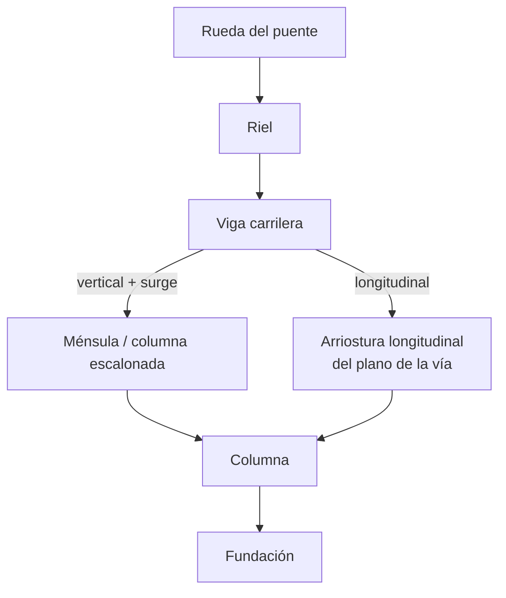

import Note from '../../components/content/Note.astro';
import Equation from '../../components/content/Equation.astro';
import Figure from '../../components/content/Figure.astro';

## La idea que organiza el problema

Un edificio con puente grúa se diseña distinto de una nave común por **tres cosas que
cambian a la vez**:

1. **La carga se mueve.** El puente rueda a lo largo de la nave y el carro se desplaza de un
   riel a otro. No hay una posición de carga: hay que **buscar la crítica**.
2. **La carga es dinámica.** Arrancar, frenar y levantar añaden inercia: **impacto vertical**,
   **empuje lateral (*surge*)** y **frenado longitudinal**.
3. **La carga se repite.** Un puente de servicio pesado hace millones de ciclos: aparece la
   **fatiga**, un estado límite que en un edificio normal casi nunca gobierna.

Y hay una segunda idea, tan importante como la primera: **no existe una sola norma**. El
diseño se arma con tres referencias de uso corriente, cada una responsable de una parte:

<Figure
  src="/puentes-grua-cargas-viga-carrilera/sistema-puente-grua.svg"
  alt="Esquema de una nave industrial con puente grúa: dos columnas escalonadas con ménsulas que soportan las vigas carrileras, los rieles encima, el puente grúa que cruza de un riel al otro con su carro y la carga izada colgando, y las tres fuerzas dinámicas: vertical con impacto, lateral (surge) y longitudinal (frenado)"
  caption="El puente rueda sobre las vigas carrileras; el carro rueda sobre el puente. La carga baja por rueda → riel → viga carrilera → ménsula/columna → fundación, y cada uno de los tres efectos dinámicos sigue su propio camino."
/>

<Note type="info" title="Quién aporta qué (Normativas mixto)">
- **ASCE/SEI 7-22, §4.9 (Crane Loads)** — las **fuerzas** que la grúa induce: impacto, surge,
  frenado, y las combinaciones de carga.
- **CMAA 70 / 74** (Crane Manufacturers Association of America) — la **clase de servicio**
  (A–F) del puente, que fija cuántos ciclos y, por tanto, si la fatiga controla.
- **AISC Design Guide 7 — *Industrial Building Design* (3.ª ed., 2019)** + **AISC 360-22**
  (Apéndice 3, fatiga) — el **diseño** de la viga carrilera, columnas, arriostramientos y
  conexiones.

En Chile las combinaciones se cierran con **NCh 3171** y las cargas gravitacionales con
**NCh 1537**, pero el detalle de las cargas de grúa se toma del marco de ASCE 7 §4.9.
</Note>

---

## 1. La carga de rueda es móvil: el caso crítico

Antes de cualquier fuerza dinámica, hay que saber **cuánto baja por cada rueda**, y eso
depende de dónde esté el carro. El peso propio del puente se reparte por igual a las cuatro
ruedas; pero la **carga izada más el carro** cargan sobre todo el **riel al que el carro se
acerca**. La rueda máxima ocurre con el carro pegado a un riel (a la distancia mínima de
aproximación del gancho, $a$):

<Figure
  src="/puentes-grua-cargas-viga-carrilera/carga-rueda.svg"
  alt="Diagrama del puente grúa de luz S apoyado en los rieles A y B, con el carro pegado al riel A a una distancia a. La reacción en el riel A es grande y en el B pequeña, y la fórmula de la carga de rueda máxima reparte el peso del puente a las cuatro ruedas y la carga más el carro al riel cercano"
  caption="Con el carro junto al riel A, casi toda la carga izada baja por sus ruedas. Ese es el caso crítico para la viga carrilera de ese lado."
/>

<Equation label="Carga de rueda máxima">
$$
P_{\max} = \frac{W_{\text{puente}}}{4} \;+\; \left(W_{\text{carro}} + W_L\right)\frac{S - a}{2\,S}
$$
</Equation>

con $W_{\text{puente}}$ el peso del puente, $W_{\text{carro}}$ el del carro y polipasto, $W_L$
la carga izada nominal, $S$ la luz del puente y $a$ la aproximación mínima del gancho al riel.

---

## 2. Los tres efectos dinámicos (ASCE 7 §4.9)

Sobre esa carga de rueda se montan las tres fuerzas que distinguen a una grúa de una carga
estática. Un detalle clave que ordena todo: **el impacto solo afecta a la fuerza vertical**;
el surge y el frenado se aplican **sin impacto**, y la deflexión se verifica con la carga
**estática** (tampoco con impacto).

<Figure
  src="/puentes-grua-cargas-viga-carrilera/tres-fuerzas.svg"
  alt="La viga carrilera con las tres fuerzas: la vertical de rueda hacia abajo aumentada por el impacto (25% cab, 10% pendant, 25% monorriel), el surge lateral horizontal aplicado en el ala superior (20% de la carga izada más el carro, repartido a los dos rieles), y el frenado longitudinal a lo largo del riel (10% de las cargas de rueda) que va a la arriostura longitudinal"
  caption="Cada fuerza sigue un camino distinto dentro de la sección: la vertical flexiona el eje fuerte, el surge carga el ala superior (eje débil) y el frenado va a la arriostura longitudinal."
/>

### Impacto vertical

La carga de rueda máxima se **incrementa** para cubrir la vibración de arranque y frenado del
izaje:

| Tipo de puente | Incremento por impacto |
|---|---|
| Cabina u operado a distancia (motorizado) | +25 % |
| Monorriel (motorizado) | +25 % |
| Colgante / *pendant* (motorizado) | +10 % |
| Manual (a cadena) | 0 % |

<Equation label="Vertical de diseño">
$$
P_v = P_{\max}\,(1 + I) \qquad I = \text{fracción de impacto}
$$
</Equation>

### Fuerza lateral (surge)

El empuje transversal —por acelerar/frenar el carro y por el balanceo de la carga— vale
**20 % de la suma de la carga izada más el carro**, repartido por igual a los dos rieles y
aplicado en la parte superior del riel. **No** incluye el peso del puente ni el impacto:

<Equation label="Surge lateral">
$$
H_s = 0{,}20\,\left(W_L + W_{\text{carro}}\right) \quad\text{(repartido a los dos rieles)}
$$
</Equation>

Este es el efecto que obliga al **canal-tapa**, como veremos.

### Fuerza longitudinal (frenado)

Al frenar el puente entero a lo largo de la nave, aparece una fuerza en la dirección del riel
igual al **10 % de las cargas de rueda máximas** (sin impacto), que se lleva a la **arriostura
longitudinal** del plano de la vía:

<Equation label="Longitudinal">
$$
H_l = 0{,}10\sum P_{\max,\text{riel}}
$$
</Equation>

donde $\sum P_{\max,\text{riel}}$ son las cargas de rueda máximas **de un solo riel** (las dos
ruedas de ese lado del puente).

---

## 3. La clase de servicio decide qué gobierna (CMAA)

Antes de dimensionar la viga carrilera hay que conocer la **clase de servicio CMAA** del
puente, porque decide si el diseño lo controla la **resistencia**, la **deflexión** o la
**fatiga**. Se basa en cuántos ciclos y con qué intensidad de carga trabaja el puente:

| Clase | Servicio | Uso típico | Fatiga |
|---|---|---|---|
| **A** | Reposo / esporádico | Centrales, salas de motores | No se verifica |
| **B** | Ligero | Talleres de reparación, bodegas livianas | Baja |
| **C** | Moderado | Talleres mecánicos, papeleras | Requerida |
| **D** | Pesado | Fundiciones, bodegas de acero | Evaluación detallada |
| **E** | Severo | Patios de chatarra, cementeras | Vida finita obligatoria |
| **F** | Severo continuo | Acerías | **La fatiga gobierna** |

<Note type="tip" title="La regla mental">
En clase A la fatiga no se chequea y el tamaño lo manda la resistencia o la deflexión. A
partir de C aparece la fatiga, y de D en adelante suele **controlar el diseño** — incluyendo
que las conexiones deban ser **pretensadas de deslizamiento crítico** (*slip-critical*), porque
un perno que trabaja a fricción no afloja bajo millones de ciclos.
</Note>

---

## 4. La viga carrilera: flexión biaxial y canal-tapa

Es el elemento más exigido de la nave. Recibe las tres fuerzas a la vez y las combina en
**flexión biaxial**, con una asimetría física importante:

<Figure
  src="/puentes-grua-cargas-viga-carrilera/viga-carrilera.svg"
  alt="Sección transversal de la viga carrilera: un perfil I con un canal-tapa (cap channel) sobre el ala superior y el riel encima. La carga vertical de rueda flexiona toda la sección respecto al eje fuerte x; el surge lateral flexiona solo el ala superior más el canal-tapa respecto al eje débil y, como una viga horizontal. Se muestran la interacción biaxial y los límites de deflexión: vertical L/600, lateral L/400"
  caption="El surge no lo puede tomar el ala sola: se le agrega un canal-tapa que, junto al ala superior, forma una viga horizontal. Vertical → eje fuerte; surge → ala superior (eje débil)."
/>

- **Eje fuerte (x): la carga vertical.** Las ruedas flexionan toda la sección. Como es una
  **carga móvil**, el momento máximo se busca con **líneas de influencia** (el momento máximo
  absoluto no ocurre en el centro exacto, sino cuando la resultante y la rueda más cercana
  quedan simétricas respecto al centro).
- **Eje débil (y): el surge lateral.** El empuje horizontal actúa arriba, y **el ala superior
  no lo resiste sola**. Por eso a la viga carrilera se le añade casi siempre un **canal-tapa
  (*cap channel*)**: el ala superior más el canal trabajan como una **viga horizontal** que
  lleva el surge hasta las columnas.

Ambos momentos se combinan con la interacción biaxial de AISC 360 (Cap. H):

<Equation label="Interacción biaxial (AISC 360, Cap. H)">
$$
\frac{M_{ux}}{\phi_b M_{nx}} + \frac{M_{uy}}{\phi_b M_{ny}} \le 1{,}0
$$
</Equation>

<Note type="warning" title="La deflexión suele mandar el tamaño">
Para que el puente ruede suave y no se descarrile, la viga carrilera tiene límites de
deflexión **exigentes**, verificados con la carga **estática** (sin impacto):
**vertical $\delta \le L/600$** (grúas automatizadas $L/800$ a $L/1000$) y **lateral
$\delta \le L/400$** por surge. Con frecuencia estos límites piden una sección **más rígida**
que la que exigiría la resistencia: es la deflexión, no la tensión, la que fija el perfil.
</Note>

---

## 5. Fatiga: el estado límite propio de la grúa

La fatiga es lo que hace singular a este diseño. Cada paso del puente sube y baja la tensión
en la viga carrilera; tras millones de ciclos, una grieta puede nuclear en un detalle soldado
mucho antes de alcanzar la fluencia. Se verifica con el **rango de tensión** $\Delta f =
f_{\max} - f_{\min}$ (grúa presente vs. ausente), contra un umbral que **depende del detalle
constructivo** (categorías de AISC 360, Apéndice 3):

<Equation label="Fatiga de vida finita (AISC 360, Ap. 3)">
$$
(\Delta F)_n = \left(\frac{C_f}{N}\right)^{0{,}333} \ge (\Delta F)_{TH}
$$
</Equation>

con $N$ el número de ciclos (que sale de la clase CMAA) y $C_f$, $(\Delta F)_{TH}$ constantes
de la categoría del detalle. La consecuencia de diseño es concreta: **evitar detalles de
categoría baja** en la zona de tracción del ala superior (soldaduras transversales, topes,
conexiones intermitentes), porque su umbral de fatiga es bajo y controlan la sección.

---

## 6. La bajada de cargas

Cada fuerza tiene su ruta hasta la fundación, y conviene tenerlas separadas en la cabeza:

La **columna** que soporta la viga carrilera suele ser **escalonada** (un fuste inferior
ancho para la grúa y uno superior esbelto para el techo) o de **sección ménsula**. El surge
lateral y las cargas verticales excéntricas de la ménsula introducen **momento** en la
columna, que se suma a las cargas de techo y de sismo/viento.

---

## 7. Ejemplo resuelto

Puente grúa **cabina-operado**, capacidad $W_L = 100$ kN, luz $S = 20$ m, peso del puente
$W_{\text{puente}} = 120$ kN, carro + polipasto $W_{\text{carro}} = 30$ kN, aproximación
mínima $a = 1{,}0$ m, cuatro ruedas (dos por riel).

**Carga de rueda máxima** (carro pegado a un riel):

<Equation>
$$
P_{\max} = \frac{120}{4} + (30 + 100)\frac{20 - 1}{2\cdot 20} = 30 + 61{,}75 \approx 92\ \text{kN por rueda}
$$
</Equation>

**Vertical de diseño** con impacto de cabina (+25 %):

<Equation>
$$
P_v = 92 \cdot 1{,}25 \approx 115\ \text{kN por rueda}
$$
</Equation>

**Surge lateral** (20 % de carga izada + carro), repartido a los dos rieles:

<Equation>
$$
H_s = 0{,}20\,(100 + 30) = 26\ \text{kN} \;\Rightarrow\; 13\ \text{kN por riel}
$$
</Equation>

**Frenado longitudinal** (10 % de las cargas de rueda de un riel, dos ruedas):

<Equation>
$$
H_l = 0{,}10 \cdot (2 \cdot 92) \approx 18\ \text{kN} \quad \text{(a la arriostura longitudinal)}
$$
</Equation>

Con esto, la viga carrilera se dimensiona por flexión biaxial ($P_v$ en el eje fuerte, $H_s$
en el ala superior), se verifica la deflexión ($L/600$ y $L/400$) y, según la clase CMAA, la
fatiga del ala superior. Fíjate que **el surge de 13 kN no lleva impacto** y que la deflexión
se calcula con los **92 kN estáticos**, no con los 115.

---

## 8. Cómo combinar las cargas para diseñar

Ya tenemos las fuerzas de la grúa por separado. El diseño **no las usa todas al máximo a la
vez**: hay reglas sobre qué efectos son simultáneos, hasta dónde llega el impacto, cuántas
grúas actúan juntas y cómo se mezcla la grúa con el resto de las cargas. Son justo el tipo de
detalle que se equivoca con facilidad.

<Figure
  src="/puentes-grua-cargas-viga-carrilera/combinaciones-grua.svg"
  alt="Dos reglas al combinar cargas de grúa. Izquierda: el impacto solo se aplica a la viga carrilera y su conexión; las columnas, ménsulas y fundaciones se diseñan sin impacto, porque el efecto dinámico se amortigua en la bajada. Derecha: el surge lateral (movimiento del carro) y el frenado longitudinal (movimiento del puente) son eventos independientes que se revisan por separado, no juntos; y para varias grúas, el vertical considera hasta 2 grúas por vía, pero el surge y el frenado solo 1"
  caption="Las dos trampas: el impacto es un asunto local de la carrilera (no baja a columnas ni fundaciones), y el surge y el frenado no se combinan al máximo a la vez."
/>

### La carga de grúa es una sobrecarga

En las combinaciones de **NCh 3171** (equivalentes a ASCE 7 §2.3 para LRFD) la grúa entra en
la posición de la sobrecarga $L$: se mayora por **1,6** en las combinaciones gravitacionales y
por **1,0** cuando acompaña a viento o sismo. Un matiz útil: como el **peso del puente y del
carro se conocen bien**, se pueden tratar como carga muerta ($1{,}2$), y reservar el $1{,}6$
para la **carga izada** (la incierta). La carga vertical de la grúa —puente + carro + izada—
es la que recibe el incremento por impacto.

### Regla 1 — el impacto solo llega a la carrilera

El $+25\,\%$ / $+10\,\%$ se aplica a la vertical **para la viga carrilera y su conexión**, pero
por práctica establecida (**AIST TR13 / AISC DG7**) **no** se lleva a las columnas, ménsulas ni
fundaciones: el efecto dinámico se amortigua en la bajada. Tampoco afecta al surge, al frenado
ni a la fatiga.

### Regla 2 — surge y frenado no son simultáneos

El surge nace del **movimiento del carro** (transversal) y el frenado, del **movimiento del
puente** (longitudinal): son eventos independientes. Se verifica **vertical + surge** y
**vertical + frenado** como casos separados, nunca los tres máximos a la vez.

<Note type="warning" title="Los mismos números, dos combinaciones distintas">
Con el ejemplo anterior: la **viga carrilera** se diseña con la vertical **con** impacto
(115 kN) más el surge (13 kN); pero la **columna** que la sostiene toma la misma vertical
**sin** impacto (92 kN). El mismo puente, dos cargas verticales distintas según qué elemento
estés diseñando.
</Note>

### Regla 3 — varias grúas no cargan todas al máximo

Cuando hay más de una grúa (misma vía o vías adyacentes), la práctica de **AIST TR13 / MBMA**
acota cuántas se consideran juntas:

| Efecto | Grúas simultáneas |
|---|---|
| Vertical | hasta **2** grúas por vía |
| Surge lateral | **1** grúa |
| Frenado longitudinal | **1** grúa |

### Las combinaciones, en concreto

Llamando $C_g$ al efecto de la grúa (vertical —con o sin impacto según el elemento— más
*uno* de los dos horizontales), las combinaciones LRFD relevantes de NCh 3171 / ASCE 7 §2.3
quedan:

<Equation label="LRFD (NCh 3171 / ASCE 7 §2.3)">
$$
\begin{aligned}
&1{,}2D + 1{,}6\,C_g + 0{,}5\,(L_r \text{ o } S) \\
&1{,}2D + 1{,}6\,(L_r \text{ o } S) + (C_g \text{ o } 0{,}5W) \\
&1{,}2D + 1{,}0W + C_g + 0{,}5\,(L_r \text{ o } S) \\
&0{,}9D + 1{,}0W
\end{aligned}
$$
</Equation>

Para sismo, la grúa aporta **masa** (se la ubica estacionada en su posición más desfavorable),
pero su surge —un evento operacional— **no se combina** con el sismo.

### La fatiga va por un carril aparte

La fatiga **no** usa estas combinaciones: se evalúa a **nivel de servicio** (cargas sin
mayorar), con **una sola grúa**, **sin impacto** y sin viento ni sismo — es el rango de tensión
de una pasada del puente, repetida según la clase CMAA (§5).

---

## El hilo, en una frase

Diseñar una nave con puente grúa es tomar una carga que **se mueve, se sacude y se repite** y
darle a cada una de esas tres naturalezas su tratamiento: la **posición crítica** (carga
móvil → líneas de influencia), los **factores dinámicos** de ASCE 7 §4.9 (impacto solo
vertical, surge y frenado sin impacto) y la **fatiga** que gobierna según la clase CMAA — todo
aterrizando en una viga carrilera con **canal-tapa** que resuelve, de una vez, la flexión
biaxial y la deflexión exigente que impone el rodar suave del puente. Y al combinar, la misma
disciplina: cada efecto en su casilla —el impacto solo hasta la carrilera, el surge y el
frenado nunca juntos, la fatiga a nivel de servicio— dentro de las combinaciones de NCh 3171.
