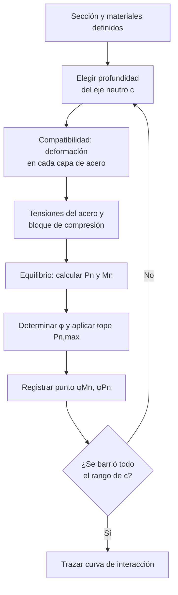
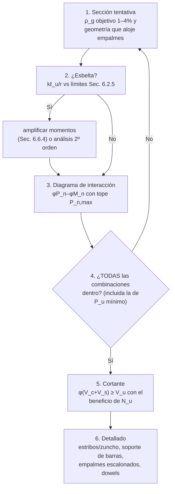

import Note from '../../components/content/Note.astro';
import Equation from '../../components/content/Equation.astro';
import Figure from '../../components/content/Figure.astro';

## La idea que organiza el capítulo

Una viga se verifica con un número: $\phi M_n \geq M_u$. Una columna no puede, porque su
resistencia a flexión **depende de cuánta carga axial la acompaña** — la compresión
precomprime la sección y retrasa la fisuración (ayuda), hasta que empieza a acercar el
hormigón a su aplastamiento (perjudica). Por eso la columna no tiene *una* resistencia:
tiene una **frontera** en el plano $P$–$M$, el diagrama de interacción, y el diseño
consiste en que todas las combinaciones de carga queden dentro.

La segunda idea del capítulo es de naturaleza: la falla por compresión es **frágil** —
el hormigón se aplasta sin fluencia previa del acero, sin aviso. La norma responde en
tres frentes que atraviesan todo el capítulo: castiga el φ (0.65 contra el 0.90 de
flexión), **prohíbe acercarse a la compresión pura** (el tope $P_{n,\max}$), y **premia
el confinamiento** que convierte la falla frágil en dúctil (zunchos: φ = 0.75).

<Note type="info" title="Alcance">
Columnas no pretensadas y pretensadas que resisten principalmente **carga axial de
compresión** con o sin momentos: columnas de pórticos y de sistemas de losas, pedestales,
elementos con espiral, y columnas compuestas hormigón-acero (con la Sec. 10.5 y el
Cap. 22). Se diseñan para la combinación simultánea de $P_u$, $M_u$ (flexocompresión),
$V_u$ y, cuando corresponde, torsión, para todas las combinaciones de la Sec. 5.3.
</Note>

---

## 1. El diagrama de interacción: la frontera

<Figure
  src="/aci318-25-cap10/diagrama-interaccion.svg"
  alt="Diagrama de interacción P-M anotado: curva nominal con el punto teórico P0, el tope Pn,max al 80 por ciento, el punto balanceado donde el momento es máximo, la flexión pura, las zonas de phi por deformación y la curva de diseño phi Pn phi Mn con puntos de carga dentro y fuera"
  caption="La frontera completa, anotada: P₀ nunca está disponible (tope por excentricidad accidental), el momento máximo ocurre en el punto balanceado, y φ cambia a lo largo de la curva según cómo falla la sección en cada tramo."
/>

Cada punto de la curva corresponde a una posición distinta del eje neutro; la curva se
construye barriéndolo:

En cada iteración, fijada $c$ y con $\varepsilon_{cu}=0.003$ en la fibra extrema comprimida:

1. **Compatibilidad** — deformación de cada capa de acero por el triángulo de deformaciones:
   $$\varepsilon_{si} = 0.003\,\frac{c - d_i}{c}$$
2. **Tensiones** — acotadas al límite elástico:
   $$f_{si} = E_s\,\varepsilon_{si}, \qquad -f_y \leq f_{si} \leq f_y$$
3. **Bloque de compresión** del hormigón:
   $$a = \beta_1\,c, \qquad C_c = 0.85\,f'_c\,a\,b$$
4. **Equilibrio** axial y de momentos respecto al centroide plástico:
   $$P_n = C_c + \sum_i f_{si}\,A_{si}, \qquad M_n = \sum (\text{momentos de } C_c \text{ y } f_{si}A_{si})$$
5. **Factor $\phi$** según $\varepsilon_t$ del acero extremo en tracción (Tabla 21.2.2) y
   tope $P_{n,\max}$; se registra $(\phi M_n,\, \phi P_n)$.

Tres puntos anclan la curva y conviene saber leerlos:

- **Compresión pura $P_0$** — teórica: hormigón y todo el acero al límite a la vez.
  Nunca está disponible (§1.2).
- **Punto balanceado** ($\varepsilon_t = \varepsilon_{ty}$) — hormigón y acero llegan al
  límite simultáneamente. Es el **momento máximo de toda la frontera**, y la divisoria
  entre las dos ramas: arriba de él, más carga axial *quita* capacidad de momento; abajo,
  la *agrega* (la compresión cierra las fisuras y retrasa la fluencia).
- **Flexión pura** ($P_n = 0$) — la columna trabajando como viga.

<Note type="tip" title="Cómo se usa el diagrama">
Un par $(M_u, P_u)$ es admisible si cae **dentro** de la curva $\phi P_n$–$\phi M_n$.
Cada combinación de la Sec. 5.3 genera un punto y todos deben quedar contenidos. El error
clásico: verificar solo la combinación de $P_u$ máximo — en la rama baja, la combinación
con $P_u$ *mínimo* (por ejemplo $0.9D + E$) suele ser la crítica, porque perder
compresión acerca el punto a la frontera.
</Note>

### 1.1 Compresión pura (Ec. 22.4.2.2)

<Equation label="Ec. 22.4.2.2">
$$
P_0 = 0.85\,f'_c\,(A_g - A_{st}) + f_y\,A_{st}
$$
</Equation>

con $A_g$ el área bruta y $A_{st}$ el refuerzo longitudinal total.

### 1.2 El tope: la excentricidad que siempre existe (Sec. 22.4.2.1)

<Equation label="Ec. 22.4.2.1">
$$
P_{n,\max} =
\begin{cases}
0.80\,P_0 & \text{columnas con estribos} \\[4pt]
0.85\,P_0 & \text{columnas con zunchos (espirales)}
\end{cases}
$$
</Equation>

El recorte no es un factor de seguridad más: reconoce que la compresión perfectamente
centrada **no existe** — tolerancias de hormigonado, barras corridas, momentos
accidentales que el análisis no captura. El tope equivale a exigir una excentricidad
mínima, y corta la punta superior del diagrama donde la falla sería la más frágil de
todas.

### 1.3 φ a lo largo de la frontera (Tabla 21.2.2)

| Clasificación | $\varepsilon_t$ | $\phi$ (estribos) | $\phi$ (zunchos) |
|---------------|:---------------:|:-----------------:|:----------------:|
| Controlada por compresión | $\leq \varepsilon_{ty}$ | 0.65 | 0.75 |
| Transición | $\varepsilon_{ty} \lt \varepsilon_t \lt \varepsilon_{ty}+0.003$ | interpolación | interpolación |
| Controlada por tracción | $\geq \varepsilon_{ty}+0.003$ | 0.90 | 0.90 |

La mayoría de las columnas trabajan controladas por compresión ($\phi = 0.65$ o 0.75);
en la rama baja del diagrama pueden entrar en transición o tracción controlada y
recuperar φ. El diagrama de diseño "se despega" del nominal de forma no uniforme por
esta razón.

---

## 2. Confinamiento: comprar ductilidad (Sec. 25.7)

<Figure
  src="/aci318-25-cap10/confinamiento.svg"
  alt="Comparación de sección con estribos y sección con zuncho: en ambas salta el recubrimiento cerca de la carga máxima, pero la curva carga-deformación con estribos cae de golpe mientras que con zuncho el núcleo confinado triaxialmente sigue cargando con falla dúctil"
  caption="La diferencia no está en la resistencia sino en lo que pasa después del peak: el zuncho confina el núcleo de forma continua (compresión triaxial) y la columna sigue cargando tras perder el recubrimiento. La norma lo paga con φ = 0.75 y P_n,max = 0.85·P₀."
/>

Cerca de la carga máxima, el recubrimiento **siempre** salta — está fuera del núcleo
confinado y nada lo sujeta. La pregunta de diseño es qué pasa después:

- **Estribos**: soporte discreto, confinan poco. Perdido el recubrimiento, la capacidad
  cae de golpe → φ = 0.65, $P_{n,\max} = 0.80\,P_0$.
- **Zuncho**: la hélice aprieta el núcleo de forma continua (estado triaxial). El núcleo
  compensa la pérdida del recubrimiento y la falla es dúctil y avisada → φ = 0.75,
  $P_{n,\max} = 0.85\,P_0$.

La cuantía volumétrica mínima del zuncho sale exactamente de esa compensación — que el
núcleo confinado recupere lo que aporta el recubrimiento que se pierde:

<Equation label="Ec. 25.7.3.3">
$$
\rho_s \geq 0.45\left(\frac{A_g}{A_{ch}} - 1\right)\frac{f'_c}{f_{yt}}
$$
</Equation>

con $A_{ch}$ el área del núcleo (al exterior de la espiral) y $f_{yt} \leq 700$ MPa. El
término $(A_g/A_{ch} - 1)$ es literalmente "cuánto recubrimiento hay que reemplazar".
Paso libre de la hélice: entre 25 y 75 mm.

<Note type="warning" title="Continuidad del zuncho">
El zuncho debe anclarse con 1.5 vueltas adicionales en cada extremo y mantenerse desde
la cara superior de la zapata o losa hasta el refuerzo horizontal más bajo del elemento
soportado (Sec. 25.7.3): el confinamiento solo existe donde la hélice está cerrada y
continua.
</Note>

### Estribos (Sec. 25.7.2)

- **Diámetro mínimo:** Nº 10 (#3) para longitudinales hasta Nº 32 (#10); Nº 13 (#4) para
  mayores o paquetes.
- **Espaciamiento vertical máximo:**

<Equation label="Sec. 25.7.2.1">
$$
s \leq \min\left(16\,d_{b,\text{long}},\; 48\,d_{b,\text{estribo}},\; \text{menor dimensión de la columna}\right)
$$
</Equation>

Los tres límites son la misma función con tres disfraces: evitar el **pandeo de las
barras longitudinales** entre apoyos. Por eso además cada barra de esquina y barras
alternas deben tener soporte lateral de una esquina de estribo con ángulo interior
$\leq 135°$, y ninguna barra puede quedar a más de 150 mm libres de una soportada
(Sec. 25.7.2.3).

---

## 3. Límites de refuerzo longitudinal (Sec. 10.6.1)

<Equation label="Ec. 10.6.1.1">
$$
0.01 \leq \rho_g = \frac{A_{st}}{A_g} \leq 0.08
$$
</Equation>

- **Mínimo 1%:** bajo carga sostenida, el flujo plástico del hormigón le transfiere
  carga al acero con el tiempo; con muy poco acero, éste termina fluyendo en servicio.
  El mínimo también garantiza resistencia a flexión frente a momentos no calculados.
- **Máximo 8%:** congestión — pero es un límite teórico. En los **empalmes por traslape
  la cuantía local se duplica**, así que el máximo práctico es $\rho_g \approx 0.04$.

### Número mínimo de barras (Sec. 10.7.3.1)

| Configuración del refuerzo transversal | Mínimo de barras longitudinales |
|----------------------------------------|:-------------------------------:|
| Estribos rectangulares o circulares | 4 |
| Estribos triangulares | 3 |
| Zunchos (espirales) | 6 |

### Dimensiones mínimas (Sec. 10.3)

El ACI 318-25 no fija una dimensión mínima absoluta: la geometría debe alojar el
refuerzo con los recubrimientos y separaciones del Cap. 25. Para secciones mayores que
lo requerido, la Sec. 10.3.1.2 permite diseñar con un área bruta reducida
$A_{g,\text{eff}} \geq 0.5\,A_g$ a efectos de mínimos y resistencia.

<Note type="info">
No existe una tabla de altura mínima como en elementos de flexión: a la columna la
gobiernan la **resistencia** (el diagrama) y la **esbeltez** (Cap. 6), no la deflexión.
</Note>

---

## 4. Cortante (Cap. 22.5)

La compresión axial ayuda al corte — cierra las fisuras diagonales y mantiene el
engranaje de áridos trabajando. La forma simplificada de la Tabla 22.5.5.1 lo captura:

<Equation label="Ec. 22.5.5.1">
$$
V_c = 0.17\left(1 + \frac{N_u}{14\,A_g}\right)\lambda\sqrt{f'_c}\;b_w d
$$
</Equation>

con $N_u/A_g$ en MPa, positiva en compresión. La contribución de los estribos es la
general:

<Equation label="Ec. 22.5.10.5.3">
$$
V_s = \frac{A_v\,f_{yt}\,d}{s} \qquad \phi V_n = \phi(V_c + V_s) \geq V_u \quad (\phi = 0.75)
$$
</Equation>

---

## 5. Esbeltez (Sec. 6.2.5): cuándo el equilibrio se escribe en la deformada

Una columna esbelta se flecta, y la carga axial actuando sobre esa flecha genera momento
adicional ($P$–$\delta$): el equilibrio hay que plantearlo en la configuración
deformada. La norma permite **despreciar** el efecto cuando es menor al ~5%:

<Equation label="Sec. 6.2.5">
$$
\frac{k\,\ell_u}{r} \leq
\begin{cases}
34 - 12\,(M_1/M_2) \leq 40 & \text{pórticos arriostrados (sin desplazamiento lateral)} \\[4pt]
22 & \text{pórticos no arriostrados (con desplazamiento)}
\end{cases}
$$
</Equation>

con $\ell_u$ la longitud libre, $k$ el factor de longitud efectiva, $r \approx 0.30h$
(rectangular) o $0.25D$ (circular), y $M_1/M_2$ la relación de momentos de extremo
(positiva en curvatura simple — la doble curvatura es más estable y el límite lo
reconoce). Superado el límite: **magnificación de momentos** (Sec. 6.6.4) o análisis de
segundo orden. El efecto de la esbeltez nunca es reducir la resistencia de la sección —
es **amplificar la demanda** $M_u$ que entra al diagrama.

---

## 6. Detallado del refuerzo

- **Recubrimiento mínimo (Tabla 20.5.1.3):** 40 mm a la cara del estribo o zuncho en
  ambiente interior.
- **Empalmes (Sec. 10.7.5):** por traslape, soldados o mecánicos. En el traslape la
  cuantía local se duplica: escalonarlos y mantener $\rho_g$ holgada.
- **Barras de transferencia / dowels (Sec. 16.3):** la interfaz columna–zapata requiere
  refuerzo que la cruce con al menos $0.005\,A_g$, con desarrollo en compresión a ambos
  lados.
- **Separación libre entre longitudinales (Sec. 25.2.3):**
  $\geq \max(40\,\text{mm},\; 1.5\,d_b,\; 4/3\,d_{agg})$.

---

## 7. El orden de diseño

---

## Resumen de verificaciones para columnas

| Verificación | Requisito | Naturaleza |
|--------------|-----------|:---:|
| Flexocompresión | Todas las $(P_u, M_u)$ dentro de $\phi P_n$–$\phi M_n$ | frontera — frágil arriba, dúctil abajo |
| Carga axial máxima | $P_{n,\max} = 0.80\,P_0$ (estribos) / $0.85\,P_0$ (zunchos) | **corta la punta más frágil** |
| Factor de reducción | 0.65 / 0.75 / hasta 0.90 según $\varepsilon_t$ (Tabla 21.2.2) | castiga lo frágil |
| Cuantía longitudinal | $0.01 \leq \rho_g \leq 0.08$ (práctico $\leq 0.04$ por empalmes) | flujo plástico / congestión |
| Número de barras | 4 (estribos) / 3 (triangular) / 6 (zunchos) | geometría del confinamiento |
| Refuerzo transversal | Estribos Sec. 25.7.2 o zuncho Ec. 25.7.3.3 | **compra ductilidad** |
| Espaciamiento de estribos | $\min(16 d_{b,\ell},\, 48 d_{b,t},\, b_{\min})$ | anti-pandeo de barras |
| Cortante | $\phi(V_c+V_s) \geq V_u$, con beneficio de $N_u$ | frágil — sobreproteger |
| Esbeltez | $k\ell_u/r \leq$ límite o amplificar momentos | amplifica demanda, no reduce capacidad |
| Recubrimiento | 40 mm a la cara del estribo (Tabla 20.5.1.3) | durabilidad |
