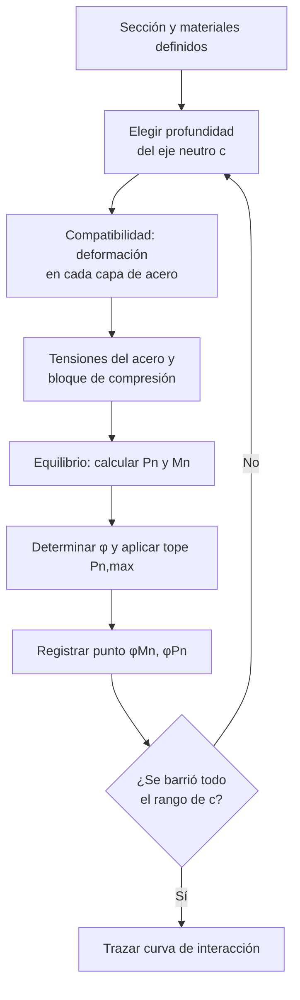

import Note from '../../components/content/Note.astro';
import Equation from '../../components/content/Equation.astro';

## Alcance

El Capítulo 10 aplica a columnas no pretensadas y pretensadas que resisten principalmente
**carga axial de compresión**, con o sin momentos flectores, incluyendo:

- Columnas de pórticos y de sistemas de losas con o sin vigas.
- Pedestales y elementos de compresión con o sin refuerzo transversal en espiral.
- Columnas compuestas de hormigón y acero estructural (en conjunto con la Sec. 10.5 y el
  Cap. 22).

Las columnas se diseñan para resistir la combinación simultánea de **carga axial $P_u$**,
**momento $M_u$** (flexocompresión), **cortante $V_u$** y, cuando corresponde, **torsión**.

---

## Límites de diseño (Sec. 10.3)

### Dimensiones mínimas

El ACI 318-25 no fija una dimensión mínima absoluta, pero la geometría debe permitir alojar
el refuerzo con los recubrimientos y espaciamientos del Cap. 25. Para columnas con sección
mayor que la requerida por las cargas, la Sec. 10.3.1.2 permite diseñar con un **área bruta
reducida** $A_{g,\text{eff}}$ no menor que la mitad del área total real, a efectos de
refuerzo mínimo y resistencia.

<Note type="info">
A diferencia de las vigas, no existe una tabla de altura mínima: el control de la columna lo
gobiernan la **resistencia** (diagrama de interacción) y la **esbeltez** (Cap. 6), no la
deflexión.
</Note>

---

## Resistencia requerida

La resistencia de diseño debe satisfacer en todas las secciones y para todas las
combinaciones de la Sec. 5.3:

$$
\phi P_n \geq P_u \qquad \phi M_n \geq M_u \qquad \phi V_n \geq V_u
$$

Las solicitaciones se evalúan considerando los **efectos de esbeltez** de la Sec. 6.2.5
(momentos amplificados $M_c$ en columnas esbeltas).

---

## Resistencia a flexocompresión

La resistencia de una columna se representa mediante el **diagrama de interacción**
$P_n$–$M_n$, obtenido por compatibilidad de deformaciones ($\varepsilon_{cu}=0.003$) y
equilibrio de la sección. Cada punto corresponde a una posición distinta del eje neutro.

### Construcción del diagrama (proceso iterativo)

El diagrama no tiene forma cerrada: se construye barriendo la **profundidad del eje neutro
$c$** desde compresión pura hasta flexión pura. Para cada valor de $c$ se resuelve el
equilibrio de la sección y se obtiene un punto $(\phi M_n,\, \phi P_n)$.

En cada iteración, fijada $c$ y con $\varepsilon_{cu}=0.003$ en la fibra extrema comprimida,
se evalúa:

1. **Compatibilidad** — deformación de cada capa de acero por el triángulo de deformaciones:
   $$\varepsilon_{si} = 0.003\,\frac{c - d_i}{c}$$
2. **Tensiones** — acotadas al límite elástico:
   $$f_{si} = E_s\,\varepsilon_{si}, \qquad -f_y \leq f_{si} \leq f_y$$
3. **Bloque de compresión** del hormigón:
   $$a = \beta_1\,c, \qquad C_c = 0.85\,f'_c\,a\,b$$
4. **Equilibrio** axial y de momentos respecto al centroide plástico:
   $$P_n = C_c + \sum_i f_{si}\,A_{si}, \qquad M_n = \sum (\text{momentos de } C_c \text{ y } f_{si}A_{si})$$
5. **Factor $\phi$** según $\varepsilon_t$ del acero extremo en tracción (Tabla 21.2.2) y tope
   $P_{n,\max}$; se registra el punto $(\phi M_n,\, \phi P_n)$.

Tres puntos notables anclan la curva: **compresión pura** ($c \to \infty$, limitada a
$P_{n,\max}$), el **punto balanceado** ($\varepsilon_t = \varepsilon_{ty}$, donde el hormigón
y el acero llegan al límite simultáneamente) y la **flexión pura** ($P_n = 0$).

<Note type="tip" title="Cómo se usa el diagrama">
Un par $(M_u,\, P_u)$ es admisible si cae **dentro** de la curva $\phi P_n$–$\phi M_n$. Cada
combinación de carga de la Sec. 5.3 genera un punto distinto; todos deben quedar contenidos por
la envolvente de diseño.
</Note>

### Resistencia axial nominal pura (Ec. 22.4.2.2)

<Equation label="Ec. 22.4.2.2">
$$
P_0 = 0.85\,f'_c\,(A_g - A_{st}) + f_y\,A_{st}
$$
</Equation>

donde $A_g$ es el área bruta y $A_{st}$ el área total del refuerzo longitudinal.

### Resistencia axial máxima (Sec. 22.4.2.1)

La carga axial de diseño nunca puede alcanzar $P_0$: se limita para considerar excentricidades
accidentales inevitables.

<Equation label="Ec. 22.4.2.1">
$$
P_{n,\max} =
\begin{cases}
0.80\,P_0 & \text{columnas con estribos} \\[4pt]
0.85\,P_0 & \text{columnas con zunchos (espirales)}
\end{cases}
$$
</Equation>

El mayor factor para zunchos refleja la **mayor ductilidad y confinamiento** del núcleo
helicoidal.

### Factor de reducción según deformación (Tabla 21.2.2)

| Clasificación | $\varepsilon_t$ | $\phi$ (estribos) | $\phi$ (zunchos) |
|---------------|:---------------:|:-----------------:|:----------------:|
| Controlada por compresión | $\leq \varepsilon_{ty}$ | 0.65 | 0.75 |
| Transición | $\varepsilon_{ty} < \varepsilon_t < \varepsilon_{ty}+0.003$ | interpolación | interpolación |
| Controlada por tracción | $\geq \varepsilon_{ty}+0.003$ | 0.90 | 0.90 |

La mayoría de las columnas trabajan en la zona **controlada por compresión** ($\phi=0.65$ o
$0.75$). En la rama inferior del diagrama (flexión dominante) pueden entrar en transición o
tracción controlada.

<Note type="tip" title="Por qué los zunchos tienen mejor φ">
El refuerzo en espiral confina el núcleo de hormigón de forma continua: tras el
desprendimiento del recubrimiento, la columna mantiene capacidad y falla de manera dúctil. Por
eso la norma premia los zunchos con $\phi = 0.75$ frente a $0.65$ de los estribos y con
$P_{n,\max} = 0.85\,P_0$ frente a $0.80\,P_0$.
</Note>

---

## Límites de refuerzo longitudinal (Sec. 10.6.1)

La cuantía del refuerzo longitudinal $\rho_g = A_{st}/A_g$ debe cumplir:

<Equation label="Ec. 10.6.1.1">
$$
0.01 \leq \rho_g = \frac{A_{st}}{A_g} \leq 0.08
$$
</Equation>

- **Mínimo $0.01\,A_g$:** controla la fluencia lenta y el flujo plástico, y asegura una
  resistencia a flexión mínima frente a momentos imprevistos.
- **Máximo $0.08\,A_g$:** evita congestión del acero; en la práctica, por los empalmes
  (donde la cuantía se duplica), conviene no superar $\rho_g \approx 0.04$.

### Número mínimo de barras (Sec. 10.7.3.1)

| Configuración del refuerzo transversal | Mínimo de barras longitudinales |
|----------------------------------------|:-------------------------------:|
| Estribos rectangulares o circulares | 4 |
| Estribos triangulares | 3 |
| Zunchos (espirales) | 6 |

---

## Refuerzo transversal

### Columnas con estribos (Sec. 25.7.2)

- **Diámetro mínimo del estribo:** barra Nº 10 (#3) para longitudinales hasta Nº 32 (#10);
  barra Nº 13 (#4) para longitudinales mayores o paquetes de barras.
- **Espaciamiento vertical máximo (Sec. 25.7.2.1):**

<Equation label="Sec. 25.7.2.1">
$$
s \leq \min\left(16\,d_{b,\text{long}},\; 48\,d_{b,\text{estribo}},\; \text{menor dimensión de la columna}\right)
$$
</Equation>

- **Disposición (Sec. 25.7.2.3):** cada barra de esquina y barras alternas deben tener
  soporte lateral por la esquina de un estribo con ángulo interior $\leq 135^\circ$; ninguna
  barra puede quedar a más de 150 mm libres de una barra soportada.

### Columnas con zunchos (Sec. 25.7.3)

La cuantía volumétrica del zuncho debe cumplir:

<Equation label="Ec. 25.7.3.3">
$$
\rho_s \geq 0.45\left(\frac{A_g}{A_{ch}} - 1\right)\frac{f'_c}{f_{yt}}
$$
</Equation>

donde $A_{ch}$ es el área del núcleo confinado (medida al exterior de la espiral) y $f_{yt}
\leq 700\,\text{MPa}$. El espaciamiento libre de la hélice debe estar entre **25 mm y 75 mm**.

<Note type="warning" title="Continuidad del zuncho">
El zuncho debe anclarse con 1.5 vueltas adicionales en cada extremo y mantenerse desde la cara
superior de la zapata o losa hasta el refuerzo horizontal más bajo del elemento soportado
superior (Sec. 25.7.3).
</Note>

---

## Resistencia a cortante (Cap. 22.5)

Para columnas con carga axial de compresión $N_u$, la contribución del hormigón puede tomarse,
de forma simplificada (Tabla 22.5.5.1), como:

<Equation label="Ec. 22.5.5.1">
$$
V_c = 0.17\left(1 + \frac{N_u}{14\,A_g}\right)\lambda\sqrt{f'_c}\;b_w d
$$
</Equation>

con $N_u/A_g$ en MPa y $N_u$ positiva en compresión. La contribución de los estribos sigue la
expresión general:

<Equation label="Ec. 22.5.10.5.3">
$$
V_s = \frac{A_v\,f_{yt}\,d}{s} \qquad \phi V_n = \phi(V_c + V_s) \geq V_u \quad (\phi = 0.75)
$$
</Equation>

---

## Efectos de esbeltez (Sec. 6.2.5)

Los efectos de segundo orden pueden **despreciarse** cuando:

<Equation label="Sec. 6.2.5">
$$
\frac{k\,\ell_u}{r} \leq
\begin{cases}
34 - 12\,(M_1/M_2) \leq 40 & \text{pórticos arriostrados (sin desplazamiento lateral)} \\[4pt]
22 & \text{pórticos no arriostrados (con desplazamiento)}
\end{cases}
$$
</Equation>

donde $\ell_u$ es la longitud libre, $k$ el factor de longitud efectiva, $r$ el radio de giro
($\approx 0.30 h$ en secciones rectangulares, $0.25 D$ en circulares) y $M_1/M_2$ la relación
de momentos de extremo (positiva en curvatura simple). Si se supera el límite, se amplifican
los momentos por el método de **magnificación de momentos** (Sec. 6.6.4) o un análisis de
segundo orden.

---

## Detallado del refuerzo

- **Recubrimiento mínimo (Tabla 20.5.1.3):** 40 mm para columnas no expuestas a la intemperie
  ni en contacto con el suelo (medido a la cara del estribo o zuncho).
- **Empalmes (Sec. 10.7.5):** se permiten empalmes por traslape, soldados o mecánicos. En el
  traslape la cuantía local se duplica; conviene escalonarlos y mantener $\rho_g$ holgada
  respecto al límite de 0.08.
- **Barras de transferencia / dowels (Sec. 16.3):** la conexión columna–zapata requiere
  refuerzo que cruce la interfaz con al menos $0.005\,A_g$ y respete las longitudes de
  desarrollo en compresión.
- **Espaciamiento libre entre barras longitudinales (Sec. 25.2.3):**
  $\geq \max(40\,\text{mm},\; 1.5\,d_b,\; 4/3\,d_{agg})$.

---

## Resumen de verificaciones para columnas

| Verificación | Requisito |
|--------------|-----------|
| Cuantía longitudinal | $0.01 \leq \rho_g \leq 0.08$ (Sec. 10.6.1.1) |
| Número de barras | 4 (estribos) / 3 (triangular) / 6 (zunchos) |
| Resistencia a flexocompresión | Punto $(P_u, M_u)$ dentro del diagrama $\phi P_n$–$\phi M_n$ |
| Carga axial máxima | $P_{n,\max} = 0.80\,P_0$ (estribos) / $0.85\,P_0$ (zunchos) |
| Factor de reducción | $\phi = 0.65$ (estribos) / $0.75$ (zunchos), Tabla 21.2.2 |
| Refuerzo transversal | Estribos (Sec. 25.7.2) o zuncho $\rho_s$ (Ec. 25.7.3.3) |
| Espaciamiento de estribos | $\min(16 d_{b,\ell},\, 48 d_{b,t},\, b_{\min})$ |
| Resistencia a cortante | $\phi V_n = \phi(V_c+V_s) \geq V_u$, $\phi=0.75$ |
| Esbeltez | Despreciable si $k\ell_u/r \leq$ límite (Sec. 6.2.5), o magnificar |
| Recubrimiento | 40 mm a la cara del estribo (Tabla 20.5.1.3) |
