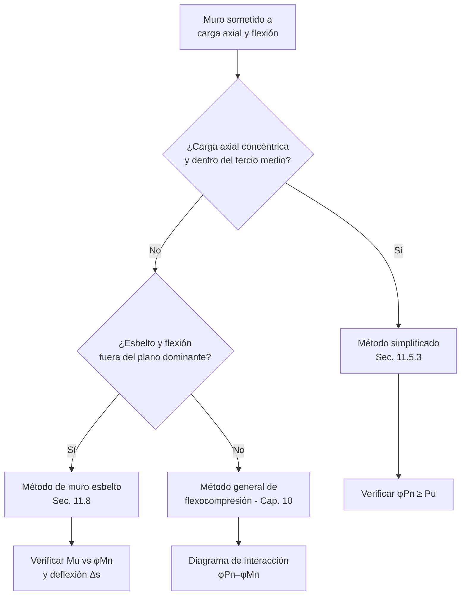
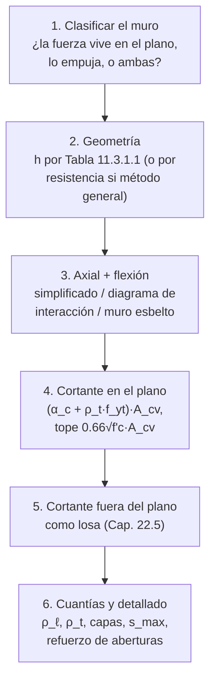

import Note from '../../components/content/Note.astro';
import Equation from '../../components/content/Equation.astro';
import Figure from '../../components/content/Figure.astro';

## Los dos muros del capítulo

El Capítulo 11 junta bajo una palabra dos elementos que trabajan de forma opuesta, y la
mitad de las confusiones con muros vienen de no separarlos desde el principio:

1. **El muro de corte**: la fuerza vive **en** su plano (sismo, viento). Es un elemento
   enorme y rígido cuyo problema es el corte diagonal y la flexocompresión en su plano.
2. **El muro que recibe empuje**: la fuerza **empuja** su plano (suelo en sótanos,
   cargas excéntricas en muros esbeltos). Es, mecánicamente, una **losa vertical**: su
   problema es la flexión fuera del plano.

<Figure
  src="/aci318-25-cap11/dos-muros.svg"
  alt="Dos esquemas: muro de corte en elevación con la fuerza en su plano y fisuras diagonales cosidas por el refuerzo horizontal, y muro de sótano en sección flectando fuera del plano bajo el empuje triangular del suelo con el refuerzo vertical en la cara traccionada"
  caption="El mismo elemento, dos mecánicas opuestas. En el plano: fisuras diagonales → manda el refuerzo horizontal ρ_t. Fuera del plano: flexión de losa vertical → manda el refuerzo vertical ρ_ℓ. Identificar cuál domina es el primer paso de todo diseño de muros."
/>

Cada mecánica tiene su refuerzo protagonista — horizontal para el corte en el plano,
vertical para la flexión fuera de él — y sus propias verificaciones. Un mismo muro real
(un muro perimetral de sótano en zona sísmica, por ejemplo) puede ser los dos a la vez y
requiere ambas revisiones.

<Note type="info" title="Alcance">
Muros no pretensados y pretensados: de carga, de corte, de sótano y fundación. Se
diseñan como elementos de compresión (aplica también el Cap. 10 de la norma) más las
disposiciones propias de geometría, cortante y refuerzo distribuido de este capítulo.
Los diafragmas se rigen por el Cap. 12 y los muros estructurales especiales
sismorresistentes por la Sec. 18.10. Resistencia requerida:
$\phi P_n \geq P_u$, $\phi M_n \geq M_u$, $\phi V_n \geq V_u$ para las combinaciones de
la Sec. 5.3.
</Note>

---

## 1. Límites de diseño (Sec. 11.3)

Para muros diseñados por el **método simplificado** (Sec. 11.5.3), el espesor debe cumplir:

<Equation label="Tabla 11.3.1.1">
$$
h \geq \max\left(100\ \text{mm},\; \frac{1}{25}\,\min(\ell_w,\, h_w)\right)
$$
</Equation>

con $\ell_w$ la longitud y $h_w$ la altura no soportada. Muros exteriores de sótano y de
fundación: **190 mm** mínimo.

<Note type="info">
El límite solo es obligatorio con el método simplificado. Si el muro se analiza por
flexocompresión general (Cap. 10) o como muro esbelto (Sec. 11.8), el espesor lo
gobiernan la resistencia y la estabilidad, no esta tabla.
</Note>

---

## 2. Carga axial y flexión: tres rutas

### 2.1 Método simplificado (Sec. 11.5.3)

Para sección rectangular sólida con la resultante dentro del **tercio medio** del
espesor ($e \leq h/6$ — es decir, sin tracción en ninguna fibra):

<Equation label="Ec. 11.5.3.1">
$$
\phi P_n = 0.55\,\phi\,f'_c\,A_g\left[1 - \left(\frac{k\,\ell_c}{32\,h}\right)^2\right]
$$
</Equation>

con $\phi = 0.65$. La estructura de la fórmula se deja leer: el $0.55 f'_c A_g$ es una
compresión admisible conservadora (nótese que el acero vertical ni aparece — el método
lo regala), y el corchete es la **penalización por esbeltez**: cae con el cuadrado de
$k\ell_c/h$, y en $k\ell_c = 32h$ la capacidad llega a cero. El factor de longitud
efectiva:

| Condición de restricción de los extremos | $k$ |
|------------------------------------------|:---:|
| Restringidos contra rotación en uno o ambos extremos | 0.8 |
| No restringidos contra rotación en ambos extremos | 1.0 |
| Muros no arriostrados contra traslación lateral | 2.0 |

### 2.2 Método general (Cap. 10)

Con excentricidad mayor que $h/6$ o flexión significativa, se construye el **diagrama de
interacción** $P_n$–$M_n$ de la sección (compatibilidad con $\varepsilon_{cu} = 0.003$ y
equilibrio, como en columnas) y todas las combinaciones $(P_u, M_u)$ deben quedar dentro
de la envolvente de diseño.

### 2.3 Muro esbelto fuera del plano (Sec. 11.8)

Para muros esbeltos con carga axial baja ($P_u \leq 0.06 f'_c A_g$) y flexión fuera del
plano dominante — el muro prefabricado o *tilt-up* típico — se admite un análisis
directo de segundo orden:

<Equation label="Ec. 11.8.3.1">
$$
M_u = M_{ua} + P_u\,\Delta_u
$$
</Equation>

el momento de primer orden más el efecto $P\text{-}\Delta$: la carga axial actuando
sobre la flecha $\Delta_u$ a media altura (calculada con la rigidez fisurada $I_{cr}$).
La deflexión de servicio se limita a $\Delta_s \leq \ell_c/150$ (Sec. 11.8.4.1).

<Note type="warning" title="Condiciones del método de muro esbelto">
Solo válido si la sección es controlada por tracción ($\varepsilon_t \geq 0.004$), la
carga axial es baja ($\leq 0.06 f'_c A_g$) y el muro está arriostrado arriba y abajo
contra desplazamiento fuera del plano. Fuera de esos límites: análisis general de
segundo orden.
</Note>

---

## 3. Cortante en el plano (Sec. 11.5.4)

El muro de corte trabaja sobre el área $A_{cv} = h\,\ell_w$:

<Equation label="Ec. 11.5.4.3">
$$
V_n = \left(\alpha_c\,\lambda\sqrt{f'_c} + \rho_t\,f_{yt}\right) A_{cv}
$$
</Equation>

Los dos sumandos son el hormigón y el acero, y el acero que suma es el **horizontal**:

<Note type="warning" title="El refuerzo horizontal es el que corta">
Las fisuras de corte en el plano son **diagonales** (ver la figura de apertura), y las
barras que las cruzan y las cosen son las horizontales distribuidas en el alma — no las
verticales. Esto invierte la intuición que se trae de vigas (donde el refuerzo de corte
es perpendicular al eje del elemento)... hasta que se nota que es la misma regla: el
refuerzo de corte es perpendicular al **canto**, y el "canto" de un muro es vertical.
</Note>

El coeficiente $\alpha_c$ depende de la esbeltez del muro:

<Equation label="Sec. 11.5.4.3">
$$
\alpha_c =
\begin{cases}
0.25 & h_w/\ell_w \leq 1.5 \\[4pt]
0.17 & h_w/\ell_w \geq 2.0 \\[4pt]
\text{interpolación lineal} & 1.5 \lt h_w/\ell_w \lt 2.0
\end{cases}
$$
</Equation>

Los muros **bajos y largos** ($h_w/\ell_w \leq 1.5$) reciben más: la carga puede viajar
directo del punto de aplicación a la fundación por un **puntal diagonal comprimido**,
un mecanismo extra que los muros esbeltos no tienen. Y en todos los casos:

<Equation label="Ec. 11.5.4.2">
$$
V_n \leq 0.66\,\sqrt{f'_c}\;A_{cv} \qquad (\phi = 0.75)
$$
</Equation>

el tope que protege el alma: pasado ese punto, más refuerzo horizontal no sirve porque
el hormigón diagonal se aplasta antes de que fluya — la falla sería frágil, y la norma
la saca del menú.

### Cortante fuera del plano

El corte perpendicular al plano (empuje de suelo) se trata como cortante en una
dirección del Cap. 22.5, igual que una losa — y **como una losa, el muro no lleva
estribos**, así que le corresponde la Ec. (c) de la Tabla 22.5.5.1, con el factor de
tamaño $\lambda_s$ y la cuantía vertical $\rho_w$:

<Equation label="Tabla 22.5.5.1(c)">
$$
V_c = \left(0.66\,\lambda_s\,\lambda\,(\rho_w)^{1/3}\sqrt{f'_c} + \frac{N_u}{6A_g}\right) b_w d
\qquad \phi V_n \geq V_u \quad (\phi = 0.75)
$$
</Equation>

La forma simple $V_c = 0.17\lambda\sqrt{f'_c}\,b_w d$ (Ec. (a)) **solo vale con
$A_v \ge A_{v,min}$**, que no es el caso de un muro corriente. En espesores normales
$\phi V_c$ igual suele bastar, pero en muros gruesos de contención el $\lambda_s$ pesa.

---

## 4. Cuantías mínimas (Sec. 11.6)

Los muros llevan **dos mallas distribuidas**, vertical ($\rho_\ell$) y horizontal
($\rho_t$), referidas al área bruta. Con $V_u \leq 0.5\,\phi V_c$:

| Tipo de barra / malla | $\rho_\ell$ mínima (vertical) | $\rho_t$ mínima (horizontal) |
|-----------------------|:-----------------------------:|:----------------------------:|
| Barras corrugadas $\leq$ Nº 16 (#5) con $f_y \geq 420$ MPa | 0.0012 | 0.0020 |
| Otras barras corrugadas | 0.0015 | 0.0025 |
| Malla electrosoldada $\leq$ W31 o D31 | 0.0012 | 0.0020 |

Que el mínimo horizontal (0.0020) supere al vertical (0.0012) es coherente con los dos
roles del refuerzo horizontal: controla la retracción a lo largo de muros generalmente
más largos que altos, y es el que aporta al cortante en el plano.

Con $V_u > 0.5\,\phi V_c$, el muro se diseña a cortante según la Sec. 11.5.4 con
$\rho_t \geq 0.0025$, y el vertical acompaña según la esbeltez:

<Equation label="Ec. 11.6.2">
$$
\rho_\ell \geq 0.0025 + 0.5\left(2.5 - \frac{h_w}{\ell_w}\right)\left(\rho_t - 0.0025\right) \geq 0.0025
$$
</Equation>

— en muros bajos, el puntal diagonal necesita también del acero vertical para cerrar el
mecanismo, y la ecuación lo exige en proporción.

---

## 5. Detallado (Sec. 11.7)

- **Dos capas de refuerzo** (una por cara) cuando $h > 250$ mm o
  $V_u > 0.17\lambda\sqrt{f'_c}A_{cv}$ (Sec. 11.7.2.3); muros delgados y poco
  solicitados pueden llevar una sola capa centrada.
- **Espaciamiento máximo** (Sec. 11.7.2.1): $s \leq \min(3h,\ 450\ \text{mm})$ para
  ambas direcciones.
- **Aberturas** (Sec. 11.7.5): al menos 2 barras Nº 16 (#5) en cada dirección alrededor
  de ventanas y puertas, desarrolladas más allá de las esquinas — las fisuras diagonales
  nacen justamente en las esquinas de las aberturas.
- **Confinamiento de barras verticales**: si $\rho_\ell > 0.01$ o las barras actúan como
  refuerzo a compresión, se confinan con estribos como en columnas (Sec. 11.7.4).

---

## 6. El orden de diseño

---

## Resumen de verificaciones para muros

| Verificación | Requisito | Naturaleza |
|--------------|-----------|:---:|
| Espesor mínimo (m. simplificado) | $h \geq \max(100,\, \tfrac{1}{25}\min(\ell_w, h_w))$; sótano $\geq 190$ mm | geometría |
| Carga axial (m. simplificado) | $\phi P_n = 0.55\,\phi f'_c A_g[1-(k\ell_c/32h)^2]$, $\phi=0.65$ | frágil — φ bajo |
| Flexocompresión (m. general) | $(P_u, M_u)$ dentro del diagrama $\phi P_n$–$\phi M_n$ | frontera |
| Muro esbelto (Sec. 11.8) | $M_u = M_{ua}+P_u\Delta_u$; $\Delta_s \leq \ell_c/150$ | 2º orden + servicio |
| Cortante en el plano | $(\alpha_c\lambda\sqrt{f'_c} + \rho_t f_{yt})A_{cv}$ | dúctil si manda ρ_t |
| Tope del alma | $V_n \leq 0.66\sqrt{f'_c}A_{cv}$ | **frágil — no negociable** |
| Cortante fuera del plano | Como losa, Cap. 22.5 | rara vez controla |
| Cuantía vertical mínima | $\rho_\ell \geq 0.0012$ (más Ec. 11.6.2 si hay corte alto) | protege lo dúctil |
| Cuantía horizontal mínima | $\rho_t \geq 0.0020$ (0.0025 con corte alto) | corte + retracción |
| Capas y espaciamiento | 2 capas si $h>250$ mm; $s \leq \min(3h, 450)$ | detallado |
| Aberturas | $\geq 2$ barras Nº 16 por dirección, desarrolladas | fisuración de esquinas |
