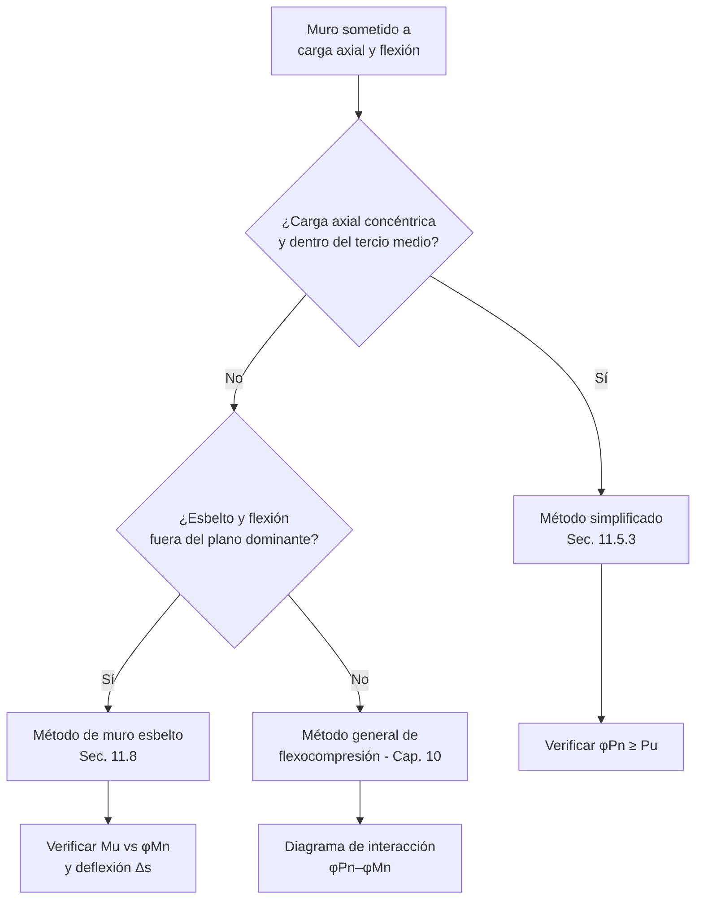

import Note from '../../components/content/Note.astro';
import Equation from '../../components/content/Equation.astro';

## Alcance

El Capítulo 11 aplica al diseño de **muros no pretensados y pretensados** que resisten
combinaciones de carga axial, cortante en el plano y fuera del plano, y flexión, incluyendo:

- Muros de carga (bearing walls) que soportan cargas gravitacionales de losas y vigas.
- Muros de corte (shear walls) que resisten fuerzas laterales de viento o sismo en su plano.
- Muros de sótano y de fundación que resisten empuje lateral del suelo (flexión fuera del
  plano).

Los muros se diseñan como **elementos de compresión** cuando resisten principalmente carga
axial con flexión (aplica también el Cap. 10), pero el Cap. 11 agrega disposiciones propias de
geometría, cortante y refuerzo distribuido. Los muros que actúan como diafragmas se rigen por
el Cap. 12, y los muros estructurales especiales sismorresistentes por la Sec. 18.10.

<Note type="info">
Conviene distinguir las dos acciones dominantes: el **cortante en el plano** (in-plane)
gobierna los muros de corte que resisten sismo o viento, mientras que la **flexión fuera del
plano** (out-of-plane) gobierna los muros de sótano y los muros esbeltos. Cada una tiene su
propio procedimiento de verificación.
</Note>

---

## Límites de diseño (Sec. 11.3)

### Espesor mínimo

Para muros no esbeltos diseñados por el **método simplificado** (Sec. 11.5.3), el espesor debe
cumplir:

<Equation label="Tabla 11.3.1.1">
$$
h \geq \max\left(100\ \text{mm},\; \frac{1}{25}\,\min(\ell_w,\, h_w)\right)
$$
</Equation>

donde $\ell_w$ es la longitud del muro y $h_w$ su altura no soportada. Para **muros exteriores
de sótano y muros de fundación** el espesor mínimo es **190 mm**.

<Note type="info">
El límite de espesor mínimo de la Tabla 11.3.1.1 sólo es obligatorio cuando se usa el método
simplificado de carga axial (Sec. 11.5.3). Si el muro se analiza con el método general de
flexocompresión del Cap. 10 o con el método de muro esbelto (Sec. 11.8), el espesor lo gobierna
la resistencia y la estabilidad, no esta tabla.
</Note>

---

## Resistencia requerida

La resistencia de diseño debe satisfacer en todas las secciones y para todas las combinaciones
de la Sec. 5.3:

$$
\phi P_n \geq P_u \qquad \phi M_n \geq M_u \qquad \phi V_n \geq V_u
$$

Las solicitaciones se obtienen con un análisis que considere los efectos fuera del plano (para
muros que reciben empuje lateral o cargas excéntricas) y los efectos de esbeltez cuando
corresponda.

---

## Resistencia axial y a flexión

Un muro puede diseñarse por dos vías:

### Método simplificado de carga axial (Sec. 11.5.3)

Aplicable a muros de sección rectangular sólida con la resultante de la carga axial dentro del
**tercio medio** del espesor ($e \leq h/6$):

<Equation label="Ec. 11.5.3.1">
$$
\phi P_n = 0.55\,\phi\,f'_c\,A_g\left[1 - \left(\frac{k\,\ell_c}{32\,h}\right)^2\right]
$$
</Equation>

con $\phi = 0.65$, $A_g$ el área bruta de la sección del muro, $\ell_c$ la altura libre
(vertical) y $h$ el espesor. El factor de longitud efectiva $k$ vale:

| Condición de restricción de los extremos | $k$ |
|------------------------------------------|:---:|
| Restringidos contra rotación en uno o ambos extremos (arriba, abajo o ambos) | 0.8 |
| No restringidos contra rotación en ambos extremos | 1.0 |
| Muros no arriostrados contra traslación lateral | 2.0 |

El término entre corchetes captura la **reducción por esbeltez** del muro a compresión.

### Método general (Cap. 10)

Cuando la excentricidad supera $h/6$ o el muro resiste flexión y carga axial combinadas
significativas, se construye el **diagrama de interacción** $P_n$–$M_n$ de la sección como en
columnas (compatibilidad de deformaciones con $\varepsilon_{cu}=0.003$ y equilibrio), y el par
$(P_u, M_u)$ debe quedar dentro de la envolvente de diseño.

---

## Resistencia a cortante en el plano (Sec. 11.5.4)

Para muros de corte, la resistencia al cortante en el plano se evalúa sobre el área
$A_{cv} = h\,\ell_w$ (espesor por longitud del muro):

<Equation label="Ec. 11.5.4.3">
$$
V_n = \left(\alpha_c\,\lambda\sqrt{f'_c} + \rho_t\,f_{yt}\right) A_{cv}
$$
</Equation>

donde $\rho_t$ es la cuantía del refuerzo horizontal y el coeficiente $\alpha_c$ depende de la
esbeltez del muro $h_w/\ell_w$:

<Equation label="Sec. 11.5.4.3">
$$
\alpha_c =
\begin{cases}
0.25 & h_w/\ell_w \leq 1.5 \\[4pt]
0.17 & h_w/\ell_w \geq 2.0 \\[4pt]
\text{interpolación lineal} & 1.5 < h_w/\ell_w < 2.0
\end{cases}
$$
</Equation>

Los muros **bajos y largos** ($h_w/\ell_w \leq 1.5$) movilizan más el mecanismo de puntal y
reciben mayor $\alpha_c$. En todos los casos la resistencia está acotada por:

<Equation label="Ec. 11.5.4.2">
$$
V_n \leq 0.66\,\sqrt{f'_c}\;A_{cv}
$$
</Equation>

con $\phi = 0.75$ para cortante. Este tope evita la falla por aplastamiento del alma del
hormigón antes de que fluya el refuerzo.

<Note type="warning" title="Refuerzo horizontal como contribución a cortante">
En la Ec. 11.5.4.3 es el refuerzo **horizontal** ($\rho_t$) el que aporta a la resistencia al
cortante en el plano, no el vertical. Esto invierte la intuición que se trae de vigas, donde el
refuerzo transversal a cortante es perpendicular al eje. En un muro de corte, las fisuras
diagonales son cosidas por las barras horizontales distribuidas en el alma.
</Note>

---

## Resistencia a cortante fuera del plano

El cortante perpendicular al plano del muro (por ejemplo, en muros de sótano que reciben empuje
de suelo) se trata como **cortante en una dirección** según el Cap. 22.5, igual que una losa o
viga ancha:

<Equation label="Cap. 22.5">
$$
V_c = 0.17\,\lambda\sqrt{f'_c}\;b_w d \qquad \phi V_n \geq V_u \quad (\phi = 0.75)
$$
</Equation>

En la mayoría de los muros de espesor normal, $\phi V_c$ por sí solo supera el cortante fuera
del plano y no se requiere refuerzo adicional por cortante.

---

## Límites de refuerzo (Sec. 11.6)

Los muros llevan **dos mallas de refuerzo distribuido**, una vertical ($\rho_\ell$) y una
horizontal ($\rho_t$), referidas al área bruta de hormigón. Cuando $V_u \leq 0.5\,\phi V_c$, las
cuantías mínimas son las de la Tabla 11.6.1:

| Tipo de barra / malla | $\rho_\ell$ mínima (vertical) | $\rho_t$ mínima (horizontal) |
|-----------------------|:-----------------------------:|:----------------------------:|
| Barras corrugadas $\leq$ Nº 16 (#5) con $f_y \geq 420$ MPa | 0.0012 | 0.0020 |
| Otras barras corrugadas | 0.0015 | 0.0025 |
| Malla electrosoldada $\leq$ W31 o D31 | 0.0012 | 0.0020 |

Cuando $V_u > 0.5\,\phi V_c$, el muro debe diseñarse para cortante en el plano según la
Sec. 11.5.4 y cumplir además $\rho_\ell$ y $\rho_t$ no menores a las de la Sec. 11.6 (con un
mínimo de $\rho_t = 0.0025$ y $\rho_\ell$ relacionado con la esbeltez según la Ec. 11.6.2).

<Equation label="Ec. 11.6.2">
$$
\rho_\ell \geq 0.0025 + 0.5\left(2.5 - \frac{h_w}{\ell_w}\right)\left(\rho_t - 0.0025\right) \geq 0.0025
$$
</Equation>

<Note type="tip" title="Vertical vs. horizontal">
La cuantía **horizontal** mínima ($0.0020$) es mayor que la **vertical** ($0.0012$) porque el
refuerzo horizontal controla la fisuración por retracción y temperatura a lo largo de muros
generalmente más largos que altos, y porque aporta a la resistencia al cortante en el plano.
</Note>

---

## Detallado del refuerzo (Sec. 11.7)

### Número de capas (Sec. 11.7.2.3)

Se requieren **dos cortinas (capas) de refuerzo**, una en cada cara, cuando:

- El espesor del muro $h > 250\ \text{mm}$, o
- El cortante en el plano $V_u > 0.17\,\lambda\sqrt{f'_c}\,A_{cv}$.

Muros más delgados y poco solicitados a cortante pueden llevar una sola capa centrada.

### Espaciamiento máximo (Sec. 11.7.2.1)

<Equation label="Sec. 11.7.2.1">
$$
s \leq \min\left(3h,\; 450\ \text{mm}\right)
$$
</Equation>

tanto para el refuerzo vertical como para el horizontal.

### Refuerzo en aberturas (Sec. 11.7.5)

Alrededor de ventanas, puertas y otras aberturas se debe colocar al menos **dos barras Nº 16
(#5)** en cada dirección, extendidas con la longitud de desarrollo más allá de la esquina de la
abertura, para controlar la fisuración diagonal que parte de las esquinas.

### Refuerzo mínimo alrededor de barras verticales

En muros donde $\rho_\ell$ excede $0.01$, o donde las barras verticales actúan como refuerzo a
compresión, deben confinarse con estribos como en columnas (Sec. 10.7.6 / Sec. 11.7.4).

---

## Método alternativo para muros esbeltos fuera del plano (Sec. 11.8)

Para muros esbeltos sometidos a flexión fuera del plano y carga axial baja
($P_u \leq 0.06\,f'_c\,A_g$), la Sec. 11.8 permite un análisis directo de segundo orden que
incluye el efecto $P\text{-}\Delta$. El momento amplificado de diseño es:

<Equation label="Ec. 11.8.3.1">
$$
M_u = M_{ua} + P_u\,\Delta_u
$$
</Equation>

donde $M_{ua}$ es el momento de primer orden (cargas laterales y excentricidad) y $\Delta_u$ la
deflexión fuera del plano en la mitad de la altura, calculada con la rigidez fisurada efectiva
$I_{cr}$. La deflexión bajo cargas de servicio $\Delta_s$ se limita a $\ell_c/150$
(Sec. 11.8.4.1) para controlar la estabilidad y el confort.

<Note type="warning" title="Condiciones del método de muro esbelto">
El método de la Sec. 11.8 sólo es válido si la sección es controlada por tracción
($\varepsilon_t \geq 0.004$), la carga axial es baja ($\leq 0.06\,f'_c A_g$) y el muro está
arriostrado en su parte superior e inferior contra desplazamiento lateral fuera del plano. Fuera
de estos límites se debe usar un análisis general de segundo orden.
</Note>

---

## Resumen de verificaciones para muros

| Verificación | Requisito |
|--------------|-----------|
| Espesor mínimo (método simplificado) | $h \geq \max(100\ \text{mm},\, \tfrac{1}{25}\min(\ell_w, h_w))$; sótano $\geq 190$ mm |
| Carga axial (método simplificado) | $\phi P_n = 0.55\,\phi f'_c A_g[1-(k\ell_c/32h)^2]$, $\phi=0.65$ |
| Flexocompresión (método general) | Punto $(P_u, M_u)$ dentro del diagrama $\phi P_n$–$\phi M_n$ (Cap. 10) |
| Cortante en el plano | $V_n = (\alpha_c\lambda\sqrt{f'_c} + \rho_t f_{yt})A_{cv} \leq 0.66\sqrt{f'_c}A_{cv}$ |
| Cortante fuera del plano | $\phi V_n \geq V_u$ como cortante en una dirección (Cap. 22.5) |
| Cuantía vertical mínima | $\rho_\ell \geq 0.0012$ (Tabla 11.6.1) |
| Cuantía horizontal mínima | $\rho_t \geq 0.0020$ (Tabla 11.6.1) |
| Número de capas | Dos cortinas si $h>250$ mm o $V_u>0.17\lambda\sqrt{f'_c}A_{cv}$ |
| Espaciamiento máximo | $s \leq \min(3h,\, 450\ \text{mm})$ |
| Refuerzo en aberturas | $\geq 2$ barras Nº 16 (#5) por dirección, desarrolladas en esquinas |
| Muro esbelto (Sec. 11.8) | $M_u = M_{ua}+P_u\Delta_u$; $\Delta_s \leq \ell_c/150$ |
