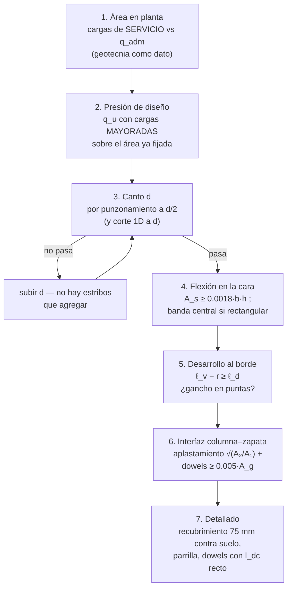

import Note from '../../components/content/Note.astro';
import Equation from '../../components/content/Equation.astro';
import Figure from '../../components/content/Figure.astro';

## La idea que organiza el capítulo

Una zapata es una **losa invertida**: la carga baja por la columna y el "apoyo" es el
suelo empujando hacia arriba, distribuido bajo toda la superficie. Con ese giro mental,
casi no hay teoría nueva — la flexión es la de una viga ancha, el punzonamiento es el de
una losa plana con la columna al revés. Lo que el capítulo aporta de propio es un **mapa
de secciones críticas**: para cada verificación, *dónde* se corta la zapata. Ese mapa, y
una regla de contabilidad de cargas que produce más errores que ninguna fórmula, son el
corazón de la nota.

<Note type="info" title="Alcance">
Fundaciones superficiales (zapatas aisladas, corridas, combinadas y losas de fundación),
**cabezales de pilotes**, pilas y muros de fundación. El diseño **geotécnico** — capacidad
de soporte, asentamientos, la presión admisible $q_{adm}$ — queda fuera de la norma: ACI
318 diseña el hormigón, y recibe la geotecnia como dato.
</Note>

---

## 1. La doble contabilidad de cargas (Sec. 13.3.1.1)

La regla que hay que grabarse antes que cualquier otra, porque mezcla dos mundos con
filosofías distintas:

| Pregunta | Cargas | Contra qué |
|---|---|---|
| **¿Qué área en planta necesito?** | de **servicio** (sin mayorar) | $q_{adm}$ del informe geotécnico |
| **¿Resiste el hormigón?** | **mayoradas** (Sec. 5.3) | $\phi R_n$ con la presión $q_u$ recalculada |

El área se dimensiona con cargas de servicio porque $q_{adm}$ ya trae su propio factor
de seguridad geotécnico — mayorar dos veces sería doble castigo. Definida el área, se
**recalcula la presión con cargas mayoradas** ($q_u = P_u/A$, más su gradiente si hay
momento) y con esa $q_u$ se verifican flexión, corte y punzonamiento.

<Note type="warning" title="El error clásico">
Usar la misma presión para las dos preguntas: verificar el hormigón con la presión de
servicio (queda insegura, ~40% abajo) o dimensionar el área con cargas mayoradas (zapata
gigante). Son dos contabilidades separadas por diseño, no por descuido.
</Note>

---

## 2. La hipótesis de presión lineal (y cuándo se rompe)

Todo el capítulo asume que la presión bajo la zapata es **lineal** (uniforme si la carga
es centrada, trapezoidal con momento). Esa no es una ley del suelo — es una consecuencia
de suponer la zapata **rígida**:

<Figure
  src="/aci318-25-cap13/rigida-flexible.svg"
  alt="Zapata rígida de canto grande que se asienta como cuerpo rígido con presión lineal, comparada con zapata flexible de vuelo largo donde la presión se concentra bajo la columna y los extremos se descargan"
  caption="La presión lineal es la firma de la zapata rígida: se asienta como un cuerpo y la estática (P, M, área) define la presión sin preguntarle al suelo. Con vuelos largos y canto chico, la zapata flecta y la presión se reorganiza hacia la columna."
/>

Una zapata aislada con proporciones normales (vuelo del orden del canto) es rígida y la
hipótesis funciona. Las **zapatas combinadas y losas de fundación** no: sus luces entre
columnas las hacen flexibles, y la distribución de presiones depende de la rigidez
relativa suelo–estructura — requieren un análisis de interacción (resortes de Winkler,
elementos finitos), no la fórmula de la escuadra. La norma lo reconoce exigiéndoles
diseño por análisis en vez de recetas (Sec. 13.3.4).

---

## 3. El mapa de secciones críticas

Con $q_u$ conocida, la zapata se verifica con **tres cortes**, cada uno en su lugar:

<Figure
  src="/aci318-25-cap13/secciones-criticas.svg"
  alt="Sección de zapata con la presión mayorada del suelo empujando hacia arriba y las tres secciones críticas marcadas: momento en la cara de la columna, corte unidireccional a distancia d, y perímetro de punzonamiento a d/2, más la longitud de desarrollo disponible hacia el borde"
  caption="El mapa completo: flexión (y desarrollo) en la cara, corte unidireccional a d, punzonamiento a d/2. Para columnas de acero con placa base, las secciones se miden a medio camino entre la cara de la columna y el borde de la placa (13.2.7.1)."
/>

**Flexión — en la cara de la columna (13.2.7.1).** El vuelo trabaja como voladizo
cargado por $q_u$ desde abajo: $M_u = q_u\,\ell_v^2/2$ por unidad de ancho, con
$\ell_v$ el vuelo desde la sección crítica. Dos casos especiales que el mapa marca:
columna de acero con placa base → la sección se mide **a medio camino entre la cara de
la columna y el borde de la placa** (la placa reparte, pero no como cuerpo rígido hasta
su borde); muro de albañilería → a medio camino entre eje y cara.

**Corte unidireccional — a distancia $d$ de la cara.** Como en cualquier elemento: la
carga aplicada a menos de $d$ de la cara viaja directo al apoyo por compresión inclinada
y no cuenta para el corte. Se verifica con el $V_c$ del corte en una dirección (Cap. 22.5)
— pero **con la ecuación que corresponde a un elemento sin estribos**:

<Equation label="Tabla 22.5.5.1(c)">
$$
V_c = \left(0.66\,\lambda_s\,\lambda\,(\rho_w)^{1/3}\sqrt{f'_c} + \frac{N_u}{6A_g}\right) b\,d
\qquad
\lambda_s = \sqrt{\frac{2}{1 + d/250}} \le 1
$$
</Equation>

<Note type="warning" title="No usar 0.17λ√f'c en zapatas">
La forma simplificada $V_c = 0.17\lambda\sqrt{f'_c}\,b\,d$ (Ec. (a) de la Tabla 22.5.5.1)
**solo es válida si $A_v \ge A_{v,min}$**. Una zapata no lleva estribos, así que cae en
$A_v < A_{v,min}$ y le corresponde la **Ec. (c)**, que incluye el factor de tamaño
$\lambda_s$ y la cuantía longitudinal $\rho_w^{1/3}$.

Esto importa justamente donde más: con $d = 250$ mm, $\lambda_s = 1$; con $d = 600$ mm,
$\lambda_s = 0.80$; con $d = 1000$ mm, $\lambda_s = 0.69$. **Cuanto más gruesa la zapata,
mayor el castigo** — y las zapatas típicas están muy por encima de los 250 mm. Usar
$0.17\lambda\sqrt{f'_c}$ en una zapata gruesa poco armada es **inseguro**, y es la
fórmula previa a ACI 318-19.
</Note>

**Punzonamiento — perímetro $b_o$ a $d/2$ de la cara (Cap. 22.6).** La losa invertida
tiene el mismo modo frágil que la losa de piso: la columna puede "ensartarse" en la
zapata a través de un tronco de cono. La verificación es en tensiones,
$v_u \leq \phi v_c$ con $\phi = 0.75$, y el $v_c$ es el menor de las tres expresiones
del punzonamiento (base $0.33\lambda_s\lambda\sqrt{f'_c}$, con castigos por columna
alargada y por perímetro grande).

<Note type="tip" title="Por qué el punzonamiento decide el canto">
Una zapata **no lleva estribos** — no hay espacio razonable para armar corte en un
elemento de 400–800 mm enterrado, y nadie los pone. Eso deja al canto como única
variable de las dos verificaciones de corte, y el punzonamiento (el corte más exigente
de los dos) es quien lo fija. El orden de diseño eficiente parte por ahí: elegir $d$
para que el punzonamiento pase, y la flexión después casi siempre acompaña. Canto
mínimo normativo: $d \geq 150$ mm sobre el suelo, $\geq 300$ mm sobre pilotes
(Sec. 13.3.1.2 / 13.4.2.1).
</Note>

---

## 4. Armadura de flexión

Con el momento en la cara, la armadura por metro es la de una viga ancha:

<Equation label="Ec. 22.2.2">
$$
M_n = A_s \cdot f_y \cdot \left(d - \frac{a}{2}\right)
\qquad
a = \frac{A_s \cdot f_y}{0.85 \cdot f'_c \cdot b}
$$
</Equation>

con $\phi = 0.90$ (las cuantías de zapata son bajas: prácticamente siempre controlada
por tracción) y el mínimo de losas, $A_{s,\min} = 0.0018\,b\,h$ para Gr 420, calculado
con el **espesor total** $h$.

### Zapatas rectangulares: la banda central (Ec. 13.3.3.3)

En la dirección corta de una zapata rectangular, el refuerzo no se reparte uniforme: la
franja cercana a la columna trabaja más que las puntas (la carga busca el camino corto).
La norma concentra una fracción del acero en una **banda central** de ancho igual al
lado menor:

<Equation label="Ec. 13.3.3.3">
$$
\gamma_s = \frac{2}{\beta + 1}
$$
</Equation>

con $\beta$ la relación lado largo / lado corto. Esa fracción $\gamma_s$ del acero total
va en la banda; el resto se reparte uniforme en las dos franjas exteriores. Con
$\beta = 1$ (cuadrada), $\gamma_s = 1$ y la regla desaparece — coherente.

### El desarrollo hacia el borde: la verificación que se olvida

Las barras se dimensionan en la sección de momento máximo (la cara), pero solo resisten
ahí si están **desarrolladas** a ambos lados. Hacia el centro sobra zapata; hacia el
borde, la longitud disponible es el vuelo menos el recubrimiento:

$$
\ell_{disponible} = \ell_v - r \geq \ell_d
$$

En zapatas pequeñas con barras gruesas, esto **no se cumple** y es la verificación que
más pasa piola: la solución es gancho estándar en las puntas (o barras más finas, que
desarrollan antes). En cabezales de pilotes cortos es la condición normal, no la
excepción.

---

## 5. Transferencia columna–zapata (Sec. 16.3 / 22.8)

La interfaz es una junta de hormigonado: la carga tiene que cruzarla explícitamente, por
dos mecanismos que se suman:

<Figure
  src="/aci318-25-cap13/transferencia.svg"
  alt="Junta columna-zapata mostrando el aplastamiento con difusión dos a uno desde el área cargada A1 hasta el área similar A2, y los dowels cruzando la interfaz con longitud de desarrollo en compresión a ambos lados"
  caption="El aplastamiento cruza la compresión; los dowels cruzan el exceso y toda la tracción. Y el detalle que engaña: el gancho inferior de los dowels no cuenta para el desarrollo en compresión — solo sirve para pararlos en obra."
/>

**Aplastamiento (Sec. 22.8):** el hormigón de la zapata, confinado por la masa que lo
rodea, recibe la compresión con resistencia aumentada:

<Equation label="Sec. 22.8.3.2">
$$
\phi P_{nb} = \phi \cdot 0.85\,f'_c\,A_1 \cdot \sqrt{\frac{A_2}{A_1}} \leq \phi \cdot 2 \cdot 0.85\,f'_c\,A_1
\qquad (\phi = 0.65)
$$
</Equation>

con $A_1$ el área cargada y $A_2$ el área geométricamente similar que cabe difundiendo
2:1 dentro de la zapata. El factor $\sqrt{A_2/A_1} \leq 2$ es el premio al confinamiento
— hasta duplicar.

**Dowels (Sec. 16.3.4.1):** al menos $0.005\,A_g$ de la columna debe cruzar la interfaz,
aunque el aplastamiento sobre. Toman el exceso de compresión, cualquier momento, y —en
el caso que gobierna en estructuras livianas— **toda la tracción de uplift**. Deben
desarrollarse a ambos lados de la junta: en compresión ($\ell_{dc}$) para el caso
gravitacional, en tracción si hay levantamiento.

<Note type="warning" title="El gancho no trabaja en compresión">
El gancho de 90° con que los dowels apoyan sobre la parrilla es **constructivo**: el
desarrollo en compresión debe cumplirse en el tramo recto vertical (la compresión se
transfiere por adherencia y apoyo de punta, y el gancho no aporta a ninguno). En
tracción sí cuenta como gancho estándar — la asimetría clásica del detallado.
</Note>

---

## 6. Cabezales de pilotes (Sec. 13.4)

El mismo mapa, con el apoyo concentrado en puntos: la "presión del suelo" se reemplaza
por las **reacciones de los pilotes**, y las secciones críticas son las mismas
(momento en cara, corte a $d$, punzonamiento a $d/2$ — ahora también alrededor de cada
pilote). Reglas propias:

- Profundidad mínima: **300 mm** sobre la cabeza de los pilotes (13.4.2.1).
- La reacción de un pilote se toma **concentrada en su centro**: si el centro cae fuera
  de la sección crítica, cuenta completo; si cae dentro, no cuenta; a caballo, se
  interpola linealmente por la fracción interceptada.
- Si el cabezal es **profundo** (la distancia columna–pilote es comparable al canto, el
  caso habitual con 2–4 pilotes), la hipótesis de secciones planas ya no describe nada:
  la carga baja por **puntales diagonales directos** de la columna a cada pilote, con la
  armadura inferior como tensor entre cabezas de pilote. La norma permite diseñarlo así
  explícitamente (método puntal-tensor, Cap. 23) — y el tensor vuelve a exigir
  **anclaje completo sobre los pilotes**, que es donde el §4 reaparece con fuerza.

---

## 7. El orden de diseño

---

## Resumen de verificaciones para zapatas

| Verificación | Requisito | Naturaleza |
|--------------|-----------|:---:|
| Área en planta | Cargas de **servicio** vs $q_{adm}$ | geotécnica — otra contabilidad |
| Presión de diseño | $q_u$ con cargas **mayoradas** sobre el área fijada | estática |
| Punzonamiento | $v_u \leq \phi v_c$ en $b_o$ a $d/2$, $\phi = 0.75$ | **frágil — decide el canto** |
| Corte unidireccional | $\phi V_c \geq V_u$ a distancia $d$ de la cara | frágil — sin estribos |
| Flexión | $\phi M_n \geq M_u$ en la cara (o media placa base), $\phi = 0.90$ | dúctil ✅ |
| Refuerzo mínimo | $0.0018\,b\,h$ (Gr 420) | protege lo dúctil |
| Banda central | $\gamma_s = 2/(\beta+1)$ en la dirección corta | reparto realista |
| Desarrollo al borde | $\ell_v - r \geq \ell_d$, si no: gancho | **la que se olvida** |
| Aplastamiento interfaz | $\phi\,0.85 f'_c A_1\sqrt{A_2/A_1}$, tope 2× | frágil — confinado |
| Dowels | $\geq 0.005\,A_g$, $\ell_{dc}$ recta a ambos lados (uplift: en tracción) | continuidad |
| Canto mínimo | $d \geq 150$ mm (suelo) / $\geq 300$ mm (sobre pilotes) | geometría |
| Recubrimiento | 75 mm hormigonado contra el suelo (Tabla 20.5.1.3) | durabilidad |
