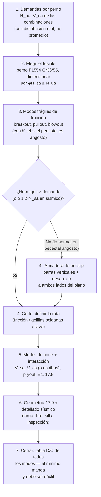

import Note from '../../components/content/Note.astro';
import Equation from '../../components/content/Equation.astro';
import Figure from '../../components/content/Figure.astro';

## El problema: llevar una fuerza del acero al hormigón

Todo anclaje es una **cadena**. La tracción de una columna baja por la placa base, entra
al perno, viaja por el vástago hasta la tuerca embebida, y desde ahí tiene que
dispersarse en el hormigón del pedestal hasta encontrar equilibrio. Cada tramo de ese
recorrido es un eslabón con su propio modo de falla, y la resistencia del anclaje es la
del **eslabón más débil** — no la del perno.

Esa es la idea que organiza todo el Capítulo 17, y la que conviene tener clara antes de
ver una sola fórmula: **diseñar un anclaje no es verificar un perno; es elegir qué
eslabón de la cadena quieres que falle primero, y proteger todos los demás.**

La respuesta a "qué eslabón" también la da el capítulo: el acero del perno, porque es el
único eslabón **dúctil**. Un perno F1554 que fluye se estira centímetros avisando y
disipando energía; un cono de hormigón que se desprende falla de golpe, sin aviso y sin
capacidad residual. Por eso los modos se separan en dos familias:

| Modo de falla | Sección | φ típico | Naturaleza |
|---|---|:---:|---|
| Acero del perno en tracción, $N_{sa}$ | 17.6.1 | 0.75 | ✅ **dúctil** |
| Breakout del hormigón en tracción, $N_{cb}$ | 17.6.2 | 0.70 | ❌ frágil |
| Pullout (extracción), $N_{pn}$ | 17.6.3 | 0.70 | ❌ frágil |
| Side-face blowout (desprendimiento lateral), $N_{sb}$ | 17.6.4 | 0.70 | ❌ frágil |
| Acero del perno en corte, $V_{sa}$ | 17.7.1 | 0.65 | ✅ dúctil |
| Breakout del hormigón en corte, $V_{cb}$ | 17.7.2 | 0.70 | ❌ frágil |
| Pryout (palanca), $V_{cp}$ | 17.7.3 | 0.70 | ❌ frágil |

Los modos frágiles no se "resuelven" poniendo más pernos — de hecho, más pernos apenas
ayudan, porque el cono de hormigón es compartido. Se resuelven con **geometría**
(embebido, distancias al borde) o, cuando la geometría no alcanza, con **armadura de
anclaje** que reemplaza al hormigón (§17.5.2.1, más abajo). Esa jerarquía es la columna
vertebral de esta nota.

<Note type="info" title="Alcance de esta nota">
Anclajes **preinstalados con cabeza** (*cast-in headed*: perno con tuerca o placa
embebida), que son los de placas base de columnas. Los post-instalados (expansión,
adhesivos) siguen la misma estructura pero con constantes del informe de calificación
del producto (ACI 355.2/355.4). Fórmulas en SI (N, mm, MPa), hormigón de peso normal
($\lambda_a = 1$) y **fisurado** — el supuesto correcto en zonas de tracción sísmica.
</Note>

---

## 1. Tracción: los cuatro modos

<Figure
  src="/aci318-25-cap17/modos-traccion.svg"
  alt="Cuatro esquemas en sección: fluencia del acero del perno, cono de breakout a 35 grados, aplastamiento local por pullout sobre la cabeza, y desprendimiento lateral side-face blowout cerca del borde"
  caption="Los cuatro modos de falla en tracción. Solo el primero es dúctil: el objetivo del diseño es que los otros tres tengan más resistencia que él."
/>

### 1.1 Acero del perno (17.6.1) — el fusible

<Equation label="Ec. 17.6.1.2">
$$
N_{sa} = A_{se,N} \cdot f_{uta}
$$
</Equation>

con $A_{se,N}$ el **área efectiva por la rosca** (menor que la bruta: 391 mm² para un
perno de 1" UNC, contra 507 mm² brutos) y $f_{uta}$ la tensión última del material,
acotada a $\min(1.9 f_{ya},\ 860\ \text{MPa})$ — el tope $1.9 f_{ya}$ garantiza que el
perno fluya antes de cortarse, que es justamente lo que lo hace fusible.

Para F1554, el material estándar de pernos de anclaje: Gr. 36 → $f_{uta} = 400$ MPa,
Gr. 55 → 517 MPa, Gr. 105 → 862 MPa. Los grados 36 y 55 califican como **elemento
dúctil** (elongación ≥ 14%, reducción de área ≥ 30%); es la razón por la que subir de
grado "porque sobra placa" puede ser contraproducente: encarece proteger los modos
frágiles sin ganar nada.

### 1.2 Breakout (17.6.2) — el que casi siempre manda

Física del modo: la tuerca embebida empuja el hormigón hacia arriba y se desprende un
**cono a ~35°** desde la cabeza hasta la superficie. La resistencia depende del hormigón
y de la profundidad embebida $h_{ef}$ — y de *nada más del perno*:

<Equation label="Ec. 17.6.2.2.1">
$$
N_b = k_c\, \lambda_a \sqrt{f'_c}\; h_{ef}^{1.5}
\qquad (k_c = 10 \ \text{para preinstalados, SI})
$$
</Equation>

El exponente 1.5 — y no 2, que daría el área del cono — refleja que la falla es de
**mecánica de fractura**: la grieta se propaga desde la cabeza y el hormigón no alcanza
su tensión de tracción en toda la superficie a la vez. Los conos grandes son
proporcionalmente menos eficientes.

Para un **grupo** de anclajes, los conos se traslapan y comparten hormigón:

<Equation label="Ec. 17.6.2.1b">
$$
N_{cbg} = \frac{A_{Nc}}{A_{Nco}}\;\psi_{ec,N}\;\psi_{ed,N}\;\psi_{c,N}\; N_b,
\qquad A_{Nco} = 9\,h_{ef}^2
$$
</Equation>

La razón $A_{Nc}/A_{Nco}$ es el corazón del cálculo de grupo: $A_{Nco}$ es la proyección
del cono de *un* anclaje aislado (un cuadrado de $3h_{ef}$ de lado) y $A_{Nc}$ la
proyección real del grupo — la caja de los pernos traccionados extendida $1.5\,h_{ef}$
por lado, **recortada por los bordes del hormigón**. Si los conos no se traslapan ni hay
bordes, la razón vale $n$ y cada perno aporta su cono completo; con pernos juntos o
bordes cerca, vale bastante menos. Los factores ψ corrigen por excentricidad de la
resultante ($\psi_{ec,N}$), cercanía al borde ($\psi_{ed,N}$) y fisuración ($\psi_{c,N}$,
1.0 fisurado).

#### El caso que hay que conocer: el pedestal angosto

En pedestales de placas base industriales, el embebido es grande (800–1200 mm) y el
pedestal es chico (600–1000 mm de lado). Entonces $1.5\,h_{ef}$ excede **todas** las
distancias al borde y el cono no cabe: la falla ya no es un cono, es el **descorche del
prisma completo** del pedestal.

<Figure
  src="/aci318-25-cap17/pedestal-angosto.svg"
  alt="Comparación: en hormigón masivo el cono de breakout se desarrolla completo con proyección 1.5 hef por lado; en un pedestal angosto las grietas salen por las caras laterales y se descorcha el prisma completo, aplicando hef reducido"
  caption="En hormigón masivo, la capacidad crece con h_ef^1.5. En un pedestal angosto la grieta sale por las caras y la profundidad deja de importar: la norma lo captura con h'_ef."
/>

La Sec. 17.6.2.1.2 lo captura con una sustitución: si el anclaje tiene 3 o más bordes a
menos de $1.5\,h_{ef}$, se reemplaza $h_{ef}$ por

<Equation label="Ec. 17.6.2.1.2">
$$
h'_{ef} = \max\left(\frac{c_{a,max}}{1.5},\ \frac{s_{max}}{3}\right)
$$
</Equation>

en **todas** las ecuaciones del modo (incluidas $A_{Nco}$ y las proyecciones). Las
consecuencias prácticas son fuertes y vale la pena internalizarlas:

- **Alargar el perno no mejora el breakout.** Con $c_{a,max} = 250$ mm, da lo mismo
  embeber 600 o 1200 mm: $h'_{ef} = 167$ mm en ambos casos. Los pernos largos de la
  práctica chilena existen por *otras* razones (ductilidad y llegar bajo la armadura,
  §4 y §5).
- **El breakout de un pedestal angosto es estructuralmente inservible.** Es habitual que
  el grupo completo dé del orden de un décimo de la capacidad del acero de los pernos.
  No es un diseño malo: es la señal de que la resistencia real debe darla la armadura
  del pedestal (§4).

### 1.3 Pullout (17.6.3) — el aplastamiento local

Si el cono no falla, la carga sigue concentrada sobre la corona de apoyo de la tuerca, y
el hormigón puede aplastarse localmente dejando que la cabeza "avance" — el perno se
extrae deslizando. Es un modo **por perno** (no de grupo) y depende solo del área de
apoyo:

<Equation label="Ec. 17.6.3.2.2">
$$
N_p = 8\, A_{brg}\, f'_c
$$
</Equation>

$A_{brg}$ es el área neta de apoyo de la cabeza (tuerca hexagonal pesada ≈ 1.16 d²). El
factor 8 refleja el enorme confinamiento del hormigón profundo. Dos observaciones de
diseño: la armadura **no** mejora este modo — solo agrandar $A_{brg}$ (planchuela
soldada o tuerca con golilla de plancha) o subir $f'_c$ — y por eso los detalles
industriales llevan **planchuela en el extremo**: es la manera barata de sacar el
pullout de la ruta crítica.

### 1.4 Side-face blowout (17.6.4) — cabeza profunda cerca del borde

Con embebido profundo y borde cercano ($c_{a1} \lt 0.4\,h_{ef}$), la presión de apoyo de
la cabeza revienta **lateralmente** la cara del pedestal antes de desarrollar el cono:

<Equation label="Ec. 17.6.4.1">
$$
N_{sb} = 13\; c_{a1} \sqrt{A_{brg}}\; \lambda_a \sqrt{f'_c} \quad [\text{N, mm}]
$$
</Equation>

con correcciones por esquina ($c_{a2} \lt 3c_{a1}$) y por grupo a lo largo del borde
(pernos a menos de $6c_{a1}$ comparten la cara). Aparece exactamente en la misma
configuración del pedestal angosto — perno largo, borde cerca — así que en placas base
industriales **siempre hay que revisarlo**, aunque rara vez controla si hay planchuela.

---

## 2. Corte: tres modos y una pregunta previa

Antes de las fórmulas, la pregunta que define todo el lado de corte: **¿por dónde pasa
realmente el corte?** Los agujeros de placa base son sobredimensionados (holguras de
8–10 mm), así que los pernos no tocan la placa hasta que algo desliza. Las rutas
posibles: fricción bajo compresión (no disponible si hay levantamiento simultáneo),
golillas soldadas que conectan pernos y placa, o una llave de corte bajo la placa. La
respuesta cambia qué verificaciones aplican — decidirla explícitamente es parte del
diseño, no un detalle de dibujo.

<Figure
  src="/aci318-25-cap17/mecanismos-corte.svg"
  alt="Planta de un pedestal con el semicono de breakout en corte proyectándose desde la fila frontal de anclajes hacia el borde libre, y sección con el mecanismo de pryout donde el hormigón salta detrás del anclaje"
  caption="Los dos modos de hormigón en corte: breakout hacia el borde libre (gobierna con bordes cercanos) y pryout hacia atrás (gobierna en anclajes cortos sin borde cerca)."
/>

### 2.1 Acero del perno (17.7.1)

<Equation label="Ec. 17.7.1.2">
$$
V_{sa} = 0.6\, A_{se,V}\, f_{uta}
$$
</Equation>

el 0.6 es la relación corte/tracción del acero. Si la placa apoya sobre **grout de
nivelación** (el caso normal), se multiplica por 0.8: la rosca trabaja en flexión sobre
el espesor del mortero. Con φ = 0.65, la capacidad de corte por perno queda en ~40% de
la de tracción.

### 2.2 Breakout en corte (17.7.2)

El perno empuja un **semicono** de hormigón hacia el borde libre. Manda la distancia al
borde en la dirección del corte, $c_{a1}$, otra vez con exponente 1.5:

<Equation label="Ec. 17.7.2.2.1">
$$
V_b = \min\left(0.6\Big(\tfrac{l_e}{d_a}\Big)^{0.2}\sqrt{d_a},\ \ 3.7\right)
\lambda_a \sqrt{f'_c}\; c_{a1}^{1.5} \quad [\text{N, mm}]
$$
</Equation>

y para el grupo, la misma lógica de áreas proyectadas que en tracción
($A_{Vc}/A_{Vco}$ con $A_{Vco} = 4.5\,c_{a1}^2$, sobre la cara lateral). En pedestales
angostos este modo da valores tan bajos como el breakout de tracción, y la salida es la
misma: estribos como armadura de anclaje (§4) o una llave de corte que lleve el corte
directo a la fundación sin pasar por los pernos.

### 2.3 Pryout (17.7.3)

El modo espejo: sin borde cerca pero con anclaje **corto y rígido**, el corte hace
palanca y desprende el cono *hacia atrás*. Reutiliza el breakout de tracción:

<Equation label="Ec. 17.7.3.1">
$$
V_{cpg} = k_{cp}\, N_{cbg} \qquad (k_{cp} = 2 \ \text{si } h_{ef} \geq 65 \text{ mm})
$$
</Equation>

En anclajes de placa base (largos) prácticamente nunca controla, pero cuesta una línea
verificarlo.

### 2.4 Interacción tracción–corte (17.8)

El mismo hormigón no puede estar al límite en los dos modos a la vez. ACI 318-25 verifica
la interacción con una **ley de potencia $5/3$**, y —esto es lo nuevo— la aplica **por
separado a los modos de hormigón y a los de acero**:

<Equation label="Ec. 17.8.2 (anclaje individual, hormigón)">
$$
\left(\frac{N_{ua}}{\phi N_{n,c}}\right)^{5/3} +
\left(\frac{V_{ua}}{\phi V_{n,c}}\right)^{5/3} \leq 1
$$
</Equation>

<Equation label="Ec. 17.8.3 (grupo, hormigón)">
$$
\left(\frac{N_{ua,g}}{\phi N_{n,cg}}\right)^{5/3} +
\left(\frac{V_{ua,g}}{\phi V_{n,cg}}\right)^{5/3} \leq 1
$$
</Equation>

donde $\phi N_{n,c}$ es el **menor** de $\phi N_{cb}$, $\phi N_a$, $\phi N_{pn}$ y
$\phi N_{sb}$, y $\phi V_{n,c}$ el menor de $\phi V_{cb}$ y $\phi V_{cp}$ (para grupos,
los homólogos $\phi N_{cbg}$, $\phi N_{ag}$, $\phi N_{sbg}$ y $\phi V_{cbg}$,
$\phi V_{cpg}$). La **Sec. 17.8.4** exige además verificar la interacción sobre la
**resistencia del acero** del anclaje más solicitado.

<Note type="warning" title="Cambió respecto a ACI 318-19">
Hasta ACI 318-19 la interacción era una **regla trilineal**: si $V_{ua} \le 0.2\phi V_n$
se permitía la tracción plena, si $N_{ua} \le 0.2\phi N_n$ el corte pleno, y en el resto
$\frac{N_{ua}}{\phi N_n} + \frac{V_{ua}}{\phi V_n} \le 1.2$. ACI 318-25 la reemplazó por
la ley de potencia $5/3$ separada por modo de falla; el comentario R17.8.1 la describe
explícitamente como **"un enfoque menos conservador"**.

En la práctica la nueva regla **es más permisiva**: un punto que antes daba
$0.58 + 0.56 = 1.14$ (uso 0.95 del límite 1.2) ahora da
$0.58^{5/3} + 0.56^{5/3} = 0.40 + 0.38 = 0.78 \le 1$.
</Note>

Es frecuente que cada modo pase individualmente y la interacción no — conviene dejarla
siempre calculada.

---

## 3. Requisitos geométricos (17.9)

Los mínimos de detallado previenen el **splitting** (agrietamiento entre anclajes o
hacia el borde durante el hormigonado y la carga): separación mínima $4\,d_a$ entre
preinstalados sin torque de instalación ($6\,d_a$ con torque), y distancia al borde
gobernada por el recubrimiento (o $6\,d_a$ con torque). Son requisitos de *detallado*,
no de resistencia: cumplirlos no exime de calcular breakout y blowout, que siguen
cayendo mientras $c_{a1} \lt 1.5\,h_{ef}$.

---

## 4. Armadura de anclaje (17.5.2.1): cuando el hormigón no da

Esta sección es la salida del laberinto, y la razón por la que los pedestales angostos
funcionan en la práctica. Si una armadura **desarrollada a ambos lados del plano de
falla** cose el cono, la norma permite **ignorar por completo** el breakout (de tracción
o de corte) y diseñar la armadura para la demanda total, con φ = 0.75:

<Equation label="Armadura de anclaje">
$$
A_{s,req} = \frac{N_{ua}}{0.75\, f_y}
$$
</Equation>

<Figure
  src="/aci318-25-cap17/armadura-anclaje.svg"
  alt="Sección de pedestal mostrando el plano de falla del cono, barras verticales desarrolladas a ambos lados del plano con sus longitudes de desarrollo, estribos superiores para el corte, y la fórmula de diseño de la armadura"
  caption="La armadura de anclaje reemplaza al cono: barras verticales junto a los pernos para la tracción, estribos superiores para el corte. El modo pasa de frágil a dúctil."
/>

Las condiciones que hacen válido el reemplazo:

1. **Tracción**: barras paralelas al perno, cerca de él (dentro de $0.5\,h_{ef}$ del
   eje; en la práctica, pegadas), con **longitud de desarrollo completa a ambos lados**
   del plano de falla — hacia arriba (gancho estándar bajo la parrilla superior suele
   ser necesario) y hacia abajo, ancladas en la fundación. En un pedestal, son las
   barras longitudinales de siempre: el cálculo consiste en *verificar* que las que hay
   bastan y se desarrollan.
2. **Corte**: estribos cerrados concentrados en la zona superior (los primeros dentro de
   ~$0.5\,c_{a1}$ de la superficie), con las ramas paralelas al corte.
3. El perno debe quedar **dentro** de la canasta de armadura — la grieta tiene que
   cruzar barras, no bordearlas.

El resultado conceptual importa más que la fórmula: con armadura de anclaje, el eslabón
frágil se convierte en fluencia de barras — **dúctil** — y la cadena completa queda
gobernada por acero. Es el mecanismo que permite cumplir la jerarquía sísmica que sigue.

---

## 5. Diseño sísmico (17.10): la jerarquía del fusible

Para la componente sísmica de la demanda en tracción, la norma obliga a elegir **una**
de cuatro rutas (17.10.5.3), que son cuatro maneras de responder "¿quién protege a los
modos frágiles?":

| Ruta | Idea | Costo |
|---|---|---|
| (a) **Fusible en el anclaje** | Los modos de hormigón resisten $1.2\,N_{sa}$ del perno dúctil, con largo de estiramiento ≥ $8\,d_a$ | La preferida; exige verificar hormigón por capacidad |
| (b) Fusible en el elemento fijado | Otro componente fluye antes (la silla, la placa) | Trasladar el problema a ese componente |
| (c) Sobrerresistencia | Diseñar el anclaje para $\Omega_0 \cdot E$ | Demandas grandes, sin ductilidad |
| (d) Capacidad del fijado | Hormigón resiste 1.2 veces lo que el elemento fijado puede entregar | Similar a (a) generalizada |

Además, si controla un modo de hormigón, su resistencia se multiplica por **0.75**
adicional (17.10.5.4) — la fisuración cíclica degrada los conos.

<Note type="tip" title="La conexión con NCh2369">
La práctica chilena industrial (NCh2369) es la ruta (a) llevada a detalle constructivo:
pernos F1554 **largos** con camisa o despegados del hormigón (largo de estiramiento
disponible en toda la caña), **silla de anclaje** o largo libre expuesto que permite
inspeccionar y recambiar pernos fluidos después del sismo, planchuela inferior (pullout
y blowout fuera de la ruta crítica), y el **corte fuera de los pernos** (llave o
fricción) para que el fusible trabaje en tracción pura. Cada elemento "raro" del detalle
chileno clásico es una respuesta directa a un modo de falla de este capítulo.
</Note>

---

## 6. El orden de diseño

Con los modos entendidos, el procedimiento completo se ordena así:

Dos hábitos que evitan los errores clásicos:

- **Calcular las capacidades de todos los modos antes de comparar con la demanda.** La
  tabla completa cuenta la historia del detalle (qué protege a qué); verificar modos
  sueltos la esconde.
- **No promediar la tracción entre pernos sin mirar el momento.** Con momento, el perno
  extremo del lado traccionado toma bastante más que $T/n$, y el breakout de grupo se
  calcula con la resultante y su excentricidad reales ($\psi_{ec,N}$).

<Note type="info" title="Próxima nota: el ejemplo aplicado">
Esta nota es la teoría ordenada. La aplicación completa — leer un detalle real de placa
base industrial (16 pernos Ø1", pedestal 800×800), calcular todos los modos, contrastar
con las reacciones de un modelo SAP2000 y emitir el veredicto de verificación — es
materia de un ejemplo trabajado aparte, donde estos números se vuelven concretos.
</Note>
