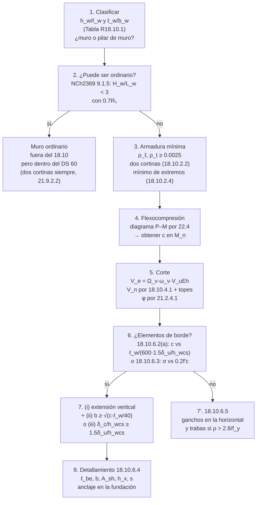

import Note from '../../components/content/Note.astro';
import Equation from '../../components/content/Equation.astro';
import Figure from '../../components/content/Figure.astro';

## El capítulo que no calcula resistencias

Todos los demás capítulos de ACI 318-25[^aci] responden la misma pregunta: *¿cuánto resiste
esto?* El Capítulo 18 responde otra: *¿cuánto se puede deformar antes de perder lo que
resiste?*

Esa diferencia explica su forma. Casi ninguna de sus disposiciones es una ecuación de
resistencia. Son **límites geométricos, cuantías mínimas, detalles de confinamiento y
amplificaciones de la demanda**. Un muro puede tener $\phi M_n$ de sobra y no cumplir el
Cap. 18; el capítulo no discute su resistencia, discute si el hormigón comprimido va a
seguir ahí después de la tercera reversión de carga.

Tres ideas lo organizan:

1. **La escala ordinario → intermedio → especial.** No son tres calidades de material:
   son tres niveles crecientes de detallamiento y proporcionamiento, con expectativas
   crecientes de capacidad de deformación.
2. **Diseño por capacidad.** Donde se espera fluencia, la demanda de corte **no es la del
   análisis lineal**: se amplifica por la sobrerresistencia real a flexión y por los
   modos superiores.
3. **Confinar donde se aplasta.** Los elementos de borde de un muro no se piden por
   resistencia, sino porque la fibra extrema comprimida va a superar una deformación
   crítica cuando el edificio se desplace 1.5 veces el desplazamiento de diseño.

<Note type="info" title="Alcance de esta nota">
El Cap. 18 tiene 86 páginas. Esta nota recorre su estructura completa pero desarrolla en
detalle solo **18.1–18.2** (el mapa) y **18.10** (muros estructurales especiales), que es
lo que ejercita el [ejemplo del muro a flexocompresión](/hormigon/ejemplo-muro-flexocompresion).
Vigas, columnas y nudos de marcos especiales (18.6–18.8) quedan resumidos.
</Note>

---

## 1. El mapa: qué le aplica a qué (Sec. 18.2.1)

Lo primero del capítulo no es una fórmula sino una asignación. La **SDC** (*Seismic Design
Category*, Sec. 4.4.6.1) decide qué partes del capítulo aplican:

| SDC | Debe cumplir |
|---|---|
| **A** | El Cap. 18 no aplica |
| **B** | 18.2.2 |
| **C** | 18.2.2, 18.2.3, 18.12.1.2 y 18.13 |
| **D, E, F** | 18.2.2 a 18.2.8, 18.12 a 18.14 y 23.11 |

Y la Sec. 18.2.1.6 mapea cada sistema a su sección:

| Sistema designado como sismorresistente | Sección aplicable |
|---|---|
| Marcos ordinarios resistentes a momento | 18.3 |
| **Muros estructurales ordinarios** | **ninguna disposición de detallamiento del Cap. 18** |
| Marcos intermedios | 18.4 |
| Muros prefabricados intermedios | 18.5 |
| Marcos especiales | 18.2.3–18.2.8 y **18.6–18.8** |
| **Muros estructurales especiales** | 18.2.3–18.2.8 y **18.10** |

Dos reglas de borde que conviene tener presentes: el Cap. 18 **gobierna sobre cualquier
otro capítulo en conflicto** (Sec. 18.2.1.2), y para SDC D a F el capítulo alcanza también
a los elementos que *no* son parte del sistema sismorresistente — los marcos
gravitacionales — vía la Sec. 18.14.

<Note type="warning" title="La línea del muro ordinario es una puerta, y en Chile está abierta">
La segunda fila de esa tabla es la disposición más rentable del capítulo: si el muro
puede clasificarse como **ordinario**, el Cap. 18 deja de pedirle detallamiento sísmico.

NCh2369:2025 **9.1.5** abre exactamente esa puerta para estructuras industriales: los
muros con razón de aspecto $H_w/L_w < 3$ cuya resistencia requerida se determine con el
sísmico horizontal amplificado por $0.7R_1 \ge 1.0$ **se pueden diseñar como muros
ordinarios**, sin satisfacer las disposiciones de muros estructurales especiales. Es el
mismo trato que la norma chilena hace en todas partes: *quien no provee ductilidad, provee
resistencia*.
</Note>

### Lo que 18.2 pide para todo sistema especial

- **18.2.3.1** — anclajes que resisten sismo en SDC C a F: Sec. 17.10 (ver
  [Cap. 17](/hormigon/aci318-25-cap17-anclajes)).
- **18.2.4.1** — los $\phi$ son los del Cap. 21, **con las modificaciones de la
  Sec. 21.2.4** (volveremos sobre esto en §4, porque el $\phi$ de corte queda acoplado a
  la amplificación).
- **18.2.5.1 / 18.2.6.1** — hormigón y acero según los requisitos de *sistemas sísmicos
  especiales* de 19.2.1 y 20.2.2. En muros especiales se permite ASTM A706 **Grados 420,
  550 y 690**; en marcos especiales solo 420 y 550 (el 690 no tiene datos suficientes).
- **18.2.8.1** — **no se permiten empalmes soldados** en marcos especiales ni en muros
  especiales, incluidas las vigas de acople. La prohibición es absoluta, no está acotada a
  las zonas de fluencia, y R18.2.8.1 aclara que alcanza **también al refuerzo transversal**.
  (Es en los sistemas *ordinarios e intermedios* donde la restricción sí se limita a las
  regiones de fluencia, vía 25.5.7.3(c).)

---

## 2. Muros estructurales especiales (Sec. 18.10): clasificar primero

Antes de calcular nada hay que saber si el elemento es un *muro* o un *pilar de muro*,
porque a los pilares se les aplican requisitos de columna. La Tabla R18.10.1 lo decide con
dos razones de aspecto — la del plano ($h_w/\ell_w$) y la de la sección horizontal
($\ell_w/b_w$):

| $h_w/\ell_w$ | $\ell_w/b_w \le 2.5$ | $2.5 < \ell_w/b_w \le 6.0$ | $\ell_w/b_w > 6.0$ |
|---|---|---|---|
| $< 2.0$ | Muro | Muro | Muro |
| $\ge 2.0$ | Pilar de muro | Pilar de muro | **Muro** |

Un muro chileno corriente de 5 m de largo y 30 cm de espesor tiene $\ell_w/b_w = 16.7$:
es un muro por la columna derecha, sin importar su esbeltez.

<Note type="warning" title="Dos alturas que no son la misma: h_w y h_wcs">
El capítulo usa **dos** símbolos de altura y los alterna deliberadamente. El Cap. 2 los
define así:

- $h_w$ — *«height of entire wall from base to top, or clear height of wall segment or wall
  pier considered»*. Es la que entra en las Secs. 18.10.2.2 y 18.10.4.1.
- $h_{wcs}$ — *«height of entire structural wall **above the critical section** for flexural
  and axial loads»*. Es la que entra en la Tabla 18.10.3.3.3 y en toda la Sec. 18.10.6.2.

En un muro en voladizo desde la fundación las dos coinciden, y por eso es fácil no notar
la diferencia. Dejan de coincidir en cuanto la sección crítica sube (un muro que arranca
sobre un subterráneo rígido, por ejemplo) o cuando se analiza un segmento entre aberturas.
El resto de esta nota respeta el símbolo que usa cada cláusula.
</Note>

---

## 3. Armadura mínima (Sec. 18.10.2)

**18.10.2.1** — las cuantías distribuidas del alma cumplen $\rho_\ell \ge 0.0025$ y
$\rho_t \ge 0.0025$, con espaciamiento $\le 450$ mm en cada dirección. Único alivio: si
$V_u \le 0.083\lambda\sqrt{f'_c}A_{cv}$, $\rho_t$ puede bajar a los valores del Cap. 11.

**18.10.2.2 — dos cortinas.** Obligatorias si $V_u > 0.17\lambda\sqrt{f'_c}A_{cv}$
**o** si $h_w/\ell_w \ge 2.0$. La razón del segundo gatillo no es el corte: es que en un
muro esbelto, una vez que la armadura vertical fluye en tracción, la zona comprimida
necesita **estabilidad lateral**, y una sola malla al centro no la da.

**18.10.4.3** — $\rho_\ell \ge \rho_t$, pero **solo si $h_w/\ell_w \le 2.0$**. En muros
esbeltos la vertical puede ser menor que la horizontal.

### El mínimo de los extremos (Sec. 18.10.2.4)

Una disposición que se olvida seguido, aplicable a muros con $h_w/\ell_w \ge 2.0$
efectivamente continuos y con una sola sección crítica:

<Equation label="Sec. 18.10.2.4(a)">
$$
\rho \ge \frac{0.5\sqrt{f'_c}}{f_y}
\qquad\text{dentro de } 0.15\,\ell_w \text{ del extremo, sobre el espesor del muro}
$$
</Equation>

(el $0.5$ en MPa equivale a $1.60$ en kgf/cm²). Esa armadura se extiende arriba y
abajo de la sección crítica **el mayor de $\ell_w$ y $M_u/3V_u$**, y no más del 50 % puede
terminarse en una misma sección.

El comentario explica el porqué, y no es resistencia: es **repartir la fisuración**. Sin
armadura suficiente en el extremo, la rótula plástica concentra su deformación en una
sola fisura y la capacidad de rotación se desploma. R18.10.2.4 agrega una advertencia
poco intuitiva: un hormigón que en obra resulte **mucho más resistente** que el de diseño
es *perjudicial* para esa distribución.

---

## 4. El corte que no es el del análisis (Sec. 18.10.3)

Aquí el capítulo hace su movimiento más característico. El comentario R18.10.3 lo dice
sin rodeos: *el corte real que experimenta un muro bajo el sismo de diseño puede ser mayor
que el del análisis lineal*. Por dos razones distintas:

- **Sobrerresistencia a flexión** ($\Omega_v$): el muro no falla cuando llega a $M_u$;
  falla cuando llega a su momento probable $M_{pr}$, con el acero a $1.25 f_y$. El corte
  que lo acompaña es proporcionalmente mayor.
- **Amplificación dinámica** ($\omega_v$): los modos superiores mueven el diagrama de
  corte hacia arriba una vez que la base plastifica.

<Equation label="Sec. 18.10.3.3.2">
$$
V_e = \Omega_v\,\omega_v\,V_{u,Eh}
$$
</Equation>

Los factores aplican **solo a la porción del corte debida al sismo horizontal** $E_h$, y
**en toda la altura del muro**, incluso bajo la sección crítica.

**Tabla 18.10.3.3.3:**

| Condición | $\Omega_v$ | $\omega_v$ |
|---|:---:|:---:|
| $h_{wcs}/\ell_w \le 1.0$ | 1.0 | 1.0 |
| $1.0 < h_{wcs}/\ell_w < 2.0$ | interpolación lineal 1.0–1.5 | 1.0 |
| $h_{wcs}/\ell_w \ge 2.0$ | **1.5** | $0.8 + 0.09\,h_n^{1/3} \ge 1.0$ |

Alternativamente se permite calcular $\Omega_v = M_{pr}/M_u$ directamente en la sección
crítica.

<Note type="warning" title="Gotcha de unidades: h_n va en pies, también en la edición SI">
El Cap. 2 define $h_n$ como *"structural height from the base to the highest level of the
seismic-force-resisting system of the structure, **ft**"*. En la edición SI de 318-25 esa
definición **sigue en pies**, porque la expresión de $\omega_v$ es empírica y quedó
calibrada en unidades inglesas. Un muro de 20 m da $h_n = 65.6$ ft y
$\omega_v = 0.8 + 0.09\cdot 65.6^{1/3} = 1.16$ — no 1.04, que es lo que sale si
uno mete los metros.
</Note>

### El φ de corte está acoplado a la amplificación (Sec. 21.2.4.1)

El Cap. 21 castiga con $\phi = 0.60$ el corte de los elementos **controlados por
corte** — aquellos cuya $V_n$ es menor que el corte que desarrolla su $M_n$. Pero
exceptúa explícitamente los muros **donde $\Omega_v \ge 1.5$** o donde se tomó
$\omega_v\Omega_v = \Omega_o$, *"porque las fuerzas de corte de diseño ya fueron
amplificadas para cubrir la sobrerresistencia flexural"*.

La consecuencia es directa: un muro esbelto ($h_{wcs}/\ell_w \ge 2.0$) hereda
$\Omega_v = 1.5$ de la tabla y con eso se verifica con $\phi = 0.75$. Un muro bajo,
que no amplifica, verifica con $\phi = 0.60$ si es controlado por corte. **Amplificar
tiene premio.**

---

## 5. Resistencia al corte (Sec. 18.10.4)

<Equation label="Ec. 18.10.4.1">
$$
V_n = \left(\alpha_c\,\lambda\sqrt{f'_c} + \rho_t\,f_{yt}\right) A_{cv}
$$
</Equation>

donde $A_{cv}$ es el **área bruta** de hormigón limitada por el espesor del alma y el
largo de la sección en la dirección del corte, y $\alpha_c = 0.25$ para $h_w/\ell_w \le 1.5$ y $\alpha_c = 0.17$ para
$h_w/\ell_w \ge 2.0$ (interpolación lineal entremedio). En kgf/cm² son $0.80$ y
$0.543$. $A_{cv}$ es el **área bruta** — no $b_w d$.

Dos topes, y aquí 318-25 estrena factor:

<Equation label="Sec. 18.10.4.4">
$$
V_n \le \alpha_{sh}\,0.66\sqrt{f'_c}\,A_{cv}
\quad\text{(suma de segmentos)},
\qquad
V_n \le \alpha_{sh}\,0.83\sqrt{f'_c}\,A_{cw}
\quad\text{(segmento individual)}
$$
</Equation>

<Equation label="Ec. 18.10.4.4">
$$
\alpha_{sh} = 0.7\left(1 + \frac{(b_w + b_{cf})\,t_{cf}}{A_{cx}}\right)^{2} \le 1.2
$$
</Equation>

donde $b_{cf}$ y $t_{cf}$ describen la **columna de borde**: en un muro tipo *barbell*,
R18.10.4 los define como el ancho de esa columna menos $b_w$, y su profundidad,
respectivamente (para muros con ala, el ancho efectivo sale de la Sec. 18.10.5.2).
$A_{cx}$ es $A_{cv}$ o $A_{cw}$ según cuál de los dos topes se esté evaluando.

<Note type="warning" title="El exponente va fuera del paréntesis">
Es un error fácil de cometer al transcribir la ecuación desde el PDF, donde el `2` queda
gráficamente cerca de $t_{cf}$. Dos comprobaciones lo resuelven: **dimensionalmente**,
$(b_w+b_{cf})t_{cf}^2/A_{cx}$ tiene unidades de longitud y no puede sumarse a un 1;
$(b_w+b_{cf})t_{cf}/A_{cx}$ sí es adimensional. Y **numéricamente**, con el cuadrado
adentro cualquier muro con ala satura el tope de 1.2 de inmediato, lo que dejaría la
fórmula sin función.
</Note>

($A_{cw}$ es el área de hormigón del **segmento vertical individual** que se verifica;
$A_{cv}$, la del conjunto que comparte la fuerza lateral.)

$\alpha_{sh}$ premia el **ala comprimida**: reconoce la mayor tensión de corte que se
alcanza antes de la falla por compresión diagonal cuando el borde tiene ala o pilastra.
No necesita tomarse menor que 1.0, y siempre se permite tomarlo igual a 1.0 — que es lo
que corresponde en un muro rectangular.

---

## 6. Elementos de borde (Sec. 18.10.6): el corazón del capítulo

La norma ofrece **dos caminos** para decidir si el borde comprimido necesita confinarse, y
son conceptualmente distintos.

### 6.1 El camino por tensiones (Sec. 18.10.6.3)

El viejo, heredado del Código de 1995. Se calculan las tensiones con **modelo lineal
elástico y sección bruta** bajo cargas mayoradas, y se exige elemento de borde especial
donde la compresión de fibra extrema supere $0.2 f'_c$; se puede discontinuar donde baje
de $0.15 f'_c$. El comentario aclara que $0.2f'_c$ es **un valor índice**, no una
descripción del estado real de tensiones.

### 6.2 El camino por desplazamientos (Sec. 18.10.6.2)

El interesante, y el que aplica a muros esbeltos ($h_{wcs}/\ell_w \ge 2.0$) continuos y
con una sola sección crítica. No mira tensiones: **compara la deriva de diseño con la
profundidad del eje neutro**.

<Equation label="Ec. 18.10.6.2a">
$$
\frac{1.5\,\delta_u}{h_{wcs}} \ge \frac{\ell_w}{600\,c}
$$
</Equation>

donde $c$ es la **mayor** profundidad de eje neutro calculada para el axial mayorado y la
resistencia nominal a flexión, en la dirección del desplazamiento de diseño, y $\delta_u$
es el **desplazamiento de diseño medido en el tope del muro** — R18.10.6.2 es explícito:
*«the design displacement in Eq. (18.10.6.2a) is taken at the top of the wall, and the wall
height is taken as the height above the critical section»*. Es decir, $\delta_u/h_{wcs}$ es
una **deriva de techo**, no una deriva de entrepiso. Reordenada, la ecuación dice cuándo
hace falta confinar:

<Equation label="Ec. 18.10.6.2a, reordenada">
$$
c \ge \frac{\ell_w}{600\,(1.5\,\delta_u/h_{wcs})}
$$
</Equation>

Y trae un piso que decide más diseños de lo que parece:

<Note type="warning" title="El piso de 0.005 sobre la deriva">
*"La razón $\delta_u/h_{wcs}$ no debe tomarse menor que 0.005."*

R18.10.6.2 explica el objetivo: exigir elementos de borde si la deformación de tracción
de la armadura de borde no alcanza aproximadamente **el doble** del límite que define
sección controlada por tracción, e imponer capacidad de deformación moderada **a los
edificios rígidos**.

El piso actúa **en un solo sentido**: sube las derivas bajas. Un edificio rígido con
deriva de techo real de 0.002 debe diseñarse *como si* tuviera 0.005, y con eso el umbral
de $c$ se divide por 2.5 — pasa de $0.556\,\ell_w$ a $0.222\,\ell_w$.

Hacia el otro lado no hay piso que valga: es la propia ecuación la que aprieta. Cuanto más
deformable es la estructura, menor es el $c$ que dispara el confinamiento, que es
exactamente lo que la física pide. Y ahí es donde el caso chileno se separa del que ACI
tuvo en mente.
</Note>

<Note type="info" title="El 0.015h de NCh2369 no se compara directo con el 0.005 de ACI">
Son dos derivas distintas y conviene no cruzarlas. El $d_{\text{máx}} = 0.015\,h$ de NCh2369 6.3
es un **desplazamiento relativo de entrepiso** —la propia cláusula define $h$ como «altura
del nivel o entre dos puntos ubicados sobre una misma línea vertical»— mientras que
$\delta_u/h_{wcs}$ es la **deriva de techo** del muro. En un voladizo la deriva de techo es
menor que la máxima de entrepiso, así que el límite chileno no se traslada 1:1 al piso de
ACI.

Lo que corresponde es entrar a la Ec. (18.10.6.2a) con la deriva de techo **que entrega el
análisis**, calculada según NCh2369 6.1 con el espectro elástico de referencia y sin
dividir por $R^*$. En estructuras industriales chilenas ese valor suele quedar
holgadamente por encima de 0.005, y con eso la verificación deja de ser un trámite.
</Note>

### 6.3 Si hacen falta: (i) y además (ii) o (iii)

La parte (b) de 18.10.6.2 es donde 318-19 introdujo —y 318-25 mantiene— la verificación
de **capacidad de deriva**. Si (a) exige elementos de borde, hay que cumplir (i) y
*además* uno de los otros dos:

- **(i)** El refuerzo transversal se extiende arriba y abajo de la sección crítica al
  menos el mayor de $\ell_w$ y $M_u/4V_u$.
- **(ii)** El atajo geométrico: $b \ge \sqrt{c\,\ell_w/40}$.
- **(iii)** La verificación completa: la **capacidad** de deriva $\delta_c$ debe superar
  1.5 veces la **demanda** $\delta_u$, ambas normalizadas por $h_{wcs}$ —
  $\delta_c/h_{wcs} \ge 1.5\,\delta_u/h_{wcs}$ — con

<Equation label="Ec. 18.10.6.2b">
$$
\frac{\delta_c}{h_{wcs}} = \frac{1}{100}\left(4 - \frac{1}{50}\left(\frac{\ell_w}{b}\right)\left(\frac{c}{b}\right) - \frac{V_e}{0.66\sqrt{f'_c}\,A_{cv}}\right)
$$
</Equation>

con la salvedad de que $\delta_c/h_{wcs}$ **no necesita tomarse menor que 0.015**.

Esta ecuación merece leerse despacio, porque no se parece a nada más en la norma. Es la
**capacidad de deriva de techo con 20 % de pérdida de resistencia lateral**, ajustada por
Abdullah y Wallace (2019)[^aw] sobre una base de ensayos de muros. Sus tres términos dicen tres
cosas físicas:

- el $4$ es la capacidad de partida, 4 % de deriva;
- $\tfrac{1}{50}(\ell_w/b)(c/b)$ la castiga por **esbeltez de la zona comprimida** — nótese
  que el espesor $b$ entra **al cuadrado**;
- $V_e/(0.66\sqrt{f'_c}A_{cv})$ la castiga por **nivel de corte**: un muro exigido en
  corte se deforma menos antes de degradarse.

<Note type="tip" title="El atajo (ii) no es una regla aparte: es la (iii) con supuestos">
R18.10.6.2 dice que la expresión de $b$ en (ii) *"se deriva de la Ec. (18.10.6.2b)
suponiendo valores de $V_u/(0.66A_{cv}\sqrt{f'_c})$ y $\delta_u/h_{wcs}$ de
aproximadamente 1.0 y 0.015"*. Se verifica: con esos supuestos, exigir
$\delta_c/h_{wcs} \ge 1.5 \cdot 0.015$ da $\ell_w c/b^2 = 37.5$, es decir
$b = \sqrt{\ell_w c/37.5} \approx \sqrt{\ell_w c/40}$.

O sea que (ii) es (iii) evaluada en el **peor caso** de corte y deriva. Si el muro está
lejos de ese peor caso, el atajo pide un espesor que la ecuación completa no pide.
</Note>

### 6.4 Detallamiento (Sec. 18.10.6.4)

Once literales, de los cuales los que dimensionan son:

| | Requisito |
|---|---|
| **(a)** | Longitud horizontal del elemento de borde $\ge \max(c - 0.1\ell_w,\; c/2)$ |
| **(b)** | Espesor $b \ge h_u/16$ ($h_u$ = altura no arriostrada de la fibra comprimida) |
| **(c)** | Si $h_w/\ell_w \ge 2.0$ **y** $c/\ell_w \ge 3/8$: $b \ge 300$ mm |
| **(d)** | En secciones con ala: incluye el ancho efectivo y penetra $\ge 300$ mm en el alma |
| **(e)** | Refuerzo transversal según 18.7.5.2(a)–(d) y 18.7.5.3, pero el espaciamiento de 18.7.5.3(a) pasa a **1/3 de la menor dimensión del elemento de borde** |
| **(f)** | $h_x \le \min(350\ \text{mm},\; \tfrac{2}{3}b)$ |
| **(g)** | $A_{sh}/(s\,b_c) \ge \max\left[0.3\left(\tfrac{A_g}{A_{ch}}-1\right)\tfrac{f'_c}{f_{yt}},\; 0.09\tfrac{f'_c}{f_{yt}}\right]$ |
| **(j)** | En la base, el refuerzo transversal penetra $\ge 300$ mm en la zapata o cabezal |
| **(k)** | La armadura horizontal del alma llega a $\le 150$ mm del extremo y desarrolla $f_y$ en la cara del núcleo confinado |

Para elemento de borde rectangular, R18.10.6.4 define $A_g = \ell_{be}\,b$ y
$A_{ch} = b_{c1}\,b_{c2}$, donde $\ell_{be}$ es la longitud del elemento de borde (la que
fija el literal (a)), $b$ su espesor, y $b_{c1}$ y $b_{c2}$ las dos dimensiones del núcleo
confinado. Ojo con estas últimas: el Cap. 2 define $b_c$ **a los bordes exteriores del
refuerzo transversal**, no centro a centro del estribo. La expresión (a) de la tabla —la que depende de
$A_g/A_{ch}$— se reinstauró en 2014 precisamente porque en **muros delgados**, donde el
recubrimiento es una fracción grande del espesor, la expresión (b) sola no confina lo
suficiente.

<Note type="info" title="Dónde falla realmente un borde de muro">
R18.10.6.4 identifica el rincón peligroso: la **inestabilidad lateral fuera del plano** es
más probable en bordes de muros planos con zonas comprimidas esbeltas y profundas —
concretamente donde $(c/b)(\ell_w/b)$ supera aproximadamente **40** — o en el borde del
alma opuesto a un ala en muros T, C o L. Es el mismo producto $(\ell_w/b)(c/b)$ que
aparece en la Ec. (18.10.6.2b); las dos disposiciones miden lo mismo.
</Note>

### 6.5 Cuando NO se requieren (Sec. 18.10.6.5)

Aun sin elemento de borde especial hay dos exigencias. La segunda es la que suele pasar
inadvertida: si la cuantía longitudinal máxima en el borde supera $2.8/f_y$ [MPa], el
borde igual necesita refuerzo transversal según 18.7.5.2(a)–(e), con el espaciamiento
vertical de la Tabla 18.10.6.5(b). Las reversiones cíclicas pandean la armadura de borde
aunque el muro no llegue a demandas altas.

---

## 7. Marcos especiales (Secs. 18.6 a 18.8), en tres líneas

- **18.6 Vigas.** Mínimo 2 barras arriba y abajo continuas; $M_n^+ \ge M_n^-/2$ en la cara
  del nudo; corte de diseño con $M_{pr}$ en ambos extremos y la gravitacional; estribos
  cerrados en la zona de rótula.
- **18.7 Columnas.** $\sum M_{nc} \ge \tfrac{6}{5}\sum M_{nb}$ — columna fuerte, viga
  débil; corte de diseño por capacidad; confinamiento por la Tabla 18.7.5.4 con los
  factores $k_f$ y $k_n$.
- **18.8 Nudos.** $V_n$ del nudo por la Tabla 18.8.4.3, con $\phi = 0.85$ (Sec.
  21.2.4.4), y anclaje de las barras de viga dentro del nudo.

---

## 8. Qué cambió en 318-25 frente a 318-19[^aci19]

| Disposición | ACI 318-19 | ACI 318-25 | Respaldo |
|---|---|---|---|
| $f'_c$ en la Ec. (18.10.4.1) | sin límite declarado sobre $\sqrt{f'_c}$ | **$f'_c \le 85$ MPa** (y también en 18.10.4.4 y 18.10.4.5) | **R18.10.4 lo declara**: *«In ACI CODE-318-19 Section 18.10.4, no limit was specified on the value of $\sqrt{f'_c}$»*, con base en Rojas-Leon et al. (2024) |
| $\omega_v$ (Tabla 18.10.3.3.3) | Función del número de pisos $n_s$: $0.9 + n_s/10$ ($n_s \le 6$); $1.3 + n_s/30 \le 1.8$ | $0.8 + 0.09\,h_n^{1/3} \ge 1.0$, con $h_n$ en **pies** | Cotejo directo con el texto de 318-19; el comentario de 318-25 no lo señala como cambio |
| Topes de $V_n$ (18.10.4.4/5) | $0.66\sqrt{f'_c}A_{cv}$ y $0.83\sqrt{f'_c}A_{cw}$ | los mismos **multiplicados por $\alpha_{sh} \le 1.2$** | Ídem: R18.10.4 explica qué hace $\alpha_{sh}$, pero no lo presenta como novedad |

Las tres son verificables contra las dos ediciones, pero conviene distinguir cuál afirma la
propia norma y cuáles salen de comparar los textos. Solo la primera viene declarada en el
comentario.

---

## 9. La capa chilena: NCh2369[^nch] y el DS 60[^ds60]

Todo lo anterior es ACI. En Chile la cadena normativa es otra: **NCh2369 9.1.1** manda
diseñar el hormigón armado según NCh430, y su comentario C9.1.1 advierte que el **DS 60
(2011)** la reemplazó y debe usarse mientras no sea derogado. El DS 60 no es un código
autónomo: **modifica ACI 318S-08 cláusula por cláusula**, y en muros especiales agrega
disposiciones que no existen en ACI y endurece otras.

| Tema | ACI 318-25 | DS 60 (sobre ACI 318S-08) | Manda |
|---|---|---|:---:|
| Dos cortinas | Si $V_u > 0.17\lambda\sqrt{f'_c}A_{cv}$ **o** $h_w/\ell_w \ge 2.0$ | **Siempre**, en todo muro sísmico (21.9.2.2) | DS 60 |
| Tope de axial | Solo $P_{n,max} = 0.80P_o$ (22.4.2.1) | **$P_u \le 0.35\,f'_c A_g$** (21.9.5.3) | DS 60 |
| Capacidad de deformación | $\delta_c/h_{wcs} \ge 1.5\,\delta_u/h_{wcs}$, Ec. (18.10.6.2b) | **$\varepsilon_c \le 0.008$** en la fibra más comprimida, Ec. (21-7a) | verificar ambas |
| Trigger del borde | $1.5\delta_u/h_{wcs} \ge \ell_w/600c$, con piso 0.005 | $c \ge \ell_w/(600\,\delta'_u/h'_w)$, **sin el 1.5 y sin piso** | ACI dispara antes |
| Longitud confinada | $\max(c-0.1\ell_w;\ c/2)$ | Ec. (21-8a), otra fórmula | verificar ambas |
| Espaciamiento vertical | 1/3 de la menor dimensión del borde | 1/2 de la menor dimensión | **ACI** |
| $h_x$ | $\min(350\ \text{mm};\ \tfrac23 b)$ | **$\min(200\ \text{mm};\ b/2)$** | **DS 60** |
| Espesor del borde | 300 mm **solo si** $c/\ell_w \ge 3/8$ | **300 mm siempre** (21.9.6.4(f)) | **DS 60** |
| Diámetros en el borde | — | $d_b \le$ dim. menor$/9$; $d_{estribo} \ge d_b/3$ (21.9.2.4) | DS 60 |

Dos de estas merecen atención especial porque **contradicen** lo que la Sec. 18.10 sugiere:
el DS 60 **declina explícitamente** el piso sobre la deriva —R21.9.6.2: *«No se considera
necesario exigir el límite inferior de 0.007 para $\delta'_u/h'_w$ como lo hace
ACI318S-08»*— y su mínimo de 300 mm en el elemento de borde **no tiene condición**, así
que en Chile ningún muro especial lleva un borde más delgado que eso.

<Note type="warning" title="El PDF del DS 60 es un escaneo">
El PDF oficial del MINVU no tiene capa de texto: `pdftotext` devuelve cero caracteres. Para
citarlo hay que leerlo visualmente (o extraer la imagen embebida de cada página). Las
cláusulas de muros están en las páginas 18 a 21.
</Note>

---

## 10. El orden de diseño de un muro especial

---

## Resumen de verificaciones — muro estructural especial

| Verificación | Referencia | Requisito | Naturaleza |
|---|---|---|:---:|
| Clasificación del segmento | Tabla R18.10.1 | $h_w/\ell_w$ y $\ell_w/b_w$ | define el camino |
| Cuantías del alma | 18.10.2.1 | $\rho_\ell,\rho_t \ge 0.0025$; $s \le 450$ mm | control de fisuras |
| Dos cortinas | 18.10.2.2 | si $V_u > 0.17\lambda\sqrt{f'_c}A_{cv}$ o $h_w/\ell_w \ge 2.0$ | estabilidad de la zona comprimida |
| Mínimo de extremos | 18.10.2.4 | $\rho \ge 0.5\sqrt{f'_c}/f_y$ en $0.15\ell_w$ | reparte la fisuración |
| Corte de diseño | 18.10.3.3 | $V_e = \Omega_v\omega_v V_{u,Eh}$ | **diseño por capacidad** |
| Resistencia al corte | 18.10.4.1 | $(\alpha_c\lambda\sqrt{f'_c}+\rho_t f_{yt})A_{cv}$ | dúctil si manda $\rho_t$ |
| Tope del alma | 18.10.4.4 | $\alpha_{sh}\,0.66\sqrt{f'_c}A_{cv}$ | **frágil — no negociable** |
| $\phi$ de corte | 21.2.4.1 | 0.75 si $\Omega_v \ge 1.5$; si no, 0.60 cuando es controlado por corte | acoplado a la amplificación |
| Flexocompresión | 18.10.5.1 | $(P_u, M_u)$ dentro del diagrama $\phi P_n$–$\phi M_n$ | frontera |
| ¿Elemento de borde? | 18.10.6.2(a) | $1.5\delta_u/h_{wcs} \ge \ell_w/600c$, con $\delta_u/h_{wcs} \ge 0.005$ | **capacidad de deformación** |
| Capacidad de deriva | 18.10.6.2(b) | $b \ge \sqrt{c\ell_w/40}$ **o** $\delta_c/h_{wcs} \ge 1.5\delta_u/h_{wcs}$ | dimensiona el espesor |
| Longitud y espesor del borde | 18.10.6.4(a)–(c) | $\ge \max(c-0.1\ell_w, c/2)$; $b \ge h_u/16$ | geometría |
| Confinamiento | 18.10.6.4(g) | Tabla 18.10.6.4(g) | evita el aplastamiento |
| Anclaje en la fundación | 18.10.6.4(j) | $\ell_d$ para $1.25f_y$; $\ge 300$ mm de estribos | continuidad de la rótula |

El ejemplo trabajado que ejercita esta nota está en
[Muro de corte a flexocompresión con elementos de borde](/hormigon/ejemplo-muro-flexocompresion).

[^aci]: American Concrete Institute, *Building Code Requirements for Structural Concrete
(ACI 318-25) and Commentary*, Farmington Hills, MI, 2025 — Cap. 18 (pp. 307–392), en
particular las Secs. 18.2.1, 18.10.2 a 18.10.6 y sus comentarios, la Tabla 18.10.3.3.3,
la Tabla 18.10.6.4(g), la Tabla 18.10.6.5(b) y la Sec. 21.2.4.1. Las expresiones citadas
corresponden a la edición SI; los coeficientes numéricos difieren de la edición oficial en
unidades pulgada-libra.

[^aci19]: American Concrete Institute, *Building Code Requirements for Structural Concrete
(ACI 318-19) and Commentary*, Farmington Hills, MI, 2019 — Tabla 18.10.3.3.3 (la expresión
de $\omega_v$ en función del número de pisos) y Sec. 18.10.4.4 (los topes de $V_n$ sin
$\alpha_{sh}$). Es la fuente de la columna «ACI 318-19» del §8; salvo el límite de
$\sqrt{f'_c}$, que R18.10.4 de 318-25 sí declara como cambio, las otras dos filas salen de
cotejar los textos de las dos ediciones.

[^nch]: Instituto Nacional de Normalización, *NCh2369:2025 — Diseño sísmico de estructuras
e instalaciones industriales*, Santiago, 2025 — cláusulas 6.1 (cálculo de desplazamientos
con el espectro elástico de referencia), 6.3 (desplazamientos sísmicos máximos) y
9.1.1/9.1.5 (diseño según NCh430 y la excepción de los muros de baja esbeltez).

[^ds60]: Ministerio de Vivienda y Urbanismo de Chile, *Decreto Supremo N° 60 (V. y U.),
Reglamento que fija los requisitos de diseño y cálculo para el hormigón armado*, 2011 —
cláusula 21.9 (muros estructurales especiales y vigas de acople), en particular 21.9.2.2,
21.9.2.4, 21.9.5.3, 21.9.5.4, 21.9.6.2 con su Ec. (21-8), y 21.9.6.4 letras (a), (c) y (f).
El DS 60 **modifica ACI 318S-08 cláusula por cláusula** y no es un código autónomo. El
comentario C9.1.1 de NCh2369 advierte que reemplazó a NCh430 y debe considerarse mientras
no sea derogado.

[^aw]: Abdullah, S. A., y Wallace, J. W., *"Drift Capacity of Reinforced Concrete
Structural Walls with Special Boundary Elements"*, ACI Structural Journal, V. 116, No. 1,
2019 — el origen de la Ec. (18.10.6.2b).
