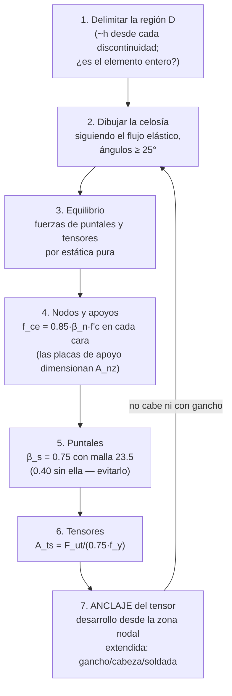

import Note from '../../components/content/Note.astro';
import Equation from '../../components/content/Equation.astro';
import Figure from '../../components/content/Figure.astro';

## La idea que organiza el capítulo

Toda la teoría de vigas descansa en una hipótesis — las secciones planas permanecen
planas — que es falsa cerca de cualquier discontinuidad: una carga concentrada, un
apoyo, una esquina, una abertura. En esas zonas el flujo de tensiones se retuerce y las
fórmulas seccionales ($M_n$, $V_c$) no describen nada. Pero el hormigón no se entera de
que perdimos la teoría: sigue sabiendo hacer lo único que sabe hacer bien —
**comprimirse en línea recta**. El método puntal-tensor toma eso en serio: en vez de
forzar fórmulas de sección, se **dibuja la celosía que el elemento quiere ser** —
puntales de hormigón comprimido, tensores de acero, nodos donde se encuentran — y se
verifica cada pieza.

La licencia para hacerlo es el **teorema del límite inferior** de la plasticidad:
cualquier celosía que (a) esté en equilibrio con las cargas y (b) no sobrepase la
resistencia de ninguna de sus piezas, es una estimación **segura** — aunque no sea el
mecanismo "exacto". Con su letra chica: el teorema asume que el material puede
redistribuirse hasta encontrar esa celosía, es decir, exige **ductilidad**. Las reglas
"raras" del capítulo (ángulo mínimo, armadura distribuida, anclajes) son el precio de
esa letra chica.

<Note type="info" title="Alcance">
Diseño de regiones de discontinuidad (regiones D): vigas altas, ménsulas y cartelas,
cabezales de pilotes, zonas de aplicación de cargas concentradas y postensado, nudos,
extremos con apoyos entallados, aberturas. Con **φ = 0.75 único** para puntales,
tensores y nodos (Tabla 21.2.1) — todo el modelo se trata como un mecanismo de corte:
frágil hasta que se demuestre lo contrario.
</Note>

---

## 1. Regiones B y D: dónde aplica

<Figure
  src="/aci318-25-cap23/b-d-regions.svg"
  alt="Viga en elevación con las regiones D sombreadas alrededor de la carga concentrada y los apoyos, extendiéndose una altura h hacia cada lado, y la región B central donde la hipótesis de secciones planas es válida"
  caption="Cada discontinuidad perturba el flujo de tensiones ~h hacia cada lado (Saint-Venant). Las regiones B se diseñan con la teoría de vigas; las D, con puntal-tensor."
/>

La frontera práctica es el principio de Saint-Venant: la perturbación de una
discontinuidad se disipa a una distancia aproximadamente igual al **canto** del
elemento. Todo lo que quede a menos de $h$ de una carga concentrada, apoyo, cambio de
sección o abertura es región D. Y hay elementos que son **pura región D** — no les queda
ninguna zona B que diseñar por secciones:

- **Vigas altas**: luz libre ≤ 4 veces el canto, o carga concentrada a menos de $2h$
  del apoyo (Sec. 9.9).
- **Ménsulas y cartelas**: $a_v/d \leq 2$ (con provisiones alternativas en la
  Sec. 16.5 para $a_v/d \leq 1$).
- **Cabezales de pilotes** con la distancia columna–pilote del orden del canto.
- Zonas de anclaje de postensado, apoyos entallados (*dapped ends*), nudos.

## 2. El método en cuatro pasos

1. **Dibujar** la celosía: puntales rectos de hormigón, tensores donde irá armadura,
   nodos en las intersecciones. Guía: seguir el flujo elástico de tensiones (las
   trayectorias de compresión son los puntales naturales).
2. **Equilibrar**: resolver la celosía como reticulado isostático — las fuerzas de cada
   pieza salen de la estática pura.
3. **Verificar** cada pieza: $\phi F_{ns} \geq F_{us}$ (puntales), $\phi F_{nt} \geq
   F_{ut}$ (tensores), $\phi F_{nn} \geq F_{un}$ (caras de nodos), con $\phi = 0.75$.
4. **Detallar**: anclar los tensores en los nodos (§5 — donde el método se gana o se
   pierde) y coser los puntales interiores con armadura distribuida.

## 3. Los modelos clásicos

<Figure
  src="/aci318-25-cap23/modelos-tipicos.svg"
  alt="Modelo puntal-tensor de una viga alta con dos puntales diagonales desde la carga a los apoyos y el tensor inferior entre ellos, y de una ménsula con el puntal diagonal hacia la columna y el tensor principal horizontal en la cara superior"
  caption="Viga alta: la carga baja directo por dos puntales y el tensor inferior impide que se abran — por eso debe anclarse completo sobre los apoyos. Ménsula: el tensor va arriba, y su anclaje en la punta es la falla típica del detalle mal resuelto."
/>

**Viga alta**: el modelo mínimo es un triángulo — dos puntales de la carga a los apoyos,
un tensor entre apoyos. Dos lecturas de diseño salen gratis del dibujo: la armadura
inferior trabaja a **fuerza constante** en toda la luz (no como en una viga esbelta,
donde acompaña al momento), así que no se puede cortar; y debe **anclarse completa sobre
los apoyos**, porque el nodo del apoyo la necesita al 100%.

**Ménsula**: el puntal baja inclinado desde la carga hacia la columna, y el equilibrio
exige un tensor **horizontal arriba** — donde la intuición de viga no pondría el acero
principal. La fuerza del tensor crece con $a_v/d$ y con cualquier tracción horizontal
$N_{uc}$ (frenado, retracción del elemento apoyado). El extremo del tensor, justo bajo
la carga, casi no tiene hormigón detrás: se ancla con **barra transversal soldada,
gancho horizontal o cabeza** — nunca fiado a la adherencia recta que no cabe.

## 4. Puntales: la botella que se hincha (23.4 / 23.5)

<Figure
  src="/aci318-25-cap23/puntales-nodos.svg"
  alt="Puntal interior con forma de botella mostrando la tracción transversal que genera al ensancharse y la armadura distribuida que la cose, junto a los tres tipos de nodo CCC, CCT y CTT con sus factores beta decrecientes"
  caption="El puntal interior se ensancha entre sus extremos y esa expansión genera tracción transversal: sin armadura que la cosa, β_s cae de 0.75 a 0.40. En los nodos, cada tensor que llega descuenta un 20% de capacidad."
/>

<Equation label="Ec. 23.4.3">
$$
F_{ns} = f_{ce} \cdot A_{cs}, \qquad f_{ce} = 0.85\,\beta_c\,\beta_s\,f'_c
$$
</Equation>

El $\beta_s$ codifica la geometría real del puntal:

| Puntal | $\beta_s$ | Por qué |
|--------|:---------:|---------|
| De borde (uniforme, junto a una cara) | 1.0 | no puede ensancharse: trabaja como prisma |
| Interior **con** armadura distribuida (23.5) | 0.75 | la botella está cosida |
| Interior **sin** armadura distribuida | 0.40 | la tracción transversal fisura el puntal por la mitad de su capacidad |

El mecanismo: un puntal interior no es un prisma — la compresión **se expande** entre
sus extremos (forma de botella), y esa expansión genera tracción transversal que raja el
puntal longitudinalmente. La armadura distribuida de la Sec. 23.5 (cuantía ≥ 0.0025
cruzando el puntal, en una o dos direcciones según el ángulo) cose esa fisura — y la
diferencia entre 0.75 y 0.40 dice cuánto vale: **casi el doble de capacidad por una
malla mínima**. En vigas altas, la Sec. 9.9 exige esa malla en ambas caras siempre.

$\beta_c$ es el factor de confinamiento (hasta 2.0 cuando el hormigón que rodea al
puntal es mucho más ancho, como en cabezales masivos) — el mismo argumento del
aplastamiento confinado.

## 5. Nodos y el anclaje del tensor (23.8 / 23.9)

<Equation label="Tabla 23.9.2">
$$
F_{nn} = f_{ce} \cdot A_{nz}, \qquad f_{ce} = 0.85\,\beta_n\,f'_c
\qquad
\beta_n = \begin{cases} 1.0 & \text{CCC (solo compresión)} \\ 0.80 & \text{CCT (un tensor)} \\ 0.60 & \text{CTT (dos o más)} \end{cases}
$$
</Equation>

La regla mnemotécnica es directa: **cada tensor que llega a un nodo le descuenta un
20%**. El tensor "tira" del nodo, le abre microfisuras transversales, y el hormigón
comprimido fisurado resiste menos — el mismo fenómeno del puntal botella, ahora en el
punto más congestionado del modelo.

<Note type="warning" title="La verificación que decide: el anclaje del tensor">
El tensor debe estar **completamente desarrollado donde su eje sale de la zona nodal
extendida** — la longitud disponible se mide desde ese punto hacia afuera, no desde el
borde del elemento. En un apoyo de viga alta o en la punta de una ménsula, esa longitud
es de 200–400 mm: casi nunca alcanza para desarrollo recto, y el diseño termina en
gancho, cabeza o barra soldada transversal. La experiencia de fallas del método está
aquí, no en los puntales: **una celosía perfecta con un tensor mal anclado es un dibujo,
no una estructura.**
</Note>

## 6. La geometría que protege la ductilidad (23.2.7)

$$
\theta \geq 25° \quad \text{entre el eje de un puntal y el de un tensor en el mismo nodo}
$$

El porqué vuelve al teorema del límite inferior: una celosía muy "aplanada" (puntal casi
paralelo al tensor) puede equilibrar las cargas en el papel, pero exige deformaciones
enormes para movilizarse — el hormigón se agota antes de llegar al estado supuesto. El
ángulo mínimo mantiene el modelo dentro de lo que el material puede redistribuir. La
misma lógica recomienda elegir modelos **cercanos al flujo elástico**: mientras menos
redistribución pida la celosía elegida, menos ductilidad consume.

---

## 7. El orden de diseño

El bucle final no es adorno: si el tensor no se puede anclar, el modelo elegido no es
construible y hay que **redibujar la celosía** (nodos más adentro, más filas de
armadura, placas de apoyo más grandes) — no forzar el anclaje.

---

## Resumen del capítulo

| Pieza | Resistencia | Factor clave | Naturaleza |
|-------|-------------|:---:|:---:|
| Puntal de borde | $0.85 \cdot 1.0 \cdot f'_c \cdot A_{cs}$ | prisma, no se hincha | frágil |
| Puntal interior armado | $0.85 \cdot 0.75 \cdot f'_c \cdot A_{cs}$ | malla 23.5 ≥ 0.0025 | frágil cosido |
| Puntal interior sin armar | $0.85 \cdot 0.40 \cdot f'_c \cdot A_{cs}$ | **evitarlo: media capacidad** | frágil |
| Tensor | $A_{ts} \cdot f_y$ | anclaje en zona nodal extendida | dúctil ✅ (si está anclado) |
| Nodo CCC / CCT / CTT | $0.85 \cdot \beta_n \cdot f'_c \cdot A_{nz}$ | 1.0 / 0.80 / 0.60 | cada tensor −20% |
| Geometría | $\theta \geq 25°$ puntal–tensor | protege la redistribución | letra chica del teorema |
| φ | **0.75 para todo** (Tabla 21.2.1) | — | el modelo completo se trata como corte |

**La jerarquía del método**: que mande el tensor (dúctil) — puntales con su malla, nodos
con sus placas de apoyo dimensionadas, y el anclaje resuelto antes de dar por bueno el
dibujo.
