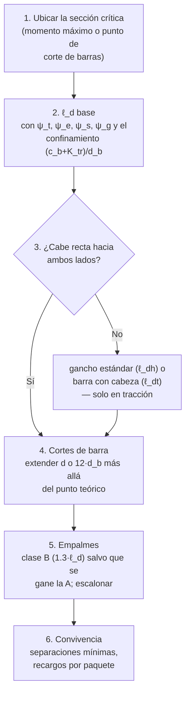

import Note from '../../components/content/Note.astro';
import Equation from '../../components/content/Equation.astro';
import Figure from '../../components/content/Figure.astro';

## La idea que organiza el capítulo

El cálculo de flexión responde *cuánto* acero se necesita en una sección. Este capítulo
responde una pregunta anterior y más básica: **¿ese acero existe ahí?** Porque una barra
no resiste donde está — resiste donde está **desarrollada**: la fuerza entra y sale de
la barra por adherencia, de a poco, a lo largo de una longitud. Una barra que cruza la
sección crítica con 100 mm de empotramiento aporta casi nada, por gruesa que sea.

Todo el capítulo — longitudes de desarrollo, ganchos, cabezas, empalmes — es la
administración de un solo hecho físico: **la transferencia de fuerza entre acero y
hormigón nunca es puntual**. Y el modo de falla que administra es frágil: una barra que
se desliza o revienta su recubrimiento no avisa ni redistribuye.

<Note type="info" title="Alcance">
Espaciamientos mínimos (25.2), ganchos estándar y su geometría (25.3), longitudes de
desarrollo en tracción, compresión, con gancho y con cabeza (25.4), empalmes por
traslape, mecánicos y soldados (25.5), paquetes de barras (25.6) y refuerzo transversal
(25.7). Es el capítulo *servidor* de la norma: todos los capítulos de elementos delegan
aquí su detallado.
</Note>

---

## 1. La física: bielas radiales y el anillo que revienta

La adherencia no es "pegamento": las **corrugas** de la barra se apoyan en el hormigón
como pequeñas cuñas, generando bielas de compresión inclinadas que salen radialmente de
la barra. La componente radial de esas bielas infla un **anillo de tracción** en el
hormigón circundante — y ese anillo es el eslabón débil:

<Figure
  src="/aci318-25-cap25/adherencia.svg"
  alt="Sección transversal de una barra con las bielas radiales de compresión que salen de las corrugas y el anillo de tracción que generan en el hormigón, con las fisuras de splitting hacia el recubrimiento; y vista longitudinal mostrando la fuerza entrando gradualmente a lo largo de la longitud de desarrollo"
  caption="Las corrugas empujan, el hormigón responde con un anillo de tracción, y la falla ocurre por donde el anillo es más débil: el recubrimiento. Por eso ℓ_d depende de c_b y de los estribos tanto como de la barra."
/>

Dos maneras de fallar, y la fórmula de la norma contiene a ambas:

- **Splitting** (recubrimiento o separación chicos): el anillo revienta hacia la
  superficie libre más cercana. Manda la distancia $c_b$ y ayuda el refuerzo transversal
  que cruza el plano de falla ($K_{tr}$).
- **Pullout** (barra muy bien confinada): el anillo aguanta y la falla es por corte del
  hormigón entre corrugas — la barra se extrae. A partir de aquí, más recubrimiento no
  ayuda: solo alargar.

## 2. Longitud de desarrollo en tracción (25.4.2)

<Equation label="Ec. 25.4.2.4a">
$$
\ell_d = \left(\frac{f_y}{1.1\,\lambda\sqrt{f'_c}} \cdot
\frac{\psi_t\,\psi_e\,\psi_s\,\psi_g}{\left(\dfrac{c_b + K_{tr}}{d_b}\right)}\right) d_b
\qquad \text{con } \frac{c_b + K_{tr}}{d_b} \leq 2.5
$$
</Equation>

La estructura de la fórmula es la física del §1: el numerador es la demanda (colgar
$f_y$ contra la resistencia a tracción del hormigón, de ahí el $\sqrt{f'_c}$); el
denominador $(c_b + K_{tr})/d_b$ es la **resistencia al splitting** — recubrimiento más
estribos, en diámetros de barra — y su tope de 2.5 es el cambio de modo: pasado ese
confinamiento, manda el pullout y nada más ayuda.

Los factores ψ, cada uno con su porqué:

| Factor | Valor | Por qué |
|--------|:-----:|---------|
| $\psi_t$ — barra superior | 1.3 si hay >300 mm de hormigón fresco debajo | el agua de exudación y el asentamiento plástico dejan una interfaz porosa bajo la barra |
| $\psi_e$ — recubrimiento epóxico | 1.5 / 1.2 | el epóxico lubrica: las corrugas resbalan en vez de apoyar |
| $\psi_s$ — barras chicas ($\leq$ Nº 19) | 0.8 | anillos de tracción proporcionalmente más robustos |
| $\psi_g$ — grado del acero | 1.0 (Gr 420) / 1.15 (Gr 550) / 1.3 (Gr 690) | más fuerza que colgar por la misma superficie |

**Órdenes de magnitud que vale la pena memorizar** (Gr 420, $f'_c = 25$ MPa, barra
inferior sin epóxico): con confinamiento óptimo (tope 2.5), $\ell_d \approx 31\,d_b$;
con confinamiento pobre ($(c_b+K_{tr})/d_b = 1.5$), $\approx 51\,d_b$; barra superior,
multiplicar por 1.3. La regla rápida de "40–60 diámetros" vive aquí.

## 3. La verificación completa: capacidad vs demanda en todo x

La consecuencia de que la fuerza entre en rampa es que cada barra tiene una **envolvente
de capacidad** a lo largo del elemento — cero en la punta, 100% a $\ell_d$ de ella — y
el diseño debe verificar que esa envolvente cubra la demanda **en todas partes**, no
solo en el máximo:

<Figure
  src="/aci318-25-cap25/desarrollo-fuerza.svg"
  alt="Viga con una barra corrida y una barra cortada, y bajo ella el diagrama que compara el momento demandado con la envolvente de capacidad de las barras, que crece en rampa a lo largo de la longitud de desarrollo desde cada punta"
  caption="La envolvente de capacidad (escalonada por los cortes de barra) debe cubrir la demanda en todo punto. Los cortes de barra se diseñan sobre este diagrama, no sobre el momento máximo."
/>

Y aquí vive la trampa clásica del **corte de barras**: la fisuración diagonal por corte
hace que la fuerza del acero en una sección corresponda al momento de una sección a
distancia ~$d$ — el diagrama de momentos efectivo está *desplazado*. La norma lo
resuelve con reglas geométricas (en vigas, Sec. 9.7.3): toda barra se extiende
**$d$ o $12\,d_b$ más allá** de su punto teórico de corte, y las que continúan deben
desarrollarse desde el punto donde las cortadas dejan de necesitarse. Cortar barras
"donde el diagrama lo permite" sin la extensión es un error con historial de fallas.

## 4. Compresión: más corta, y sin ganchos (25.4.9)

<Equation label="Ec. 25.4.9.2">
$$
\ell_{dc} = \max\left(\frac{0.24\,f_y\,\psi_r}{\lambda\sqrt{f'_c}},\ \ 0.043\,f_y\,\psi_r\right) d_b \geq 200\ \text{mm}
$$
</Equation>

Para Gr 420 y $f'_c = 25$: $\approx 20\,d_b$ — **dos tercios o menos** que en tracción.
Dos razones físicas: la compresión no abre fisuras transversales que degraden la
adherencia, y la **punta de la barra apoya** directamente contra el hormigón, sumando un
mecanismo que en tracción no existe.

<Note type="warning" title="El gancho no existe en compresión">
El gancho es un anclaje mecánico que funciona **tirando** — el codo aplasta el hormigón
de su interior. Empujando, no aporta nada, y la norma no permite contarlo para
$\ell_{dc}$. El gancho inferior de los dowels y arranques de columna es constructivo
(apoyar la barra en la parrilla); el desarrollo en compresión debe cumplirse en el tramo
recto. Es la asimetría más traicionera del detallado.
</Note>

## 5. Ganchos y cabezas: cuando la barra no cabe recta

### Ganchos estándar (25.3 / 25.4.3)

Cuando no hay espacio para $\ell_d$ recta (bordes de zapata, nudos exteriores, extremos
de muro), el gancho reemplaza adherencia por **apoyo mecánico**: el codo aplasta el
hormigón dentro de la curva.

<Figure
  src="/aci318-25-cap25/ganchos-empalmes.svg"
  alt="Gancho estándar de 90 grados con su sección crítica, el aplastamiento del hormigón dentro del codo y la extensión de 12 diámetros; y un traslape con las bielas diagonales entre las dos barras y las clases A y B de longitud"
  caption="Izquierda: el gancho ancla aplastando el hormigón interior del codo — y ℓ_dh crece con d_b^1.5, así que rinde cada vez menos con barras gruesas. Derecha: el traslape son dos desarrollos cosidos por bielas, con el doble de fuerza radial en la misma zona."
/>

<Equation label="Ec. 25.4.3.1">
$$
\ell_{dh} = \left(\frac{f_y\,\psi_e\,\psi_r\,\psi_o\,\psi_c}{23\,\lambda\sqrt{f'_c}}\right) d_b^{1.5}
\;\geq\; \max(8\,d_b,\ 150\ \text{mm})
$$
</Equation>

El exponente **1.5** es el dato para la intuición: la fuerza crece con $d_b^2$ pero la
capacidad del codo no la acompaña — los ganchos de barras gruesas rinden
proporcionalmente menos (para φ25, Gr 420, $f'_c=25$: $\ell_{dh} \approx 460$ mm ≈
$18\,d_b$; para φ36 ya va en $\approx 22\,d_b$). Los factores $\psi_o$ (ubicación y
confinamiento) y $\psi_c$ (resistencia del hormigón) castigan el mismo modo de falla:
el **splitting lateral** del plano del gancho. Geometría estándar: extensión de
$12\,d_b$ tras el codo en ganchos de 90°, $4\,d_b \geq 65$ mm en los de 180°, diámetro
interior de doblado $6\,d_b$ hasta el Nº 25.

### Barras con cabeza (25.4.4)

La versión compacta del gancho: una cabeza forjada o roscada que ancla por apoyo
directo, con $\ell_{dt}$ también proporcional a $d_b^{1.5}$. Útil donde ni el gancho
cabe (nudos congestionados); requiere área de cabeza mínima ($4\,A_b$ neta) y tiene
límites de $f'_c$ y diámetro.

## 6. Empalmes (25.5)

### Traslape en tracción

Un traslape son **dos desarrollos superpuestos**: la fuerza sale de una barra y entra a
la otra a través de bielas diagonales entre ambas — el doble de fuerza radial en la
misma zona de hormigón, más una concentración de fisuras en los extremos del empalme.
De ahí el recargo:

| Clase | Longitud | Condición |
|-------|:--------:|-----------|
| **A** | $1.0\,\ell_d$ | $A_{s,provisto} \geq 2\,A_{s,requerido}$ en el tramo **y** ≤ 50% del acero empalmado dentro del largo del traslape |
| **B** | $1.3\,\ell_d$ | Todo lo demás — **el caso normal** |

(mínimo 300 mm). La clase A hay que *ganársela* con las dos condiciones a la vez; en la
práctica, asumir clase B y **escalonar los empalmes** — que además de habilitar la
discusión de clase, evita alinear todas las secciones débiles en el mismo plano.

### Compresión, mecánicos y soldados

- **Traslape en compresión** (25.5.5): $0.071\,f_y\,d_b$ para $f_y \leq 420$ →
  $30\,d_b$ para Gr 420, mínimo 300 mm. Nótese que es *más largo* que $\ell_{dc}$: el
  empalme paga la transferencia doble.
- **Mecánicos o soldados** (25.5.7): deben desarrollar al menos **125% de $f_y$** de la
  barra — el 25% extra garantiza que, si algo fluye, sea la barra y no el empalme
  (fluencia repartida, no concentrada en un dispositivo).
- **Barras mayores a φ36 no se traslapan**: solo empalme mecánico o soldado. El
  splitting de un traslape de φ43 no es controlable con recubrimientos normales.

## 7. Reglas de convivencia (25.2 / 25.6)

- **Separación libre mínima** entre barras paralelas: $\max(25\ \text{mm},\ d_b,\
  4/3\,d_{agg})$ — las dos primeras por adherencia (cada barra necesita su anillo de
  hormigón), la tercera para que el árido pase al hormigonar.
- **Paquetes** (25.6): hasta 4 barras actuando como unidad; el desarrollo de cada barra
  se recarga **+20%** (3 barras) o **+33%** (4 barras) — el paquete tiene menos
  perímetro de adherencia por barra que las barras sueltas.

---

## 8. El orden de verificación

---

## Resumen del capítulo

| Situación | Regla | Orden de magnitud (Gr 420, G25) |
|-----------|-------|:---:|
| Desarrollo en tracción | Ec. 25.4.2.4a con $(c_b+K_{tr})/d_b \leq 2.5$ | 31–51 $d_b$ (×1.3 si superior) |
| Desarrollo en compresión | Ec. 25.4.9.2, **solo tramo recto** | ~20 $d_b$ |
| Gancho estándar | $\ell_{dh} \propto d_b^{1.5}$, ext. $12\,d_b$ (90°) | ~18 $d_b$ (φ25) — empeora con el diámetro |
| Barra con cabeza | $\ell_{dt} \propto d_b^{1.5}$, cabeza $\geq 4A_b$ | similar al gancho, sin la patilla |
| Corte de barras | Extender $d$ o $12\,d_b$ tras el punto teórico | el diagrama "desplazado" |
| Traslape tracción | Clase B = $1.3\,\ell_d$ (A = $1.0$ solo si sobra acero y ≤50%) | escalonar siempre |
| Traslape compresión | $0.071\,f_y\,d_b \geq 300$ mm | ~30 $d_b$ |
| Empalme mecánico/soldado | $\geq 1.25\,f_y$ | protege la fluencia repartida |
| Barras > φ36 | Sin traslape: solo mecánico o soldado | splitting incontrolable |
| Separación libre | $\geq \max(25, d_b, 4/3\,d_{agg})$ mm | cada barra con su anillo |
| Paquetes | +20% (3 barras) / +33% (4) al desarrollo | menos perímetro por barra |
