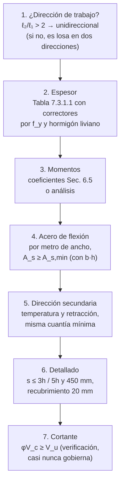

import Note from '../../components/content/Note.astro';
import Equation from '../../components/content/Equation.astro';
import Figure from '../../components/content/Figure.astro';

## La idea que organiza el capítulo

Una losa unidireccional es una **viga ancha de 1 m** — esa es toda su teoría de
resistencia. Lo que hace interesante al Capítulo 7 es otra cosa: es el capítulo donde la
norma resuelve casi todo **por tabla** (espesor, cuantías mínimas, espaciamientos), y
donde el trabajo real del diseñador está en dos preguntas previas al cálculo:

1. **¿En qué dirección trabaja?** — la pregunta que decide si este capítulo aplica.
2. **¿Qué pasa en la dirección que "no trabaja"?** — donde vive el refuerzo de
   temperatura y retracción, el más olvidado y el que más fisuras evita.

### ¿Por qué una losa apoyada en cuatro bordes trabaja en una sola dirección?

Porque la carga no se reparte por geometría sino por **rigidez**: cada franja de losa
compite por llevarse la carga, y la rigidez de una franja cae con la cuarta potencia de
su luz. Basta una relación de luces de 2 para que la franja corta sea $2^4 = 16$ veces
más rígida y se lleve el 94% de la carga:

<Figure
  src="/aci318-25-cap7/direccion-trabajo.svg"
  alt="Dos plantas de losa: con relación de luces mayor a 2 la carga viaja casi completa en la dirección corta y la losa se diseña como unidireccional; con relación menor o igual a 2 ambas direcciones compiten en rigidez y la losa es bidireccional"
  caption="La carga viaja por el camino más rígido, y la rigidez cae con la luz a la cuarta. Sobre ℓ₂/ℓ₁ = 2, la dirección larga transporta tan poco que se ignora — y su acero pasa a ser el de temperatura y retracción."
/>

De ahí el criterio del alcance: relación de luces mayor a 2 → unidireccional (este
capítulo); menor o igual a 2 → bidireccional (Cap. 8 de la norma). Las losas apoyadas
directamente sobre el suelo quedan fuera (Cap. 13).

---

## 1. Espesor mínimo (Tabla 7.3.1.1)

Para losas que **no soportan ni están unidas a elementos susceptibles de dañarse por
deflexiones**, el espesor de tabla permite omitir el cálculo de deflexiones:

| Condición de apoyo | Espesor mínimo $h$ |
|--------------------|:------------------:|
| Simplemente apoyada | $\ell_n / 20$ |
| Un extremo continuo | $\ell_n / 24$ |
| Ambos extremos continuos | $\ell_n / 28$ |
| Ménsula (voladizo) | $\ell_n / 10$ |

con $\ell_n$ la **luz libre**. Valores para $f_y = 420$ MPa; para otros:

<Equation label="Ec. 7.3.1.1">
$$
h_{\min} = h_{\text{tabla}} \cdot \left(0.4 + \frac{f_y}{700}\right)
$$
</Equation>

El corrector por $f_y$ tiene su porqué: con acero de mayor fluencia se pone menos
armadura trabajando a mayor tensión → deformaciones mayores en servicio → la misma losa
flecta más, y la tabla lo compensa con más espesor.

<Note type="info">
Para hormigón liviano ($w_c$ entre 1440 y 1840 kg/m³) los espesores se multiplican por
el mayor de $(1.65 - 0.0003\,w_c)$ y 1.09 (Sec. 7.3.1.1.1) — menos módulo elástico, más
flecha.
</Note>

---

## 2. Flexión: la viga ancha

La resistencia por metro de ancho es la de una viga rectangular:

<Equation label="Ec. 22.2.2">
$$
M_n = A_s \cdot f_y \cdot \left(d - \frac{a}{2}\right)
\qquad
a = \frac{A_s \cdot f_y}{0.85 \cdot f'_c \cdot b}
$$
</Equation>

con $\phi = 0.90$ para secciones controladas por tracción ($\varepsilon_t \geq \varepsilon_{ty} + 0.003$; para Grado 420, $0.005$ —
en losas, con sus cuantías bajas, prácticamente siempre). Para $M_u$ y $V_u$ se admiten
los **coeficientes simplificados** de la Sec. 6.5 cuando se cumplen sus condiciones
(cargas uniformes, dos vanos mínimo, luces similares, $L \leq 3D$).

En cortante, la losa rara vez necesita nada: $\phi V_c$ con el espesor de tabla suele
sobrar, y de hecho no hay dónde poner estribos cómodamente en 15 cm.

---

## 3. Refuerzo mínimo de flexión (Tabla 7.6.1.1)

| Acero | $f_y$ (MPa) | $A_{s,\min}$ |
|-------|:-----------:|:-------------|
| ASTM A615 Gr 280 | 280 | $0.0020 \cdot b \cdot h$ |
| ASTM A615/A706 Gr 420 | 420 | $0.0018 \cdot b \cdot h$ |
| ASTM A615 Gr 550 | 550 | $\dfrac{0.0018 \times 420}{f_y} \cdot b \cdot h \geq 0.0014\,bh$ |

<Note type="warning" title="$h$ vs $d$ en refuerzo mínimo">
$A_{s,\min}$ se calcula con el espesor total $h$, **no** con el peralte efectivo $d$ —
el punto clásico de confusión al venir de vigas (donde el mínimo usa $b_w d$). La razón:
este mínimo no viene del argumento de flexión sino directamente de las cuantías de
retracción y temperatura, que trabajan sobre la sección completa.
</Note>

---

## 4. Temperatura y retracción (Sec. 7.6.4): la dirección que "no trabaja"

El hormigón se acorta al secarse y con los ciclos térmicos, y la losa **no está libre**:
muros, vigas y columnas la sujetan. Acortamiento impedido = tracción = fisuras — que
aparecen perpendiculares a la dirección larga, justamente donde el análisis de flexión
dice que "no pasa nada". El refuerzo de temperatura y retracción, perpendicular al
principal y con las mismas cuantías mínimas de la Tabla 7.6.1.1, no resiste cargas: 
**reparte esa fisuración inevitable** en muchas fisuras capilares en vez de pocas
grietas visibles. No requiere cálculo de resistencia; requiere no olvidarse de él.

<Note type="tip" title="Losas unidireccionales apoyadas en los cuatro bordes">
En losas que trabajan en una dirección por relación de luces ($\ell_2/\ell_1 > 2$) pero
están apoyadas en los cuatro bordes, el refuerzo "de temperatura" en la dirección larga
además recoge los momentos secundarios reales de esa dirección (el 6% que el diseño
ignora) — otra razón para respetar su espaciamiento máximo.
</Note>

---

## 5. Espaciamientos máximos (Sec. 7.7.2) y recubrimiento

<Equation label="Sec. 7.7.2.1 / 7.7.2.3">
$$
s_{\text{flexión}} \leq \min(3h,\; 450\,\text{mm})
\qquad
s_{\text{temperatura}} \leq \min(5h,\; 450\,\text{mm})
$$
</Equation>

Los límites de espaciamiento son control de fisuración y de carga concentrada: una barra
cada 3 espesores garantiza que cualquier fisura (o rueda, o pie) encuentre acero cerca.

**Recubrimiento** (Tabla 20.6.1.3): 20 mm para barras hasta No. 11 en losas no expuestas
a la intemperie ni en contacto con el suelo, medido a la cara de la barra más cercana.

---

## 6. El orden de diseño

---

## Resumen de verificaciones para losas unidireccionales

| Verificación | Requisito | Naturaleza |
|--------------|-----------|:---:|
| Dirección de trabajo | $\ell_2/\ell_1 > 2$ → este capítulo | clasificación |
| Espesor mínimo | Tabla 7.3.1.1 o cálculo de deflexión (Cap. 24) | servicio |
| Resistencia a flexión | $\phi M_n \geq M_u$ con $\phi = 0.90$ | dúctil ✅ |
| Refuerzo mínimo | Tabla 7.6.1.1 (con $b \cdot h$) | protege lo dúctil |
| Temperatura y retracción | Ídem mínimo, dirección perpendicular | fisuración impedida |
| Espaciamiento flexión | $s \leq \min(3h,\, 450\,\text{mm})$ | fisuración |
| Espaciamiento temperatura | $s \leq \min(5h,\, 450\,\text{mm})$ | fisuración |
| Cortante | $\phi V_c \geq V_u$ (sin estribos) | rara vez controla |
| Recubrimiento | 20 mm para barras ≤ No. 11 en ambiente interior | durabilidad |
