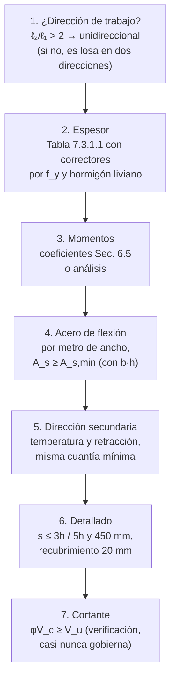

import Note from '../../components/content/Note.astro';
import Equation from '../../components/content/Equation.astro';
import Figure from '../../components/content/Figure.astro';

## La idea que organiza el capítulo

Una losa unidireccional es una **viga ancha de 1 m** — esa es toda su teoría de
resistencia. Lo que hace interesante al Capítulo 7 es otra cosa: es el capítulo donde la
norma resuelve casi todo **por tabla** (espesor, cuantías mínimas, espaciamientos), y
donde el trabajo real del diseñador está en dos preguntas previas al cálculo:

1. **¿En qué dirección trabaja?** — la pregunta que decide si este capítulo aplica.
2. **¿Qué pasa en la dirección que "no trabaja"?** — donde vive el refuerzo de
   temperatura y retracción, el más olvidado y el que más fisuras evita.

### ¿Por qué una losa apoyada en cuatro bordes trabaja en una sola dirección?

Porque la carga no se reparte por geometría sino por **rigidez**: cada franja de losa
compite por llevarse la carga, y la rigidez de una franja cae con la cuarta potencia de
su luz. Basta una relación de luces de 2 para que la franja corta sea $2^4 = 16$ veces
más rígida y se lleve el 94% de la carga:

<Figure
  src="/aci318-25-cap7/direccion-trabajo.svg"
  alt="Dos plantas de losa: con relación de luces mayor a 2 la carga viaja casi completa en la dirección corta y la losa se diseña como unidireccional; con relación menor o igual a 2 ambas direcciones compiten en rigidez y la losa es bidireccional"
  caption="La carga viaja por el camino más rígido, y la rigidez cae con la luz a la cuarta. Sobre ℓ₂/ℓ₁ = 2, la dirección larga transporta tan poco que se ignora — y su acero pasa a ser el de temperatura y retracción."
/>

De ahí el criterio del alcance: relación de luces mayor a 2 → unidireccional (este
capítulo); menor o igual a 2 → bidireccional (Cap. 8 de la norma). Las losas apoyadas
directamente sobre el suelo quedan fuera (Cap. 13).

---

## 1. Espesor mínimo (Tabla 7.3.1.1)

Para losas que **no soportan ni están unidas a elementos susceptibles de dañarse por
deflexiones**, el espesor de tabla permite omitir el cálculo de deflexiones:

| Condición de apoyo | Espesor mínimo $h$ |
|--------------------|:------------------:|
| Simplemente apoyada | $\ell_n / 20$ |
| Un extremo continuo | $\ell_n / 24$ |
| Ambos extremos continuos | $\ell_n / 28$ |
| Ménsula (voladizo) | $\ell_n / 10$ |

con $\ell_n$ la **luz libre**. Valores para $f_y = 420$ MPa; para otros:

<Equation label="Ec. 7.3.1.1">
$$
h_{\min} = h_{\text{tabla}} \cdot \left(0.4 + \frac{f_y}{700}\right)
$$
</Equation>

El corrector por $f_y$ tiene su porqué: con acero de mayor fluencia se pone menos
armadura trabajando a mayor tensión → deformaciones mayores en servicio → la misma losa
flecta más, y la tabla lo compensa con más espesor.

<Note type="info">
Para hormigón liviano ($w_c$ entre 1440 y 1840 kg/m³) los espesores se multiplican por
el mayor de $(1.65 - 0.0003\,w_c)$ y 1.09 (Sec. 7.3.1.1.1) — menos módulo elástico, más
flecha.
</Note>

---

## 2. Flexión: la viga ancha

La resistencia por metro de ancho es la de una viga rectangular:

<Equation label="Ec. 22.2.2">
$$
M_n = A_s \cdot f_y \cdot \left(d - \frac{a}{2}\right)
\qquad
a = \frac{A_s \cdot f_y}{0.85 \cdot f'_c \cdot b}
$$
</Equation>

con $\phi = 0.90$ para secciones controladas por tracción ($\varepsilon_t \geq \varepsilon_{ty} + 0.003$; para Grado 420, $0.005$). Y esto
no es una opción sino un requisito: la Sec. 7.3.3.1 **exige** que las losas sean controladas por
tracción — con las cuantías bajas de una losa, se cumple prácticamente siempre. Para $M_u$ y
$V_u$ se admiten los **coeficientes simplificados** de la Sec. 6.5 cuando se cumplen sus cinco
condiciones (prismático, cargas uniformes, $L \leq 3D$, dos vanos mínimo, luces que no difieran
más de 20 %); los momentos así obtenidos **no se redistribuyen** (Sec. 6.5.3).

En cortante, la losa rara vez necesita nada: sin estribos ($A_v < A_{v,\min}$) rige la fila (c)
de la Tabla 22.5.5.1, con el factor de tamaño $\lambda_s$ y la cuantía longitudinal, y el
espesor de tabla suele sobrar — de hecho no hay dónde poner estribos cómodamente en 15 cm. Pero
ojo: esa expresión, introducida en 318-19, entrega en una losa de cuantía mínima cerca de la
**mitad** del $0.17\lambda\sqrt{f'_c}\,b_w d$ de las ediciones anteriores.

---

## 3. Refuerzo mínimo de flexión (Sec. 7.6.1.1)

Un valor único, sin tabla:

<Equation label="Sec. 7.6.1.1">
$$
A_{s,\min} = 0.0018\,A_g
$$
</Equation>

<Note type="warning" title="h vs d en refuerzo mínimo">
$A_{s,\min}$ se calcula con el espesor total $h$, **no** con el peralte efectivo $d$ —
el punto clásico de confusión al venir de vigas (donde el mínimo usa $b_w d$). La razón:
este mínimo no viene del argumento de flexión sino directamente de las cuantías de
retracción y temperatura de la Sec. 24.4.3.2, que trabajan sobre la sección completa
(R7.6.1.1 lo dice explícitamente).
</Note>

<Note type="info" title="Qué cambió en 318-25">
Ediciones anteriores daban este mínimo en una **tabla por grado de acero**, que permitía
reducir la cuantía para $f_y > 420$ MPa. ACI 318-25 la eliminó, en flexión (7.6.1.1) y en
retracción y temperatura (24.4.3.2). El comentario R24.4.3.2 explica el porqué: *«la mecánica
de la fisuración sugiere que una mayor tensión de fluencia no aporta ningún beneficio al
control de la fisuración»*. Con acero de grado alto ya no se ahorra malla.
</Note>

---

## 4. Temperatura y retracción (Sec. 7.6.4): la dirección que "no trabaja"

El hormigón se acorta al secarse y con los ciclos térmicos, y la losa **no está libre**:
muros, vigas y columnas la sujetan. Acortamiento impedido = tracción = fisuras — que
aparecen perpendiculares a la dirección larga, justamente donde el análisis de flexión
dice que "no pasa nada". El refuerzo de temperatura y retracción, perpendicular al
principal y con la misma cuantía de $0.0018$ (Sec. 24.4.3.2, a la que remite 7.6.4.1), no
resiste cargas: **reparte esa fisuración inevitable** en muchas fisuras capilares en vez de
pocas grietas visibles. No requiere cálculo de resistencia; requiere no olvidarse de él.

<Note type="tip" title="Losas unidireccionales apoyadas en los cuatro bordes">
En losas que trabajan en una dirección por relación de luces ($\ell_2/\ell_1 > 2$) pero
están apoyadas en los cuatro bordes, el refuerzo "de temperatura" en la dirección larga
además recoge los momentos secundarios reales de esa dirección (el 6% que el diseño
ignora) — otra razón para respetar su espaciamiento máximo.
</Note>

---

## 5. Espaciamientos máximos (Sec. 7.7.2) y recubrimiento

Acá conviene no ir de memoria. En losas **no pretensadas**, el espaciamiento del acero de
flexión **no** es el $3h$ que uno recuerda: la Sec. 7.7.2.2 lo remite a la Tabla 24.3.2, es
decir al control de fisuración, que depende de la tensión de servicio del acero $f_s$ (se
permite tomar $f_s = \tfrac{2}{3}f_y$, Sec. 24.3.2.1) y del recubrimiento $c_c$:

<Equation label="Tabla 24.3.2">
$$
s_{\text{flexión}} \leq \min\left[380\left(\frac{280}{f_s}\right) - 2.5\,c_c,\;\; 300\left(\frac{280}{f_s}\right)\right]
$$
</Equation>

Para Grado 420 con $f_s = 280$ MPa y $c_c = 20$ mm eso da **300 mm**. El $\min(3h, 450)$ existe,
pero es la Sec. 7.7.2.3 y aplica a losas pretensadas con tendones no adheridos.

El de retracción y temperatura vive en el Cap. 24:

<Equation label="Sec. 24.4.3.3">
$$
s_{\text{temperatura}} \leq \min(5h,\; 450\,\text{mm})
$$
</Equation>

Los límites de espaciamiento son control de fisuración y de carga concentrada: una barra
cada pocos centímetros garantiza que cualquier fisura (o rueda, o pie) encuentre acero cerca.

**Recubrimiento** (Tabla 20.6.1.3): 20 mm para barras hasta No. 11 en losas no expuestas
a la intemperie ni en contacto con el suelo, medido a la cara de la barra más cercana.

---

## 6. El orden de diseño

```mermaid
flowchart TD
    A["1. ¿Dirección de trabajo?<br/>ℓ₂/ℓ₁ > 2 → unidireccional<br/>(si no, es losa en dos direcciones)"] --> B["2. Espesor<br/>Tabla 7.3.1.1 con correctores<br/>por f_y y hormigón liviano"]
    B --> C["3. Momentos<br/>coeficientes Sec. 6.5<br/>o análisis"]
    C --> D["4. Acero de flexión<br/>por metro de ancho,<br/>A_s ≥ A_s,min (con b·h)"]
    D --> E["5. Dirección secundaria<br/>temperatura y retracción,<br/>misma cuantía mínima"]
    E --> F["6. Detallado<br/>s ≤ 3h / 5h y 450 mm,<br/>recubrimiento 20 mm"]
    F --> G["7. Cortante<br/>φV_c ≥ V_u (verificación,<br/>casi nunca gobierna)"]
```

---

## Resumen de verificaciones para losas unidireccionales

| Verificación | Requisito | Naturaleza |
|--------------|-----------|:---:|
| Dirección de trabajo | $\ell_2/\ell_1 > 2$ → este capítulo | clasificación |
| Espesor mínimo | Tabla 7.3.1.1 **solo** si no soporta elementos dañables; si no, deflexión calculada (7.3.2.1 → 24.2) | servicio |
| Resistencia a flexión | $\phi M_n \geq M_u$ con $\phi = 0.90$ | dúctil ✅ |
| Sección controlada por tracción | $\varepsilon_t \geq 0.005$ (7.3.3.1) | exigido, no opcional |
| Refuerzo mínimo | $0.0018\,A_g$ (7.6.1.1, con $b \cdot h$) | protege lo dúctil |
| Temperatura y retracción | Ídem $0.0018$ (24.4.3.2), dirección perpendicular | fisuración impedida |
| Espaciamiento flexión | Tabla 24.3.2 (300 mm para Gr 420 y $c_c$ = 20 mm) | fisuración |
| Espaciamiento temperatura | $s \leq \min(5h,\, 450\,\text{mm})$ (24.4.3.3) | fisuración |
| Cortante | $\phi V_c \geq V_u$, Tabla 22.5.5.1(c) sin estribos | rara vez controla |
| Recubrimiento | 20 mm para barras ≤ No. 11 en ambiente interior | durabilidad |

<Note type="tip" title="Un ejemplo trabajado de este capítulo">
El [ejemplo de losa unidireccional continua](/hormigon/ejemplo-losa-unidireccional) recorre esta
tabla completa sobre tres tramos de 4,50 m, y muestra que en una losa de oficinas corriente el
espesor no lo fija ninguna de las verificaciones de resistencia sino la deflexión — y que las
cinco secciones críticas terminan armadas con el mínimo.
</Note>
