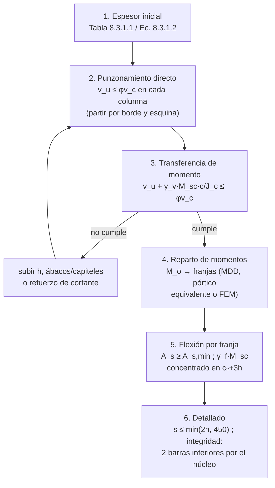

import Note from '../../components/content/Note.astro';
import Equation from '../../components/content/Equation.astro';
import Figure from '../../components/content/Figure.astro';

## La pregunta que organiza el capítulo

Una losa plana es una placa continua sostenida por **puntos**: toda la carga de un paño
— decenas de toneladas — tiene que salir por el área de una columna. Eso plantea las dos
preguntas del capítulo, y conviene notar que son de naturaleza opuesta:

1. **¿Cómo se reparte el momento?** — un problema de estática, *tolerante*: la losa es
   hiperestática y dúctil en flexión, redistribuye, y el reparto exacto entre franjas
   importa menos de lo que parece.
2. **¿Cómo entra la carga a la columna?** — el **punzonamiento**, un problema *frágil e
   intolerante*: un cono de hormigón alrededor de la columna que falla de golpe, sin
   aviso, sin redistribución posible.

La segunda pregunta es la que gobierna el diseño: en losas planas, **el espesor lo
decide el punzonamiento**, no la flexión. Todo el capítulo se lee mejor con esa
jerarquía en mente: la flexión es dúctil y perdona; el cono no.

<Note type="info" title="Alcance">
Losas no pretensadas y pretensadas en **dos direcciones**: macizas sobre vigas en todos
los bordes, planas sobre columnas (*flat plates*), planas con ábacos o capiteles
(*flat slabs*) y nervadas en dos direcciones (reticulares). Una losa trabaja en dos
direcciones cuando la relación de luces (mayor a menor) es $\leq 2$; sobre ese valor la
dirección corta se lleva prácticamente toda la carga y se diseña como unidireccional
(Cap. 7 de la norma).
</Note>

---

## 1. Espesor mínimo: la variable de diseño

En una losa plana casi no hay más variables que el espesor — no hay alma que ensanchar
ni estribos cómodos que agregar. Las tablas de espesor mínimo permiten omitir el cálculo
de deflexiones, pero en la práctica fijan el punto de partida de un espesor que después
el punzonamiento (§4–§5) confirma o sube.

### Losas sin vigas interiores (Tabla 8.3.1.1)

| Sistema | Sin ábacos | Con ábacos |
|---------|:----------:|:----------:|
| Paños exteriores sin vigas de borde | $\ell_n / 30$ | $\ell_n / 33$ |
| Paños exteriores con vigas de borde | $\ell_n / 33$ | $\ell_n / 36$ |
| Paños interiores | $\ell_n / 33$ | $\ell_n / 36$ |

con $\ell_n$ la luz libre en la dirección larga y los valores para $f_y = 420$ MPa
(otros $f_y$: multiplicar por $0.8 + f_y/1400$). Mínimos absolutos: 125 mm sin ábacos,
100 mm con ábacos.

### Losas con vigas en todos los bordes (Sec. 8.3.1.2)

Con vigas de rigidez relativa $\alpha_{fm} > 2.0$ (promedio de las vigas del perímetro
del paño):

<Equation label="Ec. 8.3.1.2">
$$
h = \frac{\ell_n \left(0.8 + \dfrac{f_y}{1400}\right)}{36 + 9\beta}
$$
</Equation>

con $\beta$ la relación entre luces libres larga y corta. Para
$0.2 \lt \alpha_{fm} \leq 2.0$ el denominador es $36 + 5\beta(\alpha_{fm}-0.2)$ (con
$h \geq 125$ mm); para $\alpha_{fm} \leq 0.2$ las vigas son tan flexibles que rige la
Tabla 8.3.1.1 — la losa "no se entera" de que existen.

---

## 2. El reparto de momentos: la estática no se negocia

Antes de los métodos, el hecho que los ordena a todos: en cada dirección, la suma de
momentos positivos y negativos de un vano está **fijada por la estática** y ningún
método puede cambiarla — solo repartirla:

<Equation label="Ec. 8.10.3.2">
$$
M_o = \frac{q_u \, \ell_2 \, \ell_n^2}{8}
$$
</Equation>

el mismo $q\ell^2/8$ de la viga simplemente apoyada, aplicado a la franja completa de
ancho $\ell_2$ (con $\ell_n \geq 0.65\,\ell_1$).

<Figure
  src="/aci318-25-cap8/franjas.svg"
  alt="Planta de un paño con las franjas de columna y central señaladas, y el diagrama de momentos del vano interior con el reparto 0.65 Mo negativo y 0.35 Mo positivo, más la ecuación del momento estático total"
  caption="El momento estático total M_o es estática pura: los métodos solo deciden el reparto (0.65/0.35 en vano interior) y cuánto va a cada franja. Por eso los distintos métodos de análisis conducen a diseños parecidos."
/>

Los momentos se concentran donde la losa es más rígida — sobre las columnas — y de ahí
la división en **franjas de columna** (ancho $\ell/4$ a cada lado del eje, con
$\ell = \min(\ell_1, \ell_2)$) que toman la mayor parte del momento negativo, y
**franjas centrales** con el resto. Para calcular el reparto la norma admite:

- **Método directo de diseño** (Sec. 8.10) — porcentajes tabulados, válido bajo sus
  limitaciones (tres vanos mínimo por dirección, paños rectangulares con relación
  $\leq 2$, cargas uniformes con $L \leq 2D$, etc.).
- **Pórtico equivalente** — la estructura como pórticos por dirección.
- **Elementos finitos** o métodos elásticos/plásticos.

El resultado tolera aproximación porque la losa en flexión es dúctil: si una franja
queda algo corta, fluye, redistribuye y la vecina toma la diferencia. El contraste con
el §4 no puede ser mayor.

---

## 3. Flexión, mínimos y espaciamientos

Cada franja se arma para su momento como una viga rectangular de ancho unitario:

<Equation label="Ec. 22.2.2">
$$
M_n = A_s \cdot f_y \cdot \left(d - \frac{a}{2}\right)
\qquad
a = \frac{A_s \cdot f_y}{0.85 \cdot f'_c \cdot b}
$$
</Equation>

con $\phi = 0.90$ para secciones controladas por tracción ($\varepsilon_t \geq 0.005$).

**Refuerzo mínimo (Sec. 8.6.1.1)** — coincide con las cuantías de retracción y
temperatura de la Tabla 24.4.3.2, sobre el **espesor total** $h$:

| Acero | $f_y$ (MPa) | $A_{s,\min}$ |
|-------|:-----------:|:-------------|
| ASTM A615 Gr 280 | 280 | $0.0020 \cdot b \cdot h$ |
| ASTM A615/A706 Gr 420 | 420 | $0.0018 \cdot b \cdot h$ |
| ASTM A615 Gr 550 | 550 | $\dfrac{0.0018 \times 420}{f_y} \cdot b \cdot h \geq 0.0014\,bh$ |

<Note type="warning" title="$h$ vs $d$ en refuerzo mínimo">
$A_{s,\min}$ se calcula con el espesor total $h$, **no** con el peralte efectivo $d$ —
punto frecuente de confusión al venir de vigas, donde el mínimo usa $b_w d$.
</Note>

**Espaciamiento máximo (Sec. 8.7.2.2)**: $s \leq \min(2h,\ 450\ \text{mm})$ en las
secciones críticas — más estricto que el $3h$ de las losas unidireccionales, porque
alrededor de las columnas el momento se concentra y las fisuras hay que repartirlas en
más barras.

---

## 4. Punzonamiento: el cono frágil (Sec. 22.6)

La física del modo: alrededor de la columna, el corte ya no es "en una dirección" — la
carga converge radialmente y la falla es un **tronco de cono** que atraviesa la losa a
unos 26–45°. La losa literalmente se ensarta en la columna. Es una falla frágil: al
formarse el cono, la losa pierde el apoyo completo de golpe.

<Figure
  src="/aci318-25-cap8/punzonamiento.svg"
  alt="Sección de losa y columna con el cono de punzonamiento atravesando la losa y el perímetro crítico a d/2 de la cara, y planta mostrando el perímetro crítico b_o alrededor de la columna con la verificación en tensiones"
  caption="El cono de punzonamiento y su idealización: la verificación se hace en tensiones sobre un perímetro vertical b_o a d/2 de la cara de la columna — el promedio razonable de un cono inclinado."
/>

La norma idealiza el cono como una superficie vertical en el **perímetro crítico**
$b_o$, a $d/2$ de la cara del apoyo (el promedio de la inclinación real), y verifica en
**tensiones**:

$$
v_u \leq \phi\, v_c \qquad \phi = 0.75
$$

Para losas sin refuerzo de cortante, $v_c$ es el menor de tres expresiones — y las tres
son la misma idea con tres correcciones distintas:

<Equation label="Tabla 22.6.5.2">
$$
v_c = \min
\begin{cases}
0.33\,\lambda_s\,\lambda\sqrt{f'_c} \\[4pt]
0.17\left(1 + \dfrac{2}{\beta}\right)\lambda_s\,\lambda\sqrt{f'_c} \\[4pt]
0.083\left(2 + \dfrac{\alpha_s d}{b_o}\right)\lambda_s\,\lambda\sqrt{f'_c}
\end{cases}
$$
</Equation>

- La primera es el caso base: $0.33\sqrt{f'_c}$, el doble del corte unidireccional,
  porque el confinamiento radial alrededor de la columna ayuda.
- La segunda castiga **columnas alargadas** ($\beta$ = relación de lados): en los
  extremos largos del perímetro el comportamiento degenera a corte unidireccional y el
  promedio baja.
- La tercera castiga **perímetros grandes respecto de $d$** ($\alpha_s$ = 40 interior,
  30 borde, 20 esquina): en columnas de borde y esquina el perímetro se recorta y pierde
  el confinamiento de sus vecinos.
- $\lambda_s = \sqrt{2/(1+0.004d)} \leq 1$ es el **efecto de tamaño**: las losas gruesas
  fallan a tensiones menores — las fisuras más anchas degradan el engranaje de áridos.

Si $v_u$ supera $\phi v_c$, las salidas en orden de costo habitual: aumentar $h$ o $d$,
ábacos/capiteles (agrandan $b_o$ justo donde hace falta), o refuerzo de cortante
(estribos o *headed studs*, que además vuelven el modo más dúctil).

---

## 5. Transferencia de momento losa-columna (Sec. 8.4.2.3)

Cuando el nudo transfiere momento desbalanceado $M_{sc}$ (vanos desiguales, cargas
asimétricas, sismo), ese momento viaja por **dos caminos simultáneos**, y la norma
obliga a diseñar ambos:

<Figure
  src="/aci318-25-cap8/transferencia-momento.svg"
  alt="Dos paneles: la fracción gamma f del momento se transfiere por flexión concentrando el acero en la franja efectiva c2 más 3h, y la fracción gamma v por corte excéntrico que suma una distribución lineal de tensiones sobre el perímetro crítico"
  caption="γ_f·M_sc va por flexión (acero concentrado en c₂+3h) y γ_v·M_sc por corte excéntrico (tensiones sumadas al punzonamiento). El segundo camino es el que suele gobernar el espesor."
/>

<Equation label="Ec. 8.4.2.3.2">
$$
\gamma_f = \frac{1}{1 + \dfrac{2}{3}\sqrt{\dfrac{b_1}{b_2}}}
\qquad
\gamma_v = 1 - \gamma_f
$$
</Equation>

con $b_1$, $b_2$ las dimensiones del perímetro crítico paralela y perpendicular al
momento. En un nudo cuadrado, $\gamma_f = 0.60$: el 60% va por flexión — con el acero
**concentrado** en la franja efectiva $c_2 + 3h$ — y el 40% restante por **corte
excéntrico**: una distribución lineal de tensiones sobre el perímetro crítico que se
suma al punzonamiento directo:

$$
v_u = \frac{V_u}{b_o d} \pm \frac{\gamma_v\, M_{sc}\, c}{J_c} \leq \phi\, v_c
$$

<Note type="warning" title="La verificación que suele decidir">
El término $\gamma_v M_{sc} c/J_c$ es la razón por la que las columnas de **borde y
esquina** — con menos perímetro y más momento desbalanceado — gobiernan el espesor de la
losa antes que las interiores, aunque carguen menos. Verificar siempre el nudo exterior
antes de dar por bueno el espesor.
</Note>

---

## 6. Integridad estructural: el cinturón post-falla (Sec. 8.7.4.2)

El punzonamiento es frágil y la norma lo sabe: además de verificarlo, exige un plan para
*cuando ocurra*. Al menos **dos barras inferiores en cada dirección deben pasar
continuas por el núcleo de la columna** (o anclarse en los apoyos exteriores). Si un
nudo punzona, la losa cae unos centímetros y queda **colgada** de esas barras en
catenaria, en vez de desencadenar el colapso progresivo del piso completo — el
mecanismo de las fallas históricas que motivaron la regla.

Es el patrón de la norma frente a lo frágil: primero resistencia, después una segunda
línea de defensa que no depende de la primera.

---

## 7. El orden de diseño

El orden no es cosmético: el punzonamiento va **antes** que la flexión porque es quien
decide el espesor, y cambiar el espesor rehace todo lo demás.

---

## Resumen de verificaciones para losas bidireccionales

| Verificación | Requisito | Naturaleza |
|--------------|-----------|:---:|
| Espesor mínimo | Tabla 8.3.1.1 (planas) o Ec. 8.3.1.2 (con vigas) | servicio |
| Punzonamiento directo | $v_u \leq \phi v_c$ en $b_o$ a $d/2$, $\phi = 0.75$ | **frágil — gobierna h** |
| Transferencia de momento | $v_u + \gamma_v M_{sc} c/J_c \leq \phi v_c$; $\gamma_f M_{sc}$ en $c_2+3h$ | **frágil — suele decidir** |
| Análisis de momentos | $M_o = q_u \ell_2 \ell_n^2/8$ → MDD, pórtico equivalente o FEM | estática — tolerante |
| Resistencia a flexión | $\phi M_n \geq M_u$ con $\phi = 0.90$ | dúctil ✅ |
| Refuerzo mínimo | Tabla 24.4.3.2 (con $b \cdot h$) | protege lo dúctil |
| Espaciamiento | $s \leq \min(2h,\, 450\,\text{mm})$ | fisuración |
| Integridad estructural | 2 barras inferiores continuas por el núcleo (Sec. 8.7.4) | **post-falla** |
| Recubrimiento | 20 mm para barras ≤ No. 11 en ambiente interior (Tabla 20.5.1.3) | durabilidad |
