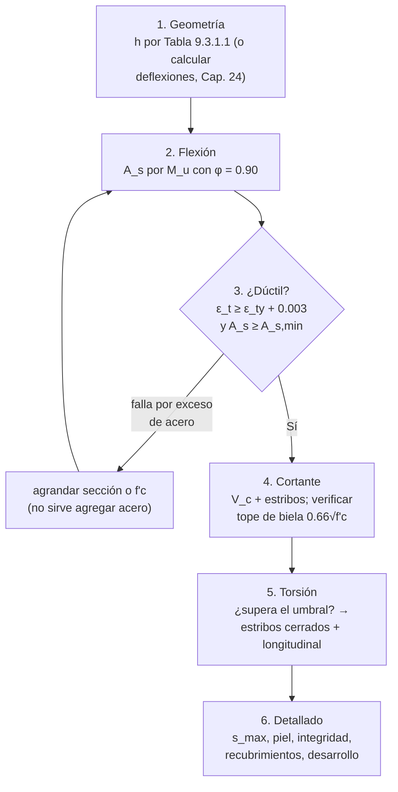

import Note from '../../components/content/Note.astro';
import Equation from '../../components/content/Equation.astro';
import Figure from '../../components/content/Figure.astro';

## La decisión que organiza el capítulo

Una viga de hormigón armado puede fallar de dos maneras: el **acero fluye** — la viga se
agrieta, se deforma a la vista, avisa durante meses — o el **hormigón se aplasta** — la
falla es súbita, sin aviso y sin capacidad residual. Todo el Capítulo 9 está construido
para forzar la primera y prohibir la segunda: **diseñar una viga es decidir dónde y cómo
fluye.**

Esa única decisión aparece tres veces con tres disfraces distintos, y conviene
reconocerla en cada uno:

| Requisito | Sección | Qué evita |
|---|---|---|
| Deformación mínima $\varepsilon_t \geq \varepsilon_{ty} + 0.003$ | 9.3.3.1 | Que el hormigón se aplaste antes de que el acero fluya (falla frágil *por exceso* de acero) |
| Refuerzo mínimo $A_{s,\min}$ | 9.6.1 | Que la viga falle al abrirse la primera fisura (falla frágil *por falta* de acero) |
| Jerarquía flexión–corte ($\phi = 0.90$ vs $0.75$, estribos mínimos, topes de $V_s$) | 9.6.3 / 22.5 | Que el corte — que no fluye — gobierne antes que la flexión |

Ese lente — **proteger lo frágil, hacer fluir lo dúctil** — ordena todo lo que sigue:
los modos frágiles no se "verifican y ya", se sacan de la ruta crítica.

<Note type="info" title="Alcance">
Vigas no pretensadas y pretensadas, incluyendo vigas de pórticos y de sistemas de losas
con vigas, vigas compuestas (con la Sec. 16.4) y viguetas (Sec. 9.8). Se diseñan para
**flexión**, **cortante** y, cuando corresponde, **torsión** y carga axial. La resistencia
requerida sale de las combinaciones de la Sec. 5.3: $\phi M_n \geq M_u$, $\phi V_n \geq V_u$,
$\phi T_n \geq T_u$ en todas las secciones.
</Note>

---

## 1. Flexión: el mecanismo antes que la fórmula

En la sección fisurada, el par resistente lo forman el acero traccionado y un bloque de
compresión en el hormigón. La distribución real de compresiones es curva; la norma la
reemplaza por el **bloque rectangular equivalente** ($0.85 f'_c$ sobre una profundidad
$a = \beta_1 c$), calibrado para reproducir la resultante y su posición:

<Equation label="Ec. 22.2.2">
$$
M_n = A_s \cdot f_y \cdot \left(d - \frac{a}{2}\right)
\qquad
a = \frac{A_s \cdot f_y}{0.85 \cdot f'_c \cdot b}
$$
</Equation>

La segunda ecuación es solo equilibrio horizontal (tracción = compresión), y dice algo
útil: **más acero → bloque más profundo → eje neutro más abajo**. Guardar esa cadena,
porque es la que conecta la cantidad de acero con la ductilidad.

### 1.1 Las tres zonas de φ

En el instante de la resistencia nominal, el hormigón está en $\varepsilon_{cu} = 0.003$
y la geometría del triángulo de deformaciones fija cuánto se estiró el acero extremo:
$\varepsilon_t = 0.003\,(d_t - c)/c$. Ese número — no la cuantía, no el momento — es el
que la norma usa para clasificar la falla y asignar φ:

<Figure
  src="/aci318-25-cap9/zonas-deformacion.svg"
  alt="Sección de viga con su triángulo de deformaciones, y gráfico de φ en función de la deformación del acero extremo mostrando las tres zonas: compresión-controlada con φ 0.65, transición, y tracción-controlada con φ 0.90 donde deben diseñarse las vigas"
  caption="La Tabla 21.2.2 en una figura: φ no premia la precisión del cálculo, premia el modo de falla. La cadena completa: menos acero → c más chico → ε_t más grande → falla más dúctil → φ más alto."
/>

| Clasificación | $\varepsilon_t$ | $\phi$ |
|---------------|:---------------:|:------:|
| Controlada por compresión | $\leq \varepsilon_{ty}$ | 0.65 (estribos) / 0.75 (zunchos) |
| Transición | $\varepsilon_{ty} \lt \varepsilon_t \lt \varepsilon_{ty}+0.003$ | interpolación lineal |
| Controlada por tracción | $\geq \varepsilon_{ty}+0.003$ | 0.90 |

con $\varepsilon_{ty} = f_y/E_s$ ($\approx 0.0021$ para Gr 420, de donde sale el límite
familiar de 0.005).

<Note type="warning" title="Las vigas no pueden vivir en transición (Sec. 9.3.3.1)">
Para vigas con carga axial menor que $0.10 f'_c A_g$, la zona de transición está
**prohibida**: deben ser controladas por tracción. No es una penalización de φ, es un
requisito. En la práctica equivale a acotar el eje neutro a $c/d_t \leq 0.375$ (Gr 420) —
y es el **límite máximo de acero** del capítulo, impuesto por ductilidad y no por una
cuantía tabulada.
</Note>

---

## 2. Refuerzo mínimo: la otra falla frágil (Sec. 9.6.1)

El límite máximo evita la falla frágil por *exceso* de acero. El mínimo evita la
opuesta, menos intuitiva: una viga con muy poco acero resiste **más antes de fisurarse
que después**. El hormigón traccionado aporta $M_{cr}$; al abrirse la primera fisura esa
contribución desaparece de golpe, y si el acero no alcanza a tomarla, la viga falla en
ese instante — frágil, con el acero rompiéndose de una vez.

<Figure
  src="/aci318-25-cap9/refuerzo-minimo.svg"
  alt="Curva momento-deflexión mostrando la rama elástica hasta Mcr y las dos ramas posteriores: con acero bajo el mínimo la resistencia cae bajo Mcr y la falla es frágil; con As mínimo la sección fisurada sigue subiendo hasta la fluencia dúctil"
  caption="A_s,min garantiza que M_n ≥ M_cr: la fisuración debe ser un evento en la vida de la viga, no el final."
/>

<Equation label="Ec. 9.6.1.2">
$$
A_{s,\min} = \max\left(
\frac{0.25\sqrt{f'_c}}{f_y}\, b_w d
\; ,\;
\frac{1.4}{f_y}\, b_w d
\right)
$$
</Equation>

Los dos términos son el mismo requisito en rangos distintos: el primero escala con
$\sqrt{f'_c}$ igual que el módulo de rotura (hormigones más resistentes se fisuran a
momentos mayores y piden más acero mínimo); el segundo es el piso para hormigones
corrientes. Y la excepción de la Sec. 9.6.1.3 — no se exige $A_{s,\min}$ si el acero
provisto supera en un tercio al requerido por análisis — es coherente con el mecanismo:
si ya hay margen sobre la demanda real, el salto de la fisuración está cubierto.

---

## 3. Espesor mínimo (Tabla 9.3.1.1)

Para vigas que no soportan ni están unidas a elementos susceptibles de dañarse por
deflexiones, la tabla permite **omitir el cálculo de deflexiones** — es un subrogante de
rigidez, no un requisito de resistencia:

| Condición de apoyo | Altura mínima $h$ |
|--------------------|:------------------:|
| Simplemente apoyada | $\ell / 16$ |
| Un extremo continuo | $\ell / 18.5$ |
| Ambos extremos continuos | $\ell / 21$ |
| Ménsula (voladizo) | $\ell / 8$ |

Los valores aplican para $f_y = 420$ MPa y hormigón de densidad normal; para otros $f_y$
se multiplican por $(0.4 + f_y/700)$, y para hormigón liviano aplica la Sec. 9.3.1.1.1.

<Note type="info">
A diferencia de las losas (Cap. 7), la tabla de vigas usa la **luz $\ell$** de la
Sec. 9.3.1.1, no la luz libre $\ell_n$.
</Note>

---

## 4. Cortante: la viga fisurada es una celosía

Cuando las fisuras diagonales se abren, la viga deja de ser un sólido y pasa a trabajar
como una **celosía**: el hormigón entre fisuras forma bielas comprimidas a ~45°, el
acero longitudinal es el cordón traccionado, la cabeza comprimida el cordón superior, y
los estribos son los **montantes traccionados** que cierran el circuito. Casi todas las
reglas de cortante del capítulo se leen directamente de esa imagen:

<Figure
  src="/aci318-25-cap9/celosia-corte.svg"
  alt="Viga en elevación con fisuras diagonales a 45 grados y la celosía equivalente superpuesta: cordón comprimido de hormigón, cordón traccionado de acero, bielas diagonales comprimidas y estribos como montantes; con la deducción de s menor o igual a d/2 y el tope de Vs que protege la biela"
  caption="La analogía de celosía: cada regla de cortante corresponde a un elemento. Estribos = montantes (V_s), bielas = tope de 0.66√f'c, y el espaciamiento máximo d/2 sale de exigir que toda fisura cruce al menos un estribo."
/>

<Equation label="Ec. 22.5.1.1">
$$
V_n = V_c + V_s \qquad \phi V_n \geq V_u \quad (\phi = 0.75)
$$
</Equation>

El φ de 0.75 — y no 0.90 — es el lente dúctil/frágil otra vez: aunque los estribos
fluyan, la falla de corte es menos avisada y más sensible a la ejecución que la de
flexión.

### 4.1 Contribución del hormigón (Tabla 22.5.5.1)

$V_c$ agrupa lo que la celosía no dibuja: el cordón comprimido no fisurado, el
engranaje de áridos entre caras de fisura y el efecto pasador del acero longitudinal.
Para elementos no pretensados:

<Equation label="Ec. 22.5.5.1">
$$
V_c = \left(0.66\,\lambda_s\,\lambda\,(\rho_w)^{1/3}\sqrt{f'_c} + \frac{N_u}{6 A_g}\right) b_w d
$$
</Equation>

Los términos no son decorativos: $(\rho_w)^{1/3}$ está porque más acero longitudinal
mantiene las fisuras más cerradas y el engranaje de áridos vivo (herencia del ACI
318-19, reemplaza al clásico $0.17\sqrt{f'_c}$); la compresión axial $N_u$ cierra
fisuras y suma. Y el **factor de tamaño** $\lambda_s = \sqrt{2/(1+0.004d)} \leq 1$
(aplicable sin estribos mínimos) reconoce que las vigas altas fallan a tensiones de
corte *menores* — las fisuras más anchas degradan el engranaje — uno de los resultados
experimentales más importantes de las últimas décadas.

### 4.2 Contribución de los estribos

<Equation label="Ec. 22.5.10.5.3">
$$
V_s = \frac{A_v \, f_{yt} \, d}{s} \qquad \text{con } V_s \leq 0.66\sqrt{f'_c}\,b_w d
$$
</Equation>

La fórmula es literalmente la celosía: una fisura de proyección horizontal $\approx d$
cruza $d/s$ estribos, cada uno aportando $A_v f_{yt}$. Y el tope de $0.66\sqrt{f'_c}$
protege a la **biela**: pasado ese punto, agregar estribos no sirve porque el hormigón
diagonal se aplasta antes de que fluyan — la falla volvería a ser frágil.

### 4.3 Mínimos y espaciamientos (Sec. 9.6.3 / Tabla 9.7.6.2.2)

Se requiere estribo mínimo cuando $V_u > 0.5\,\phi V_c$ — el mismo argumento del
$A_{s,\min}$ de flexión, ahora en diagonal: que la formación de la primera fisura de
corte no sea la falla.

<Equation label="Ec. 9.6.3.4">
$$
A_{v,\min} = \max\left(
0.062\sqrt{f'_c}\,\frac{b_w s}{f_{yt}}
\;,\;
0.35\,\frac{b_w s}{f_{yt}}
\right)
$$
</Equation>

| $V_s$ | $s_{\max}$ (el menor) |
|-------|:--------------------:|
| $\leq 0.33\sqrt{f'_c}\,b_w d$ | $\min(d/2,\; 600\,\text{mm})$ |
| $> 0.33\sqrt{f'_c}\,b_w d$ | $\min(d/4,\; 300\,\text{mm})$ |

El $d/2$ sale de la figura: toda fisura potencial debe cruzar al menos un estribo. Con
corte alto ($V_s$ grande) las bielas se empinan y se exige $d/4$ — al menos dos estribos
por fisura.

---

## 5. Torsión (Sec. 22.7)

La torsión convierte a la viga en un **tubo de pared delgada**: el flujo de corte
circula por el perímetro (el núcleo casi no participa — por eso las fórmulas usan
$A_{cp}$ y $p_{cp}$, área y perímetro exteriores, y no la inercia polar). Puede
despreciarse bajo el umbral de fisuración:

<Equation label="Ec. 22.7.4.1">
$$
T_u \leq \phi\,\lambda\sqrt{f'_c}\left(\frac{A_{cp}^2}{p_{cp}}\right)
$$
</Equation>

Superado el umbral, el tubo fisurado trabaja como **celosía espacial** — la misma del
cortante, envuelta alrededor de la sección — y por eso el diseño pide *ambos* refuerzos:
estribos **cerrados** (los montantes, ahora en las cuatro caras) y acero **longitudinal
adicional** (los cordones, en todo el perímetro), combinados con los de flexión y corte.

<Note type="tip" title="Torsión de equilibrio vs. compatibilidad">
Si la torsión es necesaria para el equilibrio, se diseña íntegra. Si proviene de
compatibilidad (estructura hiperestática), $T_u$ puede reducirse al valor de fisuración
$\phi\lambda\sqrt{f'_c}(A_{cp}^2/p_{cp})$ y redistribuir: al fisurarse, la rigidez
torsional se desploma y la viga "suelta" la torsión que no necesita.
</Note>

---

## 6. Detallado: tres reglas con historia

- **Refuerzo de piel (Sec. 9.7.2.3):** en vigas con $h > 900$ mm, barras repartidas en
  las caras laterales de la mitad traccionada. Sin ellas, entre la armadura de fondo y el
  eje neutro quedan 400+ mm de alma donde las fisuras de flexión se abren sin control.
- **Integridad estructural (Sec. 9.7.7):** en vigas perimetrales, al menos un cuarto del
  acero positivo y dos barras continuas en todo el vano, con estribos cerrados. Es
  armadura *post-falla*: si un apoyo desaparece, la viga cuelga en catenaria en vez de
  soltarse.
- **Recubrimiento y separación:** 40 mm a la cara del estribo en ambiente interior
  (Tabla 20.5.1.3); espaciamiento libre entre barras
  $\geq \max(25\,\text{mm},\, d_b,\, 4/3\,d_{agg})$ (Sec. 25.2).

---

## 7. El orden de diseño

El paso 3 es el corazón: si la ductilidad no sale, la respuesta **nunca** es más acero —
es más sección o más hormigón. Es el error clásico del que la cadena
*acero → c → ε_t* protege.

---

## Resumen de verificaciones para vigas

| Verificación | Requisito | Naturaleza |
|--------------|-----------|:---:|
| Altura mínima | Tabla 9.3.1.1 o cálculo de deflexión (Cap. 24) | servicio |
| Ductilidad | $\varepsilon_t \geq \varepsilon_{ty} + 0.003$ (Sec. 9.3.3.1) | **protege lo dúctil** |
| Resistencia a flexión | $\phi M_n \geq M_u$, $\phi = 0.90$ | dúctil ✅ |
| Refuerzo mínimo de flexión | $\max(0.25\sqrt{f'_c}/f_y,\; 1.4/f_y)\,b_w d$ | **protege lo dúctil** |
| Resistencia a cortante | $\phi(V_c+V_s) \geq V_u$, $\phi=0.75$ | frágil — sobreproteger |
| Estribos mínimos | Si $V_u > 0.5\phi V_c$ (Sec. 9.6.3) | **protege lo dúctil** |
| Tope de estribos | $V_s \leq 0.66\sqrt{f'_c}\,b_w d$ (biela) | frágil — no negociable |
| Espaciamiento de estribos | $d/2$ (o $d/4$ con corte alto) | geometría de la celosía |
| Torsión | Umbral Ec. 22.7.4.1 o diseñar tubo + celosía espacial | frágil sin refuerzo |
| Refuerzo de piel | Si $h > 900$ mm (Sec. 9.7.2.3) | servicio/fisuración |
| Integridad estructural | Barras continuas y estribos cerrados (Sec. 9.7.7) | post-falla |
